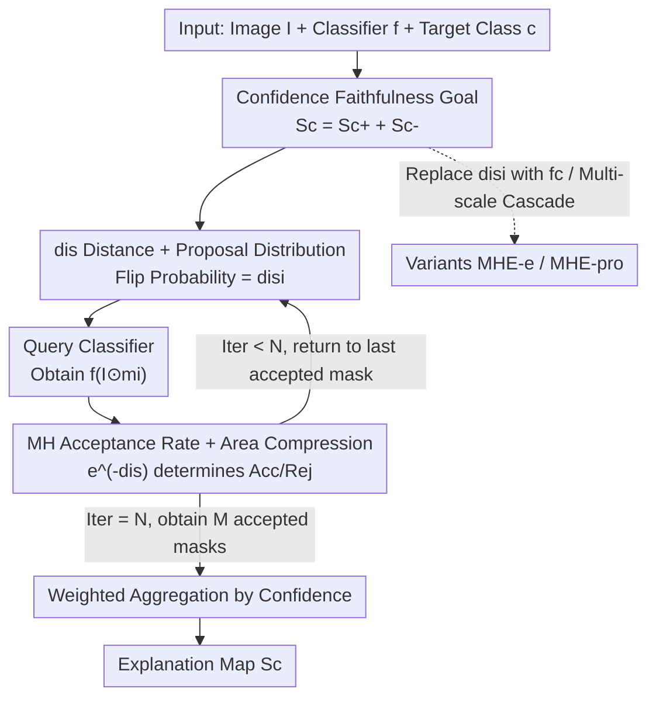

# Making the Classification Explanation Faithful to the Confidence Score

**Conference**: CVPR 2026  
**Paper**: [CVF Open Access](https://openaccess.thecvf.com/content/CVPR2026/html/Mi_Making_the_Classification_Explanation_Faithful_to_the_Confidence_Score_CVPR_2026_paper.html)  
**Code**: https://github.com/helloAI007/MHE  
**Area**: Interpretability  
**Keywords**: Black-box explanation, confidence faithfulness, Metropolis-Hastings sampling, perturbation-based explanation, negative contribution regions

## TL;DR
This paper proposes MHE (Metropolis-Hastings Explainer), a black-box explanation method that uses MH sampling to search for masks where "the confidence remains close to the original image after partial occlusion." This ensures the confidence of the explained region strictly approximates the model's original confidence—by simultaneously identifying both positive and negative contribution regions—thereby upgrading the explanation from "class faithfulness" to "confidence faithfulness."

## Background & Motivation
**Background**: The mainstream of classification model interpretability focuses on highlighting "which image regions support this class," represented by CAM series (GradCAM, ScoreCAM, KPCACAM), perturbation methods (RISE, Extremal Perturbations), and layer-wise attribution methods like LRP/IG.

**Limitations of Prior Work**: Existing methods almost exclusively focus on **positive contribution regions**—defining success by localizing target objects—while ignoring **negative contribution regions** (parts that lower the confidence score). Consequently, there is a significant gap between the confidence reconstructed by the explanation $f_c(I\odot S_c')$ and the model's original confidence $f_c(I)$, especially on low-confidence samples. For example, RISE uses confidence as weights directly, tending to make explanations "over-confident"; ScoreCAM often misses complete evidence regions.

**Key Challenge**: The authors decompose "faithfulness" into two levels: **class faithfulness** (the explanation only needs to point to the correct class, regardless of the confidence value) and **confidence faithfulness** (the reconstructed confidence must match the original, distinguishing between 0.9 and 0.5). Existing methods mostly remain at the former, whereas the latter requires the explanation to be **neither more nor less**: missing positive contributions drops confidence, while omitting negative contributions artificially inflates confidence.

**Goal**: Generate an explanation map $S_c$ such that $|f_c(I)-f_c(I\odot S_c')|<\varepsilon$, and explicitly split the explanation into positive contribution $S_{c+}$ and negative contribution $S_{c-}$ components ($S_c=S_{c+}+S_{c-}$).

**Key Insight**: Black-box perturbation naturally does not rely on potentially misleading internal gradients/activations, making it suitable for high-faithfulness search; the only issue is "random perturbation efficiency is too low." The authors use Metropolis-Hastings sampling to model "finding effective masks" as a Markov chain converging to a steady-state distribution, pushing the sampling towards minimizing the "confidence difference."

**Core Idea**: Replace random perturbations with MH sampling, using the "confidence difference between the occluded and original image $dis$" as an importance signal to design the proposal distribution and acceptance rate. A set of confidence-faithful masks is searched and weighted-aggregated into the final explanation.

## Method

### Overall Architecture
MHE is a black-box, perturbation-and-sampling-based explainer: given an image $I$, a classifier $f$, and a target class $c$, it outputs an explanation map $S_c$ where $f_c(I\odot S_c)$ closely fits the original $f_c(I)$. The pipeline starts with $k$ warmup rounds, followed by the main MH loop: each round starts from the previously accepted binary mask, flips several pixels according to the proposal distribution to generate a candidate mask, queries the classifier to calculate the distance $dis$, and decides whether to accept it based on the acceptance rate. After $N$ iterations, $M$ accepted masks are weighted by their respective confidence scores to aggregate into the final explanation.

### Key Designs

**1. Confidence Faithfulness Goal: Decomposing Explanation into Positive + Negative Contributions**

Addressing the pain point that "existing methods only explain positive contributions, leading to inflated confidence," the authors define the explanation for class $c$ as $S_c=S_{c+}+S_{c-}$. Here, $S_{c+}$ represents regions that increase confidence, while $S_{c-}$ represents regions that decrease it, and $S_c$ explicitly excludes neutral pixels. The ideal constraint is $|f_c(I)-f_c(I\odot S_c')|<\varepsilon$: the confidence should be high when the explanation approaches $S_{c+}$, and close to the original $f_c(I)$ when it approaches the full $S_c$. Notably, $S_{c+}$ does not solely come from the foreground—dataset sampling bias may cause certain background contexts to contribute positively. This goal of "simultaneously capturing both positive and negative regions" distinguishes MHE from methods focused only on maximizing confidence (RISE/Extremal) or only explaining $S_{c+}$ (most white-box methods).

**2. dis-driven Proposal Distribution: Using Confidence Difference as Importance Signal**

To address the inefficiency of random perturbations in searching for valid masks, MHE uses a binary mask $m_i\in\{0,1\}$. It first calculates the confidence distance between the current mask and the original image using the L4 norm: $dis_i=\|f(I)-f(I\odot m_i)\|_4$. The intuition is: a large $dis_i$ suggests important content was occluded, so the mask has low importance and should be significantly modified to explore unvisited regions; a small $dis_i$ suggests the current preserved regions are important and should be kept with high probability. Based on this, the proposal distribution is constructed where each pixel in the mask flips with probability $dis_i$ and remains unchanged with probability $(1-dis_i)$, expressed as a transition matrix:

$$P(i,i+1)=\begin{bmatrix}1-dis_i-\beta & dis_i+\beta\\ dis_i+\beta & 1-dis_i-\beta\end{bmatrix}$$

where $\beta$ (e.g., 0.1) is a small positive constant ensuring transition probabilities do not reach 0/1, as no region can be asserted as "absolutely unimportant" in any round. Compared to symmetric random generation, this $dis$-driven asymmetric proposal searches qualified samples faster in difficult scenarios.

**3. MH Acceptance Rate and Area Compression: Ensuring Convergence and Compactness**

To prevent divergent results and overly large unreadable explanation regions, MHE converts the distance into importance using $e^{-x}$ (smaller $dis$ yields larger $e^{-dis}$, increasing acceptance probability), resulting in the standard MH acceptance rate:

$$\alpha(i,i+1)=\min\Big(\frac{e^{-dis_{i+1}}\cdot Q(i+1,i)}{e^{-dis_i}\cdot Q(i,i+1)},\,1\Big)$$

For the full explanation $S_c$, an additional threshold $\varepsilon$ constrains the confidence difference, along with an auxiliary logic: when both the candidate and current $dis$ fall within an acceptable deviation, **the one with the smaller spatial area is accepted**. This compresses the final explanation to be more compact and readable. The authors theoretically prove that the Markov chain is finite-state, irreducible, aperiodic, and positive recurrent (guaranteed by $\beta>0$), possessing a unique steady-state distribution. They verify the detailed balance condition $\pi(i)Q(i,j)\alpha(i,j)=\pi(j)Q(j,i)\alpha(j,i)$ under the assumption $e^{-dis_i}\propto\pi(i)$, providing a theoretical basis for the sampling.

**4. MHE-e and MHE-pro Variants: Different Goals and Multi-scale Support**

The framework can adapt to different objectives by redefining the distance metric $dis_i$ and acceptance rate $\alpha$: **MHE-e** replaces $dis_i$ with the class confidence $f_c(I')$ itself as the importance measure, thus explaining only positive contribution regions $S_{c+}$. **MHE-pro** is a multi-scale cascaded version—the output of a previous MHE module is upsampled to initialize $m_0$ for the next scale and serves as a base mask for $Q(i,j)$, allowing coarse-scale priors to accelerate fine-scale searches and improve clarity. Both MHE and MHE-pro serve confidence faithfulness ($S_c$), while MHE-e serves positive contribution explanation ($S_{c+}$).

### Loss & Training
MHE is a training-free black-box inference method with no loss function. Key hyperparameters: default mask size $(8,8)$; acceptance threshold $\varepsilon=0.1$; L4 norm for distance; all perturbation methods (RISE/MHE/MHE-e/MHE-pro) run for 4000 iterations. MHE-pro uses 4 scales $(5,5)/(7,7)/(9,9)/(10,10)$ with 1000 iterations each. The authors also note that $\varepsilon$ and iteration count have minimal impact on performance; MHE maintains satisfactory performance even at 1000 iterations, as the mask generation mechanism primarily increases the count of accepted samples.

## Key Experimental Results

Datasets: ImageNet, CUB-200-2011, VOC2012 (approx. 2000 samples each). Classification models: ResNet50, VGG16, ViT-B/16, DINO (ViT-B/16), CLIP (ViT-B/32). Baseline methods include EigenCAM, GradCAM, GradCAM++, ScoreCAM, KPCACAM, FinerCAM, RISE, Sobol, etc. Evaluation metrics: Localization via PG/EBPG/DEL/INS; Faithfulness via AD/AI and absolute confidence difference $dis$; and a newly proposed PNN metric.

### Main Results (Confidence Faithfulness $dis$ Comparison, ImageNet)

| Method | Explanation Type | Confidence Faithfulness $dis$ | Key Performance (Qualitative) |
|------|---------|---------------|------------------------------|
| MHE | $S_c$ (Pos+Neg) | Better than RISE (Wins on all 5 models) | Confidence closest to original; compact and readable |
| MHE-e | $S_{c+}$ (Pos only) | Best in most scenarios | Higher confidence than MHE on ResNet50/ViT/DINO |
| MHE-pro | $S_c$ (Multi-scale) | Best in most scenarios | Scores closer to original than MHE via multi-scale info |
| RISE | $S_{c+}$ | Inferior to MHE series | Biased toward high confidence; overly wide on CLIP |
| CAM Series | $S_{c+}$ | Good only on CLIP | Better $dis$ on ResNet50/VGG16 (better fit for linear decomposition) |

Key Remark: On the $dis$ metric, MHE outperforms RISE across all 5 models; MHE-e and MHE-pro achieve the best results in most scenarios. AD/AI metrics prefer methods with "high confidence faithfulness" or those that "focus on positive contributions"—MHE/MHE-pro belong to the former, MHE-e to the latter. For CLIP, CAM series are excluded from some metrics (gray area) due to softmax normalization issues.

### PNN Metric & Ablation Study

The authors defined the **PNN (Positive-Negative-Neutral)** metric to quantify the ability to identify positive, negative, and neutral regions. The explanation map is segmented using thresholds $a$ and $b$ into neutral $[0,b)$, negative $[b,a)$, and positive $[a,1]$ segments. Occluding these should yield: decreasing confidence for positive, increasing for negative, and negligible change for neutral:

$$\mathrm{PNN}=\mathrm{Norm}(P^c_{dec}+N^c_{inc}-N_{mid}),\quad P^c_{dec}=f_c(I)-f_c(I\odot m_P)$$

Where $N^c_{inc}=f_c(I\odot m_N)-f_c(I)$ and $N_{mid}=|f_c(I\odot m_{Neutral})-f_c(I)|$, with default $a=0.5, b=0.1$.

| Config / Phenomenon | Conclusion | Description |
|------------|------|------|
| MHE-pro (Multi-scale) | Best PNN in most cases | Multi-scale info helps capture both pos and neg regions |
| Threshold $b$ | Negligible impact | Only used to distinguish low-importance explanations |
| Increasing threshold $a$ | MHE performance drops fastest | Indicates MHE's high-importance regions contain critical neg contributions |
| 1000 vs 4000 Iterations | Minor impact | MHE is satisfactory at 1000 rounds; mechanism primarily increases accepted samples |

### Key Findings
- **Negative contribution regions are MHE’s core differentiator**: As threshold $a$ increases, MHE's performance drops fastest, proving its high-importance zones contain critical negative contributions, while CAM/RISE focus on positive ones.
- **Metric-specific preferences**: CAM series excel at PG/EBPG (localization), RISE excels at Del/Ins, but neither balances pos/neg contributions like the MHE series, which leads in $dis$/AD/AI/PNN.
- **Variant counter-examples**: MHE-e/MHE-pro occasionally deviate from design goals. The authors hypothesize insufficient iterations—4000 might be enough for basic black-box methods but 1000 per scale for MHE-pro is low in difficult scenarios.

## Highlights & Insights
- **Conceptual Split of "Faithfulness"**: Distinguishing "class faithfulness" from "confidence faithfulness" and noting the latter requires the explanation to be neither more nor less—a fundamental perspective overlooked by most methods.
- **Explicit Modeling of Negative Contributions**: $S_c=S_{c+}+S_{c-}$ allows explanations to systematically include regions that lower confidence, providing value for understanding the model's complete decision-making process.
- **Markov Chain for Explanation Search**: Designing the proposal distribution and acceptance rate using $dis$ as an importance signal, with theoretical proofs for steady-state distribution and detailed balance, upgrades black-box perturbation from "random luck" to "directional sampling with convergence guarantees."
- **Practical Area Compression**: Prioritizing smaller areas when both candidates meet the $dis$ threshold makes explanations more compact at zero cost—a trick transferable to any mask-sampling method.

## Limitations & Future Work
- **Iteration Cost and Convergence**: Black-box sampling requires thousands of forward passes. The authors admit 4000 iterations for MHE-e or 1000 per scale for MHE-pro may be insufficient in complex scenarios.
- **Normalization in Models like CLIP**: CAM series' missing softmax normalization on CLIP complicates cross-model comparisons.
- **Hyperparameter and Threshold Dependency**: PNN's $a, b$, acceptance threshold $\varepsilon$, and mask size require empirical setting. While many are insensitive, $a$ significantly affects results.
- **Future Directions**: Adaptive iteration budgets (stopping based on $dis$ convergence), learning the $\varepsilon$/area weights, and extending the proposal distribution from uniform flipping to structured (e.g., super-pixel) flipping.

## Related Work & Insights
- **vs RISE**: RISE uses confidence as mask weights, essentially explaining the predicted class rather than the confidence value ($S_{c+}$); MHE uses MH sampling with acceptance constraints to pursue confidence faithfulness and negative contributions.
- **vs CAM Series**: CAM relies on the assumption that confidence is linearly decomposable via activation maps, which may not hold for architectures without final global pooling; MHE is purely black-box and model-agnostic.
- **vs HDM**: HDM also focuses on confidence and multi-scale info ($S_c$), but is non-open-source; MHE-pro achieves similar clarity improvements with a more lightweight cascaded multi-scale approach.
- **vs Extremal Perturbations / IASSA**: These encourage high confidence and mask smoothness ($S_{c+}$) with subjective area hyperparameters; MHE replaces subjective tuning with the deterministic rule of area compression.

## Rating
- Novelty: ⭐⭐⭐⭐ Conceptualizing "confidence faithfulness" and solving it with MH sampling + negative contribution modeling is novel and theoretically supported.
- Experimental Thoroughness: ⭐⭐⭐⭐ Covers 5 models and 3 datasets across multiple metrics.
- Writing Quality: ⭐⭐⭐⭐ Motivation and theoretical derivations are clear; PNN/$dis$ metrics are well-defined.
- Value: ⭐⭐⭐⭐ Provides a reusable evaluation perspective and methodological paradigm for confidence faithfulness in black-box explanations.

<!-- RELATED:START -->

## Related Papers

- [\[CVPR 2026\] Towards Faithful Multimodal Concept Bottleneck Models](towards_faithful_multimodal_concept_bottleneck_models.md)
- [\[CVPR 2026\] Hierarchical Concept Embedding & Pursuit for Interpretable Image Classification](hierarchical_concept_embedding_pursuit_for_interpretable_image_classification.md)
- [\[NeurIPS 2025\] Distributional Autoencoders Know the Score](../../NeurIPS2025/interpretability/distributional_autoencoders_know_the_score.md)
- [\[CVPR 2026\] HierUQ: Hierarchical Uncertainty Quantification with Adaptive Granularity Reconciliation for Degraded Image Classification](hieruq_hierarchical_uncertainty_quantification_with_adaptive_granularity_reconci.md)
- [\[ICLR 2026\] When Machine Learning Gets Personal: Evaluating Prediction and Explanation](../../ICLR2026/interpretability/when_machine_learning_gets_personal_evaluating_prediction_and_explanation.md)

<!-- RELATED:END -->
