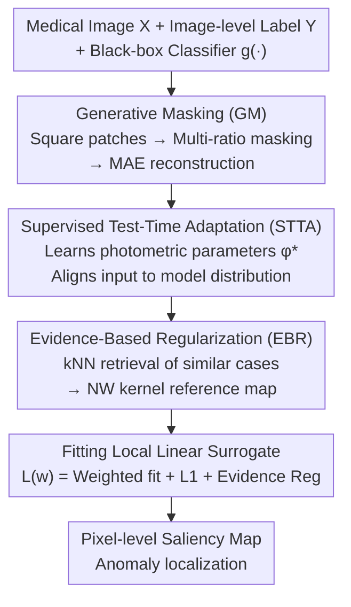

# MedLIME: A Distribution-Aligned and Evidence-Supported Framework for Medical Saliency Explanations

**Conference**: CVPR 2026  
**Paper**: [CVF Open Access](https://openaccess.thecvf.com/content/CVPR2026/html/Magazine_MedLIME_A_Distribution-Aligned_and_Evidence-Supported_Framework_for_Medical_Saliency_Explanations_CVPR_2026_paper.html)  
**Code**: To be confirmed  
**Area**: Explainability / Medical Imaging  
**Keywords**: XAI, Saliency Map, LIME, Black-box Explanation, Test-time Adaptation

## TL;DR
MedLIME enhances the classic black-box explanation method LIME with three key components: Generative Masking (GM) using MAE to ensure perturbed samples remain in-distribution, Supervised Test-Time Adaptation (STTA) to align inputs with the model's distribution, and Evidence-Based Regularization (EBR) via kNN and kernel estimation to incorporate historical clinical evidence. This framework improves the quality of saliency maps (AUPRC) for medical anomaly localization by up to 30% compared to various baselines.

## Background & Motivation
**Background**: Deep models in medical imaging are often deployed in high-risk clinical scenarios and require explainability. Saliency maps are the primary explanatory tool, highlighting regions critical to model decisions. Among these, LIME estimates feature importance by perturbing inputs and fitting local linear surrogate models. Its **pure black-box** nature—requiring no internal weights—is particularly valuable in medical settings where such weights may be inaccessible due to privacy constraints.

**Limitations of Prior Work**: Directly applying LIME to medical anomaly localization faces three specific issues. First, **out-of-distribution masking**: LIME uses black or mean blocks to hide superpixels, which can easily push the image out of the model's learned distribution, leading to unreliable local estimations. Second, **ignoring the clinical evidence paradigm**: Radiologists rely on comparisons with similar historical cases, a "base-on-evidence" logic that XAI methods like LIME ignore. Third, **dependence on superpixel segmentation**: Standard LIME relies on segmentation algorithms to divide images, creating dependency on specific image domains and instability.

**Key Challenge**: LIME assumes that masked images reside within a small neighborhood of the original image, but black/mean masking violates this. The further perturbed samples deviate from the data manifold, the more distorted the local linear approximation becomes.

**Goal**: To improve the robustness and fidelity of saliency maps for anomaly localization by keeping perturbed samples in-distribution, introducing historical evidence, and removing superpixel dependency while maintaining the black-box and model-agnostic advantages of LIME.

**Key Insight**: The authors noted that correlations between medical image patches are lower than in natural images, making the generation of a "realistic mean patch" a more effective local sampling strategy. Simultaneously, the "comparison with similar cases" in clinical evidence-based medicine can be formalized as a regularization prior for saliency maps.

**Core Idea**: Combining Generative Masking (GM) for in-distribution preservation, Supervised Test-Time Adaptation (STTA) for input alignment, and Evidence-Based Regularization (EBR) to inject historical evidence into the standard LIME pipeline.

## Method

### Overall Architecture
The task involves generating pixel-level saliency maps for a pre-trained binary classification model $g(\cdot)$ (Normal/Abnormal) to localize pathological regions using only image-level labels and black-box access. MedLIME is a three-stage pipeline: ① The image is divided into fixed square patches; missing regions are reconstructed via **Generative Masking (GM)** using a pre-trained MAE under various masking ratios to create in-distribution perturbed samples. ② **Supervised Test-Time Adaptation (STTA)** learns a set of photometric transformation parameters at test time to align the input with the model's training distribution. ③ **Evidence-Based Regularization (EBR)** retrieves similar cases from historical data and aggregates a reference saliency map as an inductive bias using a Nadaraya–Watson kernel. Finally, a local linear surrogate is fitted using the reconstructed samples passed through adapted transformations and the frozen model.

### Key Designs

**1. Generative Masking (GM): Keeping Perturbed Samples on the Data Manifold via MAE Reconstruction**

The limitation is that LIME's black/mean masking pushes images out of the model distribution. GM avoids zero or mean filling. Instead, it partitions $X\in\mathbb{R}^{H\times W}$ into $P=HW/s^2$ non-overlapping square patches of size $s$. A binary mask $m\in\{0,1\}^P$ determines patch visibility, generating $N$ masks with different ratios. These are processed by a **pre-trained MAE** to reconstruct missing regions: $X_i^{rec}=f_{MAE}(X\odot m_i)$. This ensures perturbed samples are closer to the data manifold and more faithful to the original distribution. Using fixed patches also **removes superpixel algorithm dependency**, ensuring consistent perturbation units across medical images. t-SNE analysis verifies that GM samples cluster near the original image while non-GM samples deviate significantly.

**2. Supervised Test-Time Adaptation (STTA): Adapting Input Without Moving Decision Boundaries**

The limitation is the potential shift between test images and the model's training distribution. STTA defines a **geometry-preserving differentiable transformation** $f_\phi(\cdot)$ based on three principles: maintaining anatomical structures, simulating realistic imaging/scanning noise, and maintainability of parameters at test time. It implements three photometric transformations: Gaussian blur (parameters $k, \sigma$), HSV shift ($\Delta h, \Delta s, \Delta v$), and RGB shift ($\Delta r, \Delta g, \Delta b$), denoted as $\phi$. For an image $X$ and label $Y$, $S$ test-time samples $\{X_j\}$ are crafted via rotations and resized crops. The **backbone $g(\cdot)$ is frozen** while minimizing cross-entropy to find optimal parameters: $\phi^*=\arg\min_\phi\sum_j L_{CE}(g(f_\phi(X_j)),Y)$. This **adapts the input rather than the model**, calibrating the local sampling space without altering the decision boundary.

**3. Evidence-Based Regularization (EBR): Formalizing Case Comparisons as Saliency Priors**

XAI methods typically ignore clinical evidence-based logic, leading to multi-sample overfitting or false attributions. EBR mimics radiologists by referencing similar historical cases. For training sets $\{X_i, Y_i\}$, saliency maps $\{w_i\}$ are pre-calculated. For a test sample $X$, $N_T$ nearest abnormal neighbors are selected based on feature space cosine distance. Their saliency maps are aggregated using a **Nadaraya–Watson (NW) kernel**: $w_X^{NW}=\frac{\sum_j K(p_X,p_j)w_j}{\sum_j K(p_X,p_j)}$, where $K(p_i,p_j)=\exp(-\|p_i-p_j\|^2/2h^2)$ is a Gaussian kernel and $p_i$ is the feature vector. This reference acts as an inductive bias, reflecting common spatial attention patterns and enhancing robustness.

### Loss & Training
The final step approximates classifier $g(\cdot)$ near $X$ with a linear surrogate $s(m_i)=w^\top m_i$. A weighted local loss is fitted for $N$ reconstructed samples:

$$L(w)=\sum_{i=1}^{N}\pi_X(m_i)\big(g(f_{\phi^*}(X_i^{rec}))-s(m_i)\big)^2+\lambda_1\|w\|_1+\lambda_2\|w-w_X^{NW}\|^2$$

Where $\pi_X(m_i)=\exp(-D(m_i,m_0)^2/\sigma^2)$ encodes proximity in masking space, $\lambda_1$ controls L1 sparsity, and $\lambda_2$ pulls the solution toward the evidence reference $w_X^{NW}$. The explained binary model $g(\cdot)$ is fine-tuned using BCE (3e-5 learning rate, AdamW, convergence in 50–100 steps).

## Key Experimental Results

### Main Results
On four datasets (RSNA, ChestX-Det10, CheXlocalize, BUID) across three architectures (InceptionV3 / ViT / SwinViT), **AUPRC** measures the alignment between saliency maps and ground-truth masks.

| Dataset | Metric | MedLIME | Prev. SOTA | Remarks |
|--------|------|------|----------|------|
| RSNA (Avg) | AUPRC | 0.418 | 0.342 (GradCAM) | — |
| ChestX-Det10 (Avg) | AUPRC | 0.314 | 0.234 (XRAI) | — |
| CheXlocalize (Avg) | AUPRC | 0.451 | 0.380 (LayerCAM) | — |
| BUID (Avg) | AUPRC | 0.464 | 0.445 (XRAI) | Smallest lesions, hardest |

Ours improves by up to 7% relative to the best baseline. On BUID (small lesions), improvements range from 2%–30%. Notably, standard LIME (0.211/0.137/0.188/0.247) performs significantly worse than MedLIME, demonstrating the value of its components.

### Ablation Study
| Configuration | AUPRC | Description |
|------|---------|------|
| Full MedLIME | 0.451 | RSNA / ViT |
| w/o GM | 0.396 | Significant drop |
| w/o STTA | 0.427 | Moderate drop |
| w/o EBR | 0.368 | Most significant drop |

### Key Findings
- **All components contribute positively**: Removing EBR drops the score to 0.368, GM to 0.396, and STTA to 0.427, with EBR and GM providing the largest gains.
- **GM effectively pulls samples back in-distribution**: t-SNE shows GM perturbed samples聚 in the original data manifold; higher IoU between mask and ground truth correlates with larger drops in classification scores.
- **STTA lowers loss and improves localization**: 20 steps of test-time training increase ViT prediction scores by >1% and drop training loss by ~10% on RSNA.
- **EBR's dual mechanisms are vital**: Replacing kNN with random neighbors or NW weighting with simple means causes AUPRC to decline.
- According to fidelity metrics (Quantus), MedLIME is optimal in LeRF↑ (0.36) and consistency (0.87), and lowest in MoRF↓ (0.28).

## Highlights & Insights
- **"Adapt Input, Not Model" perspective for TTA**: Unlike traditional TTA which modifies BN/modules, this work freezes the model and learns photometric parameters to align the input. This calibration of local sampling space is the first of its kind for explainability.
- **Formalizing clinical evidence as a regularization term**: EBR converts historical case comparison into a prior constraint for saliency maps—a reusable paradigm for injecting domain knowledge into XAI.
- **Generative Masking as a dual-purpose tool**: MAE reconstruction ensures in-distribution perturbations while naturally removing superpixel dependency, ensuring consistency across modalities.
- **Black-box superiority**: The method remains **purely black-box**, yet its performance consistently surpasses gradient-based methods like GradCAM which require internal model access.

## Limitations & Future Work
- Like LIME, it assumes a **linear surrogate can fit the decision boundary** near a point; this fails if the boundary is highly non-linear.
- EBR requires access to a historical sample library for kNN retrieval; its applicability is limited in scenarios where zero training data is accessible.
- STTA requires test-time optimization (approx. 20 steps) for each sample, resulting in higher latency compared to single-forward methods like GradCAM.
- Future work: Exploring non-linear local surrogates; extending evidence retrieval to external knowledge bases.

## Related Work & Insights
- **vs LIME**: LIME uses OOD masks and superpixels; MedLIME uses MAE for in-distribution masks, fixed patches, and adds STTA/EBR, leading to much higher AUPRC (e.g., 0.418 vs 0.211 on RSNA).
- **vs CAM methods**: Gradient methods need internal weights; MedLIME achieves superior performance in a black-box setting.
- **vs LIME variants**: While others focus on stability or manifolds individually, this framework strengthens distribution alignment, adaptation, and evidence simultaneously.

## Rating
- Novelty: ⭐⭐⭐⭐⭐ "Learn-input TTA + EBR + GM" combination is highly innovative.
- Experimental Thoroughness: ⭐⭐⭐⭐ Extensive architectures and datasets; lacks evaluation by clinicians.
- Writing Quality: ⭐⭐⭐⭐ Clear motivation and methodology.
- Value: ⭐⭐⭐⭐ Highly suitable for privacy-restricted medical AI deployments.

<!-- RELATED:START -->

## Related Papers

- [\[CVPR 2026\] Measuring the (Un)Faithfulness of Concept-Based Explanations](measuring_the_unfaithfulness_of_concept-based_explanations.md)
- [\[ICML 2025\] Evaluating Neuron Explanations: A Unified Framework with Sanity Checks](../../ICML2025/interpretability/evaluating_neuron_explanations_a_unified_framework_with_sanity_checks.md)
- [\[CVPR 2026\] Learning Where to Look and How to Judge: Resolution-agnostic Image Quality Assessment with Quality-aware Saliency](learning_where_to_look_and_how_to_judge_resolution-agnostic_image_quality_assess.md)
- [\[AAAI 2026\] Distribution-Based Feature Attribution for Explaining the Predictions of Any Classifier](../../AAAI2026/interpretability/distribution-based_feature_attribution_for_explaining_the_predictions_of_any_cla.md)
- [\[ICML 2026\] Manifold-Aligned Guided Integrated Gradients for Reliable Feature Attribution](../../ICML2026/interpretability/manifold-aligned_guided_integrated_gradients_for_reliable_feature_attribution.md)

<!-- RELATED:END -->
