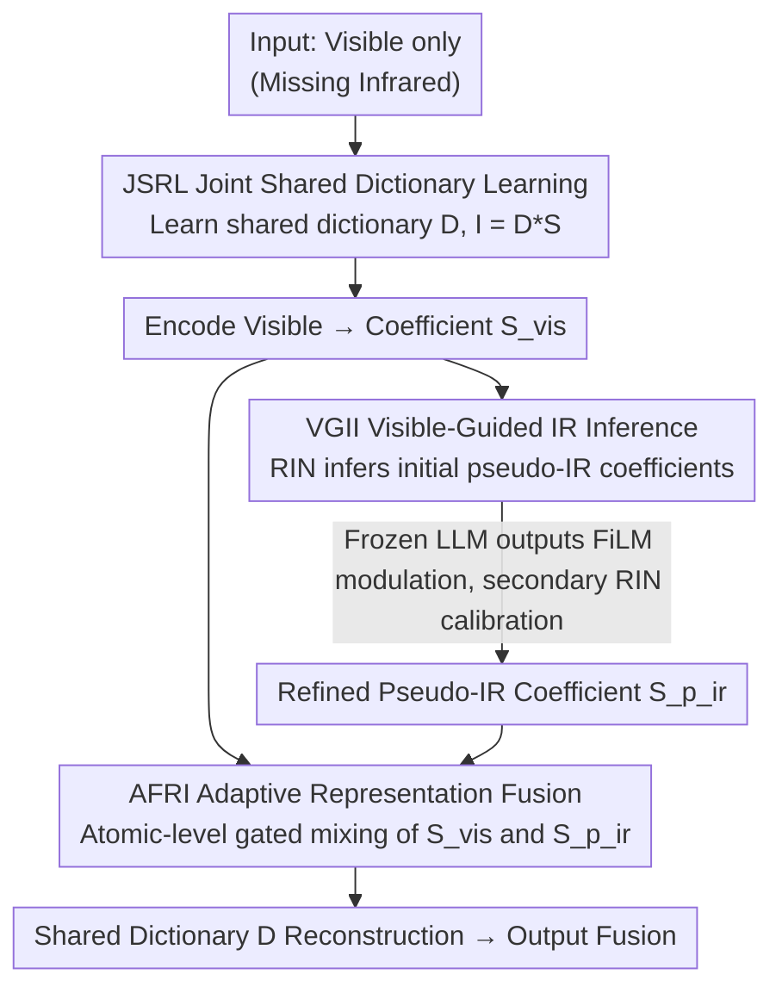

# Missing No More: Dictionary-Guided Cross-Modal Image Fusion under Missing Infrared

**Conference**: CVPR 2026  
**arXiv**: [2603.08018](https://arxiv.org/abs/2603.08018)  
**Code**: [https://github.com/harukiv/DCMIF](https://github.com/harukiv/DCMIF)  
**Area**: Interpretability  
**Keywords**: Infrared-visible image fusion, missing modality, convolutional dictionary learning, coefficient domain reasoning, LLM prior

## TL;DR
This paper proposes the first framework to perform cross-modal fusion under missing infrared conditions in the coefficient domain rather than the pixel domain. By establishing a unified IR-VIS atomic space via a shared convolutional dictionary, it completes VIS→IR reasoning and adaptive fusion within the coefficient domain. Combined with a frozen LLM providing weak semantic priors for thermal information completion, the method achieves performance close to dual-modal fusion methods using only visible light input.

## Background & Motivation
**Background**: Infrared-visible (IR-VIS) image fusion is vital for robust perception in surveillance, robotics, and autonomous driving systems. Existing methods (CNNs, Transformers, GANs, Diffusion models) assume both modalities are available during both training and inference. However, infrared modalities are frequently missing in real-world scenarios (e.g., only visible cameras available at test time).

**Limitations of Prior Work**: When infrared is missing, an intuitive solution is to generate a pseudo-infrared image in the pixel space and then fuse it. However, generation in pixel space suffers from serious issues: poor controllability, weak interpretability, and susceptibility to hallucination artifacts and loss of structural details.

**Key Challenge**: How to stably recover thermal information and perform interpretable fusion when the infrared modality is missing? 

**Key Insight**: Instead of generating infrared in the pixel space, the authors map both modalities into a unified dictionary-coefficient space. By performing reasoning and fusion in the **coefficient domain**, data consistency and prior constraints are anchored at the atomic-coefficient level.

## Method

### Overall Architecture
This paper addresses image fusion where only visible light is available and infrared is missing at test time. The core strategy is to avoid generating infrared from scratch in the pixel space and instead move the problem to a shared "dictionary-coefficient" space. Specifically, an image is represented as the convolution of dictionary atoms and sparse coefficients $\mathbf{I} = \mathbf{D} * \mathbf{S}$. Consequently, both "infrared recovery" and "fusion" become operations on coefficients $\mathbf{S}$.

The pipeline is a closed loop: First, **JSRL** learns a shared convolutional dictionary for both modalities to anchor them in the same atomic space. Next, **VGII** reasons pseudo-infrared coefficients from visible light coefficients in the coefficient domain, utilizing a frozen LLM to inject semantic priors for calibration. Finally, **AFRI** adaptively blends the visible coefficients and the reasoned pseudo-infrared coefficients at the atomic level, reconstructing the fused image using the same dictionary. The entire process—encoding, reasoning, fusion, and reconstruction—flows within the same dictionary-coefficient space, providing strong interpretability.

### Key Designs

**1. JSRL — Joint Shared Dictionary Representation Learning: Aligning modalities to a unified atomic space**

Reasoning under missing infrared is difficult because VIS and IR belong to separate representation spaces. JSRL forces both modalities to share the same convolutional dictionary $\mathbf{D} \in \mathbb{R}^{B \times k \times k}$, ensuring that differences exist only in their sparse coefficients. This establishes a one-to-one correspondence at the atomic level. The training objective minimizes joint reconstruction error with coefficient priors and dictionary regularization:

$$\min_{\mathbf{D},\mathbf{S}_{vis},\mathbf{S}_{ir}} \tfrac{1}{2}\|\mathbf{I}_{vis} - \mathbf{D}*\mathbf{S}_{vis}\|_F^2 + \tfrac{1}{2}\|\mathbf{I}_{ir} - \mathbf{D}*\mathbf{S}_{ir}\|_F^2 + \lambda_1\varphi_1(\mathbf{S}_{vis}) + \lambda_2\varphi_2(\mathbf{S}_{ir}) + \lambda_3\phi(\mathbf{D})$$

Instead of black-box fitting, model-driven unfolding is used to expand optimization iterations into a network. Each step alternates between "data consistency" (solved using the Sherman-Morrison formula in the frequency domain) and "proximal updates" (where CoeNet/DicNet act as learnable proximal operators). The overall structure consists of $N$ cascaded IV-DLBs (Infrared-Visible Dictionary Learning Blocks). Hyperparameters like step sizes are adaptively predicted by HypNet.

**2. VGII — Visible-Guided IR Inference: Recovering pseudo-IR in the coefficient domain with LLM calibration**

With a shared dictionary, "infrared recovery" simplifies to "converting VIS coefficients to IR coefficients." A frozen REN encodes visible light into coefficients $\tilde{\mathbf{S}}_{vis}$, followed by a RIN (Representation Inference Network) mapping them to initial pseudo-IR coefficients $\mathbf{S}_{p\_ir}$. To prevent thermal region bias caused by a lack of high-level semantic constraints, a lightweight LLM-in-the-loop refinement is introduced. The system feeds the {VIS, initial pseudo-IR} pair and a task description to a frozen LLM to extract text features $\mathbf{F}_{text}$. These are used via FiLM (Feature-wise Linear Modulation) for channel-level modulation $\mathbf{S}_{fm} = \gamma \odot \tilde{\mathbf{S}}_{vis} + \beta$. The LLM acts as a "semantic reviewer," keeping the process lightweight and interpretable.

Supervision is defined by: $\ell_{inf} = \ell_{int} + \ell_{reg} + \ell_{grad}$. The consistency loss $\ell_{int}$ minimizes L1 distance in both image and coefficient domains. Thermal regularization $\ell_{reg}$ emphasizes alignment in thermal regions. Gradient loss $\ell_{grad} = \|\nabla\mathbf{I}_{p\_ir} - \nabla\mathbf{I}_{vis}\|_1$ uses visible edges to constrain infrared structures.

**3. AFRI — Adaptive Representation Fusion: Structure to VIS, Thermal Semantics to IR at the atomic level**

After obtaining coefficients, the RFN (Representation Fusion Network) learns implicit atomic-level gating weights $(\mathbf{W}_{vis}, \mathbf{W}_{p\_ir})$ via Convolution-Attention Fusion blocks. The fused coefficient is $\mathbf{S}_f = \mathbf{W}_{vis} \odot \tilde{\mathbf{S}}_{vis} + \mathbf{W}_{p\_ir} \odot \mathbf{S}_{p\_ir}^{(1)}$. Reconstruction is performed with the shared dictionary. Supervision uses element-wise max:

$$\ell_f = \|\mathbf{I}_{f} - \max(\mathbf{I}_{p\_ir}, \mathbf{I}_{vis})\|_1 + \|\nabla\mathbf{I}_f - \max(\nabla\mathbf{I}_{p\_ir}, \nabla\mathbf{I}_{vis})\|_1$$

This encourages the network to preserve high intensity for thermal targets and sharp gradients for structural edges. Since gating happens in the coefficient domain, atoms representing structural edges are pushed toward VIS, while those representing thermal semantics are pushed toward IR.

### Loss & Training
The three modules are trained sequentially: JSRL → VGII → AFRI. JSRL is trained on MSRS for 1000 epochs (the dictionary is transferable). VGII and AFRI require only 10 epochs each. No adversarial training or diffusion sampling is needed. Optimized via Adam with 5×5 dictionary kernels on two RTX 4090 GPUs.

## Key Experimental Results

### Main Results

| Method | Input | MSRS AG↑ | MSRS EN↑ | FLIR AG↑ | FLIR EN↑ | KAIST AG↑ |
|------|------|---------|---------|---------|---------|----------|
| CDDFuse | IR+VIS | 4.818 | 7.321 | 5.079 | 6.766 | 3.167 |
| EMMA | IR+VIS | 4.913 | 7.333 | 3.796 | 6.489 | 3.083 |
| DCEvo | IR+VIS | 4.858 | 7.298 | 4.585 | 6.763 | 3.229 |
| **Ours** | **VIS Only** | **5.037** | **7.188** | **4.518** | **6.639** | **4.414** |

**Key Finding**: With only visible light input, the proposed method even outperforms some dual-modal SOTA methods in metrics like AG (Average Gradient).

Downstream Tasks: 
- M3FD Object Detection (YOLOv5): Ours mAP=0.948 vs. SAGE (dual-modal)=0.956.
- FMB Semantic Segmentation (SegFormer-b5): Ours mIoU=62.939 vs. LRRNet (dual-modal)=62.942.

### Ablation Study

| Config | Dictionary | LLM | AG↑ | CE↓ | EI↑ | EN↑ | SF↑ |
|------|-----------|-----|-----|-----|-----|-----|-----|
| Model I (Baseline) | ✗ | ✗ | 3.320 | 1.452 | 45.531 | 6.058 | 9.238 |
| Model II | ✓ | ✗ | 4.363 | 1.046 | 48.351 | 6.578 | 11.936 |
| Model III | ✗ | ✓ | 4.256 | 0.619 | 48.154 | 6.423 | 11.175 |
| **Ours** | ✓ | ✓ | **4.518** | **0.596** | **48.784** | **6.639** | **12.554** |

### Key Findings
- The shared dictionary contributes the most to performance improvement (Model I→II: AG +31%), validating the coefficient domain paradigm.
- LLM modulation provides additional semantic enhancement (CE reduced from 1.046 to 0.596), particularly in brightness and contrast.
- The two are complementary, yielding the best combined effect.
- Achieving over 90% of dual-modal performance with only VIS input.

## Highlights & Insights
- **Paradigm Innovation**: First to propose a coefficient domain reasoning-fusion scheme for missing infrared, avoiding pixel-space instability.
- **Clever LLM Usage**: LLM is used for semantic-level FiLM modulation, not image generation, which is lightweight and effective.
- **Simple Training**: No adversarial training or diffusion sampling; VGII and AFRI only require 10 epochs.
- **Strong Interpretability**: All computations occur in a unified atomic space where dictionary atoms have intuitive physical meanings.
- **Consistent Design**: Encoding → Reasoning → Fusion → Reconstruction all occur in the same space, ensuring representation consistency.

## Limitations & Future Work
- The shared dictionary was trained on MSRS; domains with significant differences (e.g., medical infrared) might require retraining.
- LLM processing increases inference latency; efficiency is a concern for real-time scenarios.
- Accuracy in the coefficient domain is capped by dictionary capacity; fine thermal details might be lost.
- Only investigated missing infrared; missing visible or other combinations were not explored.
- Assumes VIS contains enough structural clues; may fail in total darkness.

## Related Work & Insights
- Unlike CDDFuse or EMMA (dual-modal), this method requires only single-modal input.
- Model-driven unfolding (DKSVD, Learned-CSC) provides the theoretical foundation for dictionary learning.
- FiLM modulation (from conditional generation) is innovatively used for LLM semantic-to-coefficient modulation.
- **Insight**: The interpretable coefficient domain paradigm can be extended to other missing modality tasks (e.g., MRI-CT).

## Rating
- **Novelty**: ⭐⭐⭐⭐⭐ The combination of coefficient domain reasoning and LLM weak priors is highly original.
- **Experimental Thoroughness**: ⭐⭐⭐⭐ Covers 3 fusion datasets and 2 downstream tasks, though lacks extensive cross-dataset generalization analysis.
- **Writing Quality**: ⭐⭐⭐⭐ Rigorous math, clear framework, and well-explained motivation.
- **Value**: ⭐⭐⭐⭐ Successfully addresses missing infrared fusion with practical potential; the dictionary paradigm is generalizable.

<!-- RELATED:START -->

## Related Papers

- [\[CVPR 2026\] Neurodynamics-Driven Coupled Neural P Systems for Multi-Focus Image Fusion](neurodynamics-driven_coupled_neural_p_systems_for_multi-focus_image_fusion.md)
- [\[ICLR 2026\] Priors in Time: Missing Inductive Biases for Language Model Interpretability](../../ICLR2026/interpretability/priors_in_time_missing_inductive_biases_for_language_model_interpretability.md)
- [\[CVPR 2026\] PRISM: Prototype-based Reasoning with Inter-modal Semantic Mining for Interpretable Image Recognition](prism_prototype-based_reasoning_with_inter-modal_semantic_mining_for_interpretab.md)
- [\[ICLR 2026\] Inferring the Invisible: Neuro-Symbolic Rule Discovery for Missing Value Imputation](../../ICLR2026/interpretability/inferring_the_invisible_neuro-symbolic_rule_discovery_for_missing_value_imputati.md)
- [\[CVPR 2026\] H-Sets: Hessian-Guided Discovery of Set-Level Feature Interactions in Image Classifiers](h-sets_hessian-guided_discovery_of_set-level_feature_interactions_in_image_class.md)

<!-- RELATED:END -->
