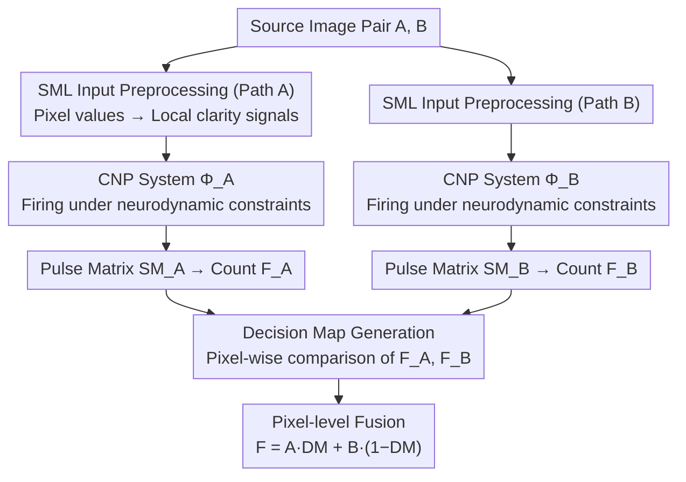

# Neurodynamics-Driven Coupled Neural P Systems for Multi-Focus Image Fusion

**Conference**: CVPR 2026  
**arXiv**: [2509.17704](https://arxiv.org/abs/2509.17704)  
**Code**: [MorvanLi/ND-CNPFuse](https://github.com/MorvanLi/ND-CNPFuse)  
**Area**: Interpretability  
**Keywords**: Multi-focus image fusion, coupled neural P systems, neurodynamics, decision map, pulsing mechanism

## TL;DR

ND-CNPFuse is proposed to establish constraints between network parameters and input signals through neurodynamic analysis of Coupled Neural P (CNP) systems. This prevents abnormal continuous firing of neurons, enabling the generation of high-quality, interpretable decision maps for multi-focus image fusion (MFIF) tasks without any training.

## Background & Motivation

Multi-focus image fusion (MFIF) aims to fuse multiple images of the same scene taken at different focal lengths into a single all-focus image. The core challenge lies in generating a decision map with precise boundaries. Existing methods face two main issues:

**End-to-end deep learning methods**: These generate fused images directly but struggle to maintain spatial consistency with the source images.

**Decision map-based deep learning methods**: These use networks to predict focused/defocused regions, but the internal mechanisms are uninterpretable (black box), leading to pseudo-edges and burrs in the decision maps.

Coupled Neural P (CNP) systems are biological neural computing models inspired by the synchronous pulsing mechanism of the mammalian visual cortex, naturally suited for distinguishing focused and defocused regions. However, when applying CNP directly to MFIF, neurons may exhibit **abnormal continuous firing**, preventing pulse counts from accurately reflecting focus differences. This paper addresses this issue by analyzing the dynamical mechanisms of CNP neurons.

## Method

### Overall Architecture

ND-CNPFuse addresses the long-standing problem of inaccurate decision map boundaries in multi-focus fusion using a training-free and fully interpretable approach. Given a pair of source images $A$ and $B$, the process involves: first preprocessing the source images, then employing two CNP systems under neurodynamic constraints to fire for $A$ and $B$, comparing their pulse counts to determine the source for each pixel to generate a decision map $DM$. Finally, pixel-level fusion is performed according to the decision map:

$$F(i,j) = A(i,j) \times DM(i,j) + B(i,j) \times (1 - DM(i,j))$$

The entire pipeline contains no learnable weights; all parameters are automatically determined through theoretical analysis of neuron firing behavior.

### Key Designs

**1. CNP Neuron Dynamic Analysis: Closing the loop on "Abnormal Continuous Firing"**

Directly applying CNP to MFIF fails because abnormal continuous firing prevents pulse counts from reflecting focus differences. This paper decomposes the three memory units of CNP neurons: feeding input $U$, linking input $V$, and dynamic threshold $T$, formulating their update rules:

- $U(t) = \alpha U(t) + I + K(n)$ (Accumulation of external input $I$)
- $V(t) = \sum_{n=0}^{t-1} K(n) \beta^{t-n-1}$ (Accumulation of neighborhood coupling signals)
- $T(t) = \lambda \frac{1-\gamma^{t-1}}{1-\gamma}$ (Threshold grows with iterations)

Theorem 4 derives the closed-form condition for "continuous firing": $I > \frac{\lambda(1-\alpha)(1-\beta)}{(1-\gamma)(1-\beta+\text{sum}(W))} - \text{sum}(W)$. Its negation yields Corollary 1: as long as the external input does not exceed this threshold, abnormal continuous firing will not occur. Thus, all parameters can be automatically configured based on the input image, eliminating manual tuning.

**2. SML Input Preprocessing: Replacing pixel values with reliable focus signals**

Feeding raw pixel values directly to neurons may limit firing due to weak signals, making it difficult to distinguish focused from defocused areas. This paper uses Sum-Modified Laplacian (SML) to preprocess source images, converting pixel values into feature signals that better represent local clarity. Ablations show that while SML has a minor impact on final metrics, it enhances stability with noisy inputs.

**3. Decision Map Generation based on Pulse Counts: Selection by firing frequency**

The two systems $\Phi_A$ and $\Phi_B$ take preprocessed $A$ and $B$ as inputs and run for a maximum number of iterations, outputting pulse matrices $SM_A$ and $SM_B$. Firing counts $F_A$ and $F_B$ are calculated within a coupling radius $r$, and the decision map is generated by direct pixel-wise comparison:

$$DM(i,j) = \begin{cases} 1, & F_A(i,j) > F_B(i,j) \\ 0, & \text{otherwise} \end{cases}$$

Focused regions naturally generate more pulses (consistent with the human eye's sensitivity to sharp regions), so the entire decision process requires no post-processing and each step has clear physical meaning.

### Loss & Training

This method is **entirely training-free**. All parameters ($u, v, \tau$, etc.) are automatically configured through neurodynamic analysis. Key hyperparameters include coupling radius $r=16$ and iteration count $t=110$. Sensitivity analysis demonstrates high generalizability of these parameters across different datasets.

## Key Experimental Results

### Main Results

Compared with nine SOTA methods across four classic MFIF datasets using six evaluation metrics:

| Dataset | Metric | ND-CNPFuse (Ours) | Prev. SOTA | Gain |
|--------|------|-----------|---------|------|
| Lytro | $Q_{abf}$ | **0.7621** | 0.7613 (PADCDTNP) | 1st |
| Lytro | $FMI_w$ | **0.5967** | 0.5916 (PADCDTNP) | 1st |
| Lytro | SSIM | **0.8541** | 0.8525 (CCF) | 1st |
| MFFW | $Q_{abf}$ | **0.7399** | 0.7384 (DMANet) | 1st |
| MFI-WHU | $FMI_w$ | **0.6268** | 0.6248 (SAMF/DMANet) | 1st |
| Real-MFF | PSNR | **34.2024** | 34.0174 (DMANet) | 1st |

Runtime: MATLAB 0.41s / C++ 0.18s (CPU), outperforming DMANet (0.21s) on GPU.  
Energy Consumption: $1.12 \times 10^{-5}$ J / image pair (extremely low).

### Ablation Study

| Configuration | $Q_{abf}$ | $FMI_w$ | SSIM | PSNR | Description |
|------|----------|---------|------|------|------|
| w/o Neurodynamics | 0.747 | 0.509 | 0.841 | 25.702 | Baseline CNP system |
| **w/ Neurodynamics** | **0.762** | **0.597** | **0.854** | **26.990** | $FMI_w$ Gain 17.29% |
| w/o SML | 0.761 | 0.593 | 0.852 | 26.983 | Minimal impact |
| w/ SML | 0.762 | 0.597 | 0.854 | 26.990 | Slight improvement |

### Key Findings

- Neurodynamic analysis is the core contribution, with $FMI_w$ improving by 17.29%, signifying significantly better feature information retention.
- Decision map visualization indicates the ND-CNP system generates maps with sharper boundaries and higher precision, avoiding regional misjudgments typical of baseline CNP.
- Parameters $r$ and $t$ perform consistently across four datasets, verifying the generalizability of the method.

## Highlights & Insights

1. **Bio-inspired + Theory-driven**: Rather than simply applying neural computing models, the paper deeply analyzes dynamical mechanisms and provides closed-form constraints, making the model reliable.
2. **Zero-training, Interpretable**: Requires no deep learning training. The decision map generation process is based on pulse count comparisons with clear physical significance.
3. **Ultra-low Energy & Real-time**: Real-time fusion is achievable on CPU alone (C++ 0.18s), with energy consumption in the $10^{-5}$ J range, ideal for edge deployment.
4. **First-of-its-kind Theoretical Analysis**: This is the first study on the neurodynamics of CNP systems, opening new directions for the theoretical understanding of such models.

## Limitations & Future Work

1. Numerical improvements are relatively limited, with some metrics only marginally exceeding PADCDTNP and DMANet.
2. Currently only processes standard MFIF scenarios with two input images; while the appendix extends to multiple images, complexity analysis is insufficient.
3. The iteration count of 110 is relatively high; exploring adaptive termination strategies for further acceleration is worthwhile.
4. SML preprocessing has limited capability in handling low-contrast edges (e.g., MFFW dataset), resulting in non-optimal SSIM.

## Related Work & Insights

- **Comparison with DMANet/PADCDTNP**: These methods also focus on decision map quality but rely on deep learning black boxes; ND-CNPFuse provides an interpretable alternative.
- **Comparison with Previous CNP Works**: Prior works proposed CNP systems but relied heavily on manual parameter tuning; this paper solves parameter automation via dynamical analysis.
- **Insights**: The approach of pulse count $\rightarrow$ focus estimation can be extended to other pixel-level decision tasks (e.g., saliency detection, depth estimation). The neurodynamic constraint analysis paradigm can be applied to other spiking neural network models.

## Rating

- Novelty: ⭐⭐⭐⭐ Solid theoretical contribution by introducing neurodynamic analysis to CNP for fusion.
- Experimental Thoroughness: ⭐⭐⭐⭐ 4 datasets, 9 comparison methods, 6 metrics, comprehensive ablation.
- Writing Quality: ⭐⭐⭐⭐ Clear theorem derivations, intuitive diagrams, and standardized structure.
- Value: ⭐⭐⭐ Fusion is a niche field and numerical gains are modest, but it provides a new paradigm for interpretable fusion.

<!-- RELATED:START -->

## Related Papers

- [\[CVPR 2026\] Missing No More: Dictionary-Guided Cross-Modal Image Fusion under Missing Infrared](missing_no_more_dictionary-guided_cross-modal_image_fusion_under_missing_infrare.md)
- [\[CVPR 2026\] On the Possible Detectability of Image-in-Image Steganography](on_the_possible_detectability_of_image-in-image_steganography.md)
- [\[ICML 2026\] IQA-Spider: Unifying Multi-Granularity Image Quality Assessment with Reasoning, Grounding and Referring](../../ICML2026/interpretability/iqa-spider_unifying_multi-granularity_image_quality_assessment_with_reasoning_gr.md)
- [\[CVPR 2026\] Hierarchical Concept Embedding & Pursuit for Interpretable Image Classification](hierarchical_concept_embedding_pursuit_for_interpretable_image_classification.md)
- [\[CVPR 2026\] Hidden Monotonicity: Explaining Deep Neural Networks via their DC Decomposition](hidden_monotonicity_explaining_deep_neural_networks_via_their_dc_decomposition.md)

<!-- RELATED:END -->
