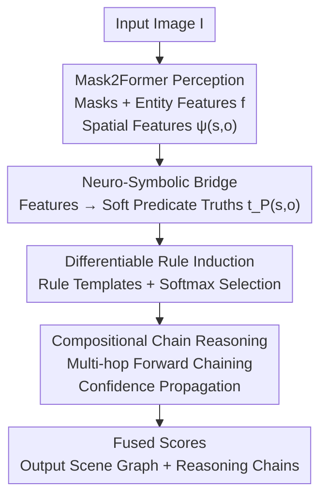

# NeuroRule: Bridging Vision and Logic with Differentiable Rule Induction

**Conference**: CVPR 2026  
**Paper**: [CVF Open Access](https://openaccess.thecvf.com/content/CVPR2026/html/Zarar_NeuroRule_Bridging_Vision_and_Logic_with_Differentiable_Rule_Induction_CVPR_2026_paper.html)  
**Area**: Neuro-symbolic / Explainability / Scene Graph Generation  
**Keywords**: Scene Graph Generation, Neuro-symbolic, Differentiable Rule Induction, First-Order Logic, Compositional Reasoning

## TL;DR
NeuroRule connects the pixel-level perception of Mask2Former with a differentiable first-order logic rule induction engine. It **automatically learns explainable compositional logic rules** (e.g., `riding(x,y) ∧ on(y,z) → travel-on(x,z)`) from images in an end-to-end manner. This approach achieves SOTA performance across three scene graph benchmarks (VG / PSG / Open-PSG) while providing an auditable reasoning chain for every relation prediction.

## Background & Motivation
**Background**: Scene Graph Generation (SGG) aims to decompose an image into a structured graph composed of `(subject, predicate, object)` triplets, serving as a foundation for downstream tasks like VQA, image captioning, and cross-modal retrieval. Prevailing methods fall into two categories: two-stage models that detect objects via Faster R-CNN before performing relationship classification on all object pairs, and one-stage models that follow the DETR paradigm to jointly detect and predict relations using queries. In both cases, predicate prediction is essentially a **pure neural network classifier**.

**Limitations of Prior Work**: Pure neural classifiers tend to "fit the distribution," treating each relation as an independent prediction. They can identify `(person, riding, horse)` and `(horse, moving-on, road)`, but they **cannot infer** the implicit relationship that should hold: `(person, travel-on, road)`—because they lack any mechanism for compositionality between relations. Furthermore, they fail to explain "why" a relation holds and exhibit poor generalization to unseen predicate or object categories.

**Key Challenge**: There is a disconnect between the flexible perception capabilities of neural networks and the compositional, explainable reasoning of symbolic systems. One must choose between pure neural approaches (flexible but black-box, lacking compositionality) or traditional symbolic rules (explainable but hand-coded, suffering from combinatorial explosion, and unable to be learned directly from pixels). The difficulty in merging them lies in the fact that the "discrete structural selection" of symbolic rules is inherently non-differentiable, making it incompatible with end-to-end backpropagation.

**Goal**: To upgrade from "identifying what relations exist" to "explaining why they hold" and "how to reason compositionally," while ensuring the entire pipeline—from pixels to logic—is fully differentiable and trainable end-to-end.

**Key Insight**: The authors observe that the "structure" of logic rules (Horn clauses) can be represented by a set of **soft selection weights**. By applying a softmax over the predicate set for each rule slot, the discrete decision of "which predicate to include in the rule body" is relaxed into continuous differentiable attention. Consequently, the rule structure, parameters, and visual grounding can be learned simultaneously via gradient descent.

**Core Idea**: Logic rules are treated as **learnable and compositional primitives** (rather than fixed constraints or implicit neural patterns). Mask2Former provides pixel-level perceptual evidence, while a differentiable rule induction engine automatically discovers first-order logic rules and performs multi-hop chained reasoning—all in a fully end-to-end differentiable manner.

## Method

### Overall Architecture
NeuroRule is an end-to-end differentiable pipeline from "pixel perception" to "symbolic reasoning." Given an input image $I \in \mathbb{R}^{H\times W\times 3}$, it outputs a scene graph $G=\{V,E\}$ (containing object nodes and weighted relationship edges), with each edge accompanied by a logic reasoning chain explaining it.

The architecture consists of three stages: ① **Pixel Perception**—Mask2Former extracts multi-scale features, decodes entity masks $\hat m_i$, features $f_i$, and spatial features $\phi_i$ using learnable queries, and calculates spatial relationship features $\psi(s,o)$ for entity pairs to form an initial context graph; ② **Neuro-Symbolic Bridge**—mapping continuous visual features to "predicate truth probabilities" (soft predicate truth values) in a discrete symbolic space; ③ **Differentiable Rule Induction + Chain Reasoning**—automatically learning Horn clauses using rule templates, performing forward chaining multi-hop reasoning on candidate triplets, and propagating confidence scores along the reasoning chain to output auditable relations.

### Key Designs

**1. Neuro-Symbolic Bridge: Translating Visual Features into "Predicate Truth Probabilities"**

Pure neural SGG treats predicate prediction as a black-box classification, leaving the symbolic system without usable "truth values." The neuro-symbolic bridge acts as this translator. For every atomic predicate $P(s,o)$ (including unary entity predicates like `person(x)` and binary relation predicates like `riding(x,y)`), its truth value is provided by a small neural network:

$$t_P(s,o) = \sigma\!\left(W_P^{\top}\cdot[f_s; f_o; \psi(s,o)] + b_P\right)$$

where $[\cdot;\cdot]$ denotes concatenation, $f_s,f_o$ are entity features from Mask2Former, and $\psi(s,o)\in\mathbb{R}^k$ is the spatial relationship feature (composed of normalized center offsets, log-scale ratios, IoU, and normalized distance/orientation encoding). Each predicate $P$ has its own learnable embedding $W_P$. This compresses visual evidence into a probability truth value in $[0,1]$, which can be fed into the logic layer for fuzzy reasoning. Crucially, perception and symbols are not trained separately; $W_P$ is driven by the same objective function gradients as the subsequent rules, forcing perceptual features to align with symbolic reasoning.

**2. Differentiable Rule Induction: Making "Rule Structure Selection" Differentiable via Softmax**

Traditional symbolic methods rely on hand-written rules or discrete searches, which are neither differentiable nor scalable. NeuroRule bypasses this using **rule templates**: given a maximum rule body length $L$, a soft selection is performed over the entire predicate set $\mathcal{P}$ for each slot $l$. The rule body is expressed as:

$$\text{body} = \bigwedge_{l=1}^{L}\sum_{P\in\mathcal{P}}\beta_{l,P}\cdot P(z_l,z_{l+1}),\qquad \beta_{l,P}=\frac{\exp(\gamma_{l,P})}{\sum_{P'}\exp(\gamma_{l,P'})}$$

where $\gamma_{l,P}$ is a learnable parameter. The softmax output $\beta_{l,P}$ acts as attention for "using predicate $P$ at slot $l$." Weights are flat during early training and sharpen as they converge to specific predicates via gradient descent, relaxing discrete structure selection into continuous optimization. The rule body truth value uses the product t-norm for fuzzy conjunction $t^r_{\text{body}}(s,o)=\prod_{i=1}^{k}t_{P_i}(z_i,z_{l+1})$. Each rule has a learnable weight $\alpha_r$, and the final probability for relation $R$ is a weighted sum of related rules passed through a sigmoid:

$$P(R(s,o)) = \sigma\!\left(\sum_{r\in\mathcal{R}_R}\alpha_r\cdot t^r_{\text{body}}(s,o)\right)$$

This allows rule structures, rule weights $\alpha_r$, and predicate embeddings $W_P$ to be learned jointly via gradients. The implementation maintains up to 1000 rule templates with a maximum length of $L=4$.

**3. Mechanism: Upgrading Single-step Prediction to Multi-hop Logical Deduction**

Learning single-step rules like `P1(s,o)→R(s,o)` is insufficient for inferring implicit relations. Compositional generalization requires chaining simple rules. NeuroRule **recursively** applies rules on the computation graph to support chain reasoning (e.g., deriving `travel-on(x,z)` from `riding(x,y)` and `on(y,z)`). Truth values for rule bodies with intermediate variables $z_2,\dots,z_k$ are calculated by taking the max over intermediate entities:

$$t^r_{\text{body}}(s,o) = \max_{e_2,\dots,e_k\in E}\left[\prod_{i=1}^{k}t_{P_i}(e_i,e_{i+1})\right]$$

where $e_1=s,\ e_{k+1}=o$. The max operation logically simulates the existential quantifier ("there exists an intermediate entity such that the chain holds") and is made differentiable via a softmax approximation. Confidence propagates along this chain, ensuring the output includes not just a triplet but a verifiable evidence chain. This is why the model excels at zero-shot/unseen relations: complex relations can be **composed** from simple relations seen during training.

### Loss & Training
The training objective combines the relationship prediction loss with a rule regularization term:

$$L = \sum_{(I,T)}\left[\sum_{(s,r,o)\in T}\big(\lambda\cdot\Omega(\text{Rul}) - \log P(r(s,o))\big)\right]$$

$\Omega(\text{Rul})$ penalizes rule complexity and consists of two parts: an L1 sparsity term $\Omega_{\text{sparsity}}$ to filter redundant rules, and a semantic term $\Omega_{\text{semantic}}$ to ensure logical coherence by maximizing the similarity between the rule body and head. This balances prediction accuracy and rule simplicity, preventing the model from learning long, overfitted rules. Hyperparameter $\lambda=0.1$. Implementation details: Mask2Former with Swin-L backbone, AdamW optimizer, learning rate 5e-5, weight decay 1e-4, PyTorch 2.0 + CUDA 11.8.

## Key Experimental Results

### Main Results
On the Visual Genome (VG) dataset (SGDet setting), NeuroRule achieves SOTA across all 8 metrics:

| Method | Backbone | AP50 | R@50 | mR@50 | mR@100 | F1 |
|------|----------|------|------|-------|--------|-----|
| EGTR | DETR | 31.7 | 52.7 | 28.9 | 35.1 | 0.37 |
| DECOLA | ViT-fusion | 35.2 | 57.1 | 31.8 | 38.5 | 0.41 |
| ViStruct | CodeT5+BLIP-2 | 38.9 | 60.5 | 34.7 | 41.2 | 0.44 |
| RAHP | CLIP | 29.8 | 50.9 | 26.4 | 32.9 | 0.35 |
| **Ours** | **Mask2Former** | **42.3** | **63.2** | **36.7** | **44.5** | **0.47** |

On the PSG spatial relationship benchmark, the mean spatial accuracy (mS@Acc) reached 88.4, significantly outperforming the strongest baseline ViStruct (78.4) by 10 points. On Open-PSG zero-shot triplet detection, NeuroRule set new records: Open-Entity 42.7, Open-Relations 38.9, Compositional Accuracy (CAcc) 45.2, and TScore 0.82.

### Ablation Study
On VG under the PredCls setting (isolating the reasoning module using ground truth labels and boxes):

| Variant | Label | R@20 | R@50 | R@100 | Note |
|------|------|------|------|-------|------|
| Neural-Only Baseline | A | 58.3 | 65.1 | 67.9 | No symbolic module, pure MLP |
| Ours (w/o Chaining) | B | 60.1 | 67.4 | 70.2 | Rule learning but no multi-hop, $L=1$ |
| Ours (w/o Reg.) | C | 61.5 | 68.8 | 71.5 | Removed regularization $\Omega$ |
| Ours (Full) | D | 62.8 | **70.1** | 72.9 | Full model, $L=4$ |

### Key Findings
- **Chaining is the primary contributor**: The transition from B to D (enabling multi-hop) yields a +2.7 R@50 gain, proving that chaining simple rules into complex relations is the core of compositional generalization. Even adding single-step rules (A to B) provides a +2.3 R@50 boost, indicating the symbolic inductive bias is inherently more structured than pure neural classification.
- **Regularization prevents overfitting**: While D is only slightly better than C in score, rule analysis shows that without regularization, the model learns long, low-support pseudo-rules (e.g., `has(x,y)∧wearing(y,z)∧man(z)→on(x,z)`). Regularization $\Omega$ encourages shorter, more universal, and semantically coherent rules, making them **credible and readable**.
- **Superior efficiency**: Compared to pure neural models like MotifNet or traditional symbolic methods like P-SGG, NeuroRule exhibits lower inference time with higher R@50. Differentiable rule learning avoids the combinatorial explosion typical of traditional symbolic reasoning, reportedly running 3× faster than Knowledge Graph-based methods.

## Highlights & Insights
- **Elegant Differentiable Relaxation**: Using rule templates with softmax over predicates to translate discrete structure selection into continuous attention is a brilliant trick. This can be adapted to any task requiring "soft selection of discrete structures from a candidate set."
- **Inherent Explainability**: In NeuroRule, the reasoning chain (e.g., `riding ∧ on → travel-on`) is the prediction mechanism itself, not a post-hoc attention visualization. Thus, the explanation is naturally faithful to the model's decision-making.
- **Dual-Purpose Regularization**: The combination of sparsity and semantic terms does not just prevent overfitting; it ensures that learned rules remain human-readable, merging "performance regularization" and "explainability constraints."

## Limitations & Future Work
- **Hard Caps on Rules**: The maximum of 1000 templates and length $L\le4$ are pre-set, meaning logical structures exceeding this complexity cannot be learned.
- **Max Enumeration Cost**: Chained reasoning requires taking the max over all intermediate entities, which might incur significant overhead as scene complexity (number of entities) increases.
- **Metric Verification**: Several new metrics on PSG/Open-PSG (e.g., TScore, CAcc) are novel protocols introduced by the paper; their comparability with existing benchmarks needs further scrutiny via the supplementary material (⚠️ Subject to original/supplementary text).
- **Writing Quality**: The text contains several rough expressions and repetitive sentences (e.g., "they often fail to they often fail to" in the related work section).

## Related Work & Insights
- **vs. Pure Neural SGG**: Methods like EGTR or RelTR use self-attention or DETR queries for end-to-end prediction, excelling at fitting data but failing at composition and explanation. NeuroRule replaces the classification head with "soft predicates + learnable rules + chain reasoning" while remaining end-to-end.
- **vs. VLM-based SGG**: While DECOLA or ViStruct leverage LLMs/VLMs for open-vocabulary SGG, they suffer from high latency and potential hallucinations. NeuroRule utilizes Mask2Former for millisecond-level pixel grounding and explicit logic for explainability.
- **vs. Traditional Neural Rule Learning**: Unlike prior methods that extract rules from structured data or struggle with out-of-distribution generalization, NeuroRule is the first framework to perform differentiable rule induction **directly from visual data** at the pixel level.

## Rating
- Novelty: ⭐⭐⭐⭐⭐ First SGG framework to induce differentiable first-order logic rules directly from pixels.
- Experimental Thoroughness: ⭐⭐⭐⭐ Extensive benchmarks, ablations, and rule quality analysis, though some metrics depend on supplementary details.
- Writing Quality: ⭐⭐⭐ Logic is clear, but several grammatical errors and repetitive phrasing detract from the experience.
- Value: ⭐⭐⭐⭐ Provides a robust neuro-symbolic paradigm for trustworthy, auditable visual understanding.

<!-- RELATED:START -->

## Related Papers

- [\[ICLR 2026\] GAVEL: Towards Rule-Based Safety through Activation Monitoring](../../ICLR2026/interpretability/gavel_towards_rule-based_safety_through_activation_monitoring.md)
- [\[CVPR 2026\] Rounded or Streamlined Head? Bridging Concept Bottleneck Models and Attribute-Described Object Parts](rounded_or_streamlined_head_bridging_concept_bottleneck_models_and_attribute-des.md)
- [\[CVPR 2026\] Selection-as-Nonlinearity: Bridging Attention and Activation via a Joint Game-Decision Lens for Interpretable, Discriminative Visual Representations](selection-as-nonlinearity_bridging_attention_and_activation_via_a_joint_game-dec.md)
- [\[CVPR 2026\] Understanding Counting Mechanisms in Large Language and Vision-Language Models](understanding_counting_mechanisms_in_large_language_and_vision-language_models.md)
- [\[CVPR 2025\] Differentiable Inverse Rendering with Interpretable Basis BRDFs](../../CVPR2025/interpretability/differentiable_inverse_rendering_with_interpretable_basis_brdfs.md)

<!-- RELATED:END -->
