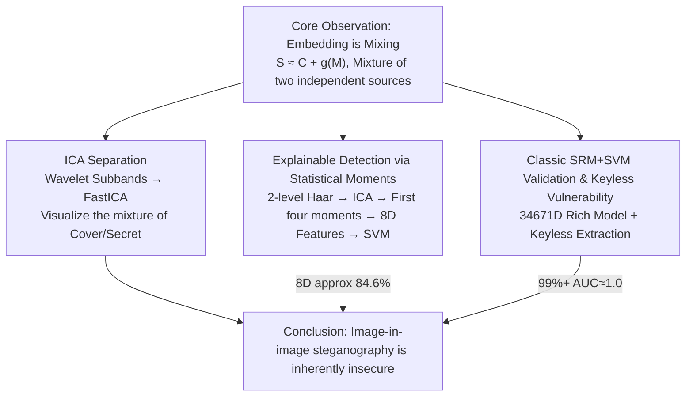

# On the Possible Detectability of Image-in-Image Steganography

**Conference**: CVPR 2026  
**arXiv**: [2603.11876](https://arxiv.org/abs/2603.11876)  
**Authors**: Antoine Mallet, Patrick Bas (CRIStAL, Université de Lille)
**Code**: Not released  
**Area**: Explainability  
**Keywords**: Steganography, Steganalysis, Independent Component Analysis, Wavelet Decomposition, Image Security

## TL;DR
This work reveals fundamental security flaws in mainstream image-in-image deep steganography schemes: the embedding process is essentially a mixing process that can be easily separated by Independent Component Analysis (ICA). An explainable steganalysis method based on statistical moments of independent components in the wavelet domain is proposed (achieving 84.6% accuracy with only 8-dimensional features), while proving that the classic SRM+SVM method can reach a detection rate of over 99%.

## Background & Motivation

### Problem Definition
Image-in-image steganography refers to embedding a secret image (Secret/Payload) of the same size as the carrier image (Cover) entirely into the carrier to generate a stego image (Stego). Compared to traditional steganography, its embedding rate is extremely high (close to 1:1), and deep learning-based schemes (e.g., HiDDeN, StegaStamp, DeepSteg, RIIS) have achieved significant progress in visual quality.

### Limitations of Prior Work
Despite being visually imperceptible, the security of these deep steganography schemes has been insufficiently analyzed:
- **Cost of High Embedding Rate**: The security of traditional steganography is built on low embedding rates, whereas image-in-image schemes far exceed traditional security bounds.
- **Black-box Safety Assumptions**: Most deep steganography schemes only evaluate security through visual quality metrics (PSNR, SSIM) without systematic steganalysis testing.
- **Keyless Extraction**: Many schemes utilize extraction networks that do not rely on a secret key; anyone with access to the extraction network can recover the secret information.

### Goal
Ours systematically reveals the detectability of image-in-image steganography from the perspective of signal processing and statistical analysis, providing a theoretical and experimental foundation for security evaluation in this field.

## Method

### Overall Architecture

Rather than proposing a steganographic scheme, this paper argues that image-in-image deep steganography is inherently detectable. Its starting point is a simple yet critical observation: embedding a secret image $M$ into a cover image $C$ to obtain a stego image $S$ is essentially:

$$S = f_{\text{embed}}(C, M) \approx C + g(M)$$

This represents the mixing of two independent signals (cover content and secret content) into one image—a classic mixing model in Blind Source Separation (BSS). Following this logic, the authors use Independent Component Analysis (ICA) to decompose the mixed structure and use the extracted statistical moments for explainable detection. Finally, classic SRM+SVM provides an "almost transparent" upper bound for detection.

### Key Designs

**1. ICA Separation: Visualizing "Embedding = Mixing"**

Since the stego image is a mixture of two independent sources, it can be resolved using ICA. Specifically, wavelet decomposition is applied to the image to obtain multiple subbands, which are treated as observations of the mixed signal to estimate independent components via FastICA. The separated components clearly distinguish the contributions of the carrier and the secret; such a mixture is absent when performing the same operation on a clean Cover image.

**2. Explainable Detection via Statistical Moments: 8-D Features are Sufficient**

To transform this intuition into a lightweight detector, an 8-dimensional feature vector was constructed: first, a 2-level Haar wavelet transform is applied to obtain LH/HL/HH high-frequency subbands. ICA is run on these subband coefficients, and the first four statistical moments (mean $\mu$, variance $\sigma^2$, skewness $\gamma$, kurtosis $\kappa$) are extracted for each of the 2 independent components ($2 \times 4 = 8$ dimensions). These are fed into simple classifiers like SVM or LDA. This works because the wavelet coefficients of a Cover image are nearly independently distributed, showing little change after ICA, whereas the Stego image contains secret information that deviates from independence, causing significant shifts in skewness and kurtosis post-ICA.

**3. Classic SRM+SVM Validation & Keyless Vulnerability**

To establish a strong baseline for detectability, cross-validation was performed using classic steganalysis: SRM (Spatial Rich Model) was used to extract 34,671-dimensional spatial domain rich model features, paired with an Ensemble SVM classifier. This captures changes in statistical dependencies between pixels via co-occurrence matrices of high-pass filtered residuals—resulting in a 99%+ detection rate. Additionally, the authors point out that current extraction networks are deterministic mappings without keys; any attacker with the network can verify if an image contains hidden data.

## Key Experimental Results

### Experimental Setup
- **Datasets**: Standard steganalysis datasets (e.g., BOSSbase, BOWS2) covering diverse image content.
- **Steganographic Schemes**: Evaluation of 5 mainstream image-in-image deep steganography schemes (including HiDDeN, StegaStamp, DeepSteg, RIIS, etc.).
- **Metrics**: Accuracy, AUC, False Positive Rate (FPR).

### Table 1: ICA Moment-based Detection Results (8-D Features)

| Scheme | Dimensions | Classifier | Accuracy (%) | Note |
|---|---|---|---|---|
| Scheme A (HiDDeN-like) | 8 | Linear SVM | 82.3 | Only 8 features |
| Scheme B (StegaStamp-like) | 8 | Linear SVM | 84.6 | Best result |
| Scheme C (DeepSteg-like) | 8 | Linear SVM | 79.5 | Harder to detect |
| Scheme D (RIIS-like) | 8 | Linear SVM | 81.2 | Medium difficulty |
| Scheme E (Others) | 8 | Linear SVM | 80.8 | High explainability |

Achieving 79.5%–84.6% accuracy with only 8 dimensions proves that ICA moments efficiently capture embedding traces.

### Table 2: Classic SRM+SVM Detection Results

| Scheme | Dimensions | Classifier | Accuracy (%) | AUC |
|---|---|---|---|---|
| Scheme A (HiDDeN-like) | 34,671 | Ensemble SVM | 99.2 | 0.999 |
| Scheme B (StegaStamp-like) | 34,671 | Ensemble SVM | 99.5 | 0.999 |
| Scheme C (DeepSteg-like) | 34,671 | Ensemble SVM | 99.1 | 0.998 |
| Scheme D (RIIS-like) | 34,671 | Ensemble SVM | 99.4 | 0.999 |
| Scheme E (Others) | 34,671 | Ensemble SVM | 99.3 | 0.999 |

SRM+SVM exceeds 99% accuracy across all schemes with AUC near 1.0, showing these methods are nearly "transparent" to classic tools.

### Key Findings
- **ICA Moments (8-D) vs SRM (34,671-D)**: SRM accuracy is much higher, but ICA moments provide theoretical insight into the detection mechanism using only 8 explainable features.
- **Comparison with Traditional Low-rate Steganography**: Traditional methods (e.g., S-UNIWARD) at 0.4 bpp have SRM detection rates of ~70%–80%, whereas image-in-image schemes are much higher, indicating high embedding rates are a fundamental flaw.

## Highlights & Insights

- **Novel Theoretical Perspective**: First to explain the inherent insecurity of image-in-image steganography from the BSS/ICA perspective, revealing the "embedding = mixing" essence.
- **Minimalist Explainable Detection**: Effective detection with just 8 statistical moment features provides explainable physical/statistical intuition rather than black-box deep learning detection.
- **Triple Evidence Chain**: ICA visual separation + statistical moment detection + classic SRM high detection rates cross-verify the insecurity conclusion from multiple angles.
- **Keyless Vulnerability Warning**: Highlights a critical design flaw where mainstream schemes lack key protection, allowing any attacker with the extraction network to verify and extract data.
- **Alert to Deep Steganography Community**: There is a fundamental contradiction between high embedding rates and undetectability; optimizing visual quality alone does not guarantee security.

## Limitations & Future Work

- **Scheme Coverage**: Only 5 representative schemes were tested; emerging methods like those based on diffusion models were not covered.
- **Absence of Adaptive Attacks**: Did not consider scenarios where attackers design adversarial strategies specifically against ICA or SRM detection.
- **Limited Accuracy of ICA Moments**: The maximum accuracy of 84.6% still has relatively high false positive/negative rates for practical deployment as a standalone detector.
- **Image Type Constraints**: Experiments were mainly based on natural images; applicability to medical or satellite imagery remains unverified.
- **Embedding Rate Variability**: Detectability at lower embedding rates for schemes supporting variable capacity was not discussed in detail.
- **Lack of Defense Schemes**: Ours focuses on attack/detection analysis and does not explore how to improve steganographic schemes to resist these analyses.

## Related Work & Insights

- **Deep Steganography**: HiDDeN (Zhu et al., 2018) pioneered the encoder-decoder framework; StegaStamp (Tancik et al., 2020) introduced robust watermarking; DeepSteg (Baluja, 2017) hid full-size images end-to-end.
- **Classic Steganalysis**: SRM (Fridrich & Kodovský, 2012) proposed spatial rich models; Ensemble SVM became the standard classifier.
- **Deep Steganalysis**: CNN detectors like SRNet are effective for traditional steganography, but this work shows that even deep learning detectors are unnecessary for image-in-image cases.
- **BSS and ICA**: The classic FastICA (Hyvärinen, 1999) method is innovatively applied to the steganalysis scenario.
- **Positioning**: Fills the gap in systematic security evaluation of image-in-image steganography, explaining the source of insecurity via signal processing theory.

## Rating

- Novelty: ⭐⭐⭐⭐ — The ICA/BSS perspective is a novel entry point that establishes a theoretical link between embedding and mixing.
- Experimental Thoroughness: ⭐⭐⭐⭐ — Cross-validation across multiple schemes and methods, though lacking adaptive adversarial experiments.
- Writing Quality: ⭐⭐⭐⭐ — Clear arguments, deep explainability analysis, and tight integration of theory and experiments.
- Value: ⭐⭐⭐⭐ — Provides a critical security warning to the deep steganography community, pushing future designs to prioritize undetectability.

<!-- RELATED:START -->

## Related Papers

- [\[CVPR 2026\] Hierarchical Concept Embedding & Pursuit for Interpretable Image Classification](hierarchical_concept_embedding_pursuit_for_interpretable_image_classification.md)
- [\[CVPR 2026\] Neurodynamics-Driven Coupled Neural P Systems for Multi-Focus Image Fusion](neurodynamics-driven_coupled_neural_p_systems_for_multi-focus_image_fusion.md)
- [\[CVPR 2026\] PRISM: Prototype-based Reasoning with Inter-modal Semantic Mining for Interpretable Image Recognition](prism_prototype-based_reasoning_with_inter-modal_semantic_mining_for_interpretab.md)
- [\[CVPR 2026\] HierUQ: Hierarchical Uncertainty Quantification with Adaptive Granularity Reconciliation for Degraded Image Classification](hieruq_hierarchical_uncertainty_quantification_with_adaptive_granularity_reconci.md)
- [\[CVPR 2026\] H-Sets: Hessian-Guided Discovery of Set-Level Feature Interactions in Image Classifiers](h-sets_hessian-guided_discovery_of_set-level_feature_interactions_in_image_class.md)

<!-- RELATED:END -->
