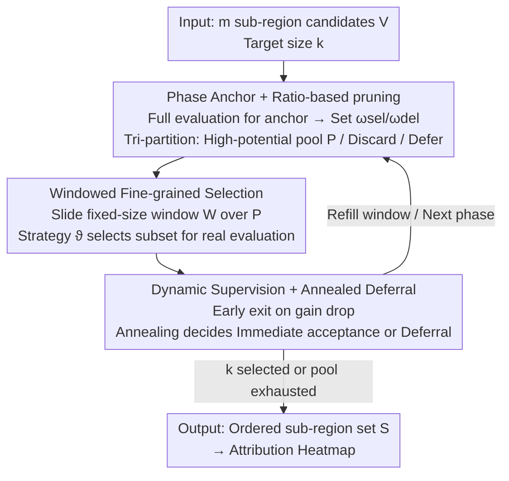

# PhaseWin: Reducing Object-Level Attribution from Quadratic Complexity to Near-Linear Phase-Window Search

**Conference**: CVPR 2026  
**Paper**: [CVF Open Access](https://openaccess.thecvf.com/content/CVPR2026/html/Gu_PhaseWin_Search_Framework_Enable_Efficient_Object-Level_Interpretation_CVPR_2026_paper.html)  
**Code**: https://github.com/Qihuai27/phasewin-search  
**Area**: Interpretability / Attribution Explanation  
**Keywords**: Object-level attribution, submodular optimization, greedy acceleration, phase-window search, multimodal foundation models

## TL;DR
PhaseWin transforms the quadratic greedy sub-region selection in object-level attribution (which re-scores all remaining regions at every step) into a coarse-to-fine search process featuring "phase pruning + window selection + dynamic supervision." While preserving greedy approximation guarantees, it achieves 95%+ of greedy attribution faithfulness using approximately 20% of the forward pass budget.

## Background & Motivation
**Background**: Attribution is a core tool for explaining "which region" object-level (detection / referring grounding) foundation models like Grounding DINO and Florence-2 rely on for their decisions. Among existing approaches, gradient-based methods (e.g., Grad-CAM) are computationally cheap but exhibit weak localization in multimodal settings; perturbation-based methods (D-RISE, D-HSIC) offer higher faithfulness but suffer from massive forward pass requirements. Recent SOTA methods model attribution as **near-submodular objective maximization**, such as VPS (Visual Precision Search), which uses stepwise greedy selection to achieve superior attribution quality.

**Limitations of Prior Work**: The greedy core of VPS requires scoring **all** remaining sub-regions at every step. When selecting $k$ regions from $m$ candidates, the complexity is $O(mk)$ (quadratic forward passes). In a 100-region setting, VPS requires ~10,100 model forward passes per sample, making it undeployable in large-scale or real-time scenarios such as autonomous driving or open-world perception.

**Key Challenge**: The trade-off between faithfulness and efficiency. Submodular greedy selection is the theoretical ceiling for faithfulness (offering a $1-1/e$ optimality guarantee). However, its quadratic cost stems specifically from the "full re-evaluation per step" mechanism. Reducing evaluations risks deviating from the greedy trajectory and sacrificing faithfulness.

**Key Insight**: The authors observe that this quadratic bottleneck is **not an inherent property of submodular optimization but is caused by the organization of the search mechanism**. The effectiveness of greedy search lies in "selecting the region with the largest marginal gain," which does not require precise evaluation of all candidates. Numerous low-potential candidates can be **coarsely screened** using cached gains, reserving real evaluations for a small subset of high-potential candidates.

**Core Idea**: The search is decomposed into **phases**. At the start of each phase, an anchor point is used to set thresholds that prune candidates into three categories: "high-potential pool / discard / defer." A **fixed-size sliding window** then performs fine-grained real evaluations on the high-potential pool, subject to a dynamic supervision mechanism for early termination. This "coarse-to-fine" approximation reduces real evaluations by an order of magnitude while mimicking greedy behavior.

## Method

### Overall Architecture
PhaseWin addresses the same attribution objective (Eq. 1: finding an ordered sequence of sub-regions that maximizes the area under the "progressive reveal" confidence curve) but replaces the solver with "Phase-Window Search." It **fully inherits the scoring function $F$ from VPS** (combining a clue score for region support and a collaboration score for confidence degradation upon removal), isolating the improvement strictly within the search mechanism.

The framework utilizes a two-level structure: an **outer phase loop** and an **inner window loop**. Each phase begins with a full evaluation of remaining candidates $R$ to set an anchor and thresholds. The inner loop then performs windowed selection on high-potential candidates $P$, constrained by "early exit" and "annealed deferral" mechanisms.

### Key Designs

**1. Phase Anchor + Fixed-Ratio Threshold Pruning**: PhaseWin performs **one** full evaluation of the remaining set $R$ at the start of each phase. It calculates the marginal gain $g_r = F(S\cup\{r\}) - F(S)$ for all $r \in R$, designating the max-gain region as anchor $r^*$ with gain $\Delta_{\text{ref}}$. Two **fixed-ratio thresholds** are set: selection threshold $\omega_{\text{sel}} = \varepsilon_{\text{sel}}\cdot\Delta_{\text{ref}}$ and deletion threshold $\omega_{\text{del}} = \varepsilon_{\text{del}}\cdot\Delta_{\text{ref}}$, where $0 < \varepsilon_{\text{del}} < \varepsilon_{\text{sel}} < 1$. Candidates are partitioned based on $g_r$: $g_r \ge \omega_{\text{sel}}$ enter the high-potential pool $P$, $g_r \le \omega_{\text{del}}$ are discarded, and others are deferred. This drastically reduces the candidates subjected to expensive real evaluations.

**2. Windowed Fine-grained Selection**: To avoid quadratic costs within the high-potential pool $P$, the `WindowSelection` procedure sorts $P$ by cached gains and initializes a **fixed-size sliding window** $W$. A **window strategy** $\vartheta(\cdot)$ selects a subset $A\subseteq W$ for **real evaluation**. Two strategies are proposed: $\vartheta_{\text{LG}}$ (selecting only the top gain within the window) and $\vartheta_{\text{BA}}$ (accepting all candidates in the window exceeding a relative gain threshold). Accepted candidates refresh $\Delta_{\text{ref}}$, and the window is refilled from the queue $Q$.

**3. Dynamic Supervision (Early Exit) + Annealed Deferral**: To mitigate low-reward evaluations, PhaseWin employs two controls. **Stage-exit** terminates the phase if the real gain $\Delta_\delta < \rho\cdot\Delta_{\text{ref}}$. **Annealed deferral** prevents getting trapped in local optima by deciding whether to immediately accept a candidate or defer it to encourage exploration. These mechanisms ensure the approximation guarantee is maintained at $1-1/e-o(1)$.

## Key Experimental Results

Experiments use Grounding DINO and Florence-2 on MS COCO (Detection), RefCOCO (REC), and LVIS V1. Efficiency is measured by **MEC** (Model Evaluation Count) and **A-C ratio** (Accuracy/Cost ratio). Faithfulness is measured by Insertion (↑) and Deletion (↓) AUC.

### Main Results (Grounding DINO, Correct Samples)

| Dataset | Method | Insertion ↑ | Deletion ↓ | MEC ↓ | A-C ratio ↑ |
|--------|------|------|------|------|------|
| MS COCO (50) | VPS(Greedy) | 0.5195 | 0.0375 | 2548.8 | 2.04 |
| MS COCO (50) | **Ours** | 0.4785 | 0.0424 | **536.8** | **8.92** |
| RefCOCO (50) | VPS(Greedy) | 0.7278 | 0.1240 | 2290.6 | 3.18 |
| RefCOCO (50) | **Ours** | 0.7013 | 0.1473 | **630.1** | **11.13** |
| LVIS rare (50) | VPS(Greedy) | 0.3411 | 0.0265 | 2544.6 | 1.34 |
| LVIS rare (50) | **Ours** | 0.3071 | 0.0303 | **465.9** | **6.59** |

In the 50-region setting, PhaseWin reduces evaluations from 2548.8 to 536.8 (~4.7× speedup) with minimal loss in Insertion AUC. The A-C ratio increases significantly (e.g., from 3.18 to 11.13 on RefCOCO).

### Results on Florence-2

| Dataset | Method | Insertion ↑ | Deletion ↓ | MEC ↓ | A-C ratio ↑ |
|--------|------|------|------|------|------|
| MS COCO | VPS(Greedy)-50 | 0.7678 | 0.0550 | 2548.1 | 2.98 |
| MS COCO | **Ours-50** | 0.7615 | **0.0474** | **2184.1** | **3.49** |
| RefCOCO | VPS(Greedy)-50 | 0.8301 | 0.1159 | 2547.8 | 3.25 |
| RefCOCO | **Ours-50** | **0.8312** | 0.1205 | **2349.1** | **3.53** |

On Florence-2, faithfulness remains par with greedy search (even slightly higher on RefCOCO), though the speedup is less pronounced. The authors attribute this to Florence-2’s near-global supermodularity, which limits the acceleration derived from **local submodularity**.

### Key Findings
- **Coarse-to-Fine Acceleration**: The combination of phase pruning and windowed selection effectively reduces complexity from quadratic to near-linear.
- **Architecture Dependency**: Structural properties of the backbone (e.g., local submodularity) dictate acceleration magnitude. Grounding DINO achieves 5–10× speedup, while Florence-2 shows lower gains.
- **Failure Analysis**: PhaseWin maintains greedy-level faithfulness on failed samples (mis-grounding, mis-classification, etc.) but at a fraction of the cost, making large-scale failure analysis feasible.

## Highlights & Insights
- **Mechanism-driven Optimization**: The study identifies that the quadratic bottleneck is a mechanism issue rather than a theoretical necessity, enabling near-linear scalability for submodular attribution.
- **Decoupled Improvement**: By keeping the scoring function $F$ unchanged, the authors cleanly demonstrate that search mechanism improvements can yield significant efficiency gains without re-training.
- **Improved Exploration**: The annealed deferral mechanism allows PhaseWin to occasionally outperform pure greedy search by avoiding premature local optima.

## Limitations & Future Work
- **Supermodularity Constraints**: Speedup is less effective for models that are near-globally supermodular (e.g., Florence-2).
- **Faithfulness Trade-off**: There is a minor drop in Insertion AUC (typically 0.02–0.04), which may not be acceptable for offline scenarios requiring maximum precision.
- **Hyperparameter Sensitivity**: The ratio-based thresholds and annealing parameters require manual tuning relative to the number of regions. Future work could explore adaptive parameter selection.

## Related Work & Insights
- **vs. VPS (Greedy)**: Using the same objective, VPS re-evaluates all remaining regions ($O(mk)$), whereas PhaseWin uses pruning and windows ($O(m)$) for 5–10× speedup.
- **vs. Lazy Greedy**: Lazy Greedy achieves ~1.3× speedup by caching marginal gains. PhaseWin employs more aggressive pruning for much higher efficiency.
- **vs. Gradient/Perturbation Methods**: PhaseWin offers higher faithfulness than gradient methods and significantly lower computational costs than standard perturbation methods.

## Rating
- **Novelty**: ⭐⭐⭐⭐ Re-conceptualizing the greedy bottleneck via phase-window search is an innovative and generalizable mechanism.
- **Experimental Thoroughness**: ⭐⭐⭐⭐⭐ Comprehensive evaluation across two backbones, three datasets, and multiple failure cases with detailed speed-accuracy ablations.
- **Writing Quality**: ⭐⭐⭐⭐ Clear presentation of algorithms and complexity analysis.
- **Value**: ⭐⭐⭐⭐ Makes high-faithfulness submodular attribution viable for large-scale and real-time applications.

<!-- RELATED:START -->

## Related Papers

- [\[CVPR 2026\] Rounded or Streamlined Head? Bridging Concept Bottleneck Models and Attribute-Described Object Parts](rounded_or_streamlined_head_bridging_concept_bottleneck_models_and_attribute-des.md)
- [\[ICML 2025\] Near-Optimal Decision Trees in a SPLIT Second](../../ICML2025/interpretability/near_optimal_decision_trees_in_a_split_second.md)
- [\[ICML 2026\] AI Engram: In Search of Memory Traces in Artificial Intelligence](../../ICML2026/interpretability/ai_engram_in_search_of_memory_traces_in_artificial_intelligence.md)
- [\[CVPR 2026\] H-Sets: Hessian-Guided Discovery of Set-Level Feature Interactions in Image Classifiers](h-sets_hessian-guided_discovery_of_set-level_feature_interactions_in_image_class.md)
- [\[ICLR 2026\] Interpretable 3D Neural Object Volumes for Robust Conceptual Reasoning](../../ICLR2026/interpretability/interpretable_3d_neural_object_volumes_for_robust_conceptual_reasoning.md)

<!-- RELATED:END -->
