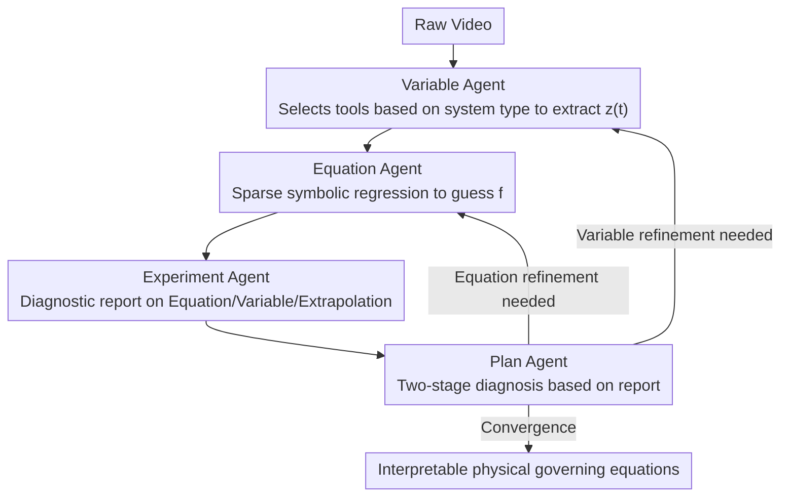

# Pixel2Phys: Distilling Governing Laws from Visual Dynamics

**Conference**: CVPR 2026  
**arXiv**: [2602.19516](https://arxiv.org/abs/2602.19516)  
**Code**: None  
**Area**: Explainability  
**Keywords**: Physics law discovery, multi-agent framework, symbolic regression, video understanding, AI for Science

## TL;DR
Pixel2Phys is proposed as an MLLM-based multi-agent collaborative framework that automatically discovers interpretable physical governing equations from raw videos through an iterative hypothesis-verification-refinement loop involving four agents: Plan, Variable, Equation, and Experiment. It achieves a 45.35% improvement in extrapolation accuracy compared to baselines.

## Background & Motivation
**Background**: Discovering physical laws from observational data is a core objective of AI for Science. Traditional methods rely on manual extraction of physical variables followed by symbolic regression, which is inefficient.

**Limitations of Prior Work**:
   - Supervised equation prediction models require scarce equation-video pairs and exhibit poor generalization.
   - Unsupervised latent space methods (Autoencoder + Symbolic Regression) have latent spaces determined by reconstruction objectives, often introducing physics-irrelevant factors like texture and lighting.
   - Direct prompting of MLLMs primarily retrieves prior knowledge from training corpora rather than deriving new laws from original visual data.

**Key Challenge**: There exists a chicken-and-egg dependency between physical variable extraction and equation discovery — a good variable space requires knowledge of dynamics, while discovering dynamics requires a clean variable space.

**Goal**: Simultaneously discover physical variables $z(t)$ and governing equations $f$, such that $\frac{dz}{dt} = f(z(t))$.

**Key Insight**: Simulate the collaborative workflow of human scientists—observation, hypothesis, experimentation, and refinement—to build an iterative multi-agent framework.

**Core Idea**: Coordinate four specialized agents using an MLLM for iterative scientific reasoning to break the cyclical dependency between variable extraction and equation discovery.

## Method

### Overall Architecture
Pixel2Phys addresses a difficult problem: to discover governing equations $\frac{dz}{dt}=f(z)$ from video, one needs clean physical variables $z(t)$; however, determining what constitutes a "clean" variable depends on the dynamics. Instead of a single-step solution, this paper decomposes the human scientific workflow into four MLLM-driven agents that iteratively provide feedback. The Variable Agent extracts candidate variables from pixels, the Equation Agent performs symbolic regression to hypothesize equations, the Experiment Agent provides diagnostic reports through extrapolation and visualization, and the Plan Agent analyzes these reports to determine whether to refine variables or the equation search. Each iteration calibrates the variable space and equations against each other.

### Key Designs

**1. Plan Agent: Two-stage diagnosis to decide the refinement direction**

This is the command center that breaks the cyclic dependency. In each round, it aggregates reports from the other three agents. It first performs a qualitative assessment based on visualizations (phase space plots, extrapolation curves) to check if the fitting is on the right track, then uses quantitative metrics like $R^2$ and extrapolation RMSE to locate specific bottlenecks. It chooses between two paths: variable refinement (re-extracting $\mathcal{Z}$) or equation refinement (adjusting search hyperparameters like sparsity).

**2. Variable Agent: Task-specific tool selection instead of a universal representation**

Since "variables" differ across physical systems, three tools are provided:
- **Object-level**: Uses SAM segmentation and tracking to extract trajectories $z(t)=[x(t),y(t)]$ for systems like pendulums.
- **Pixel-level**: Uses fixed convolutional kernels (Laplacian, bi-harmonic) to compute spatial derivatives for continuous systems like reaction-diffusion fields.
- **Representation-level**: A physics-informed autoencoder (PI-AE) with a training loss:

$$\mathcal{L} = \mathcal{L}_{recon} + \lambda_{eq}\,\mathcal{L}_{eq}, \qquad \mathcal{L}_{eq} = \|\mathcal{F}(z) - f(z)\|^2$$

where $\mathcal{L}_{eq}$ constrains the latent space using the currently discovered equation $f$. This "drags" the latent space toward physical self-consistency, unlike end-to-end methods that only use reconstruction loss.

**3. Equation Agent: Sparse symbolic regression for parsimonious discovery**

Given the variable sequence, it estimates time derivatives $\dot{Z}$ via central difference, constructs a candidate function library $\Theta(Z)$, and solves for the sparse coefficient matrix $\Xi$:

$$\min_{\Xi}\ \|\dot{Z} - \Theta(Z)\Xi\|_2^2 + \lambda_{sp}\|\Xi\|_1$$

Sequential Threshold Least Squares (STLSQ) is used to zero out most coefficients, leaving only significant terms. The sparsity parameter $\lambda_{sp}$ is dynamically adjusted by the Plan Agent.

**4. Experiment Agent: Three-dimensional cross-validation**

This agent translates "equation quality" into evidence for the Plan Agent:
- **Equation level**: $R^2$ score and complexity ($L_0$ norm of $\Xi$).
- **Variable level**: Phase space plots to visually inspect dynamical structures.
- **Extrapolation**: Integrating the equation from initial conditions to predict future trajectories and calculating RMSE against ground truth. This identifies "pseudo-solutions" that fit training data but fail in long-term prediction.

### Example: Discovering equations from a pendulum video

Taking a Van der Pol (VDP) oscillator video as an example:
1. **Variable Agent** identifies it as a discrete object, uses the Object-level tool for segmentation and tracking to get $z(t)=[x(t),y(t)]$.
2. **Equation Agent** computes $\dot Z$ and performs sparse regression. The initial $\lambda_{sp}$ is loose, resulting in an equation with false positive terms.
3. **Experiment Agent** performs extrapolation and finds that while short-term fit is acceptable, $R^2$@1000 is low and the phase space limit cycle is distorted.
4. **Plan Agent** analyzes the report: the trajectories are clean (correct phase structure), but the equation terms are cluttered. It initiates equation refinement by increasing $\lambda_{sp}$.
5. In the next round, the **Equation Agent** solves under tighter constraints. False positive terms decrease from 2.31 to 0.99, and $R^2$@1000 rises from 0.49 to 0.9954, achieving convergence.

### Loss & Training
Only the Representation-level tool in the Variable Agent requires training. The PI-AE utilizes only $\mathcal{L}_{recon}$ initially. Once a preliminary equation is found, $\mathcal{L}_{eq}$ is added for joint optimization, ensuring the latent space and equations converge together. Object-level and Pixel-level tools are training-free.

## Key Experimental Results

### Main Results (Object-level dynamics)

| Case | Method | Terms Found | False Positives | $R^2$@1000 |
|------|------|:-----------:|:---------:|----------|
| Linear | Coord-Equ | Yes | 1.10 | 0.8647 |
| Linear | **Ours** | **Yes** | **0** | **0.9913** |
| Cubic | Coord-Equ | No | 3.40 | 0.2632 |
| Cubic | **Ours** | **Yes** | **0.39** | **0.9886** |
| VDP | Coord-Equ | Yes | 2.31 | 0.4920 |
| VDP | **Ours** | **Yes** | **0.99** | **0.9954** |

### Main Results (Pixel-level PDE dynamics)

| Dataset | Method | RMSE↓ | VPS@0.5↑ |
|--------|------|-------|----------|
| Lambda-Omega | PDE-Find | 0.67 | 492 |
| Lambda-Omega | **Ours** | **0.03** | **1000** |
| Brusselator | SGA-PDE | 0.14 | 1000 |
| Brusselator | **Ours** | **0.12** | **1000** |
| FHN | PDE-Find | 0.63 | 54 |
| FHN | **Ours** | **0.16** | **1000** |

### Key Findings
- Implicit methods (Latent-ODE, AE-SINDy) completely fail in long-term extrapolation ($R^2 \approx 0$), proving that generic representations cannot capture physical structures.
- Pixel2Phys has significantly fewer false positive terms than Coord-Equ, discovering more concise and accurate equations.
- In PDE scenarios, neural operators (FNO/UNO) suffer from error accumulation, while Pixel2Phys correctly identifies high-order operators (bi-harmonic).
- The framework recovers the law of gravity and Navier-Stokes equations from real-world videos.

## Highlights & Insights
- **Multi-agent Scientific Reasoning**: Uses MLLM as a planner to coordinate specialized agents, automating the "observe-hypothesize-experiment-refine" methodology for the first time.
- **Physics-Informed Latent Space**: Discovered equations feedback into refining the variable space, breaking the variable-equation cyclic dependency.
- **Multi-granularity Tooling**: Three levels of tools (Object/Pixel/Representation) cover the spectrum from discrete objects to continuous fields and implicit dynamics.

## Limitations & Future Work
- High cost associated with utilizing GPT-4o as the backbone.
- Capability to handle N-body problems with complex interactions remains to be verified.
- The search space for symbolic regression explodes when physical variable dimensions are high.
- Chaotic systems in the real world may lead to non-convergence.

## Related Work & Insights
- **vs Coord-Equ (pipeline-based)**: Coord-Equ relies on a pre-trained tracker and single-pass regression, making it unable to handle continuous fields and prone to false positives. Pixel2Phys solves this with iterative refinement.
- **vs End-to-end (AE-SINDy)**: In end-to-end methods, reconstruction objectives dominate the latent space, leading to extrapolation failure due to physical inconsistencies. Pixel2Phys explicitly constrains the variable space via physics-consistency loss.

## Rating
- Novelty: ⭐⭐⭐⭐⭐ New paradigm for AI for Science with multi-agent reasoning.
- Experimental Thoroughness: ⭐⭐⭐⭐ Coverage of three scenarios plus real-world validation.
- Writing Quality: ⭐⭐⭐⭐ Clear framework description, though formulas require careful reading.
- Value: ⭐⭐⭐⭐⭐ Opens a new direction for MLLM-driven scientific discovery.

<!-- RELATED:START -->

## Related Papers

- [\[NeurIPS 2025\] Towards Scaling Laws for Symbolic Regression](../../NeurIPS2025/interpretability/towards_scaling_laws_for_symbolic_regression.md)
- [\[ICML 2026\] Learn from A Rationalist: Distilling Intermediate Interpretable Rationales](../../ICML2026/interpretability/learn_from_a_rationalist_distilling_intermediate_interpretable_rationales.md)
- [\[CVPR 2026\] Draft and Refine with Visual Experts](draft_and_refine_with_visual_experts.md)
- [\[CVPR 2026\] Language Models Can Explain Visual Features via Steering](language_models_can_explain_visual_features_via_steering.md)
- [\[CVPR 2026\] Selection-as-Nonlinearity: Bridging Attention and Activation via a Joint Game-Decision Lens for Interpretable, Discriminative Visual Representations](selection-as-nonlinearity_bridging_attention_and_activation_via_a_joint_game-dec.md)

<!-- RELATED:END -->
