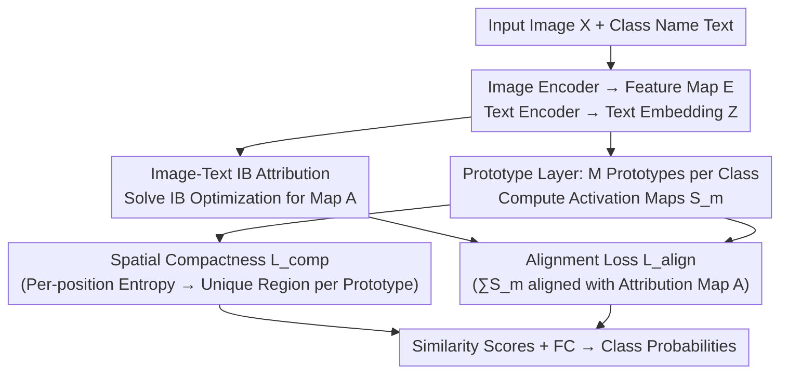

# PRISM: Prototype-based Reasoning with Inter-modal Semantic Mining for Interpretable Image Recognition

**Conference**: CVPR 2026  
**Paper**: [CVF Open Access](https://openaccess.thecvf.com/content/CVPR2026/html/Yu_PRISM_Prototype-based_Reasoning_with_Inter-modal_Semantic_Mining_for_Interpretable_Image_CVPR_2026_paper.html)  
**Code**: To be confirmed  
**Area**: Interpretability / Prototype Networks  
**Keywords**: Prototype Networks, Interpretable Image Recognition, Information Bottleneck, CLIP, Cross-modal Alignment

## TL;DR
PRISM augments traditional vision-only prototype networks (ProtoPNet series) with linguistic supervision. It utilizes CLIP and the Information Bottleneck principle to generate "text-conditioned attribution maps" as soft labels, implicitly anchoring visual prototypes to semantically meaningful image regions. By incorporating an entropy-based spatial compactness constraint to ensure non-overlapping prototypes, PRISM improves both accuracy and prototype interpretability on fine-grained classification tasks like CUB and Stanford Dogs.

## Background & Motivation
**Background**: Within self-interpretable models, prototype-based methods are a mainstream approach. Starting from ProtoPNet, these methods learn a set of "part prototypes" on CNN/ViT feature maps. During inference, the similarity between image patches and prototypes is calculated, and decisions are made via a linear combination of similarity scores. This process is naturally visualizable as "this region looks like a prototype of class $k$," mimicking human case-based reasoning. Subsequent works have improved prototype expressiveness, organizational structures (decision trees, dual prototypes), and deformable prototypes.

**Limitations of Prior Work**: Most prototype methods rely on **single-vision modality** supervision, restricting prototypes to the visual embedding space. Without semantic information from auxiliary modalities like language, prototypes often capture **surface statistical correlations** rather than human-understandable concepts. Furthermore, standard "nearest patch projection" visualizations frequently yield semantically ambiguous activation regions. Concept alignment methods (e.g., ProtoCBM, Align2Concept) either depend on explicit concept annotations or require external LLMs to extract concepts, which is costly and less self-contained.

**Key Challenge**: Prototypes must be both "discriminative" and "semantically interpretable." However, under pure visual supervision, these two objectives often decouple—the model only needs to classify correctly, with no force pulling prototypes toward "human concepts."

**Goal**: To enable prototype learning that is semantically grounded, concept-consistent, and guided by multi-modal information **without requiring explicit concept annotations or external LLMs**.

**Key Insight**: CLIP can provide meaningful spatial attribution for image features given a text description in its aligned image-text space. The authors hypothesize that using these "text-conditioned attributions" as soft supervision to align prototype activation distributions can implicitly anchor prototypes to semantic regions without manual concept labeling.

**Core Idea**: Use language-conditioned attribution maps generated by "CLIP + Information Bottleneck" as alignment targets, combined with entropy-driven spatial compactness constraints, to guide visual prototypes toward semantically meaningful and non-overlapping regions.

## Method

### Overall Architecture
PRISM is built upon a standard prototype network (feature extractor $f$ + prototype layer $g_p$ + classification head $h$). Given an input image $X$, the image encoder extracts a feature map $E\in\mathbb{R}^{H_E\times W_E\times D}$. The prototype layer learns $M$ class-specific prototypes $P_c=\{p_m^c\}$ for each class $c$. Similarity maps $S_m$ are calculated for each spatial position, followed by Global Max Pooling and a linear head for class probabilities. The novel contributions of PRISM lie in **how these prototypes are constrained**: it introduces a text branch using class names. Through an "Image-Text Information Bottleneck," it computes an attribution map $A$ and uses three losses (orthogonal $L_{orth}$, compactness $L_{comp}$, and alignment $L_{align}$) to pull prototypes toward being mutually orthogonal, spatially concentrated, and aligned with semantic attributions. Note: The attribution map $A$ is only used during training; at test time, the prototype network performs standard inference with **no additional overhead**.

### Key Designs

**1. Image-Text Information Bottleneck Attribution: Generating "Language-Conditioned Soft Labels"**

Instead of directly supervising prototype appearance, PRISM creates an attribution map $A$ to indicate which regions are semantically related to the class name. It adapts the Information Bottleneck (IB) principle to a cross-modal version for CLIP: an IB layer is inserted into the pre-trained CLIP image encoder to learn an attribution matrix $A$ of the same shape as the input ($A_{i,j}\in[0,1]$). Gaussian noise $\varepsilon$ is injected into non-relevant regions as $\tilde{X}=A\odot X+(1-A)\odot\varepsilon$. The objective is to maximize the mutual information between the compressed image $\tilde X$ and the text embedding $Z$, while minimizing the mutual information between $\tilde X$ and the original image $X$: $\max_{p(\tilde x|x)} I(\tilde X;Z)-\beta I(\tilde X;X)$. This ensures that only the image information capable of explaining the class name is retained. Since mutual information is intractable, the authors use variational distributions $q(\tilde x)=\mathcal N(0,I)$ and $q(z|\tilde x)=\mathcal N(\delta(\tilde x),I)$ to approximate the upper bound of $I(\tilde X;X)$ and the lower bound of $I(\tilde X;Z)$. The key is that attribution is driven entirely by CLIP’s alignment prior, **requiring no manual concept labels or external LLMs**.

**2. Alignment Loss: Grounding Prototype Activations to Semantic Attribution**

With the attribution map $A$ obtained, the alignment loss forces the aggregated activation maps of all $M$ prototypes for an image to approximate $A$: $L_{align}=\frac1N\sum_n \mathrm{Dist}\big(\sum_{m}S_m^c,\,A(x_n,[\text{TEXT}_n])\big)$, where $\mathrm{Dist}$ is the $\ell_1$ distance and $[\text{TEXT}]$ is the class name. This is where PRISM achieves "cross-modal grounding": while vision-only prototypes could activate anywhere as long as they aid classification, $L_{align}$ forces their collective attention onto regions CLIP deems semantically relevant to the class name.

**3. Spatial Compactness Constraint: Using Per-position Entropy for Non-overlapping Prototypes**

The authors observe that multiple prototypes of the same class often activate in the **same region**, which is redundant and weakens interpretability. Existing orthogonal losses $L_{orth}=\sum_c\|P^{(c)}P^{(c)\top}-I_M\|_F^2$ operate only in the embedding space and cannot prevent spatial activation overlap. PRISM introduces a compactness loss in the **activation map space**: at each spatial position $(h,w)$, a softmax is applied across the prototype dimension to get $\tilde S_m(h,w)$, viewed as a "probability distribution of that position belonging to each prototype." The entropy is calculated as $H(h,w)=-\sum_m \tilde S_m\log(\tilde S_m+\epsilon)$, and $L_{comp}$ is the mean entropy across the map. Minimizing entropy forces each position to be "exclusively" activated by one prototype, pushing different prototypes to occupy **non-overlapping, spatially concentrated** regions.

### Loss & Training
The total loss is $L=L_{ce}+\lambda_1 L_{orth}+\lambda_2 L_{comp}+\lambda_3 L_{align}$, where $L_{ce}$ is standard cross-entropy. Hyperparameters are set to $\lambda_1=10^{-4}, \lambda_2=0.8, \lambda_3=1.0$. The optimizer is AdamW with cosine annealing for 300 epochs (including 5 warm-up epochs at $10^{-6}$). Post warm-up, learning rates for the feature encoder, add-on layers, and prototypes are $10^{-5}/10^{-3}/10^{-3}$ respectively. Prototype dimensions are set to 160 (except for ProtoViT, which uses 768 to match CLIP token dimensions).

## Key Experimental Results

### Main Results
Evaluated on two fine-grained classification benchmarks: CUB-200-2011 (200 bird species) and Stanford Dogs (120 dog breeds), using only image-level class labels without part or box annotations. Backbones include VGG19, ResNet34, and CLIP image encoders (RN50, RN50x4, ViT-B/32, ViT-B/16).

| Dataset / Backbone | Metric | PRISM | Best Baseline | Gain |
| :--- | :--- | :--- | :--- | :--- |
| CUB / ViT-B/16 | Top-1 Acc (%) | **87.8** | 87.4 (ST-ProtoPNet) | +0.4 |
| CUB / ViT-B/32 | Top-1 Acc (%) | **82.5** | 82.2 (ST-ProtoPNet) | +0.3 |
| CUB / RN50 | Top-1 Acc (%) | **77.1** | 76.7 (EvalProtoPNet) | +0.4 |
| Stanford Dogs / ViT-B/16 | Top-1 Acc (%) | **86.1** | 85.9 (ST-ProtoPNet) | +0.2 |
| Stanford Dogs / RN50 | Top-1 Acc (%) | **80.8** | 80.2 (EvalProtoPNet) | +0.6 |

PRISM consistently outperforms representative interpretable prototype methods (ST-ProtoPNet, EvalProtoPNet, ProtoViT) across most backbones and approaches or exceeds the performance of non-interpretable ViT baselines.

### Ablation Study
The paper uses Consistency (CON.) and Stability (STA.) scores from EvalProtoPNet to quantify prototype quality. CON. measures the proportion of prototypes that consistently locate the same semantic region, while STA. measures the robustness of maximum activations under perturbations.

| Configuration | Key Change | Note |
| :--- | :--- | :--- |
| Full PRISM | — | Optimal Accuracy and CON./STA. |
| w/o $L_{align}$ | No cross-modal alignment | Prototypes lose semantic grounding; interpretability drops. |
| w/o $L_{comp}$ | No spatial compactness | Overlap between prototypes of the same class increases. |

### Key Findings
- Cross-modal alignment ($L_{align}$) is the source of "semantic grounding"; without it, prototypes revert to surface statistical correlations.
- Spatial compactness ($L_{comp}$) directly addresses redundancy where multiple prototypes crowd the same region—a problem $L_{orth}$ (embedding space only) cannot solve.
- Performance gains are more stable on ViT backbones, aligning with CLIP's strong image-text alignment priors.

## Highlights & Insights
- **"Soft Labels" are Smarter than "Hard Labels"**: Using CLIP+IB to generate semantic attribution maps as alignment targets avoids the cost of concept labeling and external LLMs. This "self-contained, implicit" semantic grounding paradigm can be transferred to other structured prediction tasks lacking annotations.
- **Entropy as a Compactness Metric**: Treating per-position prototype assignment as a probability distribution and minimizing entropy is a lightweight, differentiable way to reduce redundancy. This approach can be borrowed for any "multi-slot/multi-query" design (e.g., object-centric, slot attention).
- **Training-time Enhancement, Zero Test-time Overhead**: Attribution maps only supervise during training. Inference defaults to a standard prototype network, ensuring high practical utility.

## Limitations & Future Work
- The text branch only uses **class names**; the lack of fine-grained attribute or part descriptions might cap the potential for semantic guidance.
- Attribution quality depends entirely on CLIP's alignment priors, which may degrade in specialized domains like medicine or remote sensing.
- IB attribution requires inserting layers into the CLIP encoder and solving an optimization problem, adding training overhead. Sensitivity to $\beta$ is not fully discussed.
- Accuracy improvements are relatively small (+0.2% to +0.6%); the primary contribution is interpretability rather than a significant performance jump.

## Related Work & Insights
- **vs. ProtoPNet / TesNet / ProtoViT**: These use vision-only supervision and nearest patch projection, leading to statistical correlations and blurry activations. PRISM uses language-conditioned attribution to anchor prototypes to semantic regions.
- **vs. ProtoCBM / Align2Concept**: These rely on explicit annotations or external LLMs. PRISM is **implicit and self-contained**, utilizing CLIP+IB attribution as soft supervision.
- **vs. IBA (Information Bottleneck Attribution)**: While IBA explains single-modality black boxes, PRISM extends it to a cross-modal version (aligning $\tilde X$ with text $Z$) to provide alignment signals for prototype learning.

## Rating
- Novelty: ⭐⭐⭐⭐ (Combining CLIP+IB attribution with entropy compactness is a clear innovation, though the components exist in the literature).
- Experimental Thoroughness: ⭐⭐⭐⭐ (Covers six backbones and two datasets with consistency/stability metrics and ablation studies).
- Writing Quality: ⭐⭐⭐⭐ (Clear motivation and logic chain; complete IB derivation).
- Value: ⭐⭐⭐⭐ (Provides a useful, transferable paradigm for adding linguistic supervision to prototype networks).

## Related Papers

- [\[ICML 2026\] Prototype Transformer: Towards Language Model Architectures Interpretable by Design](../../ICML2026/interpretability/prototype_transformer_towards_language_model_architectures_interpretable_by_desi.md)
- [\[CVPR 2026\] Missing No More: Dictionary-Guided Cross-Modal Image Fusion under Missing Infrared](missing_no_more_dictionary-guided_cross-modal_image_fusion_under_missing_infrare.md)
- [\[CVPR 2025\] Interpretable Image Classification via Non-parametric Part Prototype Learning](../../CVPR2025/interpretability/interpretable_image_classification_via_non-parametric_part_prototype_learning.md)
- [\[CVPR 2026\] Hierarchical Concept Embedding & Pursuit for Interpretable Image Classification](hierarchical_concept_embedding_pursuit_for_interpretable_image_classification.md)
- [\[CVPR 2026\] On the Possible Detectability of Image-in-Image Steganography](on_the_possible_detectability_of_image-in-image_steganography.md)

<!-- RELATED:END -->

<!-- RELATED:START -->

## Related Papers

- [\[CVPR 2026\] Learning Where to Look and How to Judge: Resolution-agnostic Image Quality Assessment with Quality-aware Saliency](learning_where_to_look_and_how_to_judge_resolution-agnostic_image_quality_assess.md)
- [\[CVPR 2026\] Hierarchical Concept Embedding & Pursuit for Interpretable Image Classification](hierarchical_concept_embedding_pursuit_for_interpretable_image_classification.md)
- [\[CVPR 2026\] Missing No More: Dictionary-Guided Cross-Modal Image Fusion under Missing Infrared](missing_no_more_dictionary-guided_cross-modal_image_fusion_under_missing_infrare.md)
- [\[CVPR 2026\] On the Possible Detectability of Image-in-Image Steganography](on_the_possible_detectability_of_image-in-image_steganography.md)
- [\[CVPR 2026\] HUMORCHAIN: Theory-Guided Multi-Stage Reasoning for Interpretable Multimodal Humor Generation](humorchain_theory-guided_multi-stage_reasoning_for_interpretable_multimodal_humo.md)

<!-- RELATED:END -->
