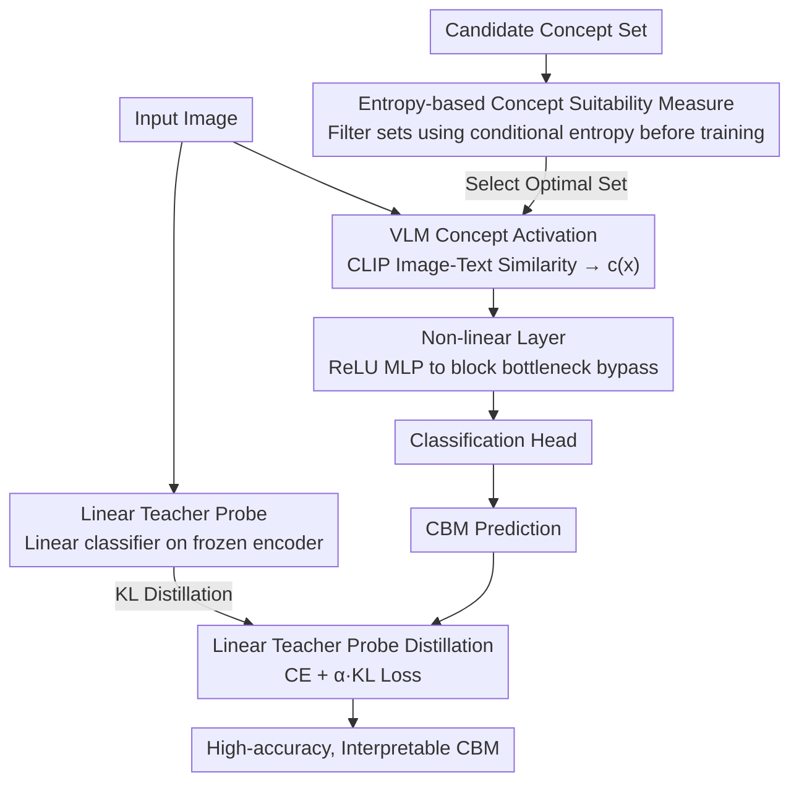

# Rethinking Concept Bottleneck Models: From Pitfalls to Solutions

**Conference**: CVPR 2026  
**arXiv**: [2603.05629](https://arxiv.org/abs/2603.05629)  
**Authors**: Merve Tapli, Quentin Bouniot, Wolfgang Stammer, Zeynep Akata, Emre Akbas  
**Area**: Interpretability  
**Keywords**: Concept Bottleneck Models, Interpretability, Concept Relevance, Distillation, Vision-Language Models

## TL;DR

The CBM-Suite framework is proposed to systematically address four pitfalls of Concept Bottleneck Models (CBMs): the lack of pre-evaluation metrics for concept relevance, the linearity problem causing bottlenecks to be bypassed, the accuracy gap compared to black-box models, and the research gap regarding the impact of different visual backbones/VLMs. This is achieved through entropy measures, non-linear layers, and distillation losses, significantly enhancing both accuracy and interpretability.

## Background & Motivation

Concept Bottleneck Models (CBMs) anchor predictions on human-understandable concepts, serving as a critical paradigm for explainable AI. These models first predict activation values for a set of semantic concepts and then perform final classification based on these activations, thereby providing concept-level decision explanations.

However, existing CBMs face four fundamental issues:

**Lack of concept relevance pre-evaluation**: Given a dataset, how can one determine if a set of concepts is suitable for the task before training? Current methods lack quantitative metrics to pre-evaluate the inherent applicability of concept sets, leading to a reliance on trial-and-error.

**Linearity Problem**: Recent CBM methods (such as CLIP-based Post-hoc CBMs) use linear layers between concept activations and the classifier. In practice, this allows the model to bypass the concept bottleneck, rendering the concept layer a mere formality—the classifier directly exploits linear combinations of raw features rather than truly depending on concept semantics.

**Accuracy Gap**: CBMs suffer from significant accuracy degradation compared to opaque end-to-end models, which limits their deployment in real-world scenarios.

**Research gap in backbone influence**: There is a lack of systematic research into how different vision encoders (e.g., ViT, ResNet) and Vision-Language Models (e.g., CLIP variants) interactively affect CBM accuracy and interpretability.

These problems severely restrict the utility of CBMs, making it difficult to achieve competitive precision while maintaining interpretability.

## Method

### Overall Architecture

CBM-Suite is not a single model but a comprehensive suite of solutions targeting the four chronic issues of CBMs: inability to evaluate concept sets pre-training, bypassing of the bottleneck due to linear structures, the accuracy gap relative to black-box models, and the lack of systematic study on backbone/VLM influences. It employs an entropy measure to score concept sets before training, a non-linear layer to block the bypass vulnerability, a linear teacher probe distillation to bridge the accuracy gap, and a systematic ablation study on the interaction between vision encoders, VLMs, and concept sets. The first three components reside in the training/inference pipeline (as shown in the diagram nodes for Key Designs 1–3), while the fourth is a systematic analysis of component combinations.

### Key Designs

**1. Entropy-based Concept Suitability Measure: Filtering poor concept sets before training**

Previously, selecting concept sets required training to observe accuracy, leading to repeated trial-and-error. This paper proposes that if a set of concepts is discriminative for a dataset, different classes should be separable in the concept space, leading to low conditional entropy; conversely, if concepts are irrelevant, conditional entropy approaches its maximum. Given a dataset $\mathcal{D}$ and concept set $\mathcal{C}$, the concept activation vector $c(x) \in \mathbb{R}^{|\mathcal{C}|}$ is computed for each sample, and the conditional entropy of labels given activations is measured:

$$H(Y | C) = -\sum_{c} p(c) \sum_{y} p(y|c) \log p(y|c)$$

A lower $H(Y|C)$ indicates a more informative concept set. This metric can be calculated without training a model, allowing for direct comparison and screening of candidate concept sets.

**2. Non-linear Layers to Solve the Linearity Problem: Preventing bottleneck bypassing**

When concept activations are derived from image-text similarities (like CLIP) and the classifier is a linear layer, the entire path from image features to prediction is linear. The model can simply find an equivalent linear mapping to predict directly from raw features, completely bypassing concept semantics. The fix is straightforward: insert a non-linear layer (MLP with ReLU) between concept activations and the classifier to break end-to-end linearity. The classification path becomes:

$$\hat{y} = g(\sigma(W \cdot c(x) + b))$$

where $\sigma$ is the non-linear activation and $g$ is the classification head. This ensures the classifier can only operate within the non-linearly transformed concept space, forcing accuracy to faithfully reflect concept relevance.

**3. Distillation Loss to Narrow Accuracy Gap: Using a linear probe as a knowledge bridge**

CBMs are typically less accurate than black-box models. This paper trains a linear classifier on frozen vision encoder features to serve as a **Linear Teacher Probe**—it is not constrained by a bottleneck and represents the upper bound of linearly reachable accuracy for that backbone. The CBM "student" then minimizes a KL divergence with the teacher's output in addition to the standard cross-entropy loss:

$$\mathcal{L} = \mathcal{L}_{CE}(y, \hat{y}_{CBM}) + \alpha \cdot D_{KL}(\hat{y}_{teacher} \| \hat{y}_{CBM})$$

The teacher transfers knowledge that is task-relevant but perhaps not fully covered by the concept set, boosting accuracy without sacrificing interpretability.

**4. Systematic Backbone and VLM Analysis: Mapping interactive influences**

The fourth pitfall is the lack of systematic comparison across component combinations. This paper conducts comprehensive ablations across vision encoders (different architectures and scales like ViT-B/16, ViT-L/14, ResNet-50), VLMs (OpenAI CLIP, OpenCLIP, SigLIP, etc.), and concept sets (various sources like manual labels, GPT-generated, or domain knowledge), providing a configuration guide for practitioners.

## Key Experimental Results

### Table 1: Classification accuracy comparison across standard benchmarks

| Method | CUB-200 | Places365 | ImageNet | CIFAR-100 |
|------|---------|-----------|----------|-----------|
| Standard End-to-End | 84.2 | 55.8 | 76.1 | 82.5 |
| Post-hoc CBM (Linear) | 78.5 | 49.2 | 71.3 | 76.4 |
| Label-free CBM | 79.8 | 50.1 | 72.0 | 77.2 |
| LaBo | 80.3 | 51.5 | 73.1 | 78.0 |
| CBM-Suite (Non-linear) | 81.7 | 52.8 | 74.2 | 79.5 |
| CBM-Suite (Non-linear + Distill) | **83.4** | **54.6** | **75.5** | **81.8** |

CBM-Suite narrows the CBM accuracy gap from ~5.7% to ~0.8% (e.g., on CUB-200) via non-linear layers and distillation while maintaining concept-level interpretability.

### Table 2: Correlation between entropy measure and actual classification accuracy

| Concept Set | # Concepts | Entropy $H(Y|C)$ | CUB-200 Acc | Places365 Acc |
|--------|---------|-----------------|-------------|---------------|
| CUB-Attributes (Manual) | 312 | 0.42 | 83.4 | - |
| GPT-4 Generated (Large) | 500 | 0.58 | 81.2 | 53.1 |
| GPT-4 Generated (Med) | 200 | 0.71 | 79.5 | 51.8 |
| Random Vocabulary | 200 | 1.85 | 68.3 | 42.1 |
| GPT-4 Generated (Small) | 50 | 1.12 | 74.1 | 47.2 |
| Domain-irrelevant | 100 | 1.63 | 70.2 | 44.5 |

The entropy measure shows a strong negative correlation with classification accuracy: lower $H(Y|C)$ results in higher model accuracy. This validates the metric as a pre-evaluation tool for concept set quality. Manual CUB-Attributes possess the lowest entropy (0.42) and highest accuracy.

## Highlights & Insights

- **Discovery and Resolution of the Linearity Problem**: The paper identifies the fundamental issue where linear paths in Post-hoc CBMs allow the bottleneck to be bypassed. Inserting non-linear layers is a simple yet effective fix crucial for guaranteeing CBM interpretability.
- **Utility of the Entropy Measure**: The pre-evaluation metric for concept relevance fills a gap in CBM research, allowing researchers to screen concept sets at low cost before training.
- **Accuracy Recovery via Distillation**: The Linear Teacher Probe acts as a knowledge bridge, reducing the accuracy gap from ~5% to within ~1% with minimal computational overhead.
- **Systematic Backbone Analysis**: This is the first systematic study of the interactions between vision encoders, VLMs, and concept sets, providing a guide for practitioners—larger encoders or stronger VLMs do not always guarantee better concept interpretability.

## Limitations

- The entropy measure assumes VLM concept activation quality is high; if the VLM has biased understanding of certain concepts, the entropy value might mislead concept selection.
- Non-linear layers introduce additional parameters, increasing the risk of overfitting, particularly on small datasets which require careful regularization.
- Distillation depends on the Linear Teacher Probe; if the teacher itself has limited accuracy (e.g., on very difficult datasets), the distillation gains may be marginal.
- Concept intervention effects after non-linear layers may not be as direct as in linear CBMs, necessitating further research into the trade-off between interpretability and accuracy.
- Experiments focus on image classification; extension to complex vision tasks like object detection or segmentation remains to be verified.

## Related Work & Insights

- **Classic CBM**: Koh et al. (2020) proposed the original CBM requiring concept labels. Post-hoc CBMs (Yuksekgonul et al. 2023) utilized CLIP for label-free concept layers but introduced the linearity problem.
- **Label-free CBM**: Oikarinen et al. (2023) used GPT for concept ge neration to avoid manual labeling, but concept quality could not be pre-evaluated.
- **LaBo**: Yang et al. (2023) optimized concept selection but relied on linear classifiers, thus suffering from the linearity issue.
- **Knowledge Distillation**: The classic paradigm by Hinton et al. (2015) is adapted here—using a lightweight linear probe teacher instead of a full large model, specifically tailored for CBM scenarios.
- **Concept Interpretability**: Methods like TCAV (Kim et al. 2018) and ACE (Ghorbani et al. 2019) analyze concepts a posteriori, whereas CBMs embed concepts into the architecture. CBM-Suite ensures this embedding is faithful.

## Rating

- Novelty: ⭐⭐⭐⭐ — Systematically identifies and resolves four fundamental flaws; the discovery of the linearity problem is particularly valuable.
- Experimental Thoroughness: ⭐⭐⭐⭐ — Comprehensive ablations across multiple datasets, backbones, and VLMs with detailed concept analysis.
- Writing Quality: ⭐⭐⭐⭐ — Clear problem-driven structure; the four contributions correspond directly to the four identified issues.
- Value: ⭐⭐⭐⭐ — Provides a complete methodological toolbox for CBM practice, offering a direct push for the explainable AI community.

<!-- RELATED:START -->

## Related Papers

- [\[AAAI 2026\] Partially Shared Concept Bottleneck Models](../../AAAI2026/interpretability/partially_shared_concept_bottleneck_models.md)
- [\[CVPR 2026\] Rounded or Streamlined Head? Bridging Concept Bottleneck Models and Attribute-Described Object Parts](rounded_or_streamlined_head_bridging_concept_bottleneck_models_and_attribute-des.md)
- [\[ICLR 2026\] There Was Never a Bottleneck in Concept Bottleneck Models](../../ICLR2026/interpretability/there_was_never_a_bottleneck_in_concept_bottleneck_models.md)
- [\[ICLR 2026\] Debugging Concept Bottleneck Models through Removal and Retraining](../../ICLR2026/interpretability/debugging_concept_bottleneck_models_through_removal_and_retraining.md)
- [\[AAAI 2026\] Concepts from Representations: Post-hoc Concept Bottleneck Models via Sparse Decomposition of Visual Representations](../../AAAI2026/interpretability/concepts_from_representations_post-hoc_concept_bottleneck_models_via_sparse_deco.md)

<!-- RELATED:END -->
