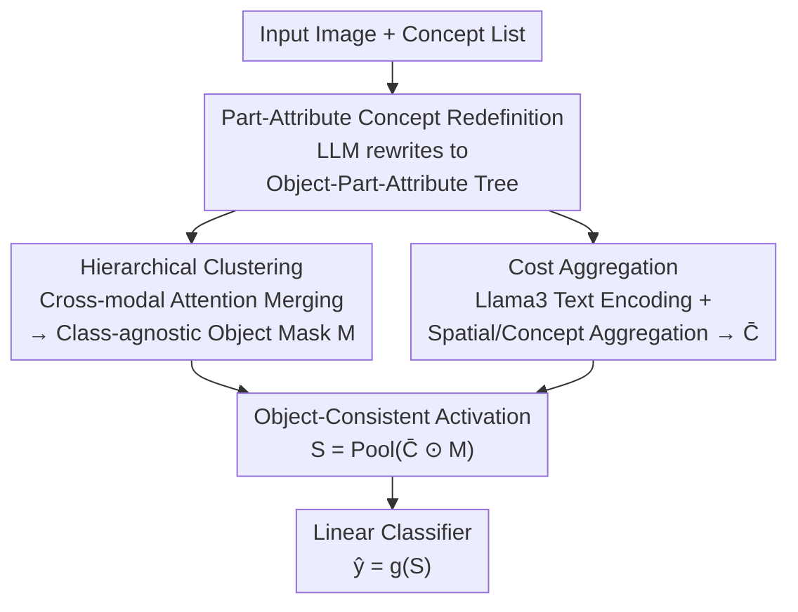

# Rounded or Streamlined Head? Bridging Concept Bottleneck Models and Attribute-Described Object Parts

**Conference**: CVPR 2026  
**Paper**: [CVF Open Access](https://openaccess.thecvf.com/content/CVPR2026/html/Liu_Rounded_or_Streamlined_Head_Bridging_Concept_Bottleneck_Models_and_Attribute-Described_CVPR_2026_paper.html)  
**Code**: None (Authors state datasets and code will be released; no link available as of writing)  
**Area**: Explainability / Concept Bottleneck Models / Vision-Language Models  
**Keywords**: Concept Bottleneck Models, Concept Grounding, Object Consistency, Semantic Consistency, part-attribute

## TL;DR
To address two types of inconsistency in VLM-driven Concept Bottleneck Models (CBMs)—mislocalizing concepts to incorrect parts and activating concepts on irrelevant objects—this paper proposes OA-CBM. It uses an LLM to rewrite concepts into "part-attribute" pairs and constructs two segmentation datasets accordingly. It employs a Hierarchical Clustering module to generate class-agnostic foreground object masks to suppress background noise and a Cost Aggregation module to stabilize vision-concept correspondence. This improves concept grounding h-IoU from 9.8 to 35.7 in the challenging Pred-All setting, with a concurrent classification accuracy gain of approximately 2.9%.

## Background & Motivation
**Background**: Concept Bottleneck Models (CBMs) first map an image to a set of human-readable concepts (e.g., "Head: Streamlined forehead") and perform classification based solely on these concept scores, making the decision pipeline traceable and editable. Recent works integrate the spatial grounding capabilities of VLMs (CLIP, DINO, etc.) into CBMs—for instance, SALF-CBM uses CLIP as a concept detector, and DOT-CBM uses optimal transport to align image patches with concepts—aiming to achieve both "where the concept appears (spatial grounding)" and "how the concept affects the prediction (semantic reasoning)" levels of explainability.

**Limitations of Prior Work**: Through a pilot study, the authors identify two overlooked flaws in this "VLM + CBM" approach. The first is **semantic inconsistency**: visual representations of different parts of the same object are often similar (e.g., fish head vs. fish body). Lacking fine-grained annotations, VLMs fail to distinguish them, leading to concepts being localized to wrong parts or producing noisy/incomplete masks. The second is **object inconsistency**: concept descriptions themselves are often object-agnostic. "Head: Streamlined forehead" can describe both a fish and a human. Consequently, when classifying a fish, this concept may simultaneously activate on a human head in the frame. Such evidence from irrelevant objects contaminates the bottleneck representation, causing spurious correlations.

**Key Challenge**: For explainability, concepts must remain class-agnostic (in part-attribute form); otherwise, concepts implicitly encode class identity, rendering the explanation a circular argument. However, class-agnostic concepts naturally cannot constrain "which object or which part should be activated." Explainability constraints and localization accuracy conflict in existing pipelines.

**Goal**: Without sacrificing concept class-agnosticism, simultaneously enforce (1) semantic consistency—each concept falls onto its corresponding fine-grained part; and (2) object consistency—each concept falls within its corresponding target object without cross-object crosstalk.

**Key Insight**: The root cause of fine-grained localization failure is "overly coarse concept granularity + lack of object boundary constraints." Thus, the authors refine concepts from "object-level" to "part-attribute" level (providing more discriminative supervision for VLMs) and explicitly learn a class-agnostic object mask to filter irrelevant regions.

**Core Idea**: Redefining concepts as "part-attribute" pairs to address semantic inconsistency, using class-agnostic hierarchical clustering to produce object masks for object inconsistency, and employing cost aggregation to stabilize vision-concept correspondence. These components form an Object-Aware CBM (OA-CBM).

## Method

### Overall Architecture
OA-CBM takes an image and a list of class-related concepts as input, outputting explainable concept activation maps and the final classification. The pipeline first takes "part-attribute" concepts generated by an LLM and CLIP visual features. It then enforces the two types of consistency through two stages, finally pooling object-consistent concept activations into a linear classifier.

The first stage manages **object consistency**: the Hierarchical Clustering (HC) module allows learnable cluster tokens to interact with object tokens and patch visual features via cross-modal attention, merging them layer-by-layer into a token concentrated with object knowledge. This is used to compute cosine similarity with visual features to obtain a class-agnostic foreground object mask $M$, suppressing false background activations. The second stage manages **semantic consistency**: the CLIP text encoder is replaced with Llama3 (bypassing CLIP's 77-token limit and enhancing compositional reasoning for complex part descriptions) to calculate an initial spatial concept cost volume $C$. A Cost Aggregation (CA) module then performs spatial and concept-wise aggregation to denoise and stabilize vision-concept correspondence, yielding $\bar{C}$. Finally, the object mask and aggregated cost volume are element-wise multiplied and pooled to obtain global concept scores $S=\text{Pool}(\bar{C}\odot M)$, which are fed into a linear classifier.

Supporting this is a new set of concept annotations: the authors used an LLM to rewrite existing part segmentation datasets into "Object-Part-Attribute" three-layer trees, constructing PartAttrCUB and PartAttrImageNet datasets, and proposed the Open Concept Grounding (OCG) evaluation task.

### Key Designs

**1. Part-Attribute Concept Redefinition and Dataset Construction: Refining "Fish head is streamlined" into discriminative signals**

The root of semantic inconsistency is overly coarse concept granularity—descriptions like "streamlined forehead" fit multiple similar parts. The authors' approach uses an LLM (GPT-5) to rewrite object-level concepts into part-attribute pairs: first asking "what visible parts does this object have" (head/wing/leg, etc.), then "what are the useful visual features to distinguish this part." Three steps were taken: **Collection & Decomposition** (LLM drafts attributes based on PartCUB-70 and PartImageNet), **Integration** (semantic deduplication via SemHash and LLM-guided clustering to retain consistent attributes), and **Mask Alignment** (mapping integrated attributes back to pixel-level part masks). This resulted in PartAttrCUB (70 bird species, 8 unified parts) and PartAttrImageNet (158 classes, ~24k images), providing both supervision for fine-grained segmentation and benchmarks for OCG.

**2. Hierarchical Clustering Module (HC): Blocking cross-object crosstalk with class-agnostic masks**

To solve object inconsistency without embedding class identity into concepts, HC learns a separate **class-agnostic object mask**. Given object name embeddings $O=\{f_{txt}(o_k)\}_{k=1}^{N_O}$, $N$ clustering blocks are initialized. Learnable cluster tokens $Q_l$ interact with object tokens $O_l$ and patch visual embeddings $P_x$ through cross-modal attention:

$$O_{l+1}=\text{mixer}\big(\text{slot}(O'_l, Q'_l)\big),\quad O'_l=\text{cross}(O_l, P_x),\quad Q'_l=\text{cross}(Q_l, P_x)$$

After $N$ levels of clustering, the knowledge-concentrated token $O_N$ is used to compute cosine similarity with visual features followed by sigmoid to obtain the object mask:

$$M=\text{sigmoid}\big(\cos(O_N, P_x)\big)$$

This mask constrains concept activations within the foreground target object, suppressing background-induced semantic drift. Since it is class-agnostic (derived from object name clusters rather than class labels), it preserves the explainability premise of CBMs.

**3. Cost Aggregation Module (CA) + Llama3 Text Encoding: Smoothing noisy concept cost volumes**

VLM-calculated similarity volumes are noisy. The authors first enhance the concept representation by replacing the CLIP text encoder with Llama3 (to handle longer/complex part descriptions) while retaining CLIP's ViT for image encoding. The initial spatial concept cost volume $C\in\mathbb{R}^{H\times W\times N_T}$ is calculated via $C_{i,j,k}=\cos(P_x[i,j,:],T_k)$. Then, a CA module $\bar{C}=\text{CA}(C, P'_x)$ performs two complementary aggregations: **Spatial Aggregation** using Swin Transformer blocks to capture local-to-semi-global features and suppress background noise, and **Concept Aggregation** using a position-encoding-free Transformer block to model dependencies between different concepts. This stabilizes cross-modal correspondence and reduces local mismatches.

### Loss & Training
The final global concept activation $S=\text{Pool}(\bar{C}\odot M)$ is fed into a linear classifier $g$ which maps $S$ to class space $\hat{y}=g(S)$, trained with standard cross-entropy. Inference supports three readout modes: **CLS token** (traditional CBM setup), **Patch token** (bound to local evidence), and **Patch-Guided** (a hybrid refined by patch-level evidence).

## Key Experimental Results

### Main Results
Concept Grounding (zero-shot, mIoU/h-IoU, %):

| Dataset / Setting | Metric | Best Baseline | OA-CBM | Gain |
|--------------|------|---------|--------|------|
| PartAttrImageNet · Pred-All | h-IoU | 9.8 (SC-CLIP) | 35.7 | +25.9 |
| PartAttrCUB · Pred-All | h-IoU | 4.4 (CLIP) | 21.1 | +16.7 |
| PartAttrImageNet · Oracle-All | h-IoU | 15.0 (SALF) | 37.0 | +22.0 |
| PartAttrImageNet · Oracle-Obj | h-IoU | 34.7 (DINO) | 51.4 | +16.7 |

Classification Accuracy (top-1, CLS Token setting, %):

| Dataset | Labo | SC-CBM | DOT-CBM | SALF-CBM | OA-CBM |
|--------|------|--------|---------|----------|--------|
| CUB200 | 73.5 | 78.3 | 77.3 | 73.1 | **80.7** |
| ImageNet | 70.0 | 74.2 | 78.7 | 69.9 | **83.1** |
| CIFAR100 | 87.2 | 88.0 | **97.3** | 86.4 | 97.2 |
| FOOD101 | 93.2 | 94.2 | 93.0 | 94.1 | **94.5** |

### Ablation Study
Impact of CA and HC modules on Accuracy (ACC) and Grounding (h-IoU):

| CA | HC | CUB200 ACC | CIFAR100 ACC | PartAttrCUB h-IoU | PartAttrImageNet h-IoU |
|----|----|-----------|--------------|-------------------|------------------------|
| ✗ | ✗ | 33.8 | 86.9 | 1.3 | 1.9 |
| ✗ | ✓ | 0.01 | 86.1 | 0.6 | 2.2 |
| ✓ | ✗ | 63.2 | 96.2 | 6.6 | 12.9 |
| ✓ | ✓ | 63.3 | 96.1 | **20.8** | **35.7** |

### Key Findings
- **CA is the primary driver of accuracy**: Adding CA alone improved CUB-200 classification from 33.8% to 63.2%.
- **HC is the key to grounding h-IoU**: With CA enabled, adding HC increased PartAttrImageNet h-IoU from 12.9 to 35.7.
- **Object consistency, not just strong backbones, is crucial**: The gain in Pred-All settings comes from the object-aware design rather than simply switching to Llama3/ViT.
- **Robust in part-only settings**: Even without attributes, the model maintains superior mIoU compared to baselines.

## Highlights & Insights
- **Decoupling explainability constraints and localization accuracy**: Concepts remain class-agnostic, while object boundaries are managed by a separate class-agnostic mask (HC). This resolves the dilemma where accurate localization often requires encoding class identity.
- **High ROI from switching text encoders**: Replacing CLIP's text tower with Llama3 provides near plug-and-play alignment gains for complex concepts.
- **"Part-attribute" granularity as a clean insight**: Moving from object-level to part-attribute pairs provides better VLM supervision and yields reusable datasets and the OCG task.
- **Three Readout Settings**: The trade-off between global discriminative power and local grounding highlights that fine-grained spatial evidence can slightly reduce classification accuracy unless handled via hybrids like Patch-Guided.

## Limitations & Future Work
- **Dependency on LLM Annotation Quality**: The quality of the "Object-Part-Attribute" tree depends on the LLM. Hallucinations or missing attributes directly affect supervision signal quality.
- **Object Name Dependency for HC**: HC uses object name embeddings to initialize clusters; its stability across datasets with ambiguous object names remains to be verified.
- **Accuracy Loss in Patch Token Setup**: Binding classification strictly to local evidence reduces global discriminative power compared to CLS tokens.

## Related Work & Insights
- **vs SALF-CBM**: SALF-CBM evaluates only class-level segmentation. OA-CBM refines concepts to part-attributes and explicitly adds object masks, leading in Pred-All grounding h-IoU (35.7 vs 7.1).
- **vs DOT-CBM**: DOT-CBM uses optimal transport for alignment but does not explicitly model object consistency. OA-CBM outperformed it on ImageNet accuracy (83.1 vs 78.7).
- **vs SC-CLIP (SC-CBM)**: SC-CLIP is a strong baseline (9.8 h-IoU). OA-CBM dominates by enforcing object-semantic dual consistency rather than just refining visual features.

## Rating
- Novelty: ⭐⭐⭐⭐ Diagnosing "semantic/object dual inconsistency" and providing dedicated modules is innovative.
- Experimental Thoroughness: ⭐⭐⭐⭐ Multiple datasets, protocols, and readout settings; however, evidence for open-world generalization is limited.
- Writing Quality: ⭐⭐⭐⭐ Intuitive motivation and clear pipeline; some symbols rely on supplementary materials.
- Value: ⭐⭐⭐⭐ Provides reusable datasets, the OCG task, and a decoupled design valuable for the explainability community.

<!-- RELATED:START -->

## Related Papers

- [\[CVPR 2026\] Rethinking Concept Bottleneck Models: From Pitfalls to Solutions](rethinking_concept_bottleneck_models_from_pitfalls_to_solutions.md)
- [\[ICLR 2026\] There Was Never a Bottleneck in Concept Bottleneck Models](../../ICLR2026/interpretability/there_was_never_a_bottleneck_in_concept_bottleneck_models.md)
- [\[AAAI 2026\] Partially Shared Concept Bottleneck Models](../../AAAI2026/interpretability/partially_shared_concept_bottleneck_models.md)
- [\[ICLR 2026\] Debugging Concept Bottleneck Models through Removal and Retraining](../../ICLR2026/interpretability/debugging_concept_bottleneck_models_through_removal_and_retraining.md)
- [\[CVPR 2025\] Attribute-formed Class-specific Concept Space: Endowing Language Bottleneck Model with Better Interpretability and Scalability](../../CVPR2025/interpretability/albm_attribute_concept_space.md)

<!-- RELATED:END -->
