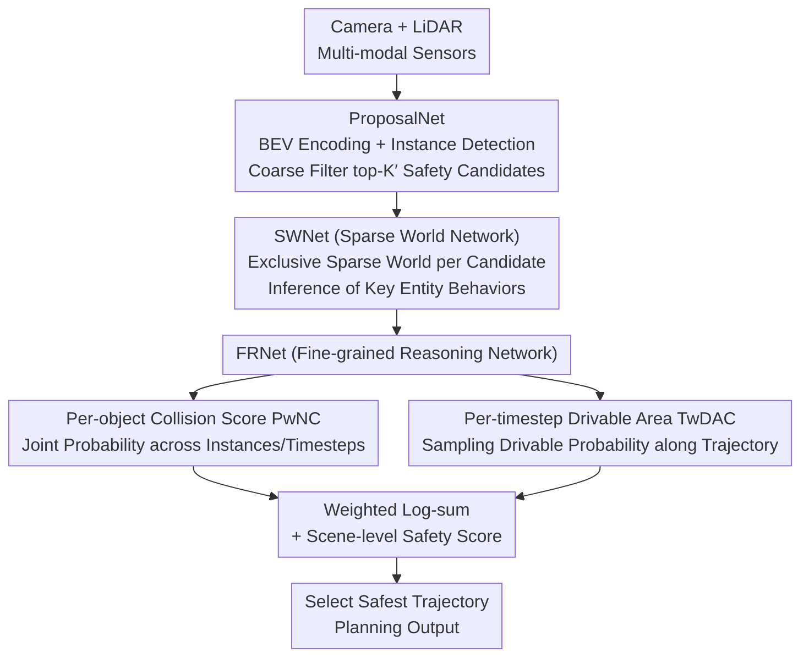

# SafeDrive: Fine-Grained Safety Reasoning for End-to-End Driving in a Sparse World

**Conference**: CVPR 2026  
**arXiv**: [2602.18887](https://arxiv.org/abs/2602.18887)  
**Code**: To be released  
**Area**: Explainability  
**Keywords**: End-to-End Driving, Safety Reasoning, Sparse World Models, Trajectory Evaluation, Collision Prediction

## TL;DR

Ours proposes the SafeDrive end-to-end planning framework, which simulates the future behavior of key entities through a trajectory-conditioned Sparse World Network (SWNet). It then employs a Fine-grained Reasoning Network (FRNet) for per-instance collision assessment and per-timestep drivable area compliance evaluation. SafeDrive achieves 91.6 PDMS and a collision rate of only 0.5% on NAVSIM, alongside a 66.8% driving score on Bench2Drive.

## Background & Motivation

**Background**: End-to-end (E2E) autonomous driving unifies perception, prediction, and planning into a single model to reduce error propagation between modules. Recent methods enhance safety through trajectory evaluation (e.g., Hydra-MDP) or world models (e.g., OccWorld, WoTE).

**Limitations of Prior Work**:
   - Trajectory evaluation methods only provide a scene-level global safety score, lacking explicit reasoning for "why it is safe/unsafe," thus failing to precisely distinguish between trajectories with subtle differences.
   - Dense world models (BEV/occupancy) are grid-centric and lack modeling of interaction relationships between objects, making it difficult to capture dynamic interaction risks.

**Key Challenge**: Safety assessment requires **instance-level and temporal** fine-grained reasoning, while existing methods only provide coarse-grained global scores.

**Key Insight**: Borrow from how human drivers reason about risk—first identifying objects that might collide, and then assessing the collision risk for each object at each future moment.

**Core Idea**: Construct a **Sparse World Model** focusing on key dynamic entities to achieve refined per-object and per-moment safety reasoning.

## Method

### Overall Architecture

SafeDrive aims to address the issue where E2E planning provides an "overall safety score" for a trajectory without explaining its specific safety or danger. Its mechanism explicitly constructs a human-like judgment process: selecting a few candidate trajectories, simulating the movements of surrounding entities for each, and finally calculating risks on a per-object and per-moment basis.

The pipeline consists of three sequential steps: Multi-modal sensors (Camera + LiDAR) are first encoded into BEV features by **ProposalNet**, which detects surrounding instances and coarsely filters a small set of safety-aware candidate trajectories. Each candidate trajectory then enters **SWNet (Sparse World Network)**, where a "sparse world" containing only key surrounding entities is constructed. The future behavior of these entities is inferred under the assumption of that specific trajectory. Finally, **FRNet (Fine-grained Reasoning Network)** performs per-object collision assessment and per-moment drivable area evaluation on these inferences. These fine-grained evidences are combined with scene-level safety scores to select the most comprehensive safe trajectory as the final planning output.

### Key Designs

**1. ProposalNet: Coarse Filtering instead of Blind Exhaustion**

SWNet must build a separate sparse world for every candidate trajectory. If there are too many candidates, the computational cost explodes. Therefore, the first step must reduce the number of candidates while maintaining "safety awareness." ProposalNet uses K-means to cluster ego trajectories in the training set, obtaining $K$ anchor trajectories as search starting points. Through trajectory-guided deformable attention, each anchor trajectory samples BEV features along its shape, i.e., $\hat{\mathcal{Q}}_\text{plan} = \text{FFN}(\text{Deform-Attn}_\text{traj}(\mathcal{Q}_\text{plan}, \mathcal{A}, F_\text{BEV}))$. Consequently, the features obtained for each candidate are sampled along the path it will actually travel, rather than being a global average. Based on these features, the model predicts an imitation score and 5 safety metrics (NC/DAC/TTC/C/EP) for each trajectory, selecting top-$K'$ candidates. Coarse filtering here saves computation and ensures remaining candidates are inherently safe, avoiding processing obviously dangerous trajectories.

**2. SWNet: Sparse Worlds for Key Entities**

Dense world models (BEV/occupancy) predict the entire scene in a grid-centric way, which is computationally expensive and struggles to represent object-level interactions like "ego vs. a specific car." SWNet changes this granularity: for each candidate trajectory, its sparse world generator copies the detected instance queries $\mathcal{O}_\text{ins}$ into $K'$ sets, pairing them with their corresponding candidate trajectory queries to form a set $\mathcal{W} = \{c_\text{plan}^j, o_\text{ins}^1, ..., o_\text{ins}^N\}_{j=1}^{K'}$. Essentially, the same entities form different "worlds" under different candidate trajectory assumptions. Then, a world interaction module uses self-attention to let the ego and surrounding entities influence each other under that trajectory assumption: $\bar{\mathcal{W}} = \text{World-SelfAttn}(\mathcal{W})$. Trajectory-guided deformable attention is then used to aggregate spatial-temporal BEV features along the trajectory: $\hat{\mathcal{W}} = \text{FFN}(\text{Deform-Attn}_\text{traj}(\bar{\mathcal{W}}, \mathcal{T}_\text{world}, F_\text{BEV}))$, yielding future states for each entity. This approach ensures the world representation only covers the finite number of entities actually posing a risk, improving efficiency; furthermore, it is trajectory-conditioned—different candidates in the same scene lead to different interaction predictions, which is more accurate than unconditional global future prediction.

**3. FRNet: Decoupling Safety into Per-object and Per-moment Evidences**

With future states predicted by the sparse world, FRNet no longer provides a vague safety score. It calculates two fine-grained streams. The first is Per-instance with No-fault Collision (PwNC): it pairs each trajectory query with each instance query, using an MLP+sigmoid to predict the collision probability with that instance at every future moment $p_\text{pwnc}^{i,j} \in [0,1]^H$. The total score for the trajectory is the product of probabilities across all instances and moments: $P_\text{PwNC}^j = \prod_{i=1}^N \prod_{h=1}^H p_\text{pwnc}^{i,j}(h)$. This multiplicative approach means a high risk with any entity at any moment significantly lowers the entire trajectory score, answering "which object and when a collision might occur." The second is Timestep-wise Drivable Area Compliance (TwDAC): it uses ConvNeXt-v2 to generate static segmentation from BEV, sampling drivable probabilities at 9 key points of the future ego box along the candidate trajectory. This captures refined boundary transgressions as the vehicle body approaches road edges. By combining these, safety is decomposed from scene-level scores to instance and temporal levels, providing clear explainability.

### Mechanism Example

Assume $N=8$ entities are detected at an intersection. ProposalNet filters $K'$ candidates (e.g., $K'=8$) from $K$ anchors based on imitation and safety metrics. For one "straight-through" candidate $j$, SWNet copies the 8 entities into its exclusive sparse world and predicts that a car on the left will cut in. FRNet then provides evidence—PwNC finds that this cutting-in car has a high $p_\text{pwnc}$ at the 6th moment, thus $P_\text{PwNC}^j$ is heavily penalized. Conversely, for a "slight yield" candidate, the collision probabilities for all entities at all moments remain low and TwDAC is not violated, resulting in the highest integrated score and selection as the final trajectory. The process not only determines which trajectory is safer but also specifies that "the straight-through one failed due to a conflict with the left merging car at moment 6."

### Loss & Training

Final trajectory selection integrates PwNC, TwDAC, and scene-level safety scores using a weighted log-sum to determine the highest comprehensive score. Training utilizes a multi-task loss combining imitation learning and safety scoring.

## Key Experimental Results

### Main Results — NAVSIM Open-loop

| Method | NC | DAC | TTC | EP | PDMS |
|------|-----|-----|-----|-----|------|
| GoalFlow (Prev. SOTA) | 98.4 | 98.3 | 94.6 | 85.0 | 90.3 |
| SeerDrive | 98.4 | 97.0 | 94.9 | 83.2 | 88.9 |
| **SafeDrive** | **99.5** | **99.0** | **97.2** | 84.3 | **91.6** |

NAVSIM EPDMS Ranking:

| Method | NC | DAC | EP | EPDMS |
|------|-----|-----|-----|-------|
| GaussianFusion | 98.3 | 97.3 | 87.5 | 85.0 |
| DiffusionDrive | 98.2 | 96.2 | 87.4 | 84.8 |
| **SafeDrive** | **99.5** | **99.0** | 88.6 | **87.5** |

### Bench2Drive Closed-loop

SafeDrive achieves a driving score of 66.8%, and records only 61 collisions (0.5%) across 12,146 NAVSIM scenarios, indicating an extremely low collision rate.

### Key Findings
- Sparse world models are better suited for safety reasoning than dense BEV/occupancy models by focusing on instance-level interactions.
- The contribution of Per-instance Collision Assessment (PwNC) outweighs scene-level global scoring.
- The Improvement in the NC (No-fault Collision) metric is most significant (99.5% vs 98.4%), highlighting the advantage of fine-grained reasoning.
- TwDAC captures fine boundary transitions through 9-point sampling of drivable area probability maps.

## Highlights & Insights
- **Introduction of the "Sparse World" concept**: Replacing dense scene representations with finite key entities reduces computation while preserving interaction data.
- **Elevation from "Global Scoring" to "Per-object Per-timestep" reasoning**: Allows for precise determination of "who and when a collision might occur," enhancing explainability.
- **Trajectory-conditioned World Model**: Different interaction predictions for different candidates in the same scene yield higher accuracy than unconditional predictions.
- **Formalization of human driving intuition**: Identifying risk objects before assessing collision risks aligns with human cognitive processes.

## Limitations & Future Work
- Validation was limited to NAVSIM and Bench2Drive; performance in real-world deployment (e.g., severe weather, construction zones) has not been tested.
- Sparse worlds rely on the quality of the detection module; failure to detect key objects leads to safety reasoning failure.
- The multiplicative scoring of PwNC may become overly conservative when many instances are present (joint probability approaches 0).
- Currently uses ResNet-34 as the image backbone; stronger visual backbones may further improve performance.

## Rating
- Novelty: ⭐⭐⭐⭐ The combination of sparse world models and fine-grained safety reasoning is quite innovative.
- Experimental Thoroughness: ⭐⭐⭐⭐⭐ Comprehensive open-loop and closed-loop validation with extensive comparisons.
- Writing Quality: ⭐⭐⭐⭐ Clear structure and rich visualizations.
- Value: ⭐⭐⭐⭐⭐ Advances the SOTA in end-to-end autonomous driving safety.

<!-- RELATED:START -->

## Related Papers

- [\[CVPR 2026\] TDATR: Improving End-to-End Table Recognition via Table Detail-Aware Learning and Cell-Level Visual Alignment](tdatr_improving_end-to-end_table_recognition_via_table_detail-aware_learning_and.md)
- [\[ACL 2025\] Safety is Not Only About Refusal: Reasoning-Enhanced Fine-tuning for Interpretable LLM Safety](../../ACL2025/interpretability/safety_is_not_only_about_refusal_reasoning-enhanced_fine-tuning_for_interpretabl.md)
- [\[ACL 2026\] Fine-Grained Analysis of Shared Syntactic Mechanisms in Language Models](../../ACL2026/interpretability/fine-grained_analysis_of_shared_syntactic_mechanisms_in_language_models.md)
- [\[CVPR 2026\] Improving Sparse Autoencoder with Dynamic Attention](improving_sparse_autoencoder_with_dynamic_attention.md)
- [\[ACL 2026\] FineSteer: A Unified Framework for Fine-Grained Inference-Time Steering in Large Language Models](../../ACL2026/interpretability/finesteer_a_unified_framework_for_fine-grained_inference-time_steering_in_large_.md)

<!-- RELATED:END -->
