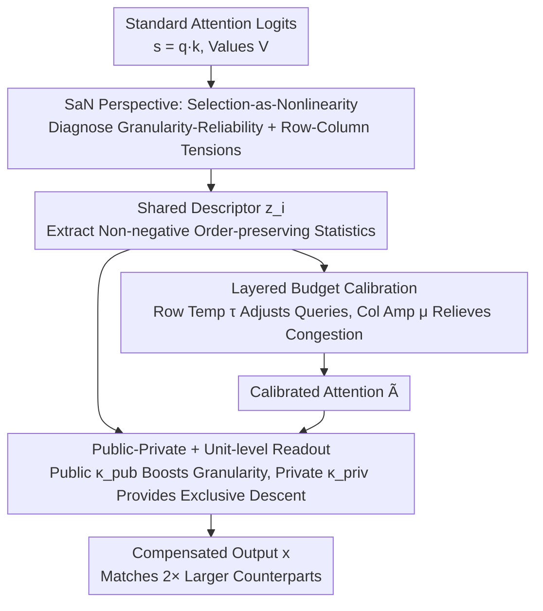

# Selection-as-Nonlinearity: Bridging Attention and Activation via a Joint Game-Decision Lens for Interpretable, Discriminative Visual Representations

**Conference**: CVPR 2026  
**Paper**: [CVF Open Access](https://openaccess.thecvf.com/content/CVPR2026/html/Cai_Selection-as-Nonlinearity_Bridging_Attention_and_Activation_via_a_Joint_Game-Decision_Lens_CVPR_2026_paper.html)  
**Code**: https://github.com/SudongCAI/CSaN  
**Area**: Interpretability / Vision Transformer  
**Keywords**: Attention Mechanism, Activation Function, Weak Independence, Budget Allocation Game, Expressivity Compensation

## TL;DR
This paper proposes the SaN (Selection-as-Nonlinearity) perspective, reinterpreting attention as a "cooperative selection game driven by context-based scoring under unit budget constraints." It diagnoses the "weak-independence" phenomenon—where pure attention stacks significantly underperform when FFNs are removed—as a result of two structural tensions. Based on this, it designs a near-zero-overhead compensation module, CSaN (Layered Budget Calibration + Public-Private Collaborative Readout), enabling small-scale Swin/ViT/Hiera models to match or exceed the performance of counterparts twice their size on ImageNet.

## Background & Motivation
**Background**: Self-attention has become the dominant token-mixing operator in vision models. Theoretically, a self-attention block with independent pre/post projections satisfies the Universal Approximation Property (UAP) on compact domains, suggesting it should be inherently powerful. Standard vision Transformers typically utilize a macro-architecture of alternating "attention layers + FFN layers."

**Limitations of Prior Work**: The authors performed a simple yet striking ablation: replacing every FFN with an attention block while keeping depth and resolution constant to create a "pure attention stack." This resulted in a massive accuracy drop: Swin-Min fell from 72.2% (alternating architecture) to 62.8% (pure attention). Even when widening the model to match parameter counts, it only reached 67.5%. In other words, while attention theoretically possesses universal approximation capabilities, these fail to "materialize" when it is used independently of FFNs. The authors name this the "weak-independence challenge."

**Key Challenge**: The problem is not whether attention "can" be powerful in principle, but "why" it fails to be powerful when used in isolation. Existing works either modify attention for efficiency (windows, low-rank, sparsity) or prove its expressivity via UAP, but none address the gap between empirical capability and theoretical potential.

**Key Insight**: The authors propose a unified cognitive lens: effective nonlinearity (activation) is essentially a "directional, soft feature selection." First, a context is used to compute an importance measure; then, features are weighted based on this measure. A token's weight is its membership degree in the fuzzy set of "important features," and activation is soft selection. Through this lens, attention is exactly a "context-gated activation unit aggregated over shared values," and the row-wise softmax normalization turns it into a cooperative allocation game under a unit mass budget.

**Core Idea**: Using the combined game-decision perspective of "Selection-as-Nonlinearity + Budget Allocation Game," the weak independence is attributed to two specific structural tensions: the Granularity-Reliability Trade-off and the Row-Column Budget Dilemma. A lightweight compensation module, CSaN, is designed not to replace attention, but to act as a wrapper that relaxes the "hard-locked budgets" while preserving the normalizer.

## Method

### Overall Architecture
The work is divided into two parts: analyzing attention and diagnosing "pathologies" via the SaN lens, followed by applying the CSaN module as a remedy. SaN interprets a row of attention $\boldsymbol{y}_i=\sum_j \alpha_{ij}\boldsymbol{v}_j$ (where $\alpha_{ij}=\mathrm{softmax}_j(\boldsymbol{q}_i^\top\boldsymbol{k}_j)$) as "query $i$ allocating unit quality budget across a set of shared values." This identifies two tensions: the Granularity-Reliability trade-off caused by the number of heads, and the Row-Column Budget Dilemma where intra-row allocation is zero-sum while a column of values is shared across multiple queries. CSaN is a drop-in wrapper for standard attention blocks that does not alter Q/K/V projections or residual topology. It extracts a non-negative, order-preserving descriptor $\boldsymbol{z}_i$ from attention logits to drive two paths: "Layered Budget Calibration" and "Public-Private Collaborative Unit-level Readout."

### Key Designs

**1. SaN Perspective: Mechanism for interpreting attention as a "cooperative selection game under unit budget" to localize "pathologies"**

This is the theoretical foundation addressing why pure attention fails. The authors define a context-gating primitive $\Phi(\boldsymbol{x},\boldsymbol{c})=\rho(\boldsymbol{c})\,\boldsymbol{x}$, where the gate $\rho\ge 0$ is order-preserving. A proposition states that as long as the same token $\boldsymbol{x}$ receives different retention amounts in different contexts, the mapping is nonlinear over $(\boldsymbol{x},\boldsymbol{c})$ and has no linear substitute—this is "selection generating effective nonlinearity." Specializing this to attention: each $(i,j)$ contributes a context-gated unit $\Phi_{i,j}=\rho(c_{ij})\boldsymbol{v}_j$, with $c_{ij}=\boldsymbol{q}_i^\top\boldsymbol{k}_j$. The row softmax acts as the normalizer. The authors prove that an $H$-head attention block with independent projections is as expressive as an $H$-group gated FFN (Expressivity Equivalence Theorem). Thus, attention is not inherently weaker than FFN; rather, the part that "materializes" when used alone is weak.

The true pathologies emerge from two tensions in the game. First, the Granularity-Reliability Trade-off: wider heads share one gate across many channels (coarse selection), while narrower heads estimate importance unreliably. Second, the Row-Column Budget Dilemma. First-order gradient coupling $\frac{\partial \ell}{\partial s_{ij}}=\alpha_{ij}\,\boldsymbol{g}_i^\top(\boldsymbol{v}_j-\boldsymbol{y}_i)$ and $\frac{\partial \ell}{\partial \boldsymbol{v}_j}=\sum_i \alpha_{ij}\boldsymbol{g}_i$ shows that row budgets are constrained by a simplex (zero-sum), while columns are shared. A theorem states that $\Delta\boldsymbol{k}_j$ allowing strictly descending gradients for all related rows exists if and only if the corresponding $\boldsymbol{q}$ cone is strictly separable—a rare alignment. Helping one row often hurts another.

**2. Layered Budget Calibration: Mechanism for upgrading allocation to a two-stage "inter-query, then intra-query" process**

To address the row-column dilemma, the authors relax the budget's geometric shape while keeping the normalizer. Allocation is split: an inter-query scaling followed by intra-query column allocation. Using descriptors, they generate a row temperature $\tau_{ih}=1+f_\tau(\boldsymbol{z}_i)$ and a column amplification factor $\mu_{jh}=1+f_\mu(\bar{\boldsymbol{z}})$. The calibrated attention becomes:

$$\tilde{\boldsymbol{A}}_{ijh}=\mathrm{softmax}_j\!\big(\tau_{ih}\,s_{ijh}\big)\cdot \mu_{jh}.$$

$\tau$ redistributes budget among queries, while $\mu$ relieves column-side congestion. Combined, they relax first-order feasibility constraints while retaining the selection semantics of the normalizer.

**3. Public-Private Collaborative + Unit-level Readout: Mechanism for increasing granularity without adding heads and providing exclusive descent paths**

To address the granularity-reliability trade-off, the readout is refined to the "unit level" (head × channel). Per-token gains $\boldsymbol{\kappa}^{\mathrm{pub}}_{ih}=\boldsymbol{1}+f_a(\boldsymbol{z}_i)$ and $\boldsymbol{\kappa}^{\mathrm{priv}}_{ih}=f_v(\boldsymbol{z}_i)$ are generated:

$$\boldsymbol{x}_{ih}=\big(\tilde{\boldsymbol{A}}_{i,:,h}\,\boldsymbol{V}_{:,h}\big)\odot \boldsymbol{\kappa}^{\mathrm{pub}}_{ih}\ \oplus\ \boldsymbol{V}_{i,h}\odot \boldsymbol{\kappa}^{\mathrm{priv}}_{ih}.$$

The public path $\boldsymbol{\kappa}^{\mathrm{pub}}$ compensates for expressivity at the channel level. The private path $\boldsymbol{\kappa}^{\mathrm{priv}}_{ih}$ uses only the token's own value, providing an exclusive descent direction. Its gradient $\partial\ell/\partial \boldsymbol{x}^{\mathrm{priv}}_i=\boldsymbol{g}_i$ bypasses row simplex and column sharing constraints. CSaN adds roughly 5% to parameters and FLOPs.

## Key Experimental Results

### Weak-Independence Diagnosis (Swin-Min, ImageNet)
This table shows the empirical motivation and compensation effects (♢ indicates width expanded to match standard Attention-FFN parameters).

| Architecture | Token-Mixer | #Params | FLOPs | Top-1 (%) |
|------|-------------|---------|-------|-----------|
| Swin-Min | Swin-Original (Attn-FFN) | 11.8M | 1.6G | 72.2 |
| Swin-Min | Pure Attention | 8.6M | 1.1G | 62.8 |
| Swin-Min | Pure Attention ♢ (Param-Matched) | 11.8M | 1.6G | 67.5 |
| Swin-CSaN | Pure Attention | 9.5M | 1.3G | **72.4** |
| Swin-CSaN | Pure Attention ♢ | 13.6M | 1.8G | **75.9** |

Pure attention stacks dropped ~9.4 points (72.2 → 62.8). CSaN allowed the pure attention stack to outperform the original baseline with lower overhead (72.4 vs 72.2).

### Main Results (ImageNet-1K, Three Transformer Families)
CSaN consistently improves performance with only ~5% extra cost, allowing smaller variants to match models ~2× their size.

| Model | Setting | #Params | FLOPs | Top-1 (%) |
|------|------|---------|-------|-----------|
| Swin-Min | Original | 11.8M | 1.6G | 72.2 |
| Swin-Min | CSaN | 12.2M | 1.7G | **75.0** |
| Swin-Tiny | Original | 28.3M | 4.4G | 81.3 |
| Swin-Tiny | CSaN | 29.5M | 4.6G | **82.7** |
| Swin-Base | Original | 87.8M | 15.1G | 83.5 |
| Swin-Small | CSaN | 51.8M | 8.9G | **83.5** (≈0.5× Params match Base) |
| ViT-Base/16 | Original | 86.6M | 16.9G | 81.8 |
| ViT-Base-Slim/16 | CSaN | 40.6M | 7.9G | **82.1** (≈0.5× Params > Base) |
| Hiera-Base | Original | 51.5M | 8.8G | 82.4 |
| Hiera-Tiny-Plus | CSaN | 29.1M | 4.9G | **82.4** (≈0.56× Params match Base) |

### Ablation Study
| Config | Architecture | #Params | Top-1 (%) | Description |
|------|------|---------|-----------|------|
| Swin-Original | Swin-Tiny | 28.3M | 81.3 | Baseline |
| CSaN-Head-Wise | Swin-Tiny | 29.0M | 82.5 | Head-level granularity |
| CSaN (Unit-level) | Swin-Tiny | 29.5M | 82.7 | Max granularity (Default) |
| Swin-CSaN-V2 | Swin-Min | 12.3M | 77.1 | CSaN + 7×7 DWConv |
| Swin-CSaN-V2 | Swin-Small | 52.3M | 83.9 | Exceeds Swin-Base (83.5) |

### Key Findings
- **Granularity is useful but not everything**: Reducing readout to head-level (CSaN-HdW) dropped accuracy from 82.7 to 82.5, still far above the 81.3 baseline. This suggests the "Layered Budget + Collaborative Readout" framework provides the bulk of the gains.
- **Strong Scalability**: Adding a 7×7 Depthwise Convolution (CSaN-V2) provides further gains, pushing Swin-Small to 83.9, surpassing Swin-Base.
- **Cross-Family Universality**: Consistent gains across window (Swin), global (ViT), and local-global (Hiera) attention support the claim that weak independence is a general attention issue.

## Highlights & Insights
- **Unifying "Activation = Selection" and "Attention = Budget Game"**: This lens explains both why attention is more expressive than linear mixing (structure from normalizers) and why that expressivity is hard to realize in isolation (coupled row-column constraints).
- **Direct Link from Diagnosis to Solution**: The two tensions correspond directly to CSaN's components. Each design choice maps back to relaxing a specific first-order constraint.
- **The "Private Path" Trick**: Providing each token a private descent direction that bypasses shared values corresponds to "giving each player in a cooperative game some private assets." This is applicable to other shared-resource scenarios like MoE or Quantization.
- **Cost-Efficiency**: A drop-in wrapper achieving ~1.5–3 point gains for ~5% cost is highly practical.

## Limitations & Future Work
- **Lack of Horizontal Comparison**: Mainly compares against original baselines/pure attention variants; lacks direct comparison with other lightweight enhancements like GLU, SE, or DWConv-only boosts.
- **Local/First-order Theoretical Characterization**: The row-column incompatibility is based on a local first-order criterion. It doesn't fully capture training dynamics over time.
- **Sensitivity of Descriptors**: Analysis of hyper-parameters ($\beta$, reduction ratios) is primarily in the supplement; sensitivity analysis in the main text is limited.
- **Vision-Only Validation**: Whether weak independence holds in NLP or multimodal Transformers remains untested.

## Related Work & Insights
- **vs. Efficient Attention**: CSaN is orthogonal; it does not change complexity but compensates for expressivity, meaning it can be layered on top of any efficient attention.
- **vs. UAP Theory**: Complements UAP by asking why theoretical potential isn't realized in practice, shifting focus from "capability in principle" to "realizability in implementation."
- **vs. MetaFormer**: While MetaFormer emphasizes macro-architecture, this work investigates the internal mechanics of the token-mixing operator itself.

## Rating
- Novelty: ⭐⭐⭐⭐⭐ Uses the game-decision lens to unify attention and activation and identifies the "weak-independence" phenomenon.
- Experimental Thoroughness: ⭐⭐⭐⭐ Covers multiple families and downstream tasks, though lacks horizontal module comparisons and NLP validation.
- Writing Quality: ⭐⭐⭐⭐ Strong logical chain from theory to method; highly interpretable, though some construction details are deferred to supplements.
- Value: ⭐⭐⭐⭐⭐ High engineering and cognitive value due to its efficiency and the insights provided into the limitations of standard attention.

<!-- RELATED:START -->

## Related Papers

- [\[CVPR 2026\] Learning complete and explainable visual representations from itemized text supervision](learning_complete_and_explainable_visual_representations_from_itemized_text_supe.md)
- [\[AAAI 2026\] Concepts from Representations: Post-hoc Concept Bottleneck Models via Sparse Decomposition of Visual Representations](../../AAAI2026/interpretability/concepts_from_representations_post-hoc_concept_bottleneck_models_via_sparse_deco.md)
- [\[CVPR 2026\] NeuroRule: Bridging Vision and Logic with Differentiable Rule Induction](neurorule_bridging_vision_and_logic_with_differentiable_rule_induction.md)
- [\[CVPR 2026\] Improving Sparse Autoencoder with Dynamic Attention](improving_sparse_autoencoder_with_dynamic_attention.md)
- [\[CVPR 2026\] Draft and Refine with Visual Experts](draft_and_refine_with_visual_experts.md)

<!-- RELATED:END -->
