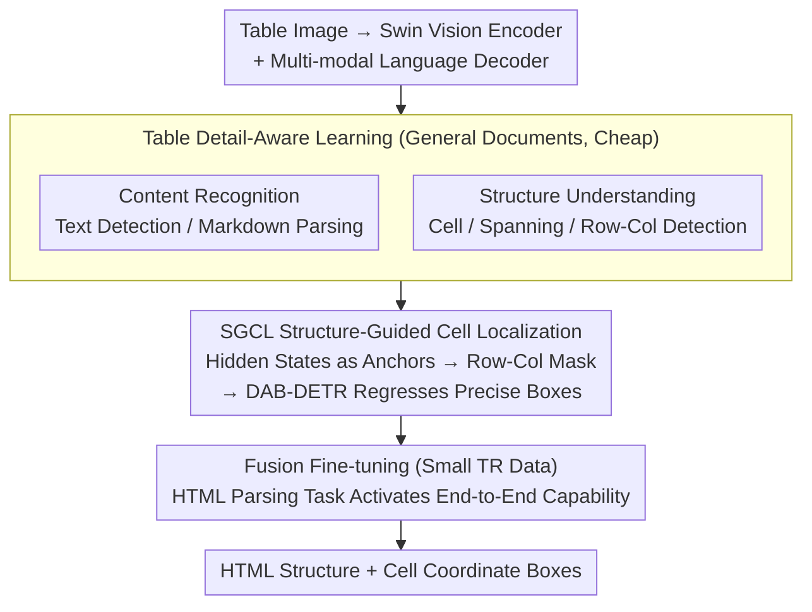

# TDATR: Improving End-to-End Table Recognition via Table Detail-Aware Learning and Cell-Level Visual Alignment

**Conference**: CVPR2026  
**arXiv**: [2603.22819](https://arxiv.org/abs/2603.22819)  
**Code**: [github.com/Chunchunwumu/TDATR.git](https://github.com/Chunchunwumu/TDATR.git)  
**Area**: Explainability  
**Keywords**: Table Recognition, End-to-End, Detail-Aware Learning, Cell Localization, Vision-Language Alignment

## TL;DR
The TDATR framework is proposed, utilizing a "perceive-then-fuse" strategy and a structure-guided cell localization module to achieve end-to-end table recognition with limited annotated data, reaching SOTA on 7 benchmarks without dataset-specific fine-tuning.

## Background & Motivation
Table Recognition (TR) is a core task in document analysis, requiring the conversion of table images into machine-readable formats like HTML. Existing methods are mainly divided into two categories:
- **Modular TR**: Separately models table structure recognition (TSR) and table content recognition (TCR), followed by post-processing fusion. This ignores the inherent dependencies between structure and content, leading to suboptimal integration and error accumulation.
- **End-to-End TR**: Generates structured output in a unified manner but relies heavily on large-scale TR annotated data, showing poor generalization in data-constrained scenarios and usually lacking cell spatial correspondences, which limits explainability.

**Key Challenge**: While end-to-end methods simplify the pipeline, the cost of TR data annotation is extremely high (requiring simultaneous annotation of structure and content), causing existing methods to perform poorly on diverse real-world tables.

**Key Insight**: This paper decouples the learning of TR capabilities into "perception" and "fusion" stages—first acquiring fine-grained table detail perception through multi-task pre-training, then learning fusion using a small amount of TR data, while introducing structure-guided cell localization to enhance explainability.

## Method

### Overall Architecture
TDATR addresses the problem that while end-to-end TR is streamlined, it is highly dependent on expensive TR-specific annotations, leading to generalization collapse when data is limited and a lack of cell spatial coordinates. The solution is to decompose "learning to recognize tables" into two steps: **perceive**, then **fuse**. The pipeline consists of three parts: a vision encoder (Swin Transformer) to encode table images into multi-resolution features, a multi-modal language decoder to generate structured text under a unified language modeling paradigm, and a Structure-Guided Cell Localization (SGCL) module that "grows" precise coordinate boxes for each cell from the hidden states of the decoding process. Training follows a perceive-then-fuse two-stage approach: the first stage supplies various perception tasks on massive general documents, and the second stage uses a small amount of TR data to fuse the perceived details into end-to-end HTML output.

### Key Designs

**1. Table Detail-Aware Learning: Pre-storing perception capabilities that usually require expensive TR annotations using cheap general document data**

The bottleneck of end-to-end TR is annotation cost—simultaneously labeling structure and content is extremely expensive. This design avoids TR-specific data by designing two types of self-supervised/weakly supervised pre-training tasks under a unified language modeling paradigm, all sourced from large-scale multi-source documents (web pages, papers, READMEs, etc.). One category is **content recognition** tasks, including spatially ordered text detection, text detection with box queries, and Markdown parsing, aimed at honing OCR and layout understanding. The other is **structure understanding** tasks, including cell detection, spanning cell detection, row/column detection, and structure parsing, establishing perception of the table skeleton at both cell and row/column granularities. Thus, before seeing much TR annotation, the model is already familiar with details like "where the text is," "where cell boundaries are," and "which cells span multiple rows/columns." Subsequent small-scale TR data only needs to "trigger" how to assemble them into complete HTML, fundamentally shifting data requirements from scarce end-to-end annotations to accessible document data.

**2. Structure-Guided Cell Localization (SGCL): Allowing coordinate boxes to grow directly from the TR decoding process, naturally aligned with output**

Modular methods rely on post-processing to align structure and content, while end-to-end methods often provide no coordinates at all, causing issues with both explainability and alignment. The key to SGCL is: instead of detecting cells separately, it reuses the hidden states of the language decoder as anchors. Specifically, it aggregates cell representations using learnable weights from different layers of decoder hidden states—for each cell, an initial representation $C$ is obtained by average pooling between the `<td` and `</td>` tokens. $C$ is then projected into row/column feature spaces, and adjacency relationships between cells are calculated using inner products, binarized into a structural mask:

$$M_{xy}^k = \mathbb{1}\left[\text{Sigmoid}\left(\langle C_x^k, C_y^k \rangle / \text{dim}(C^k)\right) > 0\right]$$

This mask guides a round of bidirectional contextual attention, enhancing $C$ into a structure-aware $C'$. Finally, an MLP regresses an initial box from $C'$, which is refined step-by-step using multi-resolution visual features $P'_3$, $P'_4$ via DAB-DETR decoding layers. The process works as follows: as the decoder emits the HTML sequence, every pair of `<td>...</td>` corresponds to a hidden state cluster. SGCL treats this as a "seed anchor" for that cell, cross-calibrating based on row/column relationships, then allowing visual features to pull the box to a pixel-level accurate position. Since the anchors are the hidden states of the TR output, the cell boxes and the generated sequence are naturally one-to-one—obviating post-processing and avoiding the training instability of bipartite (Hungarian) matching common in DETR-based systems.

**3. Fusion Fine-tuning Stage: Using an HTML parsing task to "activate" the perception accumulated in the previous stage into end-to-end capability**

The first stage builds up perception details but hasn't learned to "assemble them into a complete table." This stage uses an HTML table parsing task as supervision, letting the model predict precise coordinates for each cell via SGCL while generating structured sequences. At this point, the model no longer requires massive TR data but implicitly aggregates the previously learned text, layout, and row/column structure details to complete end-to-end TR—explaining why it achieves SOTA with significantly less fine-tuning data than baselines.

### Loss & Training
Perception Stage: All tasks use cross-entropy loss $L_{ce}$.

Fusion Stage: $L_f = \lambda_{ce} L_{ce} + \lambda_b L_b + \lambda_{iou} L_{iou} + \lambda_m L_m + \lambda_{s} L_s$
- $L_b$: Cell regression loss; $L_{iou}$: IoU loss.
- $L_m$: Mask alignment loss (Mask-DINO style), enhancing alignment between $C'$ and image features.
- $L_s$: Structure guidance loss (BCE), optimizing the row-column relationship matrix.
- Weights: $\lambda_b=0.05, \lambda_{iou}=0.03, \lambda_m=0.03, \lambda_s=0.05, \lambda_{ce}=1.0$.

Each stage is trained for 3 epochs using 16×64GB 910B NPUs.

## Key Experimental Results

### Main Results

| Dataset | Metric | TDATR | Prev. SOTA | Gain |
|--------|------|-------|----------|------|
| iFLYTAB-full | TEDS | 93.22 | 84.36 (DeepSeek-OCR) | +8.86 |
| TabRecSet | TEDS | 92.70 | 70.70 (EDD) | +22.00 |
| PubTables-1M | TEDS | 97.97 | 95.48 (Dolphin) | +2.49 |
| PubTabNet | TEDS | -ft version provided for further gain | - | - |

### Ablation Study

| Configuration | Key Metric | Description |
|------|---------|------|
| Without Detail-Aware Learning | Significant performance drop | Validates perceive-then-fuse strategy |
| Without SGCL | TEDS-D increases | Structure-content alignment degrades |
| TDATR-ft (Extra fine-tuning on PubTabNet) | Both TSR/TR improve | Confirms benefits of data volume |

### Key Findings
- End-to-end TR's TSR performance exceeds expert TSR models, proving content recognition positively promotes structure recognition.
- SOTA results are achieved using far less fine-tuning data than baselines, validating the effectiveness of the decoupled learning strategy.
- TEDS-Delta (TEDS - TEDS\_S) is significantly better than modular methods, indicating end-to-end avoids post-processing error accumulation.

## Highlights & Insights
- "Perceive-then-fuse" is an elegant decoupling idea: transforming the hard-to-get end-to-end TR annotation requirement into more accessible document data pre-training + a small amount of TR fine-tuning.
- The SGCL module is cleverly designed, using hidden states from the TR decoding process as anchor initializations for DAB-DETR, avoiding the training instability of Hungarian matching.
- The new iFLYTAB-full dataset fills a void in the evaluation of Chinese real-world table recognition.

## Limitations & Future Work
- TSR on digital tables (e.g., PubTabNet) is slightly inferior to the best expert models because complete TR sequences are about twice as long as TSR sequences, increasing generation difficulty.
- With 600M parameters, the model is smaller than large OCR VLMs (e.g., Qwen2.5-VL-72B) but still relatively large.
- Integration with LLM backbones has not been explored, which may limit understanding of complex document contexts.

## Related Work & Insights
- Dolphin is a similar end-to-end TR method; TDATR exceeds it by 2.5%+ TEDS under the same modeling paradigm.
- Unlike multi-decoder methods like OmniParser, TDATR uses a single decoder to unify structure and content generation.
- The concept of structure-guided localization can be extended to other document understanding tasks requiring layout-content alignment.

## Rating
- Novelty: ⭐⭐⭐⭐ The perceive-then-fuse strategy and SGCL module design are novel.
- Experimental Thoroughness: ⭐⭐⭐⭐⭐ 7 benchmarks, no dataset-specific fine-tuning, complete ablations.
- Writing Quality: ⭐⭐⭐⭐ Clear structure and detailed method description.
- Value: ⭐⭐⭐⭐ Strong practicality for table recognition under data constraints.

## Additional Notes
- Vision encoder uses Swin Transformer (300M), language decoder uses Transformer (300M), totaling 600M parameters.
- In SGCL, the number of DAB-DETR decoding layers $L_d=3$, and the bidirectional enhancement branch includes 2 self-attention blocks and 1 cross-attention block.
- Maximum decoding length is 4096 tokens, with the long side of input images not exceeding 2048 pixels.

<!-- RELATED:START -->

## Related Papers

- [\[ICLR 2026\] Sparling: End-to-End Spatial Concept Learning via Extremely Sparse Activations](../../ICLR2026/interpretability/sparling_end-to-end_spatial_concept_learning_via_extremely_sparse_activations.md)
- [\[CVPR 2026\] SafeDrive: Fine-Grained Safety Reasoning for End-to-End Driving in a Sparse World](safedrive_fine-grained_safety_reasoning_for_end-to-end_driving_in_a_sparse_world.md)
- [\[NeurIPS 2025\] Table as a Modality for Large Language Models](../../NeurIPS2025/interpretability/table_as_a_modality_for_large_language_models.md)
- [\[ICLR 2026\] Decomposition of Concept-Level Rules in Visual Scenes](../../ICLR2026/interpretability/decomposition_of_concept-level_rules_in_visual_scenes.md)
- [\[CVPR 2026\] Improving Sparse Autoencoder with Dynamic Attention](improving_sparse_autoencoder_with_dynamic_attention.md)

<!-- RELATED:END -->
