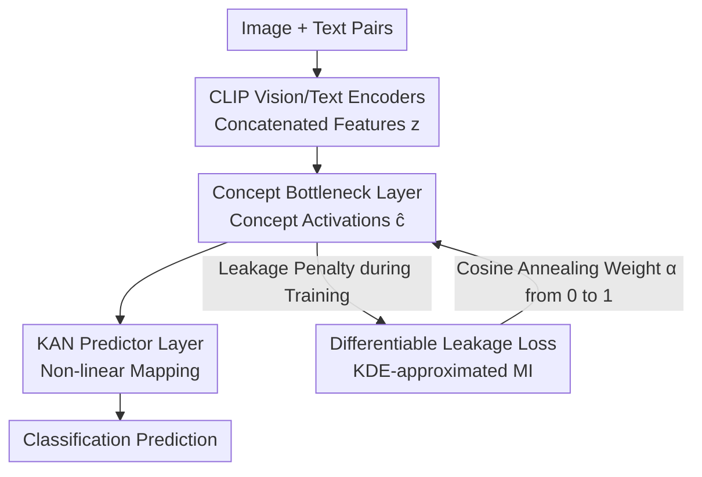

# Towards Faithful Multimodal Concept Bottleneck Models

**Conference**: CVPR 2026  
**arXiv**: [2603.13163](https://arxiv.org/abs/2603.13163)  
**Code**: To be confirmed  
**Area**: Interpretability  
**Keywords**: Concept Bottleneck Models, Interpretability, Leakage Mitigation, KAN Networks, Multimodal Classification

## TL;DR
The authors propose f-CBM—the first faithful multimodal concept bottleneck model framework. It reduces unintended information leakage in concept representations through a differentiable leakage loss and enhances concept detection accuracy using a Kolmogorov-Arnold Network (KAN) predictor head, achieving an optimal Pareto frontier across task accuracy, concept detection, and leakage reduction.

## Background & Motivation
**Background**: Concept Bottleneck Models (CBMs) provide interpretability by routing predictions through human-understandable concept layers. While extensively studied in vision and NLP, they remain largely unexplored in multimodal scenarios.

**Limitations of Prior Work**: The faithfulness of CBMs faces dual challenges: (a) inaccurate concept detection, and (b) leakage in concept representations. This includes task leakage (concepts encoding task-relevant signals beyond their semantics) and inter-concept leakage (unintended mutual information encoded between different concepts).

**Key Challenge**: Existing methods treat concept detection and leakage mitigation as independent problems; improving one often sacrifices task accuracy. Independent training protocols reduce leakage but degrade performance, whereas residual connections absorb missing information but compromise interpretability.

**Goal**: To simultaneously achieve high concept detection accuracy, minimal leakage, and competitive task accuracy in multimodal scenarios.

**Key Insight**: Preliminary analysis reveals that task leakage and inter-concept leakage are highly positively correlated, and concepts with higher detection accuracy exhibit lower leakage. Thus, simultaneously optimizing concept detection and task leakage can indirectly reduce inter-concept leakage.

**Core Idea**: Employ differentiable mutual information estimation for training-time leakage regularization and replace linear layers with KAN layers to enhance predictor expressiveness, jointly optimizing these three objectives.

## Method

### Overall Architecture
f-CBM aims to balance three conflicting objectives in multimodal classification: accurate concept detection, low task signal leakage in concept representations, and high final task accuracy. The pipeline is as follows: image-text pairs pass through CLIP vision and text encoders to form concatenated features $z=[f^v(x^v)\|f^t(x^t)]$; $z$ is then compressed through a concept bottleneck layer $\Phi^C$ into a set of human-readable concept activations $\hat{c}$; finally, these activations pass through a KAN layer $\Phi^{\text{kan}}$ to obtain classification predictions. Two key modifications—replacing the linear predictor with KAN and introducing a differentiable leakage penalty for concept representations—address expressiveness and information leakage, respectively, while a cosine annealing schedule coordinates their effects.

### Key Designs

**1. Differentiable Leakage Loss: Transforming "Information Leakage" into a Backpropagatable Objective**

A core cause of CBM unfaithfulness is Concept-Task Leakage (CTL)—where concept activations encode task label signals beyond their intended semantics, creating shortcuts for prediction. Since traditional leakage metrics based on discrete binning are non-differentiable, f-CBM adopts Kernel Density Estimation (KDE) with Gaussian kernels to approximate mutual information, $\hat{I}(x;y) = N^{-1}\sum_i \log[\hat{p}(x_i|y_i)/\hat{p}(x_i)]$, ensuring the estimation remains differentiable. The leakage loss is defined as the squared normalized difference between the MI of predicted concepts $\hat{c}$ and true concepts $c$ with respect to task labels:

$$\mathcal{L}_{\text{leak}} = \left[\frac{\hat{I}(\hat{c}_i;y)-\hat{I}(c_i;y)}{H(y)}\right]^2$$

The squared form provides bidirectional gradients—retaining task-relevant information that the true concept should carry while penalizing excessive leakage.

**2. KAN Predictor Layer: Blocking Leakage Caused by Insufficient Predictor Expressiveness**

Replacing the bottleneck-to-prediction layer with a Kolmogorov-Arnold Network (KAN) addresses a primary source of leakage: when a linear predictor is too weak, the model forces the concept layer to encode extra information to compensate. The KAN output $\Phi_o^{\text{kan}}(x) = s_o \times \sum_{i=1}^{N}\phi_{i,o}(x)$, where each $\phi_{i,o}$ is a linear combination of B-spline basis functions $\sum_m c_{i,o,m} \cdot B_m(x)$, shifts the burden of non-linear mapping to the predictor. This allows the concept layer to focus on accurate detection. Single-layer KANs preserve interpretability as each concept's $\phi_{i,o}$ provides a visualizable response curve.

**3. Cosine Annealing of Leakage Loss Weight: Sequential Learning and Constraint**

The leakage loss weight $\alpha$ follows a cosine annealing schedule from 0 to 1. By keeping $\alpha$ near 0 in early stages, the model can effectively learn concept detection without interference; as $\alpha$ increases, the model focuses on removing leaked information.

### Loss & Training
The total loss is $\mathcal{L} = \mathcal{L}_{\text{cls}} + \tilde{\lambda}\mathcal{L}_C + \tilde{\lambda}_{\text{leak}}\alpha\mathcal{L}_{\text{leak}}$, representing classification, concept detection, and annealed leakage losses. Weights $\tilde{\lambda}$ are dynamically normalized using a running mean to balance loss scales. The CLIP backbone is fine-tuned at lr=1e-5, while KAN/linear layers follow a cosine annealing schedule starting from 0.1 or 0.01.

## Key Experimental Results

### Main Results (N24News Dataset, CLIP-base)

| Method | %ACC↑ | c-RMSE↓ | CTL↓ | ICL↓ |
|--------|-------|---------|------|------|
| Black-box | 98.5 | — | — | — |
| Indep.-CBM | 96.0 | **0.043** | 0.028 | 0.005 |
| Label-free | 98.2 | 1.264 | 0.212 | 0.050 |
| CT-CBM | 98.1 | 0.101 | 0.244 | 0.059 |
| **f-CBM (ours)** | **98.1** | 0.056 | **0.005** | **0.006** |

### Cross-Dataset and Model Scale

| Dataset | Backbone | f-CBM ACC | f-CBM CTL | f-CBM ICL |
|---------|----------|-----------|-----------|-----------|
| N24News | CLIP-base | 98.1 | 0.005 | 0.006 |
| N24News | CLIP-large | 98.5 | 0.004 | — |
| CUB-200 | CLIP-base | 93.7 | 0.008 | 0.009 |
| AG News | CLIP-base | 90.6 | 0.005 | 0.006 |

### Key Findings
- f-CBM reduces CTL by approximately 40x compared to Label-free while maintaining comparable task accuracy.
- The KAN layer improves concept detection (c-RMSE dropped from 0.101 to 0.056), indirectly reducing leakage.
- Leakage loss and the KAN layer are complementary; using both yields the best performance.
- Validated the hypothesis that reducing CTL simultaneously lowers ICL.
- f-CBM is effective on text-only datasets (AG News, DBpedia), demonstrating its versatility.

## Highlights & Insights
- **Causal Chain Analysis**: The discovery of the positive correlation between concept detection accuracy, task leakage, and inter-concept leakage allows for a strategy where optimizing two improves the third.
- **Differentiable MI Estimation via KDE**: Converting a discrete quantification metric into a differentiable objective is a technique applicable to other scenarios requiring mutual information constraints.
- **Explainability through KAN**: KAN provides an additional dimension of interpretability via per-concept response curves without sacrificing performance.

## Limitations & Future Work
- The computational complexity of KDE estimation is $O(N^2)$, which may be a bottleneck for large concept sets.
- Concept annotation depends on LLMs (Claude 4.5 Sonnet) and CLIP similarity, which may limit annotation quality.
- The framework has been validated primarily on N24News and CUB-200; further verification in domains like medicine or law is needed.
- The fixed cosine annealing schedule could potentially be improved with an adaptive method.

## Related Work & Insights
- **vs CT-CBM**: While CT-CBM uses residual connections to absorb leakage and removes them post-training, f-CBM reduces leakage fundamentally during training via specialized loss functions.
- **vs Independent-CBM**: Independent training minimizes leakage but suffers from poor task accuracy; f-CBM approaches independent-level leakage while maintaining joint-training accuracy.

## Rating
- Novelty: ⭐⭐⭐⭐ Combination of differentiable leakage loss and KAN is novel and effective.
- Experimental Thoroughness: ⭐⭐⭐ Dataset diversity is somewhat limited.
- Writing Quality: ⭐⭐⭐⭐ Clear motivation and well-structured analysis of the causal chain.
- Value: ⭐⭐⭐⭐ Faithfulness is central to CBM research, and the multimodal extension is practical.

<!-- RELATED:START -->

## Related Papers

- [\[CVPR 2026\] Rethinking Concept Bottleneck Models: From Pitfalls to Solutions](rethinking_concept_bottleneck_models_from_pitfalls_to_solutions.md)
- [\[CVPR 2026\] Rounded or Streamlined Head? Bridging Concept Bottleneck Models and Attribute-Described Object Parts](rounded_or_streamlined_head_bridging_concept_bottleneck_models_and_attribute-des.md)
- [\[ICLR 2026\] There Was Never a Bottleneck in Concept Bottleneck Models](../../ICLR2026/interpretability/there_was_never_a_bottleneck_in_concept_bottleneck_models.md)
- [\[AAAI 2026\] Partially Shared Concept Bottleneck Models](../../AAAI2026/interpretability/partially_shared_concept_bottleneck_models.md)
- [\[AAAI 2026\] Flexible Concept Bottleneck Model](../../AAAI2026/interpretability/flexible_concept_bottleneck_model.md)

<!-- RELATED:END -->
