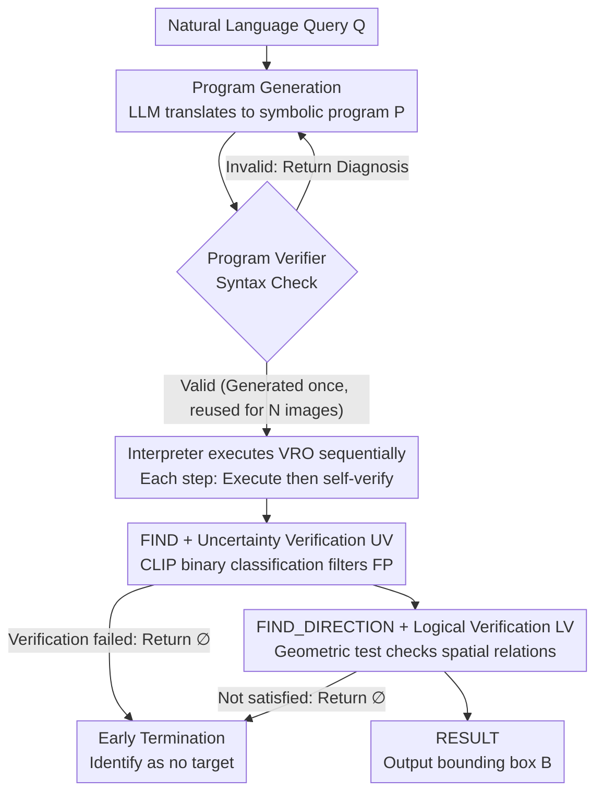

# VIRO: Robust and Efficient Neuro-Symbolic Reasoning with Verification for Referring Expression Comprehension

**Conference**: CVPR 2026  
**arXiv**: [2601.12781](https://arxiv.org/abs/2601.12781)  
**Code**: [https://github.com/ml-postech/VIRO-neuro-symbolic-reasoning-with-verification](https://github.com/ml-postech/VIRO-neuro-symbolic-reasoning-with-verification)  
**Area**: Interpretability  
**Keywords**: Referring Expression Comprehension, Neuro-Symbolic Reasoning, Operator-level Verification, Zero-shot Learning, Object-free Detection

## TL;DR
VIRO embeds a lightweight operator-level verification mechanism (CLIP uncertainty verification + spatial logic verification) into a neuro-symbolic REC pipeline. This enables each reasoning step to self-verify and terminate early when no target is present. In zero-shot settings, it significantly outperforms compositional reasoning baselines with a balanced accuracy of 61.1%, while maintaining a program failure rate below 0.3% and high inference efficiency.

## Background & Motivation

1. **Background**: Referring Expression Comprehension (REC) aims to locate target regions in an image based on natural language descriptions. Recently, neuro-symbolic methods based on LLMs and VLMs have achieved interpretable reasoning and strong zero-shot generalization by decomposing queries into structured programs and executing them step-by-step.

2. **Limitations of Prior Work**: Existing compositional reasoning pipelines assume every intermediate step is correct. In reality, Open-Vocabulary Detectors (OVD) often generate high-confidence False Positives (FP). These errors propagate through the reasoning chain, which is particularly severe in scenarios without targets where the system is forced to select an FP as the answer (the "forced prediction" problem).

3. **Key Challenge**: Existing methods lack verification mechanisms for intermediate reasoning steps. OVD-generated candidate boxes may be visual or semantic FPs, and spatial relationship reasoning may still output results even when constraints are not met. Furthermore, many systems place large multimodal LLMs in the reasoning inner loop, leading to significant latency and tight coupling between program generation and execution, requiring re-generation for every image.

4. **Goal**: (a) How to embed verification within reasoning steps to prevent cascading errors? (b) How to correctly "abstain" instead of forced prediction in object-free scenarios? (c) How to improve efficiency and scalability while maintaining accuracy?

5. **Key Insight**: Integrate lightweight verification modules within each reasoning operator—utilizing CLIP for uncertainty verification to filter OVD false positives, and geometric tests for logical verification to check spatial relationships.

6. **Core Idea**: Implement an "execute-then-verify" approach within the neuro-symbolic reasoning pipeline. If verification fails, the operator returns an empty set and terminates early, achieving robust object-free detection.

## Method

### Overall Architecture

The key challenge VIRO addresses is that existing neuro-symbolic REC pipelines assume intermediate results are correct, yet OVDs often provide high-confidence FPs. Errors amplify along the reasoning chain, forcing the system to pick an FP in object-free scenes. VIRO responds by pushing "verification" down into each individual reasoning operator and completely decoupling program generation from execution.

The pipeline consists of two stages. In the pre-execution stage, an LLM translates the natural language query into a symbolic program $P = (o_1, o_2, \dots, o_T)$ composed of Verifiable Reasoning Operators (VRO), which is then processed by a program verifier for syntax checks. In the execution stage, the interpreter runs these operators sequentially. Each operator performs self-verification after execution—if any step fails verification, it immediately returns an empty set $\varnothing$ and terminates the pipeline. Consequently, the final output is either a localized bounding box or an empty set (identifying no target), formalizing REC output as $Y = B$ or $Y = \varnothing$.

### Key Designs

**1. Verifiable Reasoning Operators (VRO): Self-Verification at Every Step**

Traditional compositional reasoning treats operators as pure execution units, where correctness is only known at the end of the pipeline when errors have already propagated. VIRO defines a finite set of operators serving as reasoning building blocks, categorized into four types: identification (FIND, PROPERTY), absolute spatial (LOCATE, SIZE, ORDER), relative spatial (FIND_DIRECTION, FIND_NEAR, FIND_INSIDE), and termination (RESULT). Each operator not only executes a reasoning action but also self-verifies the result. If verification fails, it returns $\varnothing$ to trigger early termination. Placing verification at the operator level ensures errors are cut off at the source and allows object-free scenarios to terminate efficiently.

**2. Uncertainty Verification (UV, embedded in FIND): CLIP as a Binary Classifier for FPs**

OVDs (e.g., GroundingDINO) are prone to giving high scores to visually/semantically similar but incorrect objects. UV crops the image region $I_j$ corresponding to each OVD candidate $B_j$, selects $K$ common categories as negative anchors, and calculates a verification score using CLIP:

$$S(l|I_j) = \frac{1}{K}\sum_{k=1}^K \frac{\exp(\text{sim}(I_j, l)/\tau)}{\exp(\text{sim}(I_j, l)/\tau) + \exp(\text{sim}(I_j, c_k)/\tau)}$$

This performs a binary classification of "candidate label $l$ vs. each negative anchor $c_k$" and averages the probabilities. Candidates with scores below a threshold $\delta_l$ are filtered. This leverages CLIP's discriminative rather than retrieval capability, providing minimal overhead while suppressing "look-alike" FPs. To counteract CLIP's internal bias toward certain labels, $\delta_l$ is calibrated per-label using ImageNet.

**3. Logical Verification (LV, embedded in FIND_DIRECTION): Geometric Tests for Spatial Relations**

Even if candidates pass UV, spatial relationships might not hold—a query might specify "the person to the left of the elephant," but the detected person might not be to the elephant's left. LV performs geometric tests on all input candidates to check if the target satisfies the specified directional relationship relative to the reference. This filters errors where entities are correct but their positioning is not, serving as a second gate alongside UV.

**4. Program Generation and Restricted Verification Loop: Reducing Runtime Errors below 0.3%**

LLMs occasionally produce syntactically invalid programs. VIRO uses Qwen2.5-72B-Instruct-AWQ for few-shot generation $P = \text{LLM}(Q|m)$, followed by a program verifier. If it fails, concise diagnostic feedback is sent back to trigger LLM self-correction. The failure rate is minimized primarily because the operator space is restricted—VIRO only allows combinations within a fixed symbolic structure rather than open Python code (like ViperGPT), significantly reducing runtime errors to below 0.3%.

**5. Decoupled Architecture: Reducing Latency from Multiplicative to Additive**

Linking program generation and execution requires re-running the LLM for every new image. VIRO generates the program once per query and reuses it across all $N$ images. The total time is $T_{\text{total}} = T_{\text{pre}} + N \times T_{\text{exec}}$. As $N$ increases, the generation cost $T_{\text{pre}}$ is amortized. This is ideal for robotic visual search where one query applies to many images, unlike HYDRA or NAVER where latency grows multiplicatively with the number of images.

### A Complete Example: Querying "person to the left of the elephant" in an "elephant-free" image

Consider the query "the person to the left of the elephant" where no elephant exists. The LLM translates this to `FIND(elephant) → FIND_DIRECTION(person, left) → RESULT`. After syntax validation, execution begins. The first `FIND(elephant)` invokes the OVD, which might mistakenly return a gray cow with high confidence. UV immediately crops the region and scores it. The average probability for "elephant vs {cow, horse, ...}" falls below the calibrated threshold $\delta_{\text{elephant}}$, and the FP is filtered. `FIND` returns $\varnothing$. Since the reference is empty, the pipeline terminates early without running `FIND_DIRECTION`, correctly outputting an empty set. In contrast, older pipelines without verification would proceed with the "fake elephant," forced to select a person based on a false premise—a failure mode VIRO resolves, improving TNR from 7.5% to 50.2% on gRefCOCO.

## Key Experimental Results

### Main Results

| Dataset/Split | Metric | Ours | Prev. SOTA (Compositional) | Gain |
|--------|------|------|----------|------|
| gRefCOCO+RefCOCO TestA | Balanced Acc. | 61.1% | 35.2% (HYDRA) | +25.9 |
| gRefCOCO TestA | TNR (N-acc) | 50.2% | 7.5% (HYDRA) | +42.7 |
| RefCOCO TestA | TPR (Acc@0.5) | 71.9% | 66.7% (ViperGPT) | +5.2 |
| RefCOCO TestA | Program Failure Rate | 0.07% | 3.45% (ViperGPT) | Significant Reduction |
| RefCOCO TestA | Execution Latency | 0.71s | 1.49s (ViperGPT) | 2.1× Faster |
| RefEgo (Full Frame) | ACC@0.5+n | 51.9% | 23.0% (ViperGPT) | +28.9 |

### Ablation Study

| Configuration | Balanced Acc. | TNR | TPR | Description |
|------|---------|------|------|------|
| Detector-only | 40.0% | 22.8% | 57.1% | OVD only |
| + Operators | 56.8% | 38.9% | 74.6% | + Compositional operators |
| + LV | 57.0% | 39.3% | 74.6% | + Logical Verification |
| + UV (fixed) | 58.8% | 43.1% | 74.4% | + Uncertainty Verification (Fixed threshold) |
| + UV (adaptive) | 61.1% | 50.2% | 71.9% | + Adaptive threshold (Full model) |

### Key Findings
- Compositional operators contribute the most (Balanced Acc +16.8). UV significantly improves object-free detection (TNR +11.3), though a TPR-TNR trade-off exists.
- Adaptive thresholds improve TNR by 7.1% compared to fixed thresholds but decrease TPR by 2.5%, reflecting a precision-recall trade-off.
- In 1-query-N-images scenarios, VIRO and ViperGPT outperform HYDRA/NAVER due to their decoupled architecture, with VIRO having lower execution latency.
- CLIP backbone choice: ViT-H/14 yields 3.1% higher TPR than ViT-L/14 but increases execution latency by 29%.

## Highlights & Insights
- **Operator-level verification is a key innovation**: Verification occurs within each reasoning step ("execute+verify") rather than at the end of the pipeline. This is a first-of-its-kind design in this category, catching errors at the source.
- **CLIP as a lightweight binary verification tool**: It cleverly utilizes CLIP's discriminative power by comparing candidates against a set of negative anchors, resulting in minimal computational cost with significant gains in robustness.
- **Object-free detection as "abstention" rather than "classification"**: This is naturally achieved through the empty set return mechanism without requiring extra training for object-free detection. This philosophy is transferable to any visual reasoning system requiring "refusal to answer."

## Limitations & Future Work
- An inherent trade-off exists between TPR and TNR—improving object-free detection capability sacrifices accuracy when targets are present (TPR drops from 74.6% to 71.9%).
- Dependence on a fixed operator set limits coverage for complex queries (e.g., those involving actions or temporal semantics).
- CLIP verification uses ImageNet-calibrated thresholds; generalization to out-of-domain data needs further validation.
- Logical verification is currently limited to simple geometric tests; complex spatial relationships (occlusion, relative size) may require stronger reasoning mechanisms.

## Related Work & Insights
- **vs. ViperGPT**: ViperGPT generates open Python code but lacks verification, leading to a 3.45% failure rate. VIRO uses restricted operators + a verifier to reduce failure to 0.07% while achieving higher TPR.
- **vs. HYDRA/NAVER**: These methods tightly couple program generation and execution, requiring re-generation for every image and relying on large multimodal LLMs, which results in higher latency and failure rates than VIRO.
- **vs. Supervised REC (GREC-UNINEXT)**: VIRO approaches or even surpasses supervised methods that require object-free annotation training in its "no-target" detection performance, demonstrating the potential of zero-shot approaches.

## Rating
- Novelty: ⭐⭐⭐⭐ Operator-level verification and the abstention mechanism are significant innovations in compositional REC, though the overall concept is intuitive.
- Experimental Thoroughness: ⭐⭐⭐⭐⭐ Covers multiple REC benchmarks, object-free benchmarks, video benchmarks, efficiency, scalability, and comprehensive ablations.
- Writing Quality: ⭐⭐⭐⭐ Clear problem definitions and methodological explanations with rich illustrations.
- Value: ⭐⭐⭐⭐ Highly relevant for practical applications (robotic search, object-free detection), filling a critical gap in compositional reasoning methods.

<!-- RELATED:START -->

## Related Papers

- [\[ICLR 2026\] Inferring the Invisible: Neuro-Symbolic Rule Discovery for Missing Value Imputation](../../ICLR2026/interpretability/inferring_the_invisible_neuro-symbolic_rule_discovery_for_missing_value_imputati.md)
- [\[ICLR 2026\] Interpretable 3D Neural Object Volumes for Robust Conceptual Reasoning](../../ICLR2026/interpretability/interpretable_3d_neural_object_volumes_for_robust_conceptual_reasoning.md)
- [\[AAAI 2026\] Attention as Binding: A Vector-Symbolic Perspective on Transformer Reasoning](../../AAAI2026/interpretability/attention_as_binding_a_vector-symbolic_perspective_on_transformer_reasoning.md)
- [\[ICML 2026\] IQA-Spider: Unifying Multi-Granularity Image Quality Assessment with Reasoning, Grounding and Referring](../../ICML2026/interpretability/iqa-spider_unifying_multi-granularity_image_quality_assessment_with_reasoning_gr.md)
- [\[CVPR 2026\] Beyond Top Activations: Efficient and Reliable Crowdsourced Evaluation of Automated Interpretability](beyond_top_activations_efficient_and_reliable_crowdsourced_evaluation_of_automat.md)

<!-- RELATED:END -->
