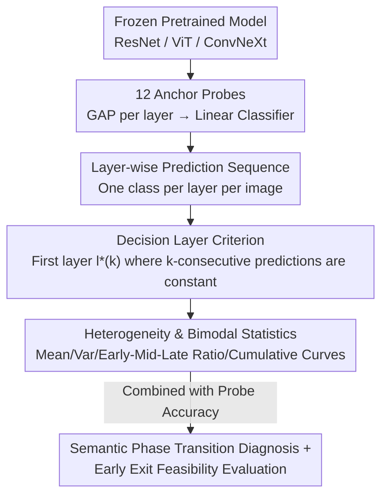

# When Do Models Actually Decide? Mapping the Layer-Wise Decision Timeline in Pretrained Neural Networks

**Conference**: CVPR 2026  
**Paper**: [CVF Open Access](https://openaccess.thecvf.com/content/CVPR2026/html/Lee_When_Do_Models_Actually_Decide_Mapping_the_Layer-Wise_Decision_Timeline_CVPR_2026_paper.html)  
**Code**: To be confirmed  
**Area**: Interpretability / Representation Analysis  
**Keywords**: Decision timeline, linear probing, early exit, semantic phase transition, ImageNet

## TL;DR
The authors train linear probes at each anchor layer of ResNet-18/50/101 (plus ViT-B/16 and ConvNeXt-Tiny) to track the specific layer where the prediction for each ImageNet image "settles." They discover a strong bimodal decision distribution and a "semantic phase transition" concentrated in the final residual stages. Based on these findings, they suggest that stability-based early exits provide negligible real-world speedup-accuracy gains.

## Background & Motivation
**Background**: Deep networks are typically handled as "black-box wholes"—every input must pass through all 50 layers. One area of research to improve efficiency is early exit networks, which add trainable exit branches and gating modules to intermediate layers to allow simple samples to exit early. Another area is probing, which uses frozen intermediate activations to train lightweight classifiers to see "what information is encoded" in each layer.

**Limitations of Prior Work**: Early exit methods consistently modify architectures and add specialized training objectives and gating, asking "Can we build an early exit system?" Probing methods ask "What attributes does this layer encode?" Neither directly answers a more fundamental question: in an **unmodified** pretrained model, at which layer does the prediction **naturally stabilize**?

**Key Challenge**: "What is encoded" and "when decisions crystallize" are different concepts. Representations in one layer may be highly similar to the next (high CKA), but this does not imply that the classification decision has been finalized. High probe accuracy only indicates class separability, not that the model has "made up its mind." There is a lack of tools to directly characterize the **decision moment**.

**Goal**: To transform the probing method from "measuring what" to "measuring when." For each image, the objective is to find the layer where its predicted class begins to remain constant; this metric is then used to characterize the heterogeneity of different samples and architectures in terms of computational demand and its implications for early exit.

**Key Insight**: Adoption of a "forensic analysis" perspective—keeping the base model untouched and adding no training objectives, only attaching probes to fixed anchor layers to observe how predictions evolve with depth. This yields the **intrinsic** decision timeline of the model rather than one shaped by external training objectives.

**Core Idea**: Attach linear probes to each layer and define the "first layer where the prediction remains constant for $k$ consecutive layers" as the decision layer $l^*(k)$ for that sample. Use this to statistically map the layer-wise decision timeline for the entire dataset.

## Method

### Overall Architecture
The method is a diagnostic pipeline: take a frozen pretrained classifier → attach linear probes to 12 representative anchor layers → extract activations per layer using forward hooks during a single forward pass → generate a prediction for each layer → determine the decision layer based on the "constant for $k$ layers" criterion → analyze the distribution, bimodal structure, and sensitivity to stability criteria across the ImageNet validation set. The input is an image, and the output is a set of **statistical profiles regarding "when the model decides."**

For each architecture, 12 anchors are selected ($T+1=12$, so $T=11$): For ResNet, these are the stem, the ends of each residual stage, and the final pooling layer; for ViT-B/16 and ConvNeXt-Tiny, depth-matched anchors are selected to ensure comparison at a unified 12-anchor granularity. For convolutional layers generating spatial feature maps $h^{(l)}\in\mathbb{R}^{B\times C\times H\times W}$, global average pooling is first applied to obtain a fixed-length vector:

$$\bar h^{(l)}=\frac{1}{HW}\sum_{i=1}^{H}\sum_{j=1}^{W} h^{(l)}_{:,:,i,j}\in\mathbb{R}^{B\times C}$$

### Key Designs

**1. Decision Criterion and Stability Window $k$: Quantifying the "When" as the First Stable Layer**

This is the core definition of the paper, addressing the lack of operational metrics for "decision crystallization." For image $i$, let $\hat y^{(l)}_i=\arg\max_c P_l(\bar h^{(l)}_i)_c$ be the predicted class from the probe at the $l$-th anchor. The decision layer $l^*_i(k)$ is defined as the first anchor where the prediction remains unchanged over a window of length $k$:

$$l^*_i(k)=\min\Big\{\, l\in\{0,\dots,T-k\}:\ \hat y^{(l)}_i=\hat y^{(l+1)}_i=\dots=\hat y^{(l+k)}_i \,\Big\}$$

If no such anchor exists, $l^*_i(k)=T$ by convention—meaning the terminal anchor $T$ serves as a fallback bucket for "unstable samples," and does not always represent a true late decision. The hyperparameter $k$ controls strictness: $k=1$ only requires consistency in the next step, while $k=4$ requires consistency across four consecutive anchors to filter out transient agreements. Crucially: **stability $\neq$ correctness**. Early layers may produce "stable but incorrect" predictions, so the authors also track probe accuracy $\alpha^{(l)}=\frac1N\sum_i \mathbb{1}[\hat y^{(l)}_i=y_i]$ to distinguish between the two.

**2. Linear Probes: Measuring Intrinsic Separability Without "Over-learning"**

A linear probe $P_l:\mathbb{R}^C\to\mathbb{R}^{1000}$ is trained for each layer, $P_l(\bar h^{(l)})=W_l\bar h^{(l)}+b_l$, minimizing cross-entropy for 1,000 ImageNet classes. The choice of **linear** probes ensures that measured performance reflects the intrinsic class separability of representation $h^{(l)}$, rather than the capacity of the probe itself. Probes are trained on 70% of the validation set; 30% is held out. Training uses SGD with momentum $\mu=0.9$, initial learning rate $\eta_0=0.1$, weight decay $10^{-4}$, and up to 100 epochs with early stopping (patience 10).

**3. Quantifying Heterogeneity and Bimodality: Looking Beyond the Mean**

To assess whether the network treats all samples equally, the authors use statistical measures: mean $\mu_k=\frac1N\sum_i l^*_i(k)$, median, and standard deviation $\sigma_k$. A large $\sigma_k$ indicates high heterogeneity in computational demand. Samples are categorized by relative depth: $l^*_i(k)<0.3T$ as **Early Decision**, $0.3T\le l^*_i(k)<0.7T$ as **Medium**, and $l^*_i(k)\ge 0.7T$ as **Late Decision**, with ratios $f_{\text{early}},f_{\text{mid}},f_{\text{late}}$. Cumulative decision curves $F_k(l)=\frac1N\sum_i \mathbb{1}[l^*_i(k)\le l]$ reveal how many samples have stabilized by layer $l$. A sharp jump at the terminal layer indicates many "unstable" samples assigned to the fallback bucket.

### Loss & Training
The probe training objective is independent cross-entropy per layer; the base model remains frozen. $k$ is scanned across $\{1,2,3,4\}$ to test sensitivity. All experiments are conducted on a single GPU with a batch size of 256. Additionally, the decision layers for $k=2$ are re-measured under mild corruptions (Gaussian noise, blur, brightness, severity 1–2) to check timeline stability under distribution shift.

## Key Experimental Results

Dataset: Full ImageNet validation set (50,000 images); pre-processed with resize 256 → center crop 224 → standard normalization. Main subjects are ResNet-18/50/101, with ViT-B/16 and ConvNeXt-Tiny for extended verification.

### Main Results: Semantic Phase Transitions and Bimodal Structure (ResNet, $k=2$)

| Architecture | Last Layer Probe Acc | Early Decision % | Late/Fallback % | Mean Decision Layer |
|--------------|----------------------|------------------|-----------------|---------------------|
| ResNet-18 | 64.8% | 22.5% | 53.9% | 7.40 |
| ResNet-50 | ~74% | 38.6% | 42.2% | 5.51 |
| ResNet-101 | 75.2% | 33.3% | 38.9% | 5.5–5.6 |

Probe accuracy shows a **phase transition** rather than gradual improvement: ResNet-50 rises slowly from 0.6% at L0 to 4.9% at L8, then jumps to 46.7% at L9, reaching ~74% at the final layer. This suggests L0–L8 build a "non-discriminative feature base," while semantic work is concentrated in the narrow L9–L11 window.

### Stability Sensitivity: Impact of $k$ on the Decision Landscape

| Architecture | Mean @ k=1 | @ k=2 | @ k=3 | @ k=4 | Factor |
|--------------|------------|-------|-------|-------|--------|
| ResNet-50 | 2.86 | 5.51 | 7.84 | 9.10 | 3.2× |
| ResNet-18 | 4.12 | 7.40 | 9.24 | 10.00 | 2.4× |

For ResNet-50, the early decision ratio drops from 67.7% at $k=1$ to 15.4% at $k=4$, while late decisions rise from 9.4% to 79.0%. Standard deviation peaks and then falls, indicating that moderate strictness reveals heterogeneity, while extreme strictness pushes most samples into the fallback bucket.

### Cross-Architecture & Distribution Shift ($k=2$, Table 1)

| Model | Last Layer Probe | Mean Decision Layer | Early / Late / Unstable % | Stable but Wrong Rate | Depth Change $\Delta\bar d$ (Corr.) |
|-------|------------------|---------------------|---------------------------|-----------------------|------------------------------------|
| ResNet-50 | 0.737 | 5.51 | 39% / 42% / 18% | 59.7 | +0.71 |
| ViT-B/16 | 0.808 | 4.98 | 40% / 24% / 7% | 53.3 | +0.01 |
| ConvNeXt-T| 0.793 | 9.51 | 5% / 87% / 62% | 30.3 | +0.27 |

### Key Findings
- **Negative Conclusion on Early Exit**: Pure stability-based gating yields only 34.68% accuracy @ 28.73 ms. To recover accuracy to 73.65%, confidence thresholds are needed, increasing latency to 49.13 ms—nearly matching the full-depth baseline (76.15% @ 49.46 ms). The Pareto frontier is nearly vertical. The root cause is "Stable $\neq$ Correct": early stable predictions are often "confidently wrong."
- **Means are Misleading**: ResNet-50's late-stage mass is concentrated at L9 (23.54%) and the L11 fallback (17.63%). The mean of 5.51 falls between these two clusters; full distribution analysis is essential.
- **Universal Late Semantic Consolidation**: ViT-B/16 makes the shallowest decisions (4.98), while ConvNeXt-Tiny is extremely late-biased (87% late). Decision timelines are not fixed; ResNet-50 shifts +0.71 anchors under corruption, whereas ViT is remarkably stable (+0.01).

## Highlights & Insights
- **Operationalizing the "Decision Moment"**: The definition of $l^*(k)$ is simple yet captures when a model captures its intent, strictly distinguishing it from information encoding or representation similarity.
- **Decoupling Stability vs. Correctness**: Tracking both stability and probe accuracy reveals "stable but wrong" predictions as the fundamental ceiling for early-exit methods.
- **Honest Negative Results**: Instead of overselling heterogeneity for "free acceleration," the author points out the limitations of stability-based early exits, providing guidance for future work (e.g., learned gating, confidence calibration).
- **Transferability**: This 12-anchor + bimodal statistics framework can be used to "check the health" of any frozen model to determine if it is suitable for early exit or compression.

## Limitations & Future Work
- **Limitations**: Study focused on convolutional architectures; ViT/ConvNeXt were small-scale extensions. Only ImageNet was analyzed; specialized domains might behave differently. Gating used simple heuristics rather than learned methods.
- **Granularity**: Using only 12 anchors may be coarse. The terminal fallback bucket mixes "unstable" and "true late" decisions, which necessitates careful interpretation of the late-decision ratio.
- **Future Directions**: Combining stability with confidence-based criteria or training lightweight gating networks to predict "decision readiness" from early features to bridge the stability-correctness gap.

## Related Work & Insights
- **vs. Early Exit Networks**: Unlike works that modify architectures for efficiency, this paper performs forensic analysis to reveal intrinsic heterogeneity, providing a "diagnosis" of why simple early exits fail.
- **vs. Standard Probing**: Moves from measuring "what" is encoded to "when" the prediction is finalized by adding the temporal/depth dimension of stability window $k$.
- **vs. Representation Similarity (CKA/CCA)**: While similarity measures how layers relate, similarity does not imply decision finalization. This paper tracks the actual formation of predictions, complementing similarity analysis with a direct measure of task redundancy.

## Rating
- Novelty: ⭐⭐⭐⭐ Repurposing probes from "what" to "when" and re-evaluating early exit with honest negative results is a fresh perspective.
- Experimental Thoroughness: ⭐⭐⭐⭐ Full ImageNet validation, multiple architectures, $k$-scanning, and distribution shifts are well-covered, though multi-dataset verification is missing.
- Writing Quality: ⭐⭐⭐⭐ Observation–Mechanism–Interpretation structure is clear and candid about pitfalls.
- Value: ⭐⭐⭐⭐ Provides a diagnostic framework and a necessary dose of reality for early exit and compression research.

<!-- RELATED:START -->

## Related Papers

- [\[CVPR 2026\] Hidden Monotonicity: Explaining Deep Neural Networks via their DC Decomposition](hidden_monotonicity_explaining_deep_neural_networks_via_their_dc_decomposition.md)
- [\[ICLR 2026\] Modal Logical Neural Networks for Financial AI](../../ICLR2026/interpretability/modal_logical_neural_networks_for_financial_ai.md)
- [\[ICML 2025\] On the Effect of Uncertainty on Layer-wise Inference Dynamics](../../ICML2025/interpretability/on_the_effect_of_uncertainty_on_layer-wise_inference_dynamics.md)
- [\[ICLR 2026\] Addressing Divergent Representations from Causal Interventions on Neural Networks](../../ICLR2026/interpretability/addressing_divergent_representations_causal.md)
- [\[ICLR 2026\] SALVE: Sparse Autoencoder-Latent Vector Editing for Mechanistic Control of Neural Networks](../../ICLR2026/interpretability/salve_sparse_autoencoder-latent_vector_editing_for_mechanistic_control_of_neural.md)

<!-- RELATED:END -->
