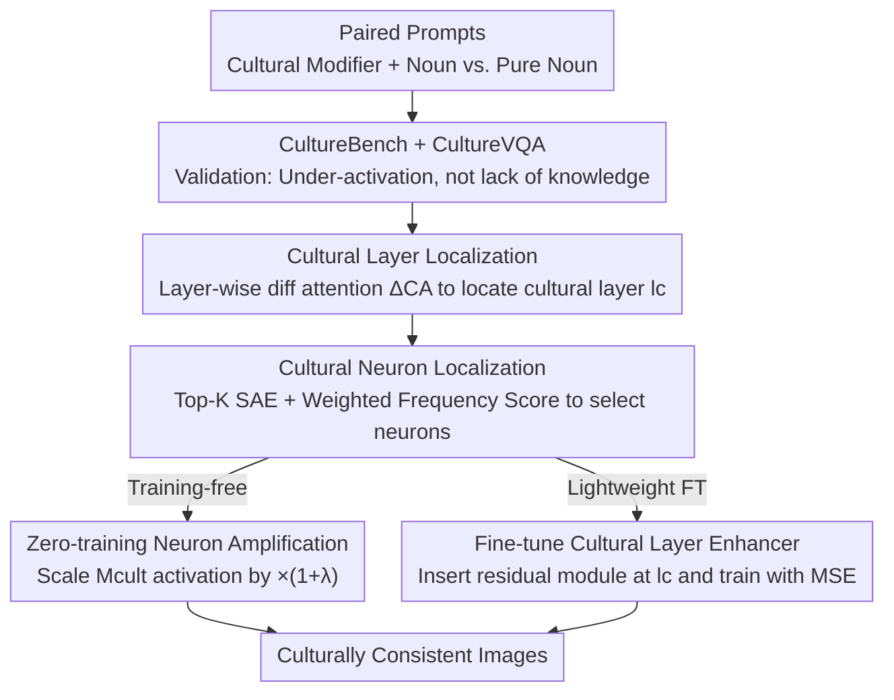

# Where Culture Fades: Revealing the Cultural Gap in Text-to-Image Generation

**Conference**: CVPR 2026  
**Paper**: [CVF Open Access](https://openaccess.thecvf.com/content/CVPR2026/html/Shi_Where_Culture_Fades_Revealing_the_Cultural_Gap_in_Text-to-Image_Generation_CVPR_2026_paper.html)  
**Code**: None  
**Area**: Interpretability / Text-to-Image Generation / Cultural Alignment  
**Keywords**: Cultural Consistency, Neuronal Interpretability, Sparse Autoencoders, Multilingual T2I, CultureBench

## TL;DR
The authors observe that multilingual text-to-image (T2I) models generate culturally neutral or Anglo-centric images when prompted with only nouns. Through attention and sparse autoencoder (SAE) probing, they demonstrate that this is a case of "under-activation" rather than a "lack of knowledge"—cultural signals are actually concentrated in only a few layers and a few specific neurons of the text encoder. Based on this, they propose two lightweight solutions: a training-free amplification of these neurons and fine-tuning only the cultural layer. On their self-constructed 15-country benchmark CultureBench, they improve the culture recognition accuracy (CultureVQA) from ~22% to 36.6%.

## Background & Motivation
**Background**: Multilingual text-to-image (T2I) models have experienced rapid progress in visual realism and semantic alignment and are widely used. Language naturally carries cultural connotations; ideally, prompting with synonymous prompts in different languages should generate images that reflect the cultural context corresponding to each language (cross-lingual cultural consistency).

**Limitations of Prior Work**: In practice, when prompted with non-English inputs, prevailing models (such as StableDiffusion XL/3.5, FLUX, AltDiffusion, and PEA-Diffusion) often generate "culturally neutral" or implicitly Anglo-centric images. For example, when using Portuguese or Turkish to prompt "a traditional building", the model only captures the literal meaning and generates a generic building, losing the cultural characteristics associated with that language. In contrast, LLMs and recommendation systems can provide culturally authentic responses to localized inputs, indicating that this cultural grounding gap is unique to the T2I modality.

**Key Challenge**: Prior works focus either on cross-lingual encoder alignment (mapping different languages to the same semantic space) or on debiasing/fairness. However, none address a more fundamental question: is this cultural deficiency because the model "does not know" (lack of cultural knowledge in the training corpus), or "knows but is not triggered" (knowledge is present but under-activated)? Furthermore, it remains unknown **where** the culture-sensitive features are hidden in the network and whether they can be controlled at the layer or neuron level.

**Goal**: (1) Provide a quantifiable definition and evaluation of "cross-lingual cultural consistency"; (2) validate the hypothesis of "under-activation rather than a lack of knowledge"; (3) locate the physical positions of cultural signals within the model; and (4) propose lightweight intervention methods that do not require large-scale retraining.

**Key Insight**: The authors observe a crucial phenomenon: simply appending "cultural style modifiers" (e.g., "a person wearing Chinese clothing" or "an Italian building") before the nouns immediately triggers the model to generate images with distinct national characteristics (see Figure 1b in the paper). This indicates that cultural knowledge is already present in the model, but prompted "nouns alone" fail to strongly trigger it. Since modifiers can awaken cultural semantics, cultural semantics must correspond to certain internally enhanceable representation units of the model.

**Core Idea**: By treating the controlled prompt pairs of "modifier vs. pure noun" as probes, the authors compare the internal attention and neuron activation differences to **locate** culture-sensitive layers and neurons. Direct amplification or fine-tuning of this tiny subset of units can restore cultural consistency without altering the backbone or retraining.

## Method

### Overall Architecture
The overall workflow consists of three connected stages: first, **constructing the benchmark and validating the hypothesis** (CultureBench + CultureVQA to prove "under-activation"); second, **using a two-stage probing to locate** the physical positions of cultural signals (first locating the culture-sensitive layer, then locating cultural neurons within that layer); and finally, proposing two **lightweight interventions** based on the localization results (training-free amplification and fine-tuning the cultural layer). The core target of the method is the text encoder. In the probing stage, paired prompts of "cultural modifier + noun" and "pure noun" are used to compare attention distributions layer by layer to identify the "cultural layer" $l_c$ with the largest discrepancy. Then, a Top-K Sparse Autoencoder (SAE) is applied in this layer to decompose attention features into sparse neurons, and a weighted frequency score is used to select the truly culture-sensitive neuron subset $\mathcal{M}_{cult}$. During the intervention stage, the activations of $\mathcal{M}_{cult}$ are either scaled by $(1+\lambda)$ at inference, or a small residual module is inserted at $l_c$ to fine-tune only this layer.

### Key Designs

**1. CultureBench + CultureVQA: Quantifying "Cultural Consistency" via Controlled Experiments**

To investigate "why culture fades", one must first measure it. The authors manually collect 7,932 culturally representative images across 15 languages/regions (using geographical constraints and local/translated keyword searches, with manual verification of authenticity and representativeness). These are split into training, testing, and neuron-detection subsets in a 7:2:1 ratio, strictly keeping the testing and neuron-detection subsets unseen during training, hyperparameter tuning, and model selection. Each image has two descriptions: a caption with a "cultural style modifier + noun" generated by GPT5-Nano, and a human-written "pure noun" caption. Experts audit the taxonomy to retain only statistically grounded, contextually appropriate cultural cues, filtering out tenuous matches as stereotypes to avoid conflating "cultural typicality" with "stereotypes". The evaluation metric, CultureVQA, is a multiple-choice VQA: Qwen3-VL and Gemini-2.5-Flash are tasked to select a country label out of 15 possibilities or choose "unrecognizable" solely based on visual cues, without seeing the text prompt. This clever design forces the models to make localization judgments based only on the cultural clues in the image, converting "cultural authenticity" into a quantifiable and comparable metric. Results immediately confirm the hypothesis: for the same generation system, prompts with "modifier + noun" achieve much higher CultureVQA scores (AltDiffusion: 44.39, PEA-Diffusion: 35.62) than "pure noun" prompts. This trend is consistent across diffusion models with vastly different architectures, proving it is not isolated.

**2. Cultural Layer Localization: Pinpointing the Single Critical Layer via Attention Difference $\Delta\mathrm{CA}$**

Having established that "the knowledge is present but under-activated", the next step is to find which layer hosts it. The authors construct a pair of prompts for each target concept: $P_{cult}$ (noun + cultural modifier) and $P_{noun}$ (noun only), labeling the cultural modifier token as $T_{cult}$ and the target noun token as $T_{noun}$. At layer $l$, the multi-head attention $A(l)\in\mathbb{R}^{B\times H\times S\times S}$ is extracted. They first compute the head average $\bar{A}(l)=\frac{1}{H}\sum_h A_h(l)$ for robustness, then retain only the attention from the modifier tokens to the noun tokens. The attention intensity directed from the cultural modifier to the target noun at this layer is defined as:

$$\mathrm{CA}(P, l) = \frac{\sum_{t_{cult}}\sum_{t_{noun}} \bar{A}_{key}(l)_{\,t_{cult}\to t_{noun}}}{|T_{cult}|\cdot|T_{noun}|}.$$

The intuition is that if layer $l$ indeed encodes cultural semantics, the attention from "modifier $\to$ noun" under cultural prompts should be significantly higher than under pure noun prompts. Thus, the difference across $N$ prompt pairs is computed as:

$$\Delta\mathrm{CA}(l) = \frac{1}{N}\sum_{i=1}^{N}\big[\mathrm{CA}(P_{cult,i}, l) - \mathrm{CA}(P_{noun,i}, l)\big].$$

A larger $\Delta\mathrm{CA}(l)$ indicates that the layer is more capable of separating cultural modifier and pure noun semantics. The authors compute $\Delta\mathrm{CA}$ across prompt pairs and random seeds, marking a layer as culture-sensitive when its value significantly exceeds the average of its two adjacent layers. The results (Figure 6 in the paper, PEA-Diffusion) show a clear global peak at Layer 16—indicating that cultural semantics are not uniformly scattered across the network but are **concentrated in a single critical layer**. This serves as the target for all subsequent interventions.

**3. Cultural Neuron Localization: Isolating "True Cultural" Neurons via Top-K SAE & Weighted Frequency Score**

Locking onto a single layer is not fine-grained enough; the authors aim to identify the specific neurons responsible for culture within that layer. They apply a Top-K Sparse Autoencoder (SAE) to the attention features of the critical layer to disentangle the internal representations into independent, semantically coherent sparse neurons. From this layer, they extract cultural features $F_{cult}$ and noun features $F_{noun}$ (with feature dimensions $D_{att}=|T_{cult}|\times|T_{noun}|$) and employ a "weighted frequency score" to capture both the **activation frequency** and **response magnitude** of the neurons. The activation frequency is the proportion of samples exceeding a threshold $\epsilon$:

$$f_{cult}(m) = \frac{1}{N_{cult}}\sum_{i=1}^{N_{cult}} \mathbb{I}\big(Z_{cult}[i,m] > \epsilon\big),$$

and the average activation magnitude is (where $\beta$ is a small constant to prevent division by zero):

$$\mu_{cult}(m) = \frac{\sum_{i=1}^{N_{cult}} Z_{cult}[i,m]\cdot \mathbb{I}(Z_{cult}[i,m]>\epsilon)}{\sum_{i=1}^{N_{cult}} \mathbb{I}(Z_{cult}[i,m]>\epsilon) + \beta},$$

Multiplying the two yields the weighted frequency score $\mathrm{WFS}_{cult}(m)=f_{cult}(m)\cdot\mu_{cult}(m)$. The noun-side score $\mathrm{WFS}_{noun}$ is calculated similarly. Neurons are sorted by $\mathrm{WFS}_{cult}$ to obtain the Top-K candidates, and **neurons that are also highly active on the noun side are filtered out**. The remaining ones are identified as culture-sensitive neurons—this step ensures the selection of "culture-exclusive" units rather than generic units activated by any noun. Here, $K$ adaptively matches the number of prominent peaks. The authors also observe (Figure 7 in the paper) that peak neuron indices for different cultures do not overlap, indicating that distinct cultures are carried by different neurons. To validate the localization accuracy, they conduct three controlled control groups (Table 1 in the paper): after masking the Top-K cultural neurons, CultureVQA plunges from 35.62 to 7.65 (-27.97), whereas masking the same number of random neurons only drops the score to 33.04 (-2.58). This "precision strike"-like collapse occurring only when the identified neurons are masked strongly proves the causal effectiveness of the localization.

**4. Two Lightweight Interventions: Zero-Training Neuron Amplification & Fine-tuning Cultural Layer Enhancer**

Once localization is complete, direct intervention can be applied. The first approach is **zero-training neuron amplification**: the attention-related features to be intervened $F_{raw}$ are fed into the SAE encoder to obtain the sparse latent vector $Z_{raw}=\mathrm{SAE.encode}(F_{raw})$. The dimensions belonging to the cultural neuron set $\mathcal{M}_{cult}$ are multiplied by an amplification factor:

$$Z_{enh}[b,p,m] = \begin{cases}(1+\lambda)\,Z_{raw}[b,p,m], & m\in\mathcal{M}_{cult}\\ Z_{raw}[b,p,m], & \text{otherwise}\end{cases}$$

This is then decoded back to the attention space: $F_{rec\_enh}=\mathrm{SAE.decode}(Z_{enh})$. This approach leaves the backbone entirely untouched and requires no training, relying on a manually selected $\lambda$ to control cultural intensity, enhancing cultural attention patterns while preserving the original semantic structure. The second approach is **fine-tuning a cultural layer enhancer** to eliminate the need for manual $\lambda$ tuning. A small trainable residual module is inserted only at the cultural layer $l_c$:

$$\tilde{h} = h + g\big(W_2\,\sigma(W_1 h)\big),$$

where $\sigma$ is a non-linear activation function, $g$ is a normalization operation to stabilize the residual, and $W_1, W_2$ are small matrices, with all other parameters frozen. During training, given a "pure noun" prompt $p$, the generated image $\hat{x}=G(f_{\theta,\phi}(p))$ is compared with the corresponding manual cultural reference image $x^*(p)$ in CultureBench using a pixel-level MSE loss, optimizing only the enhancer parameters: $\phi^*=\arg\min_\phi \mathcal{L}_{MSE}$. Both methods follow the philosophy of "only modifying culture-related units while leaving the backbone untouched": the former is plug-and-play at zero cost, while the latter exchanges a minimal amount of training for adaptive, manual-tuning-free strength.

### Loss & Training
Fine-tuning the enhancer relies solely on pixel-level MSE loss: $\mathcal{L}_{MSE}=\frac{1}{N}\sum_i\lVert \hat{x}_i - x^*_i(p)\rVert_2^2$, optimizing only the enhancer parameters. Hyperparameters: AdamW, learning rate $5\times10^{-5}$, batch size 1, mixed-precision training for 2000 steps on a single A6000 GPU. The zero-training variant sets $\lambda=6$ (⚠️ Note: In the hyperparameter analysis, CultureVQA peaks at 35.92 when $\lambda=7$, and the main text also states "select λ = 7", which is inconsistent with the $\lambda=6$ in implementation details; refer to the original paper).

## Key Experimental Results

### Main Results
Using "pure noun" prompts on the CultureBench test set to compare with various SOTA baselines (higher CultureVQA, CLIPScore, and ImageReward is better; lower LPIPS is better):

| Method | CultureVQA ↑ | CLIPScore ↑ | ImageReward ↑ | LPIPS ↓ |
|------|------|------|------|------|
| StableDiffusion XL | 9.36 | 0.211 | -1.82 | 0.756 |
| FLUX.1-dev | 14.83 | 0.224 | -0.88 | 0.692 |
| Show-o2 | 16.43 | 0.234 | -0.91 | 0.691 |
| PEA-Diffusion | 21.65 | 0.253 | -0.65 | 0.673 |
| AltDiffusion | 23.05 | 0.282 | -0.11 | 0.688 |
| StableDiffusion 3.5 | 25.13 | 0.242 | -1.01 | 0.715 |
| **Ours (Zero-training)** | 33.91 (+12.32) | **0.291** (+0.038) | **0.33** (+0.98) | **0.654** |
| **Ours (Fine-tuning)** | **36.63** (+14.98) | 0.290 | 0.31 | 0.661 |

The culture recognition accuracy achieves a substantial lead (36.63 for the fine-tuned version vs. 23.05 for the second-best AltDiffusion), while CLIPScore, ImageReward, and LPIPS remain the best or highly competitive. This demonstrates that restoring cultural fidelity does not sacrifice semantic alignment or visual quality.

### Ablation Study

| Model | Method | CultureVQA ↑ |
|------|------|------|
| AltDiffusion | w/o Ours | 23.05 |
| AltDiffusion | w/ Random (Zero-training) | 20.38 (-2.67) |
| AltDiffusion | w/ Ours (Zero-training) | 30.06 (+7.01) |
| AltDiffusion | w/ Random (Fine-tuning) | 21.04 (-2.01) |
| AltDiffusion | w/ Ours (Fine-tuning) | 32.66 (+9.61) |
| PEA-Diffusion | w/o Ours | 21.65 |
| PEA-Diffusion | w/ Random (Zero-training) | 21.04 (-0.61) |
| PEA-Diffusion | w/ Ours (Zero-training) | 33.91 (+12.26) |
| PEA-Diffusion | w/ Random (Fine-tuning) | 22.34 (+0.69) |
| PEA-Diffusion | w/ Ours (Fine-tuning) | 36.63 (+14.98) |

There is also neuron localization validation (Table 1): masking Top-K cultural neurons results in a CultureVQA drop from 35.62 to 7.65 (-27.97), whereas random masking only leads to 33.04 (-2.58).

### Key Findings
- **Localization accuracy is the core of the entire work**: Masking the identified cultural neurons almost collapses the CultureVQA (-27.97), while random masking has negligible impact (-2.58). This sharp contrast serves as the solidest evidence for both the "under-activation" hypothesis and the localization method.
- **Random activation/random fine-tuning is practically useless or even detrimental** (e.g., random zero-training decreases performance by -2.67 / -0.61 on two models), proving that gains stem from **targeted** interventions on cultural neurons rather than arbitrary perturbations.
- **Cross-architecture generalization**: Consistent improvements are observed across two structurally distinct diffusion models, AltDiffusion and PEA-Diffusion, showing that the probe-and-enhance framework is not bound to a specific model.
- **$\lambda$ has a sweet spot**: When $\lambda=0$, the output is identical to the original image. As $\lambda$ increases, the output aligns closer with the target cultural prototype. CultureVQA peaks at 35.92 with $\lambda=7$, and slightly decreases to 32.61 at $\lambda=8$—excessive strength can lead to overfitting and harm metrics.

## Highlights & Insights
- **Transforming "why culture fades" from a philosophical concern into an anatomical engineering problem**: By using "modifier vs. pure noun" as minimalist controlled prompt probes, the authors cleanly decouple "lack of knowledge" from "under-activation". This approach is highly transferable—any scenario where a model seemingly "lacks a capability" can adopt this controlled design to check if it represents "inability" or simply "non-triggering".
- **Two-stage localization (layer to neuron) + causal ablation closed-loop**: Finding the layer via $\Delta\mathrm{CA}$, pinpointing neurons via Top-K SAE, and proving causality via masking experiments forms a highly consistent and reproducible research pipeline. Leveraging SAE to disentangle attention features and discover "culture-exclusive neurons" is an elegant interpretability application.
- **Lightweight, plug-and-play intervention**: The zero-training version is entirely non-invasive and adjustable via a single coefficient; the fine-tuned version only trains a tiny residual module in one layer (taking only 2000 steps on a single A6000), making it highly friendly for industrial deployment and a strong demonstration of the "interpret first, intervene later" paradigm.
- **Transferable trick**: Filtering out neurons that are also highly active on the noun side ensures that only culture-exclusive units are selected. This "contrastive-de-generalization" selection strategy can be generalized to the precise localization of any conceptual neurons.

## Limitations & Future Work
- **CultureVQA relies on VLMs as evaluators**: Utilizing Qwen3-VL / Gemini for cultural attribution judgments aligned closely with human annotations, but the inherent cultural biases of VLMs might leak into the evaluation. Moreover, the boundary between "cultural typicality" and "stereotypes" is defined by experts, still carrying some subjectivity.
- **Coverage limited to 15 languages/regions**: This is still relatively small compared to global cultural diversity. Low-resource languages and intra-cultural variations (e.g., different regions/ethnic groups within the same country) are not fully addressed.
- **Inconsistency in hyperparameter $\lambda$**: The implementation details state $\lambda=6$, while the hyperparameter analysis and main text refer to $\lambda=7$, causing a minor discrepancy. Furthermore, $\lambda$ must be hand-tuned; excessive values pose overfitting risks, making the stability of the zero-training variant somewhat empirical.
- **Interventions confined to the text encoder**: The method assumes that cultural signals are concentrated in a single critical layer of the text encoder. It does not explore whether internal culture representations can be located within the UNet/diffusion backbone, leaving joint cross-module intervention as a potential direction.
- **Overly rigid pixel-level MSE supervision**: Fine-tuning with pixel-level MSE between pure noun generations and manual cultural reference images may excessively constrain image composition; employing perceptual or feature-level losses might offer more flexibility.

## Related Work & Insights
- **vs. SCoFT / ViSAGe (cultural fairness)**: These works expand cultural coverage and quantify visual stereotypes to focus on "debiasing". In contrast, this paper reformulates the issue as "cross-lingual cultural consistency" and localizes its internal mechanism, shifting the goal from "preventing bias" to "actively evoking suppressed cultural representations".
- **vs. PEA-Diffusion / AltDiffusion (cross-lingual encoder alignment)**: These works align different languages into a shared semantic space but neglect "cross-lingual cultural grounding". This paper points out that aligning to a unified semantic space can actually smooth out cultural nuances, and suggests that culture-exclusive signals should be preserved and enhanced at the neuron level.
- **vs. FEMN and other neuronal interpretability works**: FEMN localizes object/attribute-level conceptual neurons (e.g., "smile", "stripes") in CLIP and performs causal manipulation. This work **first systematically applies this neuronal causal probing to "culture", an abstract concept that shifts with multilingual prompts**, and implements it in controllable generation, extending the frontier of conceptual neuron research.

## Rating
- Novelty: ⭐⭐⭐⭐⭐ Reformulates the "cultural consistency" issue as an "under-activation" problem, and offers interpretable localization + lightweight intervention via layer/neuron probes, presenting a highly novel perspective and methodology.
- Experimental Thoroughness: ⭐⭐⭐⭐ Self-constructed benchmark + validation across two different architectures + causal masking ablation + hyperparameter analysis make for a solid closed-loop; however, benchmarking against only PEA/Alt baselines and 15 countries is relatively small in scale.
- Writing Quality: ⭐⭐⭐⭐ The logical flow of hypothesis-validation-localization-intervention is clear, and equations are comprehensive. The slight inconsistency regarding the value of $\lambda$ is a minor flaw.
- Value: ⭐⭐⭐⭐⭐ Provides both a diagnostic tool and a reusable benchmark for cultural inclusivity in generative AI, while showcasing a practical paradigm of "interpretability-guided lightweight intervention".

<!-- RELATED:START -->

## Related Papers

- [\[ACL 2026\] Follow the Flow: On Information Flow Across Textual Tokens in Text-to-Image Models](../../ACL2026/interpretability/follow_the_flow_on_information_flow_across_textual_tokens_in_text-to-image_model.md)
- [\[NeurIPS 2025\] AgentiQL: An Agent-Inspired Multi-Expert Framework for Text-to-SQL Generation](../../NeurIPS2025/interpretability/agentiql_an_agent-inspired_multi-expert_framework_for_text-to-sql_generation.md)
- [\[CVPR 2026\] HUMORCHAIN: Theory-Guided Multi-Stage Reasoning for Interpretable Multimodal Humor Generation](humorchain_theory-guided_multi-stage_reasoning_for_interpretable_multimodal_humo.md)
- [\[ICLR 2026\] Toward Faithful Retrieval-Augmented Generation with Sparse Autoencoders](../../ICLR2026/interpretability/toward_faithful_retrieval-augmented_generation_with_sparse_autoencoders.md)
- [\[CVPR 2026\] Hierarchical Concept Embedding & Pursuit for Interpretable Image Classification](hierarchical_concept_embedding_pursuit_for_interpretable_image_classification.md)

<!-- RELATED:END -->
