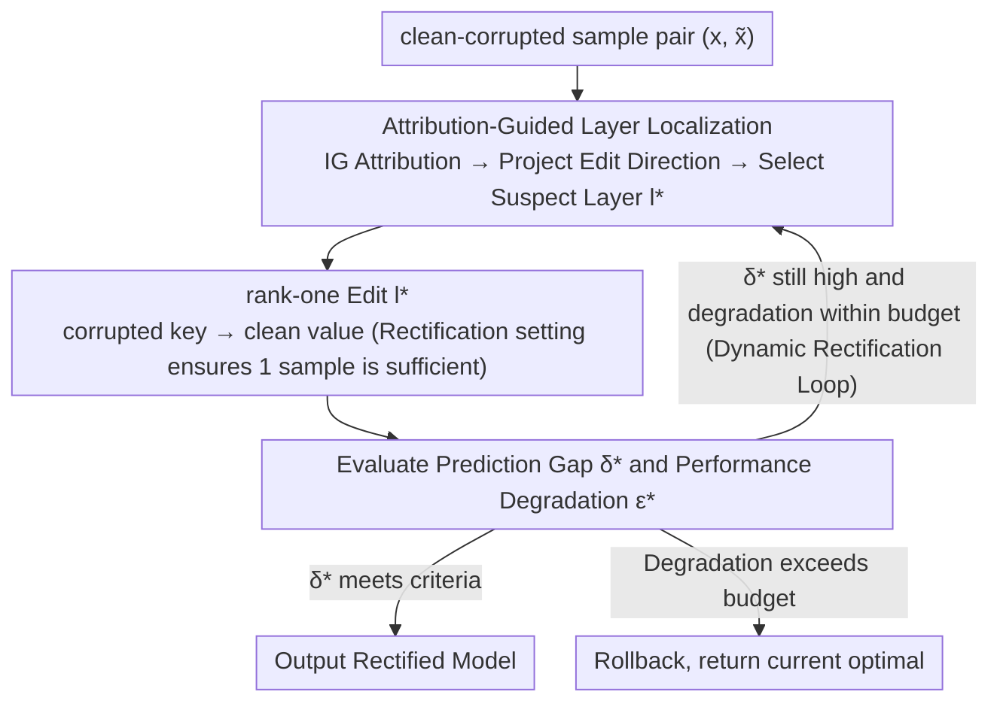

# Attribution-Guided Model Rectification of Unreliable Neural Network Behaviors

**Conference**: CVPR 2026  
**arXiv**: [2603.15656](https://arxiv.org/abs/2603.15656)  
**Code**: None  
**Area**: Knowledge Editing  
**Keywords**: rank-one model editing, attribution analysis, backdoor defense, spurious correlation, model rectification

## TL;DR
This paper proposes an attribution-guided dynamic model rectification framework that repositions rank-one model editing from domain adaptation to behavior rectification. By quantifying layer editability via Integrated Gradients to automatically locate suspect layers, it repairs three types of unreliable behaviors—backdoor attacks, spurious correlations, and feature leakage—using only a single clean sample.

## Background & Motivation

**Background**: Neural networks exhibit unreliable behaviors when facing distribution inconsistencies, including neural Trojans (backdoor triggers), spurious correlations, and feature leakage. These issues severely hinder model deployment in safety-critical scenarios.

**Limitations of Prior Work**: Mainstream repair strategies rely on data cleaning combined with model retraining, which incurs massive computational and manual costs. While rank-one model editing has demonstrated knowledge editing capabilities in generative/discriminative models, two structural bottlenecks emerge when applied to domain adaptation: (1) out-of-span residuals—where a new key $k^*$ falls outside the training key span, disrupting existing associations (Lemma 1); (2) sample complexity—requiring a large number of samples to accurately estimate keys under distribution shifts (Lemma 2).

**Key Challenge**: Existing model editing methods are typically fixed to the last feature layer (assuming it encodes high-level semantics). However, experiments show that editability varies significantly across layers—ranking differences after rectifying can vary several-fold across ResNet-18 layers (Fig. 2), and no single layer is universally optimal.

**Goal**: (1) Repair unreliable model behaviors under data-efficient conditions (even with only 1 clean sample); (2) automatically locate the most critical layers causing unreliable behaviors instead of manually specifying fixed layers.

**Key Insight**: This work repositions rank-one editing from "domain adaptation" to "behavior rectification." It leverages the structural property of clean-corrupted pairs encountered during model training to bypass the theoretical bottlenecks of standard editing. Attribution methods are then used to quantify layer editability as a basis for layer selection.

**Core Idea**: Integrated Gradients attribution is calculated on the corrupted→clean path for each layer and projected onto the rank-one editing direction to obtain a scalar editability score. The layer with the highest score is selected for editing, and the process is executed iteratively until behavior rectification is complete.

## Method

### Overall Architecture
This paper addresses the following problem: the model is compromised—it contains backdoor triggers, learned spurious correlations, or relies on irrelevant features—but retraining or collecting massive data is not feasible, and only one or two clean samples are available. The overall approach utilizes rank-one model editing as a "behavior rectification" tool. Instead of fixing the update to the last layer, it uses attribution to identify "which layer most needs modification," updates it, and evaluates the effect, iteratively identifying the next layer if necessary.

In each iteration, three steps are performed: Given a sample pair consisting of a corrupted sample $\tilde{x}$ and its clean counterpart $x$, Integrated Gradients are used to calculate the attribution $M^l(x, \tilde{x})$ for each layer relative to the transition from "bad behavior" to "good behavior." This attribution is then projected onto the rank-one editing direction and compressed into a scalar editability score $\hat{G}_l = \|M^{*,l}\|_F$. The layer with the highest score $l^* = \arg\max_l \hat{G}_l$ is identified as the "suspect layer." Finally, a rank-one weight update is performed on $l^*$ to embed the new "corrupted key → clean value" association. This process is wrapped in a while loop: re-locating and re-editing in each round until the prediction gap $\delta^*$ between corrupted and clean samples falls below a threshold, or the cumulative performance degradation reaches a budget $\epsilon$.

### Key Designs

**1. Theoretical Advantage of the Rectification Setting: Why "1 Sample is Enough" is not Luck (Rectifiability & Span-Aligned Control)**

Directly transferring rank-one editing to domain adaptation under distribution shift hits two walls: the new key $k^*$ falls outside the span of training keys, leading to out-of-span residuals that disrupt original key-value associations (Lemma 1); and distribution shifts require many samples to accurately estimate the key (Lemma 2). The key observation is that "behavior rectification" naturally avoids these issues. Since the model has **already seen** clean and corrupted samples during training, the corrupted key $k^*$ naturally falls within the span of training keys (Proposition 4.1, Rectifiability), eliminating out-of-span residuals and preserving existing associations. Furthermore, because of paired supervision (clean-corrupted), key estimation error tends toward zero, removing the need for high sample counts (Proposition 4.2, Span-Aligned Control). These propositions provide the structural theoretical support for "repair using only 1 clean sample"—repositioning the task as behavior rectification bypasses the standard bottlenecks fundamentally.

**2. Attribution-Guided Layer Localization: Asking "Which layer is most effective to change" (Attribution-Guided Layer Localization)**

Older methods fix editing to the last layer, assuming it encodes high-level semantics. However, layer-by-layer rectification on ResNet-18 reveals that editability can vary by multiples, with no universally optimal layer (Fig. 2). To automate layer selection, the first step is measuring each layer's contribution to the bad behavior: using the corrupted $\tilde{x}$ as a reference and the clean $x$ as input, the IG attribution is calculated as $M^l_i(x, \tilde{x}) = (f_l(x_i) - f_l(\tilde{x}_i)) \cdot \int_0^1 \frac{\partial f(\hat{x})}{\partial f_l(\hat{x}_i)} \, d\alpha$. The Completeness axiom (Lemma 3: the sum of attributions across layers equals the output change $f(x)-f(\tilde{x})$) allows for cross-layer comparisons. However, attribution magnitude alone only indicates "how important a layer is to the bad behavior," not the "effectiveness of editing that layer." Thus, the attribution is projected onto the actual editing direction:

$$M^{*,l} = M^l \cdot (C^{-1}k^*)^T$$

The Frobenius norm of this projection is used as the editability score. This "attribution × edit direction" intersection is the key signal—it directly corresponds to the first-order descent coefficient $G_l$, representing the rate at which the bad behavior metric decreases when moving along that edit direction. Selecting the highest score is equivalent to selecting the layer with the "maximum single-step gain."

**3. Dynamic Model Rectification Framework: Surfacing Bottlenecks Layer-by-Layer (Algorithm 1)**

Editing a single layer is often insufficient. After modifying one layer, the model's overall state changes, and layers previously ranked second or third may become the new primary bottlenecks. Consequently, instead of a one-time operation, localization and editing are placed in a while loop. Each round checks if the prediction gap $\delta^* = f(x) - f(\tilde{x})$ exceeds target $\delta$ and if cumulative performance degradation $\epsilon^*$ is within budget. If so, Design 2 re-locates the suspect layer, performs $T$ epochs of rank-one editing, and evaluates the result. If degradation is acceptable, the edit is kept for the next round; otherwise, it is rolled back. This allows the multi-layer repair path to be "gradually explored" rather than pre-specified. The dynamic version is more stable across all scenarios than the static version (CIFAR-10 Backdoor, $n=1$: ASR 2.57→1.34, OA 92.93→93.65).

### Loss & Training
The individual rank-one edit targeting a constrained least-squares problem: $\min_\Lambda \|v^* - f_l(k^*; W')\|$ under the constraint $W' = W + \Lambda(C^{-1}k^*)^T$. Here $k^*$ is the feature key of the corrupted sample in that layer, $v^*$ is the desired clean output value, and $C = KK^T$ is the second-moment statistic of the training keys. The update is an outer product of two vectors, making it strictly rank-one with a closed-form solution, which is the source of its data efficiency and low overhead. In the dynamic framework, after $T$ epochs per round, the performance degradation $\zeta$ is measured to decide whether to retain or rollback the update.

## Key Experimental Results

### Main Results

**Table 1: Backdoor Attack Repair (CIFAR-10 & ImageNet)**

| Method | # Samples | CIFAR-10 OA↑ | CIFAR-10 ASR↓ | ImageNet OA↑ | ImageNet ASR↓ |
|------|:---:|:---:|:---:|:---:|:---:|
| Trojaned model | - | 93.67 | 99.94 | 69.05 | 87.24 |
| Fine-tune | 1 | 90.83 | 73.07 | 65.95 | 79.91 |
| Fine-tune | 20 | 91.58 | 13.22 | 68.42 | 21.86 |
| P-ClArC | 20 | 89.97 | 6.21 | 65.42 | 8.09 |
| A-ClArC | 20 | 92.53 | 6.32 | 67.17 | 8.73 |
| Stat. rectifying | 1 | 92.93 | 2.57 | 67.87 | 3.01 |
| **Dyn. rectifying** | **1** | **93.65** | **1.34** | 66.77 | **1.61** |
| **Dyn. rectifying** | **20** | **93.61** | **0.26** | **68.84** | **0.12** |

**Table 4: Spurious Correlation Mitigation (CIFAR-10 & ImageNet, Spurious column represents relative bias to Clean ↓)**

| Method | # Samples | CIFAR-10 Overall↑ | Clean↑ | Spurious Bias↓ | ImageNet Overall↑ | Clean↑ | Spurious Bias↓ |
|------|:---:|:---:|:---:|:---:|:---:|:---:|:---:|
| Benign model | - | 94.00 | 94.42 | +5.58 | 69.04 | 81.25 | +10.41 |
| A-ClArC | 20 | 92.41 | 76.77 | +2.57 | 67.01 | 75.66 | +6.59 |
| P-ClArC | 20 | 88.29 | 16.89 | +0.23 | 66.84 | 8.32 | +2.59 |
| **Dyn. rectifying** | **1** | 92.93 | 94.29 | **+1.86** | 67.50 | 81.66 | **+4.17** |
| **Dyn. rectifying** | **20** | **93.99** | 94.30 | **+0.12** | **68.94** | 81.25 | **+2.08** |

**Table 5: Feature Leakage Mitigation (BlockMNIST)**

| Method | # Samples | Accuracy↑ | Feature Leakage↓ |
|------|:---:|:---:|:---:|
| Benign model | - | 99.17 | 3.597 |
| IG-SUM Reg | - | 94.14 | 3.417 |
| Fine-tune | 20 | 98.67 | 2.929 |
| Stat. rectifying | 1 | 98.97 | 2.655 |
| **Dyn. rectifying** | **1** | **99.03** | **2.417** |

### Ablation Study

**Static vs Dynamic Rectification (CIFAR-10 Backdoor, $n=1$)**

| Config | OA↑ | ASR↓ | Description |
|------|:---:|:---:|------|
| Patched model (n=20) | 89.70 | 12.19 | Neuron pruning, OA loss |
| Static rectifying (n=1) | 92.93 | 2.57 | Edit last layer only |
| **Dynamic rectifying (n=1)** | **93.65** | **1.34** | Attribution localization + Iterative editing |

### Key Findings
- **Extreme Data Efficiency**: With only 1 clean sample, dynamic rectification reduces ASR from 99.94% to 1.34% on CIFAR-10 while keeping OA nearly constant (93.67→93.65).
- **Dynamic Superiority**: Dynamic rectification consistently outperforms static rectification (last-layer only) across all scenarios, validating the necessity of attribution-guided localization.
- **Cross-Trigger Generalization**: Repairing with triggers of specific visibility/locations generalizes well to others (visibility 0.3-1.0; locations TL/C/BL/BR).
- **Unified Effectiveness**: The same framework performs exceptionally across backdoors, spurious correlations, and feature leakage, demonstrating robust generalization.
- **Real-world Validation**: On the ISIC skin lesion dataset, 10 manual clean samples reduced spurious bias from +26.00 to +1.50, far exceeding A-ClArC and fine-tuning.
- **Cost of P-ClArC**: While P-ClArC reduces spurious bias, it causes Clean accuracy to collapse (94.42→16.89 on CIFAR-10), an issue absent in Ours.

## Highlights & Insights
- **Theoretical-Empirical Loop**: Propositions for Rectifiability and Span-Aligned Control rigorously prove why 1 sample is sufficient—corrupted keys exist within the training span (no residual) and paired supervision eliminates estimation error.
- **"Attribution × Edit Direction" Signal**: Instead of using raw attribution (importance), projecting onto the rank-one direction measures "how much unreliability can be reduced by editing this layer"—aligning intuition with first-order descent coefficients.
- **No Inference Overhead**: Unlike P-ClArC/A-ClArC which add artifact modules, this method directly edits weights, leaving model architecture and inference cost unchanged.
- **Explainability Evidence**: IG heatmaps on BlockMNIST show that the benign model attributes to null patches (leakage), while the rectified model concentrates attribution on the digit region (Fig. 5).

## Limitations & Future Work
- **Paired Data Requirement**: Rectification assumes the corrupted sample is known and its clean version is available; practical use might require prior backdoor detection steps.
- **Linear Association Assumption**: Rank-one editing treats layers as linear associative memories, which may be less accurate for highly nonlinear layers.
- **Task Scope**: Applicability to object detection, segmentation, or generation has not been explored.
- **Large Model Scale**: Experiments focus on ResNet-18/EfficientNet-B4; effectiveness on ViT/LLM scales remains to be verified.

## Related Work & Insights
- **vs ROME/MEMIT**: While ROME edits LLM factual knowledge, this work adapts rank-one editing to behavior rectification in discriminative models.
- **vs P-ClArC/A-ClArC**: They patch models by adding artifact modules; Ours edits weights directly—removing inference overhead and requiring fewer samples.
- **vs Fine-tuning**: Fine-tuning with $n=1$ leaves ASR at 73%; with $n=20$, OA drops significantly. Rank-one editing is more precise and preserves OA better.

## Rating
- Novelty: ⭐⭐⭐⭐ 
- Experimental Thoroughness: ⭐⭐⭐⭐⭐ 
- Writing Quality: ⭐⭐⭐⭐ 
- Value: ⭐⭐⭐⭐

## Related Papers

- [\[ACL 2025\] ChainEdit: Propagating Ripple Effects in LLM Knowledge Editing through Logical Rule-Guided Chains](../../ACL2025/knowledge_editing/chainedit_propagating_ripple_effects_in_llm.md)
- [\[CVPR 2026\] SAME: Sparse and Anchored Model Editing for Heterogeneous Incremental Learning under Limited Data](same_sparse_and_anchored_model_editing_for_heterogeneous_incremental_learning_un.md)
- [\[ICLR 2026\] Fine-tuning Done Right in Model Editing](../../ICLR2026/knowledge_editing/fine-tuning_done_right_in_model_editing.md)
- [\[ICML 2026\] Reverse-Engineering Model Editing on Language Models](../../ICML2026/knowledge_editing/reverse-engineering_model_editing_on_language_models.md)
- [\[ICLR 2026\] Energy-Regularized Sequential Model Editing on Hyperspheres](../../ICLR2026/knowledge_editing/energy-regularized_sequential_model_editing_on_hyperspheres.md)

<!-- RELATED:END -->

<!-- RELATED:START -->

## Related Papers

- [\[ICLR 2026\] ACE: Attribution-Controlled Knowledge Editing for Multi-hop Factual Recall](../../ICLR2026/knowledge_editing/ace_attribution-controlled_knowledge_editing_for_multi-hop_factual_recall.md)
- [\[ICLR 2026\] Scaling Knowledge Editing in LLMs to 100,000 Facts with Neural KV Database](../../ICLR2026/knowledge_editing/scaling_knowledge_editing_in_llms_to_100000_facts_with_neural_kv_database.md)
- [\[ICLR 2026\] TangleScore: Tangle-Guided Purge and Imprint for Unstructured Knowledge Editing](../../ICLR2026/knowledge_editing/tanglescore_tangle-guided_purge_and_imprint_for_unstructured_knowledge_editing.md)
- [\[ACL 2025\] ChainEdit: Propagating Ripple Effects in LLM Knowledge Editing through Logical Rule-Guided Chains](../../ACL2025/knowledge_editing/chainedit_propagating_ripple_effects_in_llm.md)
- [\[CVPR 2026\] SAME: Sparse and Anchored Model Editing for Heterogeneous Incremental Learning under Limited Data](same_sparse_and_anchored_model_editing_for_heterogeneous_incremental_learning_un.md)

<!-- RELATED:END -->
