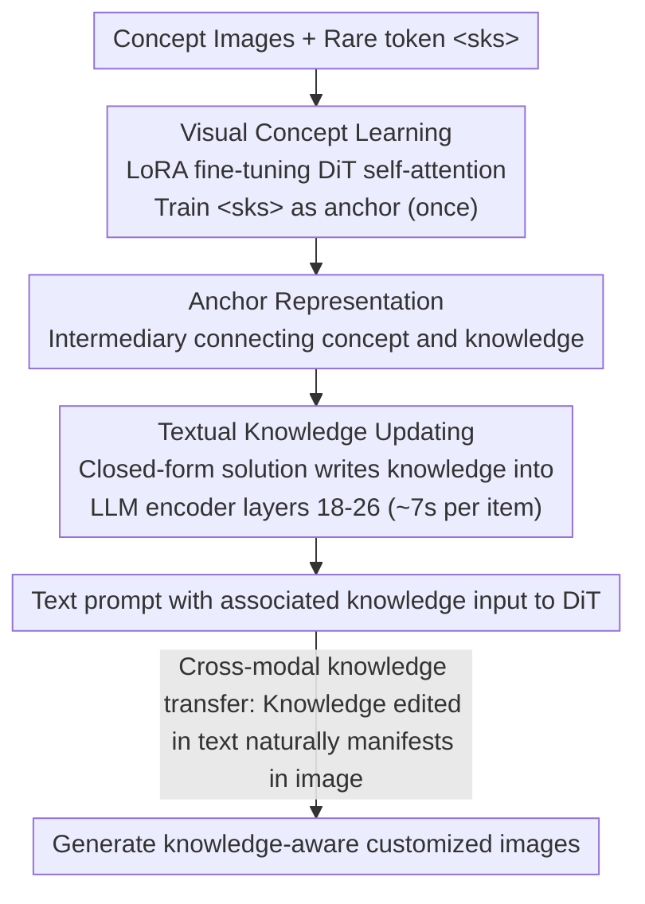

# MoKus: Leveraging Cross-Modal Knowledge Transfer for Knowledge-Aware Concept Customization

**Conference**: CVPR 2026  
**arXiv**: [2603.12743](https://arxiv.org/abs/2603.12743)  
**Code**: None  
**Area**: Image Generation / Concept Customization / Knowledge Editing  
**Keywords**: Concept Customization, Cross-Modal Knowledge Transfer, Knowledge Editing, DiT, LLM Text Encoder  

## TL;DR
Ours proposes a new task named "Knowledge-Aware Concept Customization." It identifies that knowledge editing within LLM text encoders naturally transfers to the visual generation modality (cross-modal knowledge transfer). Based on this, the MoKus framework is proposed: it first utilizes LoRA fine-tuning to bind rare tokens as anchor representations for visual concepts, and then employs knowledge editing techniques to efficiently map multiple natural language knowledge items to these anchor representations, with each knowledge update taking approximately 7 seconds.

## Background & Motivation
**Background**: Existing concept customization methods (e.g., DreamBooth, Textual Inversion) represent target concepts using rare tokens (e.g., `<sks>`).  
**Limitations of Prior Work**: Two fundamental flaws exist: (1) **Unstable performance**—rare tokens seldom appear in pre-training data and lack a semantic foundation, leading to fluctuating generation quality when combined with normal text prompts; (2) **Knowledge-unaware**—rare tokens only encode visual appearance and cannot carry intrinsic knowledge of the concept (e.g., "Bronze statue in Copenhagen harbor" $\rightarrow$ Little Mermaid Statue), causing failure in generating knowledge-related prompts (e.g., "Little Mermaid Statue Denmark"). Encoder-based methods (e.g., IP-Adapter, BLIP-Diffusion) require large-scale data retraining to support new knowledge.

## Core Problem
How can a generative model understand "what a concept is" (visual appearance) while simultaneously understanding "what the concept represents" (associated knowledge), enabling high-fidelity customized image generation given text prompts containing that knowledge? Furthermore, as a single concept may associate with multiple pieces of knowledge (objective descriptions, subjective feelings, etc.), how can all knowledge be efficiently bound to the same concept?

## Method

### Overall Architecture
MoKus performs "knowledge-aware concept customization"—ensuring the model remembers the appearance of a concept while understanding its underlying knowledge. Built upon an LLM text encoder + DiT backbone (Qwen-Image), it operates in two stages: Phase 1, Visual Concept Learning, uses LoRA fine-tuning on the self-attention layers of the MMDIT to learn a rare token as the visual representation (anchor representation); Phase 2, Textual Knowledge Updating, uses knowledge editing techniques to map natural language knowledge items into the text space of the anchor representation, completing the "knowledge $\rightarrow$ concept" binding. Visual learning occurs only once, after which each knowledge piece is updated in seconds.

### Key Designs

**1. Cross-modal Knowledge Transfer: Textual knowledge modifications manifest in images**

This is the core observation of MoKus. In text-to-image models using LLMs as text encoders, modifying internal knowledge within the LLM via knowledge editing (e.g., changing "Beethoven's favorite instrument" from "piano" to "guitar") results in the generated images reflecting this change (drawing a guitar instead of a piano)—meaning knowledge modifications in the text modality **naturally transfer** to visual generation. Notably, methods like GapEval or UniSandbox did not see significant transfer when directly fine-tuning the LLM encoder; MoKus demonstrates that transfer manifests when using precise knowledge editing (UltraEdit/AlphaEdit).

**2. Visual Concept Learning: Training rare tokens as "Anchor Representations"**

Generating directly from rare tokens (e.g., `<sks>`) is unstable due to their lack of semantic basis. This step uses `<sks> dog` as text input and learns the visual appearance through LoRA fine-tuning of the DiT self-attention layers. The objective is the standard Rectified Flow velocity matching loss: $\mathcal{L}(\theta_v) = \mathbb{E}[\|v_\theta(z_t, t, h) - (z_0 - z_1)\|^2]$. The fine-tuned token is used as an "anchor representation"—a mediator between concept and knowledge.

**3. Textual Knowledge Updating: Writing knowledge into encoders via closed-form solutions**

With the anchor representation, each knowledge piece $k_i$ is formulated as a question $q_i$, with the anchor $y$ as the target answer. $q_i$ is input to the LLM encoder to obtain the hidden state $h_i$ and gradient $\nabla_{\theta_t} y_i$. The update direction is calculated as $v_i = -\eta \cdot \|h_i\|^2 \cdot \nabla y_i$. A closed-form solution $\Delta\theta_t^* = (H^\top H + I)^{-1} H^\top V$ is then solved via regularized least squares to add parameter shifts to the Gate and Up Projections of the LLM encoder (layers 18–26). Since it is a closed-form solution without backpropagation, each knowledge update takes ~7s.

**4. KnowCusBench: A benchmark for the new task**

As no existing evaluation fits this task, the authors established the first knowledge-aware concept customization benchmark: 35 concepts, each with 5 knowledge items (covering personal relationships, physical attributes, functions, values, origins, and emotions), and 199 generation prompts (background change, object insertion, style transfer, attribute modification), totaling 5,975 evaluation images.

### Loss & Training
- Visual Concept Learning: Standard Rectified Flow loss, lr=2e-4, AdamW optimizer, training LoRA parameters only.
- Textual Knowledge Updating: No backpropagation; parameter shifts are computed directly via closed-form solution, scaling factor $\eta=1e-6$, batch size=1.
- Only modifies MLPs (Gate Proj + Up Proj) in layers 18-26 of the LLM encoder, totaling 16 parameter matrices.

## Key Experimental Results

| Task | Metric | MoKus | Naive-DB | Enc-FT | Description |
|--------|------|------|----------|------|------|
| Reconstruction | CLIP-I | 0.867 | 0.874 | 0.582 | Close to DB, significantly beats Enc-FT |
| Reconstruction | CLIP-I-Seg | 0.764 | 0.758 | 0.553 | Best (accurate post-segmentation eval) |
| Generation | CLIP-I-Seg | 0.718 | 0.717 | 0.562 | Best |
| Generation | CLIP-T | 0.305 | 0.291 | 0.197 | Best (prompt alignment) |
| Generation | Pick Score | 21.30 | 20.80 | 18.34 | Best (human preference) |
| Efficiency | Training Time | 6min | 27min | 10min | Most efficient |
| WISE Subset | WiScore | 1.33 | - | 0.81(baseline) | Significant gain in world knowledge |

### Ablation Study
- **Impact of Knowledge Count**: From 1 to 5 knowledge items, CLIP-I-Seg only fluctuates from 0.761 to 0.764, showing extreme stability. Training time only increases by ~7s per item (331s $\rightarrow$ 360s).
- **Scaling Factor $\eta$**: $\eta=1e-6$ is optimal. Too large ($1e-5$) shifts the encoder distribution severely, leading to generation collapse (similar to Enc-FT); too small ($1e-7$) leads to insufficient updates.
- **Layer Selection**: Modifying layers 18-26 MLP is optimal; too few layers lack update capacity, while too many interfere with pre-trained knowledge.

## Highlights & Insights
- Cross-modal knowledge transfer is a highly insightful discovery—knowledge editing, originally an NLP technique, naturally works in multimodal generation and is more effective than direct fine-tuning of the LLM encoder.
- The two-stage decoupled design is extremely efficient: Visual Concept Learning is done once (~6min), after which each new knowledge item is bound in ~7s without retraining.
- KnowCusBench standardizes evaluation with an orthogonal design across 6 knowledge perspectives and 4 prompt perspectives.
- The method naturally extends to virtual concept creation and concept erasure—controlling generation behavior by modifying knowledge answers.
- Performance gains on the WISE world knowledge benchmark suggest that knowledge updates are truly "written" into the model.

## Limitations & Future Work
- Dependency on LLMs as text encoders (e.g., Qwen-Image)—models using traditional CLIP text encoders (e.g., SD1.5/2.1) cannot use this method directly.
- Knowledge must be expressible in a "Question-Answer" format, which may be limited for abstract knowledge (e.g., subjective style preferences).
- Evaluation still relies on CLIP-based metrics, which may be insensitive to certain fine-grained visual differences.
- Currently supports only the image domain; future work includes extension to video concept customization.
- The identity matrix in the closed-form regularization term might be inflexible; more complex strategies could yield further improvements.

## Related Work & Insights
- **vs DreamBooth (Naive-DB)**: DB requires full retraining for every piece of knowledge (27min) and generates directly using rare tokens—leading to instability with new prompts. MoKus trains the anchor once, updates knowledge in 7s, and conditions generation on natural language, showing better generalization.
- **vs Enc-FT (Direct LLM Encoder FT)**: Used by GapEval and UniSandbox. Direct FT severely disrupts the encoder output distribution, causing generation collapse (CLIP-I 0.582 vs MoKus 0.867). MoKus avoids this via precise knowledge editing (modifying specific layers/directions).
- **vs Encoder-based methods (e.g., IP-Adapter)**: These require large-scale retraining to support new concepts. MoKus is parameter-efficient and achieves updates in seconds via closed-form solutions.

## Rating
- Novelty: ⭐⭐⭐⭐⭐ [New task + Cross-modal transfer discovery + Efficient two-stage framework]
- Experimental Thoroughness: ⭐⭐⭐⭐ [Custom benchmark and thorough ablation, though verified primarily on one backbone (Qwen-Image)]
- Writing Quality: ⭐⭐⭐⭐⭐ [Clear motivation, fluent deduction from observation to method, excellent visuals]
- Value: ⭐⭐⭐⭐ [Knowledge-aware customization is a valuable direction; discovery of cross-modal transfer is significant for understanding multimodal models]

<!-- RELATED:START -->

## Related Papers

- [\[CVPR 2026\] Attribution-Guided Model Rectification of Unreliable Neural Network Behaviors](attribution-guided_model_rectification_of_unreliable_neural_network_behaviors.md)
- [\[CVPR 2026\] SAME: Sparse and Anchored Model Editing for Heterogeneous Incremental Learning under Limited Data](same_sparse_and_anchored_model_editing_for_heterogeneous_incremental_learning_un.md)
- [\[ICML 2026\] Do Text Edits Generalize to Visual Generation? Benchmarking Cross-Modal Knowledge Editing in UMMs](../../ICML2026/knowledge_editing/do_text_edits_generalize_to_visual_generation_benchmarking_cross-modal_knowledge.md)
- [\[ICLR 2026\] GOT-Edit: Geometry-Aware Generic Object Tracking via Online Model Editing](../../ICLR2026/knowledge_editing/got-edit_geometry-aware_generic_object_tracking_via_online_model_editing.md)
- [\[ICML 2026\] KORE: Enhancing Knowledge Injection for Large Multimodal Models via Knowledge-Oriented Controls](../../ICML2026/knowledge_editing/kore_enhancing_knowledge_injection_for_large_multimodal_models_via_knowledge-ori.md)

<!-- RELATED:END -->
