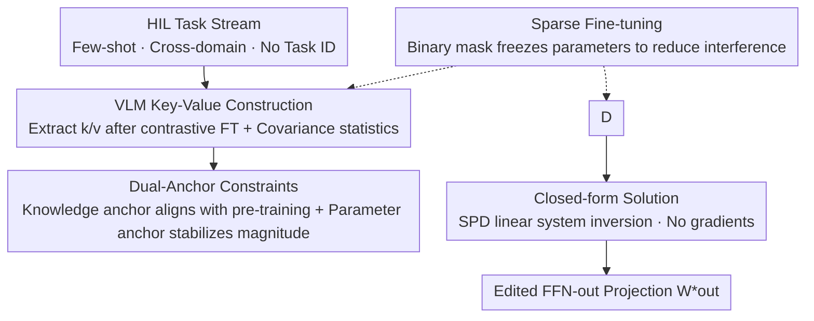

# SAME: Sparse and Anchored Model Editing for Heterogeneous Incremental Learning under Limited Data

**Conference**: CVPR 2026  
**Paper**: [CVF Open Access](https://openaccess.thecvf.com/content/CVPR2026/html/Duan_SAME_Sparse_and_Anchored_Model_Editing_for_Heterogeneous_Incremental_Learning_CVPR_2026_paper.html)  
**Code**: The original text mentions a Project Page, but no explicit repository is provided ⚠️  
**Area**: Knowledge Editing / Continual Learning  
**Keywords**: Model Editing, Heterogeneous Incremental Learning, Vision-Language Models, Few-shot, Dual-Anchor Constraints

## TL;DR
This work adapts the "locate-then-edit FFN key-value pairs" paradigm from Large Language Models (LLMs) to Vision-Language Models (VLMs) like CLIP. Under a newly proposed "Heterogeneous Incremental Learning (HIL)" setting—characterized by no task identities, cross-domain shifts, and few-shot data—the authors propose sparse fine-tuning, dual-anchor constraints, and closed-form solutions to directly "write" new task knowledge into the FFN output projection matrices. The method requires no additional parameters, achieves 6.8% higher average accuracy than existing continual learning methods, and retains 95.8% of oracle performance.

## Background & Motivation

**Background**: Although foundation models are powerful, they suffer from catastrophic forgetting during Incremental Learning (IL). Existing IL evaluations typically focus on two idealized settings: Class-Incremental (CIL; single domain, split by class) and Task-Incremental (TIL; multiple domains but task identities provided during inference).

**Limitations of Prior Work**: In real-world deployment, these assumptions often fail. Models encounter **heterogeneous data distributions** and **fuzzy or unknown task boundaries** in unpredictable environments, frequently with **limited labels**. TIL methods rely on implicit task classification to route samples to experts, which becomes unreliable when domains are highly homogeneous. Few-shot IL methods often introduce learnable parameters or require a data-rich base training phase, contradicting the "limited supervision" premise.

**Key Challenge**: The fundamental tension in incremental learning lies between "injecting new knowledge" and "preserving old capabilities." Aggressive fitting of new tasks washes out pre-trained semantics, while conservative updates fail to learn new tasks. Heterogeneous and few-shot settings amplify risks at both ends.

**Goal**: To define a realistic evaluation setting, HIL (simultaneously testing intra-domain continuity, cross-domain heterogeneity, and few-shot learning without task IDs), and to design a method that stably injects knowledge under this setting while being **parameter-free, independent of task IDs, and insensitive to task order**.

**Key Insight**: The authors observe that factual and task knowledge in large models is primarily encoded in FFN layers. "Locate-then-edit" methods in LLMs (e.g., ROME/MEMIT/AlphaEdit) inject knowledge by rewriting key-value mappings in FFN output projections. This mechanism is naturally suited for IL: it efficiently writes new knowledge while minimizing changes elsewhere. However, it has been validated almost exclusively in NLP, leaving its application to VLMs like CLIP unexplored.

**Core Idea**: Treat the VLM's FFN output projection $W_{out}$ as the editable target. Extract compact task key-value pairs $(K_1, V_1)$ from few-shot data. Use a **closed-form solution** via a symmetric positive definite (SPD) linear system under the constraints of "Knowledge Anchors + Parameter Anchors" to compute the edited weights. This learns new tasks while anchoring back to pre-trained semantics without gradient iterations and with constant memory.

## Method

### Overall Architecture
SAME treats each incremental task as a "model editing" operation. For the current task, it first performs sparse fine-tuning on the FFN output projection to extract key-value statistics. These statistics, along with those from the original pre-trained model, are fed into a least-squares objective with dual-anchor regularization. Finally, the derivative is set to zero to obtain a closed-form solution, which is written back to $W_{out}$. The entire pipeline involves no backpropagation iterations; the results depend only on covariance matrices, making it naturally insensitive to task order and capable of parallel task processing.

### Key Designs

**1. VLM Key-Value Construction: Porting LLM FFN editing to dual modalities with covariance compression**

LLM editing treats input features to FFN-out as keys $k$ and outputs as values $v$, where $(k, v)$ pairs encode local knowledge. This paper extends this to VLMs: given image-text pairs $(I, T)$, vision/text encoders yield $h_v=f_v(I), h_t=f_t(T)$. The $W_{out}$ layers are fine-tuned using the original contrastive loss, and training samples are fed through the adapted model to extract $k$ and $v$ per layer. To avoid the high cost of storing token-level features, the authors accumulate **second-order statistics**: $K^\top K=\sum_b k_b^\top k_b$ and $K^\top V=\sum_b k_b^\top v_b$. For multiple tasks, global statistics $\bar K^\top\bar K, \bar K^\top\bar V$ are averaged across $M \times N$ sub-datasets. This ensures constant memory regardless of sample size, which is key to being "parameter-free."

**2. Dual-Anchor Constraints: Learning new tasks without drifting from pre-trained semantics**

Simply fitting new key-value pairs can erase old knowledge. The authors add two complementary anchors to the objective (Eq. 5):

$$W^* = \arg\min_W \|K_1 W - V_1\|_F^2 + \lambda_k\|K_0 W - V_0\|_F^2 + \lambda_p\|W - W_{out}\|_F^2$$

The first term fits $(K_1, V_1)$ for new knowledge. The **Knowledge Anchor** $\lambda_k\|K_0 W-V_0\|^2$ forces the edited projection to reproduce mappings $(K_0, V_0)$ from the **original pre-trained VLM**. Since the pre-trained model is generalized, these act as reliable reference knowledge, preventing semantic drift. The **Parameter Anchor** $\lambda_p\|W-W_{out}\|^2$ prevents the weight magnitudes from deviating too far, maintaining representation continuity and numerical stability.

**3. Sparse Fine-tuning: Sampling masks before extraction to suppress interference**

Before fine-tuning $W_{out}\in\mathbb{R}^{d_k\times d_v}$ for a task, a binary mask $M\in\{0,1\}^{d_v\times d_k}$ is sampled to freeze parameters at a fixed ratio $p$ ($M_{ij}=0$). Gradients are filtered: $\nabla\mathcal{L}_{masked}=\nabla\mathcal{L}\odot M$. By restricting updates to a subspace of $W_{out}$, the model is forced to reuse pre-trained representation bases, reducing destructive interference between heterogeneous tasks. This serves as the "first line of defense" against conflicts.

**4. Closed-form Solution: Gradient-free, constant memory, and order-insensitive editing**

Setting the derivative of Eq. 5 to zero yields a symmetric positive definite (SPD, for $\lambda_k, \lambda_p > 0$) linear system:

$$H = \bar K_1^\top\bar K_1 + \lambda_k \bar K_0^\top\bar K_0 + \lambda_p I,\qquad W^* = H^{-1}\big(\bar K_1^\top\bar V_1 + \lambda_k \bar K_0^\top\bar V_0 + \lambda_p W_{out}\big)$$

The edited weight is $W_{out}^* = W^*$. Since global statistics are aggregated across all tasks, a single solve integrates all task knowledge and anchor priors. This requires **no task-by-task backpropagation, maintains constant memory, and is naturally insensitive to task order** because it relies on additive covariance matrices.

### Loss & Training
The fine-tuning stage follows the original CLIP image-text contrastive loss to compress task knowledge into statistics. The actual "editing" is performed via the closed-form solution (Eq. 8). The backbone is CLIP ViT-B/16, optimized with AdamW for 500 iterations per task in a 5-shot setting. Hyperparameters are fixed at $\lambda_p=300, \lambda_k=0.1$, and sparse ratio $p=0.3$.

## Key Experimental Results

**Evaluation Setting**: MTIL benchmark (11 vision-language domains) with fixed Order I. Each domain is split into $N$ sub-tasks. Split-2 ($N=2$, 22 tasks) and Split-3 ($N=3$, 33 tasks) are tested under 5-shot settings. Inference uses cosine similarity across all domain classes (no task IDs). **Oracle (FFN)** refers to independent fine-tuning per sub-task. **Retention** is defined as Average Accuracy ÷ Oracle Accuracy.

### Main Results: Split-2 / 5-shot Average Accuracy (%)

| Method | Type | Avg Accuracy | Gap vs Ours |
|------|------|----------|----------|
| Oracle (FFN) | Upper Bound | 68.9 | — |
| Continual FT | IL | 46.0 | −20.0 |
| Wise-FT | IL | 50.8 | −15.2 |
| DIKI | IL | 53.9 | −12.1 |
| ZSCL | IL | 56.1 | −9.9 |
| GNSP | IL | 58.7 | −7.3 |
| MoE-Adapter | IL | 59.2 | −6.8 |
| Consensus TA | Model Fusion | 58.6 | −7.4 |
| Task Arithmetic | Model Fusion | 60.2 | −5.8 |
| TIES-Merging | Model Fusion | 61.7 | −4.3 |
| **SAME (Ours)** | Editing | **66.0** | — |

SAME averages 66.0%, outperforming the strongest IL baseline (MoE-Adapter, 59.2%) by 6.8 points and the strongest fusion baseline (TIES-Merging, 61.7%) by 4.3 points, reaching **95.8%** of the Oracle performance.

### Main Results: Domain Highlights (Split-2 / 5-shot, %)

| Domain | MoE-Adapter | TIES-Merging | Oracle | SAME |
|----|-------------|--------------|--------|------|
| EuroSAT | 60.1 | 69.3 | 66.2 | **80.9** |
| MNIST | 53.4 | 57.6 | 90.8 | **89.5** |
| Flowers | 65.1 | 71.4 | 84.3 | 75.3 |
| Aircraft | 28.6 | 23.9 | 36.3 | 26.1 |

Notably, SAME's 80.9% on EuroSAT **exceeds the Oracle (66.2%)**, suggesting positive transfer from anchor-based aggregation. It nearly matches the Oracle on MNIST (89.5 vs 90.8), where other methods drop significantly.

### Key Findings
- **Stability from Anchors**: SAME achieves near-oracle retention without additional learnable parameters. Catastrophic forgetting is shown to be largely driven by semantic drift from unconstrained updates.
- **Order Independence**: Because editing depends on additive covariance statistics, tasks can be injected out of order or in parallel, avoiding the task-order sensitivity of traditional IL.
- **Cross-task Positive Transfer**: Transcending the Oracle on EuroSAT suggests that global key-value aggregation can exploit shared structures across domains.

## Highlights & Insights
- **Clean Adaptation of LLM Paradigm to VLM**: Explicitly treating vision-text joint FFN inputs/outputs as keys/values and using second-order statistics solves the problem of compact knowledge storage in few-shot settings. This compression approach is transferable to any task-based knowledge storage scenario.
- **The HIL Setting as a Contribution**: Integrating "intra-domain continuity, cross-domain heterogeneity, few-shot, and no task IDs" into one protocol provides a more rigorous and realistic benchmark than standard CIL/TIL.
- **Elegant Closed-form Editing**: Reducing incremental learning to an SPD linear system solve is computationally attractive for edge deployment where memory is limited and iterations are costly.

## Limitations & Future Work
- **FFN Knowledge Assumption**: The method assumes task knowledge is primarily encoded in FFN-out. Its effectiveness on attention-heavy or deeper coupled knowledge remains an early-stage exploration for VLMs.
- **Fixed Hyperparameters and Random Masking**: $\lambda_k, \lambda_p, p$ are fixed across tasks, and masks are sampled randomly. This lacks adaptive tuning per task/layer; random masking might occasionally freeze critical parameters.
- **Covariance Storage Cost**: While memory is constant per task, maintaining $d_k \times d_k$ matrices for $H$ across all $W_{out}$ layers involves significant storage and inversion costs for high-dimensional models.
- **Future Directions**: Implementing structured selection for sparse masking, making anchor coefficients adaptive to task similarity, and validating scalability on larger VLMs or longer task streams.

## Related Work & Insights
- **vs. Model Editing (ROME / MEMIT / AlphaEdit)**: These rewrite facts in LLMs via FFNs. AlphaEdit uses null-space constraints to protect old knowledge. SAME ports this to VLMs using "Dual-Anchor + Closed-form" for cross-domain few-shot IL rather than single-fact rewriting.
- **vs. Model Fusion (Task Arithmetic / TIES-Merging)**: Fusion methods merge weights from independently fine-tuned tasks. SAME performs editing in the key-value space of FFN-out, preserving pre-trained semantics more precisely (outperforming TIES-Merging by 4.3 points).
- **vs. Task/Few-shot IL (MoE-Adapter / DIKI)**: These rely on implicit routing or extra modules and often require data-rich base training. SAME requires no extra parameters, no task IDs, only 5-shot data, and is order-insensitive, filling the gaps of these methods in heterogeneous few-shot scenarios.

## Rating
- **Novelty**: ⭐⭐⭐⭐ HIL setting + adapting FFN editing to VLM with dual-anchor closed-form solutions is a novel combination.
- **Experimental Thoroughness**: ⭐⭐⭐⭐ Solid comparison across 11 domains and 22/33 tasks against various baselines.
- **Writing Quality**: ⭐⭐⭐⭐ Clear motivation, mathematical derivation, and complete algorithms.
- **Value**: ⭐⭐⭐⭐ The parameter-free, order-insensitive, few-shot approach is highly attractive for real-world deployment; the HIL protocol is a valuable contribution.

<!-- RELATED:START -->

## Related Papers

- [\[ACL 2026\] HiEdit: Lifelong Model Editing with Hierarchical Reinforcement Learning](../../ACL2026/knowledge_editing/hiedit_lifelong_model_editing_with_hierarchical_reinforcement_learning.md)
- [\[ACL 2025\] CompKe: Complex Question Answering under Knowledge Editing](../../ACL2025/knowledge_editing/compke_complex_question_answering_under_knowledge_editing.md)
- [\[CVPR 2026\] Attribution-Guided Model Rectification of Unreliable Neural Network Behaviors](attribution-guided_model_rectification_of_unreliable_neural_network_behaviors.md)
- [\[ICLR 2026\] Rote Learning Considered Useful: Generalizing over Memorized Training Examples](../../ICLR2026/knowledge_editing/rote_learning_considered_useful_generalizing_over_memorized_training_examples.md)
- [\[NeurIPS 2025\] Edit Less, Achieve More: Dynamic Sparse Neuron Masking for Lifelong Knowledge Editing in LLMs](../../NeurIPS2025/knowledge_editing/edit_less_achieve_more_dynamic_sparse_neuron_masking_for_lifelong_knowledge_edit.md)

<!-- RELATED:END -->
