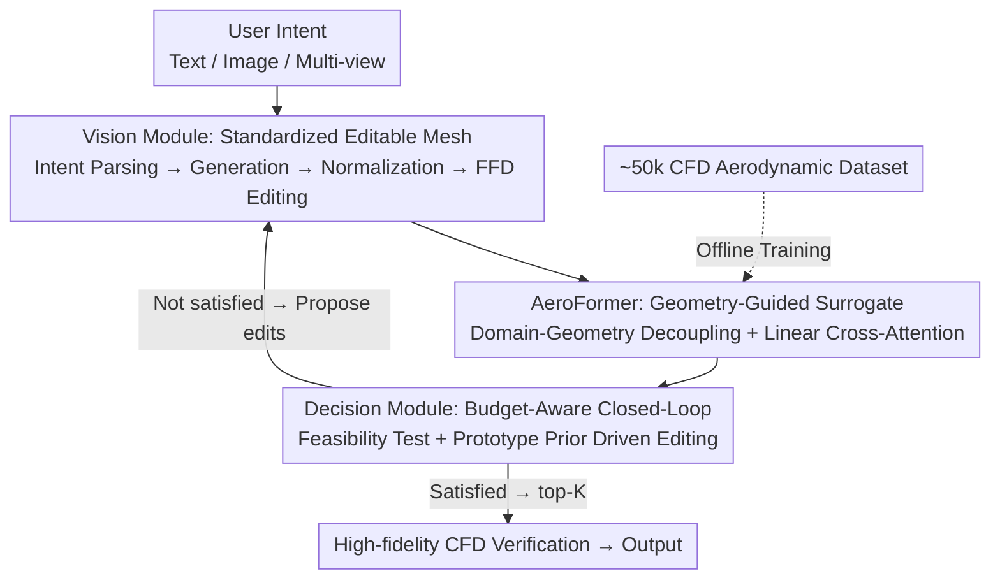

# AeroAgent: A Vision-Physics-Decision Framework for Aerodynamic Vehicle Design

**Conference**: CVPR 2026  
**Paper**: [CVF Open Access](https://openaccess.thecvf.com/content/CVPR2026/html/Liu_AeroAgent_A_Vision-Physics-Decision_Framework_for_Aerodynamic_Vehicle_Design_CVPR_2026_paper.html)  
**Code**: Undisclosed  
**Area**: Agent / Physics Simulation / 3D Generation  
**Keywords**: Aerodynamic Design, AI Agent, CFD Surrogate Model, Closed-loop Optimization, Transformer Surrogate

## TL;DR
AeroAgent integrates "text/image-to-3D car generation → second-level drag and flow field prediction via the AeroFormer surrogate model → planner-driven propose-evaluate-refine closed-loop editing" into a unified framework. It utilizes high-fidelity CFD only for final top-K candidate verification, achieving an average drag reduction of 2–12% within 5 iterations while reducing high-fidelity CFD calls by 50–80%.

## Background & Motivation
**Background**: Early stage vehicle styling must balance aesthetics, low drag coefficient $C_d$, and regulatory dimensional constraints. In real-world workflows, designers iterate between sketches, 3D models, and simulation engineers. High-fidelity CFD simulations and manual modifications consume the majority of the schedule, often taking weeks to move from a sketch to an aerodynamically and regulatorily compliant design.

**Limitations of Prior Work**: Recent generative models can quickly produce stunning 3D car shapes from text/images, but "fast generation" without reliable physics-in-the-loop does not shorten end-to-end design time. Related work is split into three disconnected paths: (1) Text/CAD generation models explore rich styling spaces but treat downstream physics as an afterthought; (2) CFD flow field surrogate models (neural operators) accelerate pressure/velocity field prediction by orders of magnitude but are usually trained in isolation and not coupled with editing or decision-making; (3) Classical aerodynamic shape optimization (adjoint methods, FFD) can directly reduce drag, but each iteration requires a CFD solve and is tied to specific parameterizations and boundary conditions.

**Key Challenge**: Generation-only, surrogate-only, and CFD-only pipelines each solve only one part of the problem. None provide styling teams with an **end-to-end, budget-aware** closed-loop design circuit. The actual bottleneck is not 3D generation, but the "generation → physics evaluation → reshaping" loop, which is either fragmented or prohibitively expensive at every step due to high-fidelity CFD.

**Goal**: Investigate how an AI agent can close this loop under **strict CFD budgets**—starting from heterogeneous design intents (text, real images, text-conditioned images, or multi-view drawings), ensuring physics feedback drives editing, and reducing expensive high-fidelity CFD to a final validation of a few candidates.

**Core Idea**: Build a vision–physics–decision framework around a **single standardized, editable 3D representation**. Use the fast surrogate model AeroFormer to support all internal loop evaluations, reserving high-fidelity CFD only for top-K verification.

## Method

### Overall Architecture
AeroAgent takes user design intent (text or image) as input and outputs a batch of drag-reduced, compliant, and aesthetically maintained 3D car shapes (STL) with CFD-verified $C_d$. The loop is coordinated by three modules: **Vision** converts heterogeneous intent into standardized, CFD-ready 3D meshes and supports local editing; **Physics (AeroFormer)** predicts drag, surface pressure, and volume velocity fields in seconds for a given geometry; **Decision** acts as the orchestration hub, treating regulatory dimensions, drag, and aesthetics as feasibility tests. It combines prototype priors and surrogate sensitivity to generate executable edits in a budget-aware propose–evaluate–refine loop. Only after convergence are the top-K ($K \le B_{hf}$) designs sent for high-fidelity CFD confirmation. The internal loop **never calls** the high-fidelity solver—essential for "low budget" operation. Physics is supported by an offline-built ~50k simulation aerodynamic dataset.

### Key Designs

**1. Vision Module: Bridging "Generation-Editing-Evaluation" with a Single Standardized Editable 3D Representation**

To address the fragmentation where generative models treat physics as an afterthought and produce meshes unfit for CFD, the Vision module requires all candidates eventually to be in the same standardized STL format. This ensures downstream physics and decision modules see consistent input. The process involves parsing natural language intent into structured visual specifications (viewpoint, background/lighting, body type, style anchors, negative constraints), with body types limited to {sedan, SUV, MPV, pickup, sport car}. Pure text input is first synthesized into a conditioned image using a commercial text-to-image model (Nano Banana), while user images undergo matting, exposure/white balance correction, and local retouching. A unified image-to-3D model (Hunyuan3D 3.0) reconstructs the mesh and exports an STL, followed by fixed post-processing: PCA principal axis alignment (with head direction disambiguation), ground plane and up-direction fitting using wheel cues, re-centering, and unit normalization (meters). Each candidate's overall dimensions $(L, W, H)$ are projected to regulatory/manufacturing ranges using "minimum change anisotropic scaling" prioritized by $L \to H \to W$. Local refinements use small-step **Free-Form Deformation (FFD)** for actions like adjusting windshield angles, roof curvature, boat-tailing, diffuser angles, and wheel arch styling. All edits are parameterized, step-limited, and recorded, complementing centimeter-level mesh micro-edits with coarse-grained appearance editing. Each candidate is finally bundled as a standard STL plus a `meta.json` (bounding box, wheelbase, coordinate transforms, mesh health summary, body class, FFD grids/masks, and edit history).

**2. AeroFormer: Domain-Geometry Decoupled Geometry-Guided Transformer Surrogate**

To address the bottleneck where surrogate models are trained in isolation or fail to compute over million-point 3D domains, AeroFormer uses a unified **point-wise representation** for both volume domains and vehicle surfaces, eliminating the need for shape-specific CFD mesh regeneration (mesh-free). Given 3D query points $X = \{x_i \in \mathbb{R}^3\}$, coordinate MLPs map them to latent tokens (volume and surface samplings use independent MLPs specializing in flow fields and geometric cues). The backbone core involves **decoupling volume domains and surface geometry followed by cross-attention fusion**, conditioning volume features on the current vehicle shape: queries are from volume tokens, while keys and values are from surface tokens:

$$Q = z_{vol}W_Q, \quad K = z_{surf}W_K, \quad V = z_{surf}W_V$$

Standard softmax cross-attention scales quadratically with token counts, which is infeasible for million-point domains. AeroFormer adopts **linear attention**: applying a kernel map $\Psi(\cdot)$ to $q,k$ rows to get $\tilde{q}_i, \tilde{k}_i$, and pre-calculating $\sum_i \tilde{k}_i \otimes v_i$ for reuse, reducing complexity to approximately $O((N_{vol}+N_{surf})C^2)$. The surface branch performs area-weighted sampling on STLs for points and normals, using a Transolver-style slice/aggregate encoder (mapping points to learnable "physical states," performing attention in state space, and deslicing back to points) while retaining linear self-attention as a baseline. Three task-specific heads predict pressure $\hat{p}$, velocity $\hat{u}$, and scalar drag $\hat{C_d}$ through a unified interface $S_t(x; Q_t)$ using different query sets. Training optimizes these tasks independently: field outputs use squared-error loss $L_t = \frac{1}{|Q_t|}\sum_q \|\hat{y}_t(q) - y_t(q)\|_2^2$, and drag uses scalar regression $L_d = (\hat{C_d} - C_d)^2$. This mesh-free + linear attention design allows near-linear scaling from $10^5$ to $5\times10^6$ points.

**3. Decision Module: Feasibility Test + Prototype Prior Driven Budget-Aware Loop**

To transform vague intent into executable edits without exhausting high-fidelity CFD budgets, the Decision module serves as the single source of truth. It treats regulatory dimensions, drag, and aesthetics as **concurrent hard constraints**. A candidate is accepted if and only if:

$$\Pi(x; U) = \mathbb{1}[x \in F]\cdot\mathbb{1}[C_d(x) \le \tau_d]\cdot\mathbb{1}[E(x; U) = 1]$$

where $F$ is the feasible dimension set, $\tau_d$ is the drag threshold, and $E(\cdot; U) \in \{0,1\}$ is a binary predicate for user aesthetic intent (implemented via a large multimodal model GPT-5 as an automated aesthetic evaluator). Any candidate in $A = \{x \in C \mid \Pi(x;U)=1\}$ is considered qualified. Executable edits are derived from **prototype priors + physics feedback**: a curated library of low-drag, high-aesthetic exemplars provides shape priors. The planner selects a set of actions from this library that align with priors and are likely to improve feasibility, which are then sent to the Vision module for mesh updates. Termination occurs after $m$ rounds of $|\Delta C_d| < \epsilon$ (drag convergence), when $E(x;U)=1$ with no further viable improvements, or upon budget exhaustion. Only top-K designs reach high-fidelity CFD.

**4. Large-scale Vehicle Aerodynamic Dataset: ~50k Simulations for Industrial-grade Training**

To ensure "industrial-grade reliability," the surrogate model was trained on a dataset of approximately 50k standardized STL vehicle shapes covering five body classes. Each shape includes labels for volumetric pressure, volumetric velocity, and scalar drag $C_d$. Geometries originate from licensed public models and compliant generative pipelines, normalized according to Vision module specifications. Labels were generated using a GPU-accelerated Lattice–Boltzmann solver with unified boundary conditions and residual-based convergence. The dataset was processed over two months using 160 RTX 4090 GPUs, totaling approximately $2\times10^5$ GPU-hours.

## Key Experimental Results

### Main Results: AeroFormer vs. Aerodynamic Surrogate Models
Flow fields (pressure and velocity) and $C_d$ were predicted within a rectangular volume domain around the vehicle. All methods used the same standardized STL, domain, and data split (1000 training / 100 test subset). Field predictions are measured by Relative L2/L1 (lower is better), and drag by $R^2$ (higher is better).

| Model | Pressure Rel L2 ↓ | Pressure Rel L1 ↓ | Velocity Rel L2 ↓ | Velocity Rel L1 ↓ | $C_d$ $R^2$ ↑ |
|------|------|------|------|------|------|
| 3D-GeoCA | 0.1853 | 0.0661 | 0.0521 | 0.0274 | 0.9310 |
| Transolver | 0.1797 | 0.1090 | 0.0681 | 0.0377 | 0.9134 |
| Transolver++ | 0.2084 | 0.1259 | 0.0775 | 0.0448 | 0.9012 |
| AB-UPT | 0.2524 | 0.1396 | 0.1021 | 0.0720 | 0.7821 |
| TripNet | 0.1921 | 0.1377 | 0.1007 | 0.0686 | 0.9045 |
| **Ours (AeroFormer)** | **0.1072** | **0.0566** | **0.0279** | **0.0152** | **0.9484** |
| Gain | 40.3% | 14.3% | 46.4% | 44.5% | 1.86% |

AeroFormer achieved the best performance across all metrics, with Rel L2 for pressure and velocity fields reduced by 40.3% and 46.4% respectively compared to the next best model.

### Key Findings
- **Surrogate-Only Internal Loop**: In progressive editing of a single coupe over 4 rounds, the $C_d$ curves predicted by AeroFormer and high-fidelity CFD were nearly identical and monotonically decreasing, validating the use of surrogates for internal loop optimization.
- **Cross-model Generalization**: $R^2$ for $C_d$ prediction remained $> 0.96$ across all five vehicle classes. Testing on 50 random SUVs showed $R^2 \approx 0.98$ without systematic bias.
- **Time Bottleneck**: In a 5-step total duration, physics prediction occupied only ~5 s. The majority of time was consumed by the Vision module (image/3D generation and post-processing).

## Highlights & Insights
- **Standardized Editable Representation**: This is the "glue" for the three modules. Standardizing all candidates into STL with a `meta.json` allows Physics to perform mesh-free evaluation and Decision to issue traceable commands.
- **Domain-Geometry Decoupling + Linear Attention**: Conditioning the flow field on vehicle geometry while maintaining linear complexity for million-point domains provides a template for other "geometry-determined external field" tasks like heat dissipation or acoustics.
- **Budget-Aware Paradigm**: Utilizing "cheap surrogate exploration + expensive ground truth verification" optimizes resource allocation for high-cost verification design tasks.

## Limitations & Future Work
- **Limitations**: The framework was trained on five common car types; generalization to outliers (heavy trucks, buses, extreme concepts) requires more data. Aesthetics are judged by an LLM-based image scorer without human study validation.
- **Identified Risks**: (1) Dependence on surrogate reliability for internal loops; pressure tests for out-of-distribution shapes are needed to avoid "surrogate-low, real-high" drag traps. (2) Drag reduction improvements are relative to various baselines; comparisons should be approached with caution. (3) High reproduction barriers due to undisclosed code and the massive dataset requirement (~50k CFD labels).
- **Future Work**: Implementing uncertainty estimation for surrogates to dynamically decide when to insert a high-fidelity CFD correction during the loop.

## Related Work & Insights
- **vs. Generative Models (CAD-Llama, etc.)**: These expand styling space but treat physics as post-hoc. AeroAgent's Vision module closes the loop with CFD-ready meshes and editing handles.
- **vs. Flow Surrogates (Transolver / TripNet)**: AeroFormer uses geometry-conditioned Transformers and mesh-free points to outperform these on scalar and field metrics across large-scale LBM simulations.
- **vs. Classical Optimization**: Unlike adjoint methods that require CFD for every iteration and specific parameterization, AeroAgent integrates surrogates, feasibility constraints, and aesthetic judging into a budget-aware loop.

## Rating
- Novelty: ⭐⭐⭐⭐⭐ 
- Experimental Thoroughness: ⭐⭐⭐⭐ 
- Writing Quality: ⭐⭐⭐⭐ 
- Value: ⭐⭐⭐⭐⭐ 

<!-- RELATED:START -->

## Related Papers

- [\[NeurIPS 2025\] 3DID: Direct 3D Inverse Design for Aerodynamics with Physics-Aware Optimization](../../NeurIPS2025/physics/3did_direct_3d_inverse_design_for_aerodynamics_with_physics-aware_optimization.md)
- [\[NeurIPS 2025\] Vision Transformers for Cosmological Fields: Application to Weak Lensing Mass Maps](../../NeurIPS2025/physics/vision_transformers_for_cosmological_fields_application_to_weak_lensing_mass_map.md)
- [\[CVPR 2026\] PhysSkin: Real-Time and Generalizable Physics-Based Skin Simulation](physskin_real-time_and_generalizable_physics-based_animation_via_self-supervised.md)
- [\[CVPR 2026\] AviaSafe: A Physics-Informed Data-Driven Model for Aviation Safety-Critical Cloud Forecasts](aviasafe_a_physics-informed_data-driven_model_for_aviation_safety-critical_cloud.md)
- [\[ICML 2026\] Learning to Refine: Spectral-Decoupled Iterative Refinement Framework for Precipitation Nowcasting](../../ICML2026/physics/learning_to_refine_spectral-decoupled_iterative_refinement_framework_for_precipi.md)

<!-- RELATED:END -->
