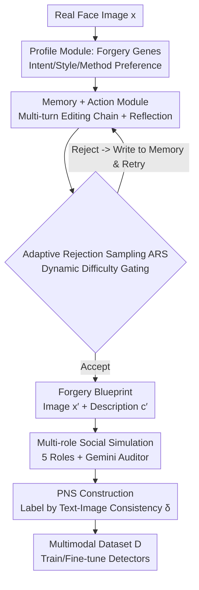

# Agent4FaceForgery: Multi-Agent LLM Framework for Realistic Face Forgery Detection

**Conference**: CVPR 2026  
**Paper**: [CVF Open Access](https://openaccess.thecvf.com/content/CVPR2026/html/Lai_Agent4FaceForgery_Multi-Agent_LLM_Framework_for_Realistic_Face_Forgery_Detection_CVPR_2026_paper.html)  
**Code**: https://github.com/laiyingxin2/Agent4FaceForgery  
**Area**: Agent / Multimodal VLM / AI Safety  
**Keywords**: Face Forgery Detection, Multi-Agent LLM, Data Synthesis, Deepfake, Social Simulation  

## TL;DR
A multi-agent system driven by LLMs is used to "act" as both forgers and social network observers, simulating the complete life cycle of face forgery from creation to propagation. It synthesizes training data with text-image consistency annotations, leading to significant performance gains for deepfake detectors in cross-domain and cross-algorithm real-world scenarios (e.g., Celeb-DF AUC improved from the 70% range to 87.1%).

## Background & Motivation

**Background**: Face forgery detection has evolved from early binary classification using Xception/ResNet to mining frequency domain artifacts (SPSL, M2TR), reconstruction inconsistency (RECCE), and recently, multimodal methods introducing LLMs and textual context (SIAF), maintaining a constant arms race with generative technologies.

**Limitations of Prior Work**: The authors summarize the common bottleneck of all methods as **"ecological invalidity" of training data**. Existing datasets (FF++, Celeb-DF, and even multimodal DD-VQA) are curated, static samples that fail to characterize the dynamic life cycle of forgeries in the real world: ① They do not reflect the **intent and iterative process of human forgers** (different people have different motivations, techniques, and style preferences, and they improve through trial and error); ② They lack **social context and multimodal interaction**—in reality, forged images never exist in isolation but are propagated amidst comments, retweets, and truth-vs-fake debates.

**Key Challenge**: Models that perform well on offline benchmarks often fail when deployed in real online environments. The root cause is not the detection algorithm itself, but that the data does not resemble "wild" forgeries.

**Goal**: Split the problem into two: (1) How to capture the diverse intentions and iterative processes of human forgery; (2) How to model the complex, often adversarial, text-image interactions that accompany forgeries.

**Key Insight**: Since real-world data is hard to collect, LLM agents are used to **simulate** the entire industry chain. Each agent possesses a Profile (defining intent), Memory (iterative learning), and Action (executing visual editing + generating text), and multiple agents with different roles interact around forged images in a simulated social environment.

**Core Idea**: Upgrade the approach from "generating an image with a true/false label" to "simulating the entire forgery life cycle," and upgrade the supervision signal from image-only binary classification to **text-image consistency**—the critical data currently missing for multimodal detectors.

## Method

### Overall Architecture

Agent4FaceForgery is a **data synthesizer** that produces a high-ecological-validity multimodal dataset $D$ to train/fine-tune various detectors. Given an unmanipulated real face $x$ and optional text description $c$, the goal is to generate a dataset containing real samples $\{(x_i, c_i, y_i{=}0, \delta_i{=}1)\}$ and forged samples $\{(x'_j, c'_j, y_j{=}1, \delta'_j)\}$, where $y$ is the image authenticity label and $\delta$ is the text-image consistency label ($\delta{=}1$ indicates the text matches the image content, $\delta{=}0$ indicates a mismatch, e.g., a forged image labeled as real).

The generation is decoupled into **two phases**: constructing a "Forgery Blueprint" (Phase 1: one forged image + one creator description) and running multi-turn social dialogues to fill the context (Phase 2). This ensures both the correctness of the underlying task structure and the naturalness of the dialogue. In Phase 1, each agent consists of Profile, Memory, and Action modules with GPT-4V as the unified cognitive core, using Adaptive Rejection Sampling (ARS) for quality gating. Phase 2 introduces multiple social roles for interaction, finally using text-image consistency rules to automatically label positive and negative samples.

### Key Designs

**1. Profile Module: Capturing Creator Intent and Style with "Forgery Genes"**

To address the lack of diverse forgery intent in existing data, each agent is assigned a "forgery gene" $p_k = (v_k, c_k)$ mined from real FF++ data. Here, $v_k$ is a vector of three quantifiable traits: **Forgery Frequency** $T^{freq}_k = |\text{forgeries}_k|$ (productivity), **Method Diversity** $T^{div}_k = |\bigcup_{i} \{method_i\}|$ (range of techniques used), and **Target Conformity** $T^{conf}_k = \frac{1}{|\text{forgeries}_k|}\sum_i \text{Pop}(target_i)$ (preference for popular vs. niche targets). $c_k$ is a natural language style preference generated by GPT-4V after observing $L$ samples from that creator. These genes drive the agent's tool selection and editing process—for instance, an agent characterized as "pursuing high realism" will favor face-swapping followed by a blending layer. This ensures the synthesized data naturally inherits "human" diversity.

**2. Memory + Action Module: Multi-turn Forgery Execution with Reflection**

To address the pitfall of cumulative hallucinations in single-agent systems, the Memory module maintains two types of memories: **Factual Memory** (objective editing details) and **Evaluative Memory** (subjective judgments, e.g., visibility of seams), recorded in structured JSON for retrieval and LLM-driven reflection. This allows agents to analyze past successes or failures to adjust the next round's strategy. The Action module implements intent as actions $\text{Action}^{(t)}_k = (\text{Edit}(\cdot), \text{Desc}(\cdot))$: visual editing is a serial combination of operators $\text{Edit}(x; p_k, M_k) = O_n(\dots O_1(x; \theta_1)\dots; \theta_n)$, covering identity tampering, attribute editing, and style synthesis. The text description $\text{Desc}(\cdot)$ can be an accurate caption or a deliberately misleading statement—the latter being the source of text-image inconsistent samples.

**3. Adaptive Rejection Sampling (ARS): Dynamic Difficulty Gating**

To ensure synthesized data is both diverse and challenging, ARS serves as a quality gate. Candidate blueprints $(x'_i, c'_i)$ are scored using a fusion score: $s_i = \lambda\, s^{LLM}_i + (1-\lambda)\, s^{disc}_i$, where $s^{disc}_i$ is the score from an external detector and $s^{LLM}_i$ is the agent's internal self-evaluation. A sample is accepted only if its score exceeds an adaptive threshold $\tau$. Crucially, $\tau$ tightens over time: after a warmup phase with a fixed threshold $\tau_{warmup}$, it switches to being data-driven:

$$\tau = \text{Quantile}(\{s_j \mid j \in \text{Accepted}\},\, q)$$

The hyperparameter $q$ controls the rejection rate. As the overall quality of the pool increases, the threshold rises, allowing only harder, higher-quality forgery samples to pass.

**4. Multi-role Social Simulation + PNS Construction: Creating Hard Negatives from Social Debates**

In Phase 2, a group of MLLM-driven roles interact around the forgery, simulating real platform dynamics. Five roles include: **Watcher** (likes posts without deep scrutiny), **Explorer** (compares posts to find artifacts), **Critic** (questions quality and credibility), **Chatter** (easily misled but corrected by others), and **Poster** (re-edits and amplifies). A **Gemini Auditor** is added to generate deliberately deceptive statements—e.g., claiming a clearly spliced image is "100% real"—creating strong text-image conflicts. These interactions are automatically labeled using a consistency function:

$$\delta(x', c') = \begin{cases} 1, & y=1 \text{ and } c' \text{ claims "totally real"} \\ 1, & y=0 \text{ and } c' \text{ claims "obviously forged"} \\ 0, & \text{otherwise} \end{cases}$$

Here, $\delta{=}1$ marks negative samples with text-image mismatch, while $\delta{=}0$ represents aligned or corrected positive samples. This shifts the supervision signal from "is the image real" to "does the text match the image."

### Mechanism

Taking an agent with a "face swap, pursuing high realism" profile as an example: ① It samples a real face and constructs an operator chain based on style preferences; ② It retrieves an evaluative memory stating "failed last time due to lighting," triggering an illumination correction API call; ③ The candidate is scored by ARS; if it exceeds the threshold $\tau$, it becomes a blueprint; ④ The blueprint enters social simulation where a Critic points out "unnatural mouth muscles," while the Gemini Auditor asserts it is "100% authentic." This process generates multiple training pairs with different consistency labels from a single forged image.

## Key Experimental Results

### Main Results

Cross-dataset generalization: Models are trained on FF++(HQ) and tested on unseen domains. Ours achieves SOTA/near-SOTA on several challenge sets.

| Dataset | Metric | Ours | FFTG (Prev. SOTA) | DCL |
|--------|------|------|--------------|-----|
| FF++ (In-domain) | AUC | 99.50 | 99.23 | 99.30 |
| DFDC-P | AUC | **88.10** | 84.74 | 76.71 |
| Wild Deepfake | AUC | **86.50** | 83.55 | 71.14 |
| Celeb-DF | AUC | **87.10** | 84.80 | 82.30 |

Robustness against unseen forgery algorithms (DF40 protocol, frame-level AUC %):

| Method | uniface | e4s | facedancer | simswap | Avg |
|------|---------|-----|------------|---------|------|
| SG-Det (NeurIPS25) | 91.8 | 87.5 | 83.0 | 91.0 | 87.8 |
| **Ours** | **96.3** | **92.4** | **92.9** | **92.4** | **93.9** |

The average AUC of 93.9% significantly outperforms the previous strongest method, SG-Det (87.8%).

### Ablation Study

Ablation of core modules (cross-dataset AUC %). FT=Forgery Tree simulation, ARS=Adaptive Rejection Sampling, PNS=Positive/Negative Sample construction:

| Config | FT | ARS | PNS | CDF | DFD | DFDC |
|------|----|----|-----|-----|-----|------|
| LLaVA Zero-shot | - | - | - | 51.8 | 69.3 | 57.4 |
| Only FT | ✓ | - | - | 83.2 | 91.5 | 82.5 |
| Only ARS | - | ✓ | - | 88.0 | 92.1 | 84.2 |
| Only PNS | - | - | ✓ | 91.0 | 93.8 | 85.5 |
| Full | ✓ | ✓ | ✓ | **92.2** | **94.9** | **86.7** |

Ablation of social simulation agent count (diminishing returns):

| Config | DFD-AUC | Celeb-DF-AUC | Time (h) |
|------|---------|--------------|---------|
| No Social Sim | 88.1 | 74.5 | 3.8 |
| 6 Agents | 92.8 | 85.3 | 6.1 |
| 12 Agents | 93.0 | 85.8 | 7.5 |

### Key Findings
- **PNS contributes the most**: Enabling only PNS improves LLaVA's Celeb-DF AUC from 51.8% to 91.0%, confirming that text-image consistency supervision is the most critical missing signal for multimodal detectors.
- **Data as a plug-and-play enhancer**: Fine-tuning with A4FF data consistently improves various models (Phi-3.5, Qwen-VL2.5, LLaVA), and is effective across different backbones (Xception, EN-B4, ViT), indicating it provides architecture-agnostic "ecological signals."
- **Efficiency of 6 agents**: Increasing agents from 6 to 12 yields marginal gains but higher computational costs; 6 agents is the optimal balance.
- **Superior labeling quality**: The proposed method achieves a labeling Precision of 94.41%, significantly higher than human-labeled DD-VQA (62.46%).

## Highlights & Insights
- **Reframing the "data problem" as a "simulation problem"**: Instead of amassing manual annotations, the system enacts the "intent-iteration-propagation" link, bypassing the inertia of simply collecting larger datasets.
- **ARS adaptive threshold as a reusable trick**: Using the $q$-quantile of accepted samples to tighten the gate ensures both diversity in the warmup phase and increasing difficulty later on, applicable to any "generate-and-filter" scenario.
- **The "Adversarial Misinformer" role (Gemini Auditor)**: Purposely creating hard negatives by asserting fakes as real directly attacks the text-image consistency dimension.
- **Supervision granularity upgrade**: Moving from image binary classification to text-image consistency $\delta$ pushes the detector's boundary from "visual analysis" to "coherence judgment," which is closer to real social media dynamics.

## Limitations & Future Work
- **Reliance on closed-source LLMs**: The cognitive core (GPT-4V) and roles involve costs and reproducibility constraints tied to APIs.
- **Lack of objective upper bound for realism**: Whether social agent behaviors truly match "wild" distributions lacks direct statistical alignment metrics; current evidence is indirect (downstream task improvement).
- **Evaluation on standard benchmarks**: Despite the emphasis on "ecological validity," final testing still relies on academic sets like FF++ and Celeb-DF rather than real-world online data.

## Related Work & Insights
- **vs. SIAF / Single-LLM Labeling**: These use a single LLM to label forged images, which is prone to hallucinations; this work uses a multi-agent structure with Memory and PNS to suppress errors, raising Precision from the 60% range to 94%.
- **vs. AI Town / MetaGPT**: Borrows the Profile-Memory-Action paradigm but tailors it specifically for "forgery life cycle simulation + multimodal data synthesis."

## Rating
- Novelty: ⭐⭐⭐⭐⭐ High. Simulating the forgery lifecycle for data synthesis is a fresh perspective.
- Experimental Thoroughness: ⭐⭐⭐⭐ Complete across domains/algorithms/backbones, though lacks end-to-end wild scenario validation.
- Writing Quality: ⭐⭐⭐⭐ Clear framework and strong motivation.
- Value: ⭐⭐⭐⭐⭐ Plug-and-play data with universal gains across architectures.

<!-- RELATED:START -->

## Related Papers

- [\[CVPR 2026\] AgentDet: A Shared-Blackboard Multi-Agent Framework for Zero-/Few-Shot Object Detection](agentdet_a_shared-blackboard_multi-agent_framework_for_zero-few-shot_object_dete.md)
- [\[ICML 2026\] OMAC: A Holistic Optimization Framework for LLM-Based Multi-Agent Collaboration](../../ICML2026/multi_agent/omac_a_holistic_optimization_framework_for_llm-based_multi-agent_collaboration.md)
- [\[ICML 2025\] Is Your LLM-Based Multi-Agent a Reliable Real-World Planner? Exploring Fraud Detection in Travel Planning](../../ICML2025/multi_agent/is_your_llm-based_multi-agent_a_reliable_real-world_planner_exploring_fraud_dete.md)
- [\[AAAI 2026\] Beyond Detection: Exploring Evidence-based Multi-Agent Debate for Misinformation Intervention and Persuasion](../../AAAI2026/multi_agent/beyond_detection_exploring_evidence-based_multi-agent_debate_for_misinformation_.md)
- [\[ACL 2026\] Debating the Unspoken: Role-Anchored Multi-Agent Reasoning for Half-Truth Detection](../../ACL2026/multi_agent/debating_the_unspoken_role-anchored_multi-agent_reasoning_for_half-truth_detecti.md)

<!-- RELATED:END -->
