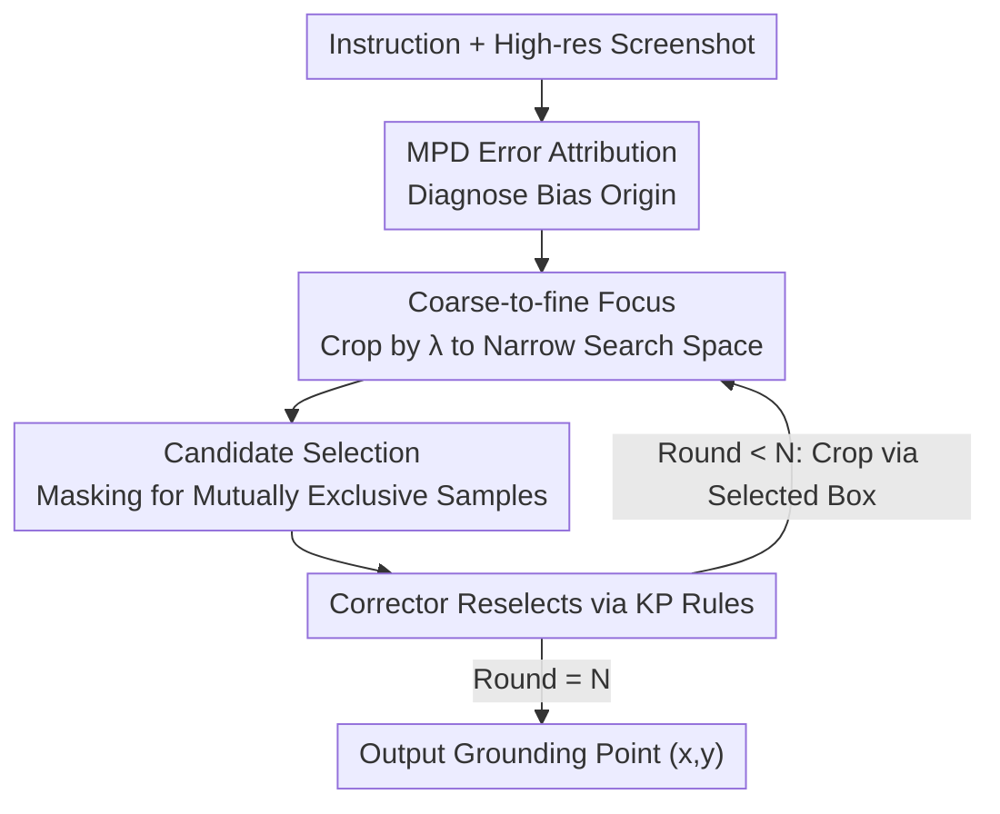

# BAMI: Training-Free Bias Mitigation in GUI Grounding

**Conference**: CVPR 2026  
**arXiv**: [2605.06664](https://arxiv.org/abs/2605.06664)  
**Code**: https://github.com/Neur-IO/BAMI (Available)  
**Area**: Agent / Multimodal VLM  
**Keywords**: GUI Grounding, Training-free, Inductive Bias, Test-time Inference, Coarse-to-fine

## TL;DR
This paper diagnoses GUI grounding errors using the MPD attribution method, identifying two main types of inductive biases: precision bias and ambiguity bias. It proposes BAMI, a training-free inference framework that eliminates precision bias through "coarse-to-fine focusing" and mitigates ambiguity bias via "candidate selection." BAMI improves the accuracy of TianXi-Action-7B on ScreenSpot-Pro from 51.9% to 57.8%.

## Background & Motivation

**Background**: GUI grounding is a core capability for GUI agents. Given a natural language instruction and a screenshot, the model must precisely locate the coordinates of target elements within a high-resolution interface to execute atomic actions like clicking, dragging, or typing. The mainstream paradigm has shifted from relying on XML/DOM structures to pure vision routes where MLLMs directly output coordinates (e.g., OS-Atlas, UI-TARS, TianXi-Action).

**Limitations of Prior Work**: On professional software benchmarks like ScreenSpot-Pro, which feature high-resolution, small targets, and dense UI elements, most models' accuracy remains below 50%. Since these models have been extensively trained, the question arises whether the failure stems from a lack of knowledge or other factors.

**Key Challenge**: The authors categorize failures from an error-driven perspective into: (1) **Knowledge Deficit**: The model does not recognize the target; (2) **Inductive Bias**: The model possesses the knowledge but fails due to inherent selection preferences. The latter is further divided into **Precision Bias** (correct target identified but coordinates systematically shifted) and **Ambiguity Bias** (distracted by similar regions or misleading semantics). Statistical analysis using MPD attribution on 50 error samples reveals that only 14% stem from knowledge deficits, while 74% are caused by inductive biases. This suggests that the majority of errors can be recovered by optimizing inference without retraining.

**Goal**: To design test-time manipulations addressing precision and ambiguity biases without any model finetuning, thereby maximizing the potential of existing open-source backbones.

**Core Idea**: Transform "one-step coordinate regression" into "recursive multi-step structured inference with bias-aware manipulations." This involves an outer loop for hierarchical cropping to refine precision and an inner loop for "mask-based multi-candidate generation + external model re-selection" to resolve ambiguity.

## Method

### Overall Architecture

BAMI (Bias-Aware Manipulation Inference) is a training-free inference pipeline applicable to any off-the-shelf grounding model. Given an input "instruction q + screenshot I," it outputs a single point (x, y). The process decomposes single-step grounding into $N$ rounds of a "coarse-to-fine" loop. In each round, the grounding model repeatedly predicts candidates. Each predicted box is then masked to force the model to generate mutually exclusive candidates. An external "corrector model" selects the most reasonable box based on GUI prior rules. The next round centers and crops the image around this box at a ratio $\lambda$. After $N$ rounds, the final box center is used.

### Key Designs

**1. MPD Error Attribution: Visualizing "Where the Model Looks"**

To address errors, one must first locate them. Traditional gradient attribution (GradCAM, Integrated Gradients) is unsuitable for generative outputs like "discrete text → coordinates." Shapley values are mathematically rigorous but take approximately 10 hours for a single high-resolution sample on an RTX 4090. This paper proposes **Masked Prediction Distribution (MPD)**: randomly masking different regions and repeating predictions (300 perturbations per sample). The spatial frequency of prediction points is aggregated into a heatmap, taking about 20 minutes. Higher density indicates higher model confidence, **visually exposing the error source**. Diagnostics on 50 samples showed: Knowledge Deficit 14%, Precision Bias 20%, Ambiguity Bias 54%, and others 12%. The 74% attributed to inductive biases are the primary targets for BAMI.

**2. Coarse-to-fine Focus: Eliminating Precision Bias from Discretization**

Precision bias stems from coordinate discretization. Models like Qwen split coordinates (e.g., $x_1=789$) into individual numerical characters `<7><8><9>` and convert them to tokens. **Precision is inherently capped at the unit level**, making perfectly accurate outputs difficult, with errors sometimes reaching hundreds of pixels. Inspired by human "glance then zoom" strategies, BAMI first predicts a coarse coordinate $(x^t, y^t)$, then crops the original image around this point by a ratio $\lambda < 1$. This smaller image is fed back into the model for refined grounding to obtain $(x^{t+1}, y^{t+1})$. Cropping acts as **local magnification, narrowing the search space and increasing effective resolution**. There is a hyperparameter trade-off: too many iterations cause excessive cropping and loss of context (2 rounds is optimal), while $\lambda$ too small (< 40%) loses context and $\lambda$ too large lacks magnification (optimal $\lambda \in [0.5, 0.7]$).

**3. Candidate Selection: Correcting Ambiguity Bias via Masking and External Models**

Ambiguity bias arises from a misalignment between training objectives and spatial metrics. Cross-entropy optimizes the **edit distance** of token sequences rather than the **Euclidean distance** of coordinates. For example, if the ground truth is $x_{\text{GT}}=789$, candidates $x'=189$ and $x''=801$ have $d_{\text{edit}}(x_{\text{GT}},x')=1 < d_{\text{edit}}(x_{\text{GT}},x'')=3$, but $d_{\text{euc}}(x_{\text{GT}},x')=600 > d_{\text{euc}}(x_{\text{GT}},x'')=12$. The model might favor the higher edit distance match. BAMI solves this in two steps: first, **forcing mutually exclusive candidates via masking**—after each prediction, the detected area is masked to ensure subsequent candidates do not overlap (2-3 per round). Second, an **external corrector model** (GPT-5, Gemini-2.5-Pro, or a LoRA-tuned Qwen3-VL-8B) re-selects from these candidates. The key is **prompt design**: simple prompts are ineffective; one must inject **Key Principles (KP)** based on GUI priors (functionality first, memory comparison of standard widgets, interactive elements prioritized over static text). This essentially injects Euclidean space priority into the selection process.

### Inference Example (N=2, M=2~3)

Taking a ScreenSpot-Pro professional software screenshot: In round 1, the model predicts on the full image to get candidate A. Masking A leads to prediction B, forming a set {A, B}. The corrector model applies KP rules (e.g., "target is an interactive button") and selects B. The image is cropped around B with $\lambda=0.6$ for round 2. In the local view, 2-3 finer candidates are generated via masking and the corrector selects one. The center of this final box is output as (x, y).

## Key Experimental Results

### Main Results

Comparison on ScreenSpot-Pro (Avg. represents general accuracy %):

| Method | Type | ScreenSpot-Pro Avg. |
|------|------|------|
| GPT-4o | Proprietary | 0.8 |
| Claude Computer Use | Proprietary | 17.1 |
| OS-Atlas-7B | GUI-SFT | 18.9 |
| UI-TARS-7B | GUI-SFT | 35.7 |
| TianXi-Action-7B | GUI-SFT | 51.9 |
| GUI-G2-7B | GUI-RL | 47.5 |
| GUI-RC | Test-time | 41.2 |
| DiMo-GUI-7B | Test-time | 49.7 |
| **BAMI-7B (Ours)** | **Test-time** | **57.8** |

BAMI improves the base TianXi-Action-7B from 51.9% to **57.8% (+5.9)**, achieving SOTA in the 7B category and significantly outperforming other test-time methods like DiMo-GUI (49.7).

Consistency across backbones (Table 3, +BAMI represents Avg.% with the method):

| Backbone | Original | + BAMI | Gain |
|------|------|--------|------|
| UGround-7B | 16.5 | 30.0 | +13.5 |
| OS-Atlas-7B | 18.9 | 41.6 | +22.7 |
| UI-TARS-1.5-7B | 40.8 | 51.9 | +11.1 |
| TianXi-Action-7B | 51.9 | 57.8 (GPT-5) / 56.2 (Local) | +5.9 / +4.3 |

Gains are higher for weaker backbones (OS-Atlas +22.7), indicating that BAMI primarily recovers samples where the model has knowledge but is misled by bias.

### Ablation Study

Contribution of each operation and prompt design (Table 4, Baseline 51.9%):

| Configuration | Accuracy | Description |
|------|--------|------|
| Baseline | 51.9 | Original TianXi-Action-7B |
| + Focus (PB) | 55.2 | Mitigating precision bias only +3.3 |
| + Selection (AB) | 54.3 | Mitigating ambiguity bias only +2.4 |
| + BAMI (PB+AB) | **57.8** | Combined +5.9 |
| Vanilla prompt | 55.7 | Corrector with simple prompt |
| + w/ CoT | 57.0 | Adding Chain-of-Thought |
| + w/ CoT & KP | **57.8** | Adding Key Principle priors |

Different corrector models (Table 5): GPT-5 (57.8) and Gemini-2.5-Pro (57.2) performed best. The local LoRA-tuned Qwen3-VL-8B reached 56.2 despite being the same size as the grounding model.

### Key Findings
- **Ambiguity bias is most frequent (54%) but harder to fix than precision bias**: While it is the largest error source, candidate selection alone provides a +2.4 gain, compared to +3.3 for focus alone. The two must be combined for full effectiveness.
- **KP priors are the differentiator for prompts**: Moving from Vanilla (55.7) to CoT (57.0) to CoT&KP (57.8) shows that injecting GUI spatial priors is the key.
- **Hyperparameter "sweet spot"**: 2 iterations and $\lambda \in [0.5, 0.7]$ are optimal. Over-cropping leads to context loss.
- **Local corrector models nearly match online APIs**: The 8B local model (56.2) is competitive with GPT-5 (57.8), supporting privacy and independent deployment.

## Highlights & Insights
- **MPD is an efficient, intuitive attribution tool**: Visualizing attention for the non-differentiable "text → coordinates" pipeline via random masking and frequency aggregation reduces diagnosis time from 10 hours (Shapley) to 20 minutes.
- **Quantifying "why it fails" into bias percentages** before designing the solution is a robust approach, ensuring BAMI targets the 74% inductive bias rather than knowledge gaps.
- **The edit distance vs. Euclidean distance insight is profound**: Identifying the conflict between token optimization and spatial grounding requirements (the 789 vs 189/801 example) highlights a fundamental flaw in MLLM coordinate regression.
- **Masking for mutually exclusive candidates is a clever design**: It ensures diversity not through sampling temperature, but by physical occlusion, preventing candidates from collapsing into duplicates.

## Limitations & Future Work
- **Reliance on external models**: Performance peaks with online models like GPT-5, introducing implicit knowledge and API costs. The local version requires specific LoRA tuning.
- **Inference overhead**: $N$ outer loops and $M$ candidates per round result in multiple forward passes, increasing latency compared to single-step grounding.
- **Benchmark scope**: Performance on ScreenSpot-V2 is limited to the appendix. End-to-end gains on long-chain real-world agent tasks (multi-step, cross-page) are not yet verified.
- **Failure modes of cropping**: Hierarchical cropping assumes the target can be boxed progressively. If the initial coarse prediction is severely off, the target may be cropped out of view, and a rollback mechanism is not discussed.

## Related Work & Insights
- **vs. Instruction Finetuning (OS-Atlas / UI-TARS)**: These improve grounding via SFT. BAMI modifies only inference and can be applied on top of these backbones for orthogonal gains (e.g., OS-Atlas +22.7).
- **vs. Reinforcement Learning (GUI-G2 / TianXi-Action)**: RL methods use IoU rewards to improve spatial reasoning. BAMI shows that even RL-trained models retain inductive biases that can be mitigated during test-time.
- **vs. Language Spatial Reasoning (CoT)**: Simple CoT often degrades GUI grounding performance. BAMI proves that manipulating the **image space** (cropping/masking) is more effective than pure language expansion.
- **vs. Image-space Multi-stage Methods (DiMo-GUI / GUI-RC)**: While similar in their coarse-to-fine nature, BAMI is unique in its MPD-driven design and explicit correction of ambiguity bias using KP priors.

## Rating
- Novelty: ⭐⭐⭐⭐ MPD attribution and bias-driven test-time frameworks are novel, though coarse-to-fine cropping has precedents in GUI tasks.
- Experimental Thoroughness: ⭐⭐⭐⭐ Extensive backbone and corrector testing, though latency and ScreenSpot-V2 details could be more prominent.
- Writing Quality: ⭐⭐⭐⭐ Clear logic from attribution to design; the edit distance vs. Euclidean distance comparison is particularly insightful.
- Value: ⭐⭐⭐⭐ Practical as a training-free, plug-and-play solution with significant gains for open-source backbones.

<!-- RELATED:START -->

<!-- RELATED:END -->

## Related Papers

- [\[CVPR 2026\] Towards GUI Agents: Vision-Language Diffusion Models for GUI Grounding](towards_gui_agents_vision-language_diffusion_models_for_gui_grounding.md)
- [\[ACL 2026\] ZARA: Training-Free Motion Time-Series Reasoning via Evidence-Grounded LLM Agents](../../ACL2026/llm_agent/zara_training-free_motion_time-series_reasoning_via_evidence-grounded_llm_agents.md)
- [\[CVPR 2025\] TANGO: Training-free Embodied AI Agents for Open-world Tasks](../../CVPR2025/llm_agent/tango_training-free_embodied_ai_agents_for_open-world_tasks.md)
- [\[AAAI 2026\] Co-EPG: A Framework for Co-Evolution of Planning and Grounding in Autonomous GUI Agents](../../AAAI2026/llm_agent/co-epg_a_framework_for_co-evolution_of_planning_and_groundin.md)
- [\[CVPR 2026\] GUI-CEval: A Hierarchical and Comprehensive Chinese Benchmark for Mobile GUI Agents](gui-ceval_a_hierarchical_and_comprehensive_chinese_benchmark_for_mobile_gui_agen.md)

<!-- RELATED:END -->
