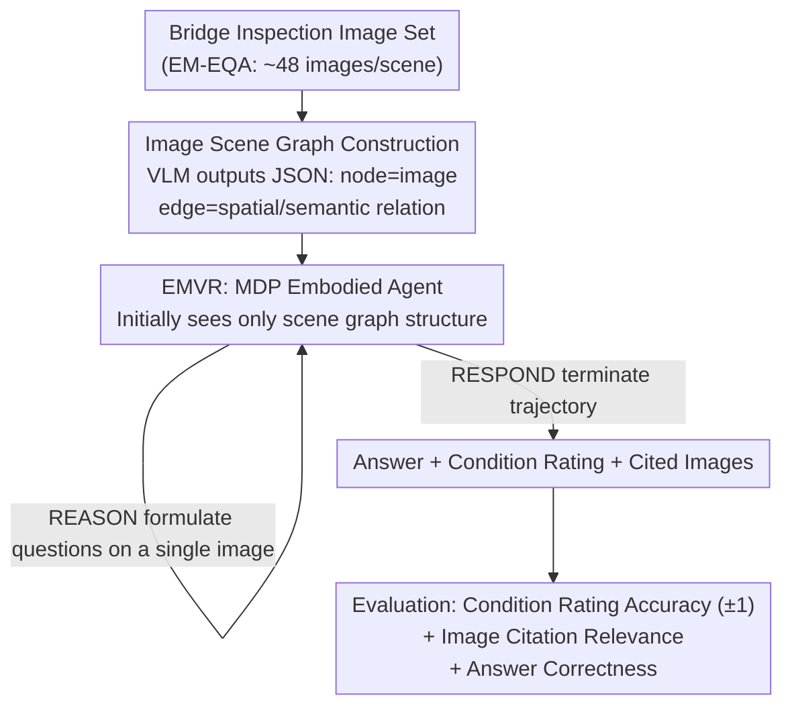

# BridgeEQA: Virtual Embodied Agents for Real Bridge Inspections

**Conference**: CVPR 2026  
**Paper**: [CVF Open Access](https://openaccess.thecvf.com/content/CVPR2026/html/Varghese_BridgeEQA_Virtual_Embodied_Agents_for_Real_Bridge_Inspections_CVPR_2026_paper.html)  
**Code**: https://drags99.github.io/bridge-eqa/  
**Area**: Embodied Agents / Multimodal VLMs / Embodied QA  
**Keywords**: Embodied Question Answering, Bridge Inspection, Image Scene Graphs, MDP Agents, Long-Context Position Bias

## TL;DR
This paper abstracts infrastructure inspection into a new class of Embodied Question Answering tasks (Inspection EQA), releases BridgeEQA (a benchmark of 2,200 expert-annotated bridge inspection QA pairs), and proposes EMVR—a method that reformulates "one-shot feeding of all images" long-context QA as an agent actively navigating and gathering evidence on an image-node scene graph via an MDP. This mitigates "lost-in-the-middle" in long contexts, significantly outperforming non-navigational baselines in condition rating accuracy, image citation relevance, and answer correctness.

## Background & Motivation

**Background**: Embodied Question Answering (EQA) requires agents to answer natural language questions based on spatially distributed visual observations, spanning two settings: Episodic Memory EQA (EM-EQA, answering from a precollected set of all required images) and Active EQA (A-EQA, autonomous exploration). Existing benchmarks like OpenEQA limit scenes to household environments with simplistic questions (e.g., counting objects, determining positions). The strongest baseline on EM-EQA is Multi-Frame VLM—which feeds all images of a scene directly into the VLM's context for a single-turn response.

**Limitations of Prior Work**: Existing benchmarks feature small spatial scales and simplistic questions, severely underestimating the difficulty of real-world deployment. Real-world scenarios often involve massive spatial spans, hierarchical structures from global overviews to fine-grained details, heterogeneous imaging conditions, and the need to align observations with domain-specific evaluation standards. Meanwhile, when the strongest Multi-Frame VLMs are fed dozens or hundreds of images in their context, they suffer from the position-bias of long-context LLMs: information in the middle of the sequence is "lost in the middle," causing severe degradation in answer quality and visual grounding.

**Key Challenge**: Real inspections require an entire reasoning chain: navigating through dozens of images covering the entire structure, synthesizing cross-view evidence to form component-level evaluations, citing supporting images, and aligning with written inspection standards. A fundamental conflict exists between one-shot long-context inputs and position bias—the more images provided, the more likely key evidence falls into the ignored middle section.

**Goal**: (1) Provide a benchmark that truly tests this complete reasoning chain with objectively comparable evaluations; (2) Design an answering method unaffected by long-context position bias; (3) Propose a metric to measure whether visual evidence is correctly cited.

**Key Insight**: The authors observe that bridge inspection naturally satisfies several scarce conditions: multi-scale reasoning, long-range spatial understanding, expert-annotated reports as ground truth, first-person imagery, and standardized numerical ratings (NBI 0–9 scale), making it an ideal testbed for advancing Episodic Memory EQA. Simultaneously, they note that since the issue lies in "passively receiving all images," it can be resolved by redesigning the process into an agent performing "active, on-demand evidence gathering."

**Core Idea**: Reformulate EM-EQA as A-EQA—using an image-node scene graph as an allocentric map, allowing an embodied agent to dynamically retrieve information through an MDP, bringing key evidence from the middle to the end of the context window, fundamentally avoiding position bias.

## Method

### Overall Architecture
BridgeEQA comprises two independent yet complementary paths of contributions: data & evaluation (Inspection EQA problem class + BridgeEQA dataset + Image Citation Relevance metric), and method (EMVR agent). The core pipeline of the method is as follows: first, dozens of inspection images of a bridge scene are used to automatically construct an image scene graph $G=(V,E,I)$ via a VLM (where nodes represent images and edges represent spatial/semantic relationships between them). Then, an embodied agent, with a VLM acting as its policy, navigates this graph using a Markov Decision Process (MDP). Initially, the agent only sees the structure of the scene graph (node labels, descriptions, edges). It then dynamically retrieves relevant images into its context on-demand using function calls: `MOVE / COMPARE / REASON / RESPOND`. Finally, it outputs an answer complete with image citations and condition ratings. Compared to the baseline of feeding all images at once, EMVR allows the model to decide which images to view and when, ensuring key evidence is positioned at the end of the context.

### Key Designs

**1. Inspection EQA Problem Class: Abstracting 'Inspection' into a Cross-Domain Reusable EQA Subclass**

Instead of stopping at merely creating "yet another dataset," the authors first define a generalized problem class: asset-centric, multi-view question answering. The agent must synthesize visual evidence across multiple viewpoints, align answers with standardized condition rating rubrics, localize supporting evidence, and match domain-expert consensus. To make this class comparable across domains (e.g., dams, tunnels, pipelines beyond bridges), the authors provide a quantitative checklist: all QA pairs must rely on multiple views, all answers must bind to a standardized rating scale, all QA pairs must have reference image sets for evidence localization, and "citation relevance must highly correlate with human consistency." Any dataset satisfying these criteria with a high percentage constitutes an Inspection EQA benchmark, enabling direct cross-comparison with future asset types. This elevates a specific application into a standardized class of research problems.

**2. Image Scene Graphs: Nodes as Images Instead of Objects, Requiring No GPS/Sensors**

Scene graphs in the general domain typically use detected "objects" as nodes. However, bridge inspection lacks foundation models capable of densely detecting all structural components (bearings, expansion joints, specific degradation modes), making object-centric approaches unfeasible. This work instead treats the images themselves as nodes: in the scene graph $G=(V,E,I)$, $V$ is the set of nodes (each corresponding to a viewpoint and its image), $E\subseteq V\times V$ is the directed edges representing spatial/semantic relations between views, and $I$ represents all images, where nodes and images are bijectively mapped ($|V|=|I|$). Every node encapsulates its image file name, an anchor focus (describing the main component using inspection terminology, e.g., "Span 1 deck and superstructure"), image descriptions, and incoming/outgoing edges. Edges carry relationship descriptors covering hierarchical ("is a detail view of..."), structural ("supports/supported by"), spatial adjacency, status similarity, and component membership. Importantly, graph construction is purely visual, requiring no GPS, geographical metadata, or external spatial sensors—the VLM processes the images and directly outputs a structured JSON with minimal fields (image description, focus, and edges). This design elegantly converts an EM-EQA problem (an unordered set of images) into an A-EQA problem (a navigable map systematically explored by an agent), while maintaining cross-domain generalizability due to its minimalist schema. Graph construction is automated using Gemini 2.5 Flash, retreating to Gemini 2.5 Pro upon parsing errors.

**3. EMVR: Reformulating QA as MDP Navigation over Scene Graphs, Tackling the "Lost in the Middle" Problem**

This is the most core contribution on the methodological side. EMVR models the agent's decision-making process as a sequential navigation and selective retrieval MDP: at timestep $t$, the state $s_t=(v_t, h_t)$ consists of the current node $v_t$ and the interaction history $h_t$ (already viewed images and observations). The observation space is the entire scene graph structure $G$ (anchor focuses, image descriptions, and edge relations of all nodes). At each step, the agent observes the current node $v_t$ and can query its neighbors $N(v_t)=\{v_j\mid (v_t,v_j)\in E\}$. The action space consists of four types of function calls: `MOVE(v_j)` to navigate to a neighboring node; `COMPARE({v_i,v_j,...})` to load and contrast images from two or more nodes ($|\{v_i,v_j,...\}|\ge 2$); `REASON(v_i)` to query details on a single image; and `RESPOND(q)` to output the final answer containing image citations and condition ratings and terminate the trajectory. The policy $\pi(a_t\mid s_t, q)$ is implemented by a VLM, terminating when `RESPOND` is executed.

Why it works: Unlike Multi-Frame VLM, which receives all images simultaneously in a single turn, EMVR initiates only with the scene graph structure (nodes, edges, semantic labels) and retrieves images on-demand. This effectively enables the agent to dynamically extract key visual evidence "scattered in the middle" and pull them to the end of the context window (as shown in Figure 2 of the paper). This leverages the model's position bias at both ends of the sequence in reverse—ensuring crucial information is always placed at the very end, circumventing the "lost in the middle" pitfall.

**4. Image Citation Relevance: A New Metric to Evaluate "Whether the Evidence is Correctly Cited"**

Real-world inspections require inspectors to corroborate ratings with photographs. Thus, the authors propose a corresponding evaluation dimension: along with the textual response, the agent must explicitly output a set of supporting images $R_{agent}=\{i'_1,...,i'_m\}$ to be compared semantically with reference images $R=\{i_1,...,i_k\}$ extracted from the original PDF reports (photos explicitly linked in the text descriptions by inspectors). Concretely, Gemini 2.5 Flash acts as a VLM-as-a-judge, taking the question, ground truth answer, reference images (as illustrative examples rather than absolute metrics), and agent-selected images to score relevance on a scale of $0.0$–$1.0$. A penalty is applied for over-citation (when the agent cites over 5 times the number of images in the reference set; empirically, most methods average under 6 images, rarely triggering this penalty). This metric is validated by three annotators for human alignment, achieving an average Spearman correlation coefficient of $0.817$ with human judgments. The value of this metric lies in using low-quality image citations as a proxy signal for detecting hallucinations or poor answers—incorrect responses are highly correlated with incorrect citations or hallucinated references (citing images that do not exist).

### A Complete Example
Taking a real QA instance as an example (from Figure 10, rating creosoted timber piles, ground truth answer SATISFACTORY, rating 6):
- EMVR (Grok 4 Fast, w/ Images + SG) starts from the scene graph structure, uses `MOVE` to navigate to nodes related to the timber piles, and uses `COMPARE` to retrieve images of Pier 1/Pier 2. It identifies "minor vertical splitting + surface weathering, no decay/no structural damage, diagonal bracing intact," and executes `RESPOND` with a rating of 7 and correct reference image citations—yielding Answer Correctness of 0.8, Image Citation Relevance of 0.95, and a rating within ground truth ±1.
- In contrast, the Multi-Frame VLM processes all images at once, incorrectly judging the condition as "severe deterioration," and outputs a rating of 3, resulting in an Answer Correctness and Image Citation Relevance of 0.0 (citing wrong images). Another failure case shows Gemini 2.5 Flash hallucinating non-existent image names (e.g., IMG_4507/4508/4509).

This example intuitively shows that active evidence gathering ensures the agent views the correct images to accurately perform the rating, while citation quality serves as an effective probe for answer reliability.

## Key Experimental Results

Dataset: 2,200 QA pairs (derived from 200 bridge inspection reports from the Vermont Agency of Transportation VTrans, covering 73 towns and 9,586 images, averaging 47.93 images/scene), with an even 1,100 / 1,100 split for train/test. Question types predominantly focus on aggregate reasoning (38.5%) and comparative analysis (27.2%), followed by relational reasoning (21.3%) and spatial analysis (17.5%) (questions can belong to multiple categories). NBI rating distribution is centered around 5–7 (Fair to Good), with rating 6 being the most frequent.

### Main Results
Evaluating three VLMs (Gemini 2.5 Flash Lite / Flash, Grok 4 Fast) × five methods on the 1,100 test samples. The table below displays **Answer Correctness** (LLM-as-a-judge):

| Method | Gemini 2.5 Flash Lite | Gemini 2.5 Flash | Grok 4 Fast |
|------|------|------|------|
| Multi-Frame VLM | 0.507 | 0.484 | 0.576 |
| Socratic LLM w/ SG | 0.542 | 0.588 | 0.614 |
| Multi-Frame VLM w/ SG | 0.581 | 0.548 | 0.622 |
| EMVR VLM w/ SG Only | 0.512 | **0.609** | 0.638 |
| EMVR VLM w/ Images + SG | 0.497 | 0.551 | **0.648** |

**Image Citation Relevance** (Visual Evidence Localization):

| Method | Gemini 2.5 Flash Lite | Gemini 2.5 Flash | Grok 4 Fast |
|------|------|------|------|
| Multi-Frame VLM | 0.717 | 0.694 | 0.687 |
| Socratic LLM w/ SG | 0.775 | 0.767 | 0.838 |
| Multi-Frame VLM w/ SG | 0.802 | 0.778 | 0.833 |
| EMVR VLM w/ SG Only | 0.798 | **0.836** | 0.876 |
| EMVR VLM w/ Images + SG | **0.849** | 0.803 | **0.889** |

Using Grok 4 Fast, EMVR compared to Multi-Frame VLM shows an improvement of **9.34 percentage points** in condition rating accuracy (±1), **20.2 percentage points** in Image Citation Relevance, and **7.2 percentage points** in Answer Correctness. On average, across all non-navigational baselines, the overall improvements are: rating accuracy +13.6%, visual evidence localization +29%, and answer quality +12.5%.

### Ablation Study
The five methods form a progressive series of ablations, highlighting two crucial comparisons:

| Configuration | Role | Phenomenon |
|------|------|------|
| Multi-Frame VLM → + w/ SG | Adding scene graph context to baselines | Answer Correctness generally increases (e.g., Grok 0.576 $\rightarrow$ 0.622), proving the scene graph structure itself is helpful |
| w/ SG Only vs. w/ Images + SG | Whether EMVR loads images initially | On Grok 4 Fast, "Images + SG" performs better (0.648 vs 0.638, citation 0.889 vs 0.876); however, on Gemini 2.5 Flash, "SG Only" yields higher results (0.609 vs 0.551)—suggesting that loading images initially may dilute attention in certain models |

### Key Findings
- **Active, navigation-based evidence gathering > One-shot long-context**: EMVR outperforms Multi-Frame VLM almost across the board on all three models, validating the hypothesis that "position bias is the primary cause, which can be mitigated via active retrieval."
- **Scene graphs bring universal gains**: Even without switching to EMVR, merely adding the scene graph context to the Multi-Frame VLM improves performance, demonstrating that structured graph relationships themselves reduce reasoning difficulty.
- **Whether to load images initially is model-dependent**: Stronger models (Grok 4 Fast) benefit from digesting initial images, while on weaker or smaller-context models, "providing only structure and pulling images on-demand" is more robust—representing an engineered trade-off worth noting.
- **Citation quality acts as a hallucination probe**: The two main failure modes (citing the wrong images and hallucinating non-existent ones) are both accompanied by degraded answers, indicating that low Image Citation Relevance can serve as a proxy signal for hallucination detection.

## Highlights & Insights
- **Clever perspective pivot from EM-EQA to A-EQA**: Passively receiving the exact same set of images results in "lost-in-the-middle", whereas active, on-demand evidence gathering shifts key evidence to the end of the context window. Substantial improvements are achieved merely by changing the "feeding mechanism" without changing the model itself. This reframing is transferable to any long-context multimodal task where too many images are present.
- **Image-centric scene graphs bypass the lack of foundation models**: When a specific domain lacks dense object detectors, utilizing "images as nodes + VLM generated relationships" serves as a highly pragmatic alternative that is purely visual, requires no GPS, and lowers boundaries for cross-domain usage.
- **Metric as a diagnostic tool**: Image Citation Relevance does not just offer scoring; it simultaneously serves as a hallucination detector. This design of "using evaluation metrics to feedback into reliability" is highly worth learning from.
- **Problem class + checklist**: Formulating "inspection" into a cross-domain comparable EQA subclass via a quantitative checklist leaves a unified interface for future dataset creation in dams, tunnels, pipeline inspections, etc.

## Limitations & Future Work
- **Failure on open-source small models**: Multiple open-source VLMs (<30B parameters) tested by the authors could not reliably follow structured output formats and function calls, and their context windows were too small for large-scale scene evaluations, excluding them from the major comparison. EMVR currently relies heavily on the agentic capabilities of closed-source frontier models.
- **Scene graph quality depends on VLMs**: Graph construction is automated by Gemini and only rolls back upon errors. Whether the edge relations in the graph are reliable directly impacts navigation quality. The paper inspects the effects of the number of nodes/edges in the supplementary material but is not thoroughly detailed in the main text.
- **LLM-as-a-judge in evaluation**: Both Answer Correctness and Image Citation Relevance rely on a VLM as an evaluator. Although validated with human consensus (Spearman correlation of 0.817), inherent biases within the evaluator model might still introduce systematic errors.
- **Narrow domain + long-tailed ratings**: Data is collected from reports from a single state (Vermont), where NBI ratings are concentrated between 5–7 and severely degraded samples are scarce, preventing a rigorous evaluation of the model's performance on long-tailed ratings.
- **Improvement directions**: Exploring trainable navigation policies (current policy is merely prompt-driven VLM), converting scene graph construction into a learnable/verifiable module, or extending the method to real active exploration (e.g., real-time image capture via robots/drones).

## Related Work & Insights
- **vs. Multi-Frame VLM [28]**: It pipes all images into the context for a single-turn answer, serving as the strongest baseline on EM-EQA. This paper argues it suffers from long-context position bias, and by changing to on-demand MDP navigation, substantially outperforms it across multiple models—the difference being "passive full sequence vs. active selectivity."
- **vs. Socratic LLM w/ SG [28,47]**: Both use scene graphs, but the latter uses Socratic self-questioning. EMVR performs explicit structured navigation using MOVE/COMPARE/REASON/RESPOND actions, which is superior across most configurations.
- **vs. OpenEQA [28]**: OpenEQA is the first open-vocabulary EQA benchmark (180 household scenes, 1,600 QA pairs), but is restricted to simple home layouts and queries. BridgeEQA introduces multi-scale structural engineering, heterogeneous imaging, and domain-expert rating criteria, posing a much higher difficulty while keeping expert reviews and ratings aligned.
- **vs. Object-centric 3D Scene Graphs [6,1,15,37]**: The general domain uses detected objects as nodes, relying heavily on strong object detectors. Lacking such foundation models in the bridge domain, this work replaces them with images as nodes—purely visual, needing no point clouds or sensors.

## Rating
- Novelty: ⭐⭐⭐⭐⭐ Highly original, combining three major contributions: abstracting inspections into the Inspection EQA problem class, utilizing images as nodes in the scene graph, and reformulating EM-EQA to A-EQA via an MDP.
- Experimental Thoroughness: ⭐⭐⭐⭐ Evaluated across 3 models × 5 methods, featuring double evaluation metrics with validated human consistency and failure mode analysis; however, restricted by closed-source dependencies, a single data source, and a shortage of longtail ratings.
- Writing Quality: ⭐⭐⭐⭐⭐ Clear motivation (analogy $\rightarrow$ inspection $\rightarrow$ EQA), rigorous definitions for methods and metrics, and intuitive illustrations.
- Value: ⭐⭐⭐⭐⭐ High real-world impact (inspecting aging infrastructure). The benchmark, metrics, and methods are released open-source as a complete suite, and the reframing paradigm is highly generalizable to broad long-context multimodal QA.

<!-- RELATED:START -->

## Related Papers

- [\[ICLR 2026\] Real-Time Reasoning Agents in Evolving Environments](../../ICLR2026/llm_agent/real-time_reasoning_agents_in_evolving_environments.md)
- [\[AAAI 2026\] Cook and Clean Together: Teaching Embodied Agents for Parallel Task Execution](../../AAAI2026/llm_agent/cook_and_clean_together_teaching_embodied_agents_for_paralle.md)
- [\[CVPR 2026\] WebChain: A Large-Scale Human-Annotated Dataset of Real-World Web Interaction Traces](webchain_a_large-scale_human-annotated_dataset_of_real-world_web_interaction_tra.md)
- [\[ACL 2025\] SynWorld: Virtual Scenario Synthesis for Agentic Action Knowledge Refinement](../../ACL2025/llm_agent/synworld_agentic_action_knowledge.md)
- [\[ICLR 2026\] OmniActor: A Generalist GUI and Embodied Agent for 2D&3D Worlds](../../ICLR2026/llm_agent/omniactor_a_generalist_gui_and_embodied_agent_for_2d3d_worlds.md)

<!-- RELATED:END -->
