# CarePilot: A Multi-Agent Framework for Long-Horizon Computer Task Automation in Healthcare

**Conference**: CVPR 2026 Findings  
**arXiv**: [2603.24157](https://arxiv.org/abs/2603.24157)  
**Code**: Yes (Carepilot Project Page)  
**Area**: LLM Agent / Healthcare Automation  
**Keywords**: Healthcare Software Automation, Multi-Agent Framework, Actor-Critic, Long-Horizon GUI Interaction, Dual-Memory Mechanism

## TL;DR
This paper proposes the CareFlow benchmark (1,050 long-horizon healthcare software workflow tasks, 8–24 steps, covering DICOM/3D Slicer/EMR/LIS systems) and the CarePilot framework (based on the Actor-Critic paradigm, integrating tool grounding and a dual-memory mechanism), which outperforms GPT-5 by approximately 15% in task accuracy on CareFlow.

## Background & Motivation

**Background**: Multimodal agents have advanced in Android, desktop, and web environments (Mind2Web, SeeAct, UI-TARS, etc.), yet standardized benchmarks for healthcare software remain absent.

**Unique Challenges of Healthcare Software**: (1) Daily clinical operations require chaining 10–15 dependent steps (e.g., open study → configure view → annotate → export → update records); (2) Platforms are highly heterogeneous and frequently updated; (3) Strict requirements for data integrity, audit trails, and privacy compliance; (4) Institution-specific interface layouts make agents overfitted to surface layouts fragile.

**Limitations of Prior Work**: (1) Absence of public long-horizon interaction benchmarks for healthcare software; (2) Existing VLMs (GPT-4o, Gemini, etc.) perform poorly on healthcare GUIs—while step-level accuracy is acceptable, task completion rates are extremely low.

**Key Insight**: Establish the first long-horizon healthcare software benchmark and design an Actor-Critic agent integrated with tool grounding and memory mechanisms.

**Core Idea**: An Actor predicts the next action → A Critic evaluates and corrects it → Dual memory (short-term + long-term) maintains workflow context → Iterative simulation training enhances robustness.

## Method

### Overall Architecture
CarePilot targets long-process tasks in healthcare software involving 8–24 steps where a single error can lead to total failure (e.g., locating a sequence in a DICOM browser and performing annotation). A single-step loop consists of: Natural language goal + current screenshot → **Tool Grounding** (UI detection + OCR + scaling + template matching) to localize controls → **Actor** reads dual memory + grounding signal $\phi_t$ to predict semantic actions → **Critic** evaluates (providing corrective feedback or approving execution) → Update memory → Proceed to the next step. The architecture comprises four components: a domain benchmark (CareFlow), perception layer (Tool Grounding), memory layer (Dual Memory), and decision layer (Actor-Critic).

```mermaid
%%{init: {'flowchart': {'rankSpacing': 24, 'nodeSpacing': 28, 'padding': 6, 'wrappingWidth': 400, 'subGraphTitleMargin': {'top': 8, 'bottom': 16}}}}%%
flowchart TD
    subgraph CF["CareFlow 基准"]
        direction TB
        S1["种子任务设计<br/>专家梳理操作约束"] --> S2["多样性扩展<br/>替换/调参/增删步骤"]
        S2 --> S3["逐步 GUI 标注<br/>截图 + 语义动作标签"]
        S3 --> S4["质量过滤<br/>Cohen's κ=0.78"]
    end
    CF -.训练/评测数据.-> IN["目标指令 + 当前截图"]
    IN --> G["工具 Grounding<br/>UI 检测+OCR+缩放+模板匹配 → 信号 φ_t"]
    G --> A["Actor<br/>读双记忆 + φ_t 预测语义动作"]
    A --> C{"Critic 评估"}
    C -->|不符, 给修正反馈| A
    C -->|放行执行| M["双记忆更新<br/>短期纠错 + 长期保全局上下文"]
    M -->|未完成| G
    M -->|完成| OUT["输出 COMPLETE"]
```

### Key Designs

**1. CareFlow Benchmark: Establishing Reliable Healthcare Task Data**

Given the lack of data for medical GUI automation, the authors constructed a benchmark via a four-stage process:

- **(i) Seed Task Design**: Collaborated with domain experts to outline software usage patterns and operational constraints to extract a core task list.
- **(ii) Diversity Expansion**: Controlled substitutions (e.g., "MRI report" → "X-ray report"), parameter adjustments, and step additions/deletions.
- **(iii) Step-by-step GUI Annotation**: Saved screenshots for each step alongside precise semantic action labels for the next step.
- **(iv) Quality Filtering**: Screened based on chronological consistency, task completeness, and instruction clarity; inter-annotator agreement reached Cohen's $\kappa=0.78$.

The benchmark covers Weasis/Orthanc (DICOM), 3D Slicer (Annotation), OpenEMR (EMR), and OpenHospital (LIS); it scales to 1,050 tasks (735 training + 315 testing, including 50 OOD), with 8–24 steps per task and 6 action types (CLICK/SCROLL/ZOOM/TEXT/SEGMENT/COMPLETE).

**2. Tool Grounding: Precise Localization of Dense Controls**

Healthcare software often features dense, small controls and variable themes. CarePilot utilizes four perception modules to output a unified grounding signal $\phi_t$: open-vocabulary **UI Object Detection** (returning bboxes for text queries), **Zoom/Crop** (magnifying small controls), **OCR** (extracting text labels such as sequence names or patient IDs), and **Template/Icon Matching** (robust against theme, scaling, and language variations).

**3. Dual Memory: Countering Error Accumulation**

Long-horizon workflows are vulnerable to cascading errors. CarePilot provides the Actor with two memory layers:

- **Short-term Memory** $\mathcal{M}_t^S = f^S(x_{t-1}, a_{t-1}, r_{t-1})$: Stores the previous screenshot, action, and Critic feedback for immediate error correction.
- **Long-term Memory** $\mathcal{M}_t^L = f^L(\mathcal{M}_{t-1}^L, \mathcal{M}_t^S, \phi_t)$: A compact trajectory embedding that integrates historical states and results to maintain global context.

Action prediction is conditioned on both: $a_t = \pi_\theta(g, x_t, \mathcal{M}_t^S, \mathcal{M}_t^L)$, ensuring both fine-grained detail and global consistency over 20+ steps.

**4. Actor-Critic: Concurrent Execution and Self-Correction**

Both Actor and Critic are instantiated using Qwen-VL 2.5-7B with different input conditions. The Actor proposes semantic actions based on current GUI, instructions, grounding signals, and memory. The Critic evaluates the proposal, offering corrective feedback or approval, and updates the dual memory. This "self-check" at every step prevents errors from propagating into the long-term history.

### Complete Walkthrough ("Open T2 sequence in Weasis and measure lesion")
1. **Grounding**: Current screenshot is processed by four modules; OCR identifies sequence names, and $\phi_t$ marks the bbox for the "T2" item.
2. **Actor**: Combines the goal, $\phi_t$, and memory to propose `CLICK(T2 sequence)`.
3. **Critic**: Confirms the target is T2, approves execution, and records "T2 selected" in short-term memory.
4. **Next Step**: As the interface switches to T2 view, long-term memory retains "Status=Sequence localized, Task=Perform measurement"; the Actor proposes `ZOOM` on the lesion area.
5. **Error Correction**: If the Actor mistakenly clicks T1, the Critic detects the mismatch, blocks execution, and provide corrective feedback. The error does not enter the long-term memory.
6. **Finalization**: Outputs `COMPLETE` once measurement is finished.

### Loss & Training
Tasks are modeled as sequential decision-making, where success is judged by a validator $V$ determining if the workflow was completed:

$$\hat{a}_{1:T} = \mathbb{1}[V(g, x_{1:T}, a_{1:T}) = 1]$$

## Key Experimental Results

### Main Results (CareFlow)

| Model | Weasis SWA/TA | 3D Slicer SWA/TA | OpenEMR SWA/TA | Average SWA/TA |
|------|:-:|:-:|:-:|:-:|
| Qwen2.5 VL 7B | 58.6/1.3 | 61.4/1.7 | 63.2/1.7 | 57.2/1.8 |
| Llama 4 Maverick | 88.2/18.7 | 71.6/3.4 | 78.0/25.7 | 80.5/19.2 |
| GPT-4o | 85.3/20.0 | 77.5/27.4 | 85.1/27.5 | 83.1/25.4 |
| GPT-5 | 88.7/31.3 | 81.4/37.9 | 83.8/31.3 | 85.2/36.2 |
| **CarePilot (7B)** | **90.4/40.0** | **82.1/54.8** | - | **SOTA** |

CarePilot (based on a 7B model) outperforms GPT-5 by approximately 15% in Task Accuracy (TA).

### Ablation Study

| Configuration | Avg SWA | Avg TA | Description |
|------|---------|--------|------|
| Qwen-VL 7B (Baseline) | 57.2 | 1.8 | No Agent framework |
| + Tool Grounding | +Gain | +Gain | Enhanced perception |
| + Dual Memory | +Gain | +Gain | Context maintenance |
| + Actor-Critic | **SOTA** | **SOTA** | Critical corrective feedback |

### Key Findings
- **Gap between Step-level Accuracy (SWA) and Task Accuracy (TA)**: GPT-4o achieves 83% SWA but only 25% TA, as error accumulation in long-horizon tasks severely impacts completion rates.
- CarePilot’s Critic mechanism significantly mitigates error accumulation, improving TA from a baseline of ~2% to over 40%.
- **3D Slicer (Medical Annotation)** is the most difficult software, requiring precise spatial operations; CarePilot shows the most significant improvement here.
- On the **OOD test set** (50 tasks), CarePilot maintains a 3.38% improvement, demonstrating generalization.
- OCR is crucial for EMR systems due to the high density of precise text fields.

## Highlights & Insights
- **First Long-Horizon Healthcare GUI Benchmark**: CareFlow fills a critical gap in evaluating AI automation for healthcare software.
- **7B Model Outperforms GPT-5**: Proper agent frameworks (tool enhancement + memory + feedback) are more vital than model size for domain-specific tasks.
- **Healthcare-adapted Actor-Critic**: Critics provide "how to correct" feedback, which is essential for safety-critical healthcare scenarios.
- **Step-level Accuracy $\neq$ Task Success**: High single-step performance does not guarantee workflow completion, a vital lesson for long-horizon agent research.

## Limitations & Future Work
- CareFlow only covers 5 open-source systems; generalization to commercial software (Epic, Cerner) remains to be verified.
- Having the Actor and Critic share the same model might lead to shared "blind spots."
- Current training relies on reference trajectories; future work should explore online learning without such dependencies.
- Safety evaluations are limited; consequences of erroneous operations in healthcare are significant.

## Related Work & Insights
- **vs. WebArena/AppWorld**: These general benchmarks do not cover the specialized requirements of the healthcare domain.
- **vs. Voyager/Reflexion**: Memory and reflection mechanisms inspired CarePilot, but they target gaming or general scenarios.
- **vs. Mind2Web/SeeAct**: These are short-horizon GUI agents incapable of handling long dependency chains in medical workflows.

## Rating
- **Novelty**: ⭐⭐⭐⭐ Innovative domain application and sound framework design.
- **Experimental Thoroughness**: ⭐⭐⭐⭐⭐ Comprehensive systems, multiple baselines (including GPT-5), OOD testing, and rigorous ablation.
- **Writing Quality**: ⭐⭐⭐⭐ Detailed benchmark construction and clear framework description.
- **Value**: ⭐⭐⭐⭐⭐ Directly applicable value for healthcare AI automation.

<!-- RELATED:START -->

## Related Papers

- [\[CVPR 2026\] Think, Then Verify: A Hypothesis-Verification Multi-Agent Framework for Long Video Understanding](think_then_verify_a_hypothesis-verification_multi-agent_framework_for_long_video.md)
- [\[ICLR 2026\] The Tool Decathlon: Benchmarking Language Agents for Diverse, Realistic, and Long-Horizon Task Execution](../../ICLR2026/llm_agent/the_tool_decathlon_benchmarking_language_agents_for_diverse_realistic_and_long-h.md)
- [\[ICLR 2026\] AgentSynth: Scalable Task Generation for Generalist Computer-Use Agents](../../ICLR2026/llm_agent/agentsynth_scalable_task_generation_for_generalist_computer-use_agents.md)
- [\[CVPR 2026\] Nerfify: A Multi-Agent Framework for Turning NeRF Papers into Code](nerfify_multiagent_nerf_paper_to_code.md)
- [\[ICLR 2026\] Efficient Agent Training for Computer Use](../../ICLR2026/llm_agent/efficient_agent_training_for_computer_use.md)

<!-- RELATED:END -->
