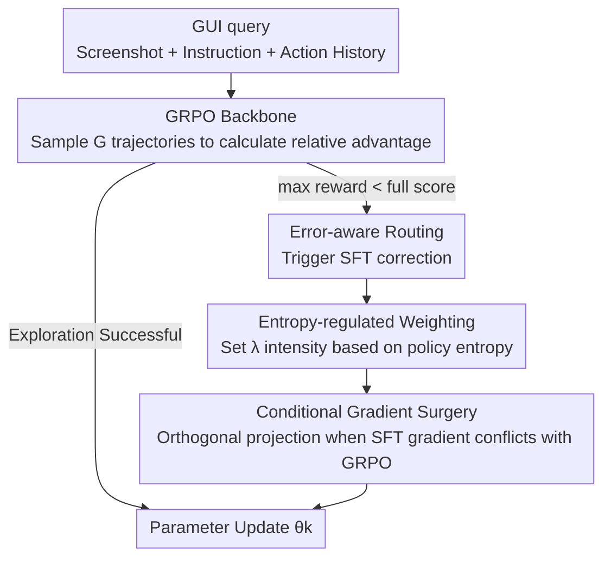

# CGL: Advancing Continual GUI Learning via Reinforcement Fine-Tuning

**Conference**: CVPR 2026  
**Paper**: [CVF Open Access](https://openaccess.thecvf.com/content/CVPR2026/html/Yao_CGL_Advancing_Continual_GUI_Learning_via_Reinforcement_Fine-Tuning_CVPR_2026_paper.html)  
**Code**: The paper claims it will be open-sourced (benchmark / code / model), but the repository address is not provided yet.  
**Area**: Agent / Continual Learning / Reinforcement Fine-Tuning  
**Keywords**: GUI Agent, Continual Learning, GRPO, Gradient Surgery, Policy Entropy  

## TL;DR
Aiming at the "learning new while forgetting old" problem of GUI agents under frequent app updates, this paper discovers that SFT learns quickly but overwrites old knowledge, while RL (GRPO) resists forgetting but learns slowly. Therefore, the CGL framework is proposed—using "error-aware routing + entropy-regulated weighting + conditional gradient surgery" to integrate SFT and GRPO, achieving the highest accuracy and near-zero forgetting on the self-built AndroidControl-CL benchmark.

## Background & Motivation
**Background**: With the help of Multimodal Large Language Models (MLLM), GUI agents can already understand interface screenshots and perform step-by-step click operations according to natural language instructions. Mainstream training paradigms are either pure SFT (supervised fine-tuning on large-scale annotated GUI trajectories) or reinforcement fine-tuning using RL such as GRPO. However, these paradigms assume that the task set is static.

**Limitations of Prior Work**: Real-world GUIs are constantly changing—app updates, the emergence of new categories, and slight adjustments to login page layouts or menu hierarchies can invalidate previously learned interaction strategies. Training an agent sequentially through a series of evolving apps causes its performance on "ancestor tasks" to drop precipitously. Furthermore, GUI tasks have long-range action dependencies: the success of a whole trajectory depends on the precision of every intermediate step, making catastrophic forgetting more lethal than in traditional Vision/NLP continual learning.

**Key Challenge**: The authors conducted a set of key controlled experiments (Fig. 2) revealing that SFT and RL follow two opposite optimization paths. SFT gradient updates are "aggressive," forcibly pulling model parameters toward the manifold of the new task, thereby destroying the structural integrity of old knowledge—learning fast but forgetting heavily. GRPO possesses an "inherent resilience": it preserves wider behavioral diversity and optimizes rewards without erasing the underlying interaction logic—resisting forgetting but with high sample complexity and slow convergence in unfamiliar environments, failing to meet realistic efficiency requirements. Thus, stability (old tasks) and plasticity (new tasks) become a zero-sum trade-off.

**Goal**: In a continual learning setting, enable the agent to rapidly absorb interaction skills of new apps without violating the "logical red lines" of already mastered skills.

**Key Insight**: Since SFT excels in plasticity and GRPO excels in stability, instead of choosing one, let them collaborate—use GRPO as the backbone to protect old logic and inject SFT targets only when GRPO exploration fails, while resolving gradient conflicts between the two at the parameter level.

**Core Idea**: Using GRPO as the anchor and SFT as the patch, the supervision signal is constrained within a subspace that does not destroy the anti-forgetting direction of GRPO through three mechanisms: "when to inject SFT (routing), how much to inject (entropy regulation), and how to ensure the injection direction does not hurt old knowledge (gradient surgery)."

## Method

### Overall Architecture
CGL treats the agent as a policy network $\pi_\theta$. At each time step, it observes the current screenshot $v_t$ and a global natural language instruction $I$, outputs the next action $a_t$ in text form, and then parses it into executable GUI commands (click coordinates, scroll, input text). The continual learning protocol is strict: tasks $T_1,\dots,T_N$ arrive sequentially, the app sets for each task are non-overlapping ($A_i \cap A_j=\varnothing$), and when training on the $k$-th task, only $D_k^{train}$ can be used without access to historical training data. However, evaluation is performed on the cumulative test set $\bigcup_{i=1}^{k} D_i^{test}$.

The entire framework revolves around a joint optimization goal, adding the GRPO loss and the dynamically weighted SFT loss together:

$$\mathcal{L} = \mathcal{L}_{GRPO} + \lambda(H, step)\cdot \mathcal{L}_{SFT}$$

Where GRPO is the backbone (responsible for anti-forgetting) and SFT is the controlled patch (responsible for rapid error correction). The weight $\lambda$ is determined by the policy entropy $H$ and the training steps. Three core modules manage specific tasks: **error-aware routing** decides "when" to trigger SFT, **entropy-regulated weighting** determines the "intensity" of SFT, and **conditional gradient surgery** ensures the "direction" of SFT updates does not damage the anti-forgetting direction of GRPO.

### Key Designs

**1. Error-aware Routing: Invite SFT only when GRPO exploration fails**

Training GUI agents with pure GRPO has a fatal weakness: when the policy has not yet learned a new interaction pattern, the $G$ rollouts sampled for the same instruction might all be incorrect. The advantage in GRPO is relative within a group—$A_{i,t}=\frac{r_i-\mu_r}{\sigma_r+\epsilon}$ ($\mu_r,\sigma_r$ are the mean and standard deviation of rewards for that group). If the entire group fails to get a full score, the relative advantage degrades into an almost indistinguishable signal, and the agent falls into ineffective exploration, unable to learn new skills. Error-aware routing breaks this deadlock: for each instruction, it checks the rewards of its $K$ rollouts. As long as $\max_k r(\tau_k) < r_{max}$ (even the highest reward doesn't reach full marks), it is determined that the policy cannot explore the correct solution on its own. Thus, this update is routed to an SFT step, optimizing the likelihood using the ground-truth demonstration $\tau^*$: $\mathcal{L}_{SFT}=-\frac{1}{|o^*|}\sum_t \log\pi_\theta(o^*_t\mid s, o^*_{<t})$. For coordinate-based spatial actions, $G$ valid points are also sampled within the target box for augmented SFT to enhance spatial generalization. In this way, SFT is used only to fix "pathological biases" (places where GRPO cannot find a successful path no matter how it tries), rather than indiscriminately overwriting.

**2. Entropy-regulated Weighting: Using policy entropy to control the "temperature" of SFT injection, warming up for exploration then cooling down for convergence**

Routing alone is not enough—too much SFT injection overpowers GRPO and hurts old knowledge, while too little fails to save stalled exploration. The authors make the SFT weight $\lambda$ a function of policy entropy $H(\pi_\theta(\cdot|s))=-\sum_a \pi_\theta(a|s)\log\pi_\theta(a|s)$ and provide a first-order theory: the entropy change caused by one step of optimization can be approximated as the negative covariance between current log-probabilities and logit updates $\Delta H \approx -\mathrm{Cov}_{a\sim\pi_\theta}(\log\pi_\theta(a|s), \Delta z_a)$. Based on this, it is divided into two stages:

- **Stage 1: Entropy Injection (warmup)**: In the first $step_w$ steps, $\lambda$ is linearly increased to the maximum. At this time, the model often pathologically favors wrong actions, and the probability of the ground-truth action approaches 0; the SFT update $\Delta z^{SFT}_a \propto (\mathbb{I}[a=a^*]-\pi_\theta(a|s))$ gives a large positive update to the low-probability $a^*$ and a negative update to high-probability wrong actions, creating strong negative covariance to inject entropy ($\Delta H_{SFT}>0$). This "heats up" the distribution, allowing it to jump out of local minima and forcing the agent to explore the correct space.
- **Stage 2: Entropy Decay (convergence)**: Once basic capabilities are established, $\lambda$ decays as an exponential function of entropy:

$$\lambda(H) = (\lambda_{max}-\lambda_{min})\,\min\!\big(1,\, k e^{\gamma H}\big) + \lambda_{min}$$

At this point, GRPO updates ($\Delta z^{GRPO}_a \propto \pi_\theta(a|s)A(s,a)$) dominate, strengthening actions that already have high probability and positive advantage due to the "Matthew effect," producing positive covariance to suppress entropy ($\Delta H_{GRPO}<0$). As $H$ decreases, $\lambda$ decays synchronously, ensuring that SFT no longer interferes with the precise convergence of GRPO and allowing knowledge to solidify for long-term retention.

**3. Conditional Gradient Surgery: "Operate" only when SFT gradient fights the GRPO anti-forgetting direction**

Even with controlled timing and intensity, SFT and GRPO may still have conflicting directions at the parameter level, destroying old knowledge. The authors use a conditional surgery: the correction is applied only when the angle between the two gradients exceeds 90° (negative cosine similarity). The conflict criterion is $\cos\alpha = \frac{\nabla_\theta\mathcal{L}_{SFT}\cdot\nabla_\theta\mathcal{L}_{GRPO}}{\|\nabla_\theta\mathcal{L}_{SFT}\|_2\,\|\nabla_\theta\mathcal{L}_{GRPO}\|_2} < 0$. Once a conflict is detected, the parallel component of the SFT gradient that is opposite to GRPO, $\nabla_\parallel = \frac{\nabla_\theta\mathcal{L}_{SFT}\cdot\nabla_\theta\mathcal{L}_{GRPO}}{\|\nabla_\theta\mathcal{L}_{GRPO}\|_2^2}\nabla_\theta\mathcal{L}_{GRPO}$, is removed, keeping only the part orthogonal to GRPO: $\nabla_\theta\mathcal{L}_{SFT}^* = \nabla_\theta\mathcal{L}_{SFT}-\nabla_\parallel$. The final SFT update is:

$$\nabla_\theta\mathcal{L}_{SFT}^{final} = \begin{cases}\nabla_\theta\mathcal{L}_{SFT}^*, & \cos\alpha<0\ (\text{conflict})\\[2pt] \nabla_\theta\mathcal{L}_{SFT}, & \text{otherwise}\end{cases}$$

This eliminates update components that oppose the GRPO anti-forgetting direction while retaining all orthogonal (non-conflicting) SFT information, effectively absorbing new knowledge without crossing "logical red lines."

### Loss & Training
The global objective is $\mathcal{L}=\mathcal{L}_{GRPO}+\lambda(H,step)\cdot\mathcal{L}_{SFT}$; GRPO utilizes standard objectives with clip and KL constraints (KL coefficient 0.01). For fairness, all methods first perform SFT on the first task to establish a shared baseline, and subsequent tasks are learned sequentially according to continual learning strategies. Key hyperparameters: $\lambda_{max}=1, \lambda_{min}=0, H_{max}=0.45, step_w=5, \gamma=20, k=e^{-10}$; GRPO/CGL based on verl, batch 16, rollout batch 512, learning rate $10^{-6}$, group size 8; trained on 8×Ascend 910B NPU.

## Key Experimental Results

### Main Results
A self-built Android-CL (AndroidControl-CL) benchmark organizes GUI tasks into sequential groups by 7 app categories: Shopping (SP), Communication (CO), Productivity (PO), Travel (TT), System Tools (ST), Education & Science (ES), and Life & Entertainment (LE). It defines 3 task orders to test robustness. Metrics include Step-wise Accuracy, Trajectory-wise Accuracy, and Forgetting Measure (FM) ($FM=\frac{1}{N-1}\sum_{k=1}^{N-1}(A_{N,k}-A_{k,k})$, where values closer to 0 indicate less forgetting). The following table shows the comparison for QwenVL2.5-3b under Task Order 1:

| Method | Avg. Step-Acc.(%) | Avg. Traj-Acc.(%) | Avg. FM |
|------|------|------|------|
| SFT | 76.90 | 23.53 | -5.73 |
| SFT+KL | 80.84 | 34.69 | -1.01 |
| SFT+Replay | 79.80 | 30.19 | -3.11 |
| GRPO | 81.53 | 36.78 | -0.62 |
| RIF-RFT | 80.44 | 32.91 | -0.58 |
| **CGL (Ours)** | **82.33** | **38.03** | **-0.02** |
| SFT-Joint-Training (Upper Bound) | 83.48 | 41.66 | - |

CGL achieves the highest Step/Traj accuracy and the smallest FM across two backbone scales (LLaVA-OneVision-0.5b and QwenVL2.5-3b). On the lightweight 0.5b model, Step-Acc is 77.84%, which is 1.27–5.18 pp higher than the baselines, with an FM of only -0.52 (much better than SFT's -6.81). It also lead stably across 3 task orders, and under Task Order 2, CGL even achieved a **positive FM (+0.13)**—a rare case in continual learning where old tasks not only avoid being forgotten but slightly improve.

### Ablation Study
Stepwise addition of modules for QwenVL2.5-3b under Task Order 1 (D-SFT = Dynamic SFT, D-$\lambda$ = Dynamic Weight, G-Surg = Gradient Surgery):

| Configuration | Step-Acc(%) | Traj-Acc(%) | FM |
|------|------|------|------|
| SFT | 76.90 | 23.53 | -5.73 |
| SFT+KL | 80.84 | 34.69 | -1.01 |
| GRPO(+KL) | 81.53 | 36.78 | -0.62 |
| GRPO+Static SFT | 81.68 | 36.79 | -0.57 |
| GRPO+D-SFT | 81.90 | 37.12 | -0.33 |
| GRPO+D-SFT+D-$\lambda$ | 82.23 | 37.62 | -0.07 |
| GRPO+D-SFT+G-Surg | 82.10 | 37.57 | -0.05 |
| **Full CGL** | **82.33** | **38.03** | **-0.02** |

### Key Findings
- **GRPO's anti-forgetting is more than just KL**: SFT+KL is still inferior to GRPO in all three metrics, indicating that GRPO's continual learning capability stems from other sources (the relative advantage mechanism itself preserves behavioral diversity); however, GRPO collapses without KL constraints.
- **Dynamic is superior to static**: Replacing static full SFT with D-SFT (correcting only at weak points) improved Step-Acc from 81.68 to 81.90, avoiding interference from redundant knowledge; adding D-$\lambda$ further boosted this to 82.23 and reduced FM to -0.07.
- **Two paths are complementary**: D-$\lambda$ manages weight, while G-Surg manages gradient direction. Combining them converged FM to -0.02, which is better than adding either individually, verifying that "intensity" and "direction" are orthogonal concerns.
- **$\lambda$ Sensitivity**: When fixing $\lambda = 1/0.2/0.01$, Step-Acc was 81.62/81.58/81.90 respectively. Fixed values are inferior to dynamic entropy regulation, supporting the necessity of entropy-adaptive control.

## Highlights & Insights
- **The empirical evidence for "SFT learns new, RL preserves old" is compelling**: The paper first quantifies the plasticity/stability difference between SFT and GRPO with clear Fig. 2 experiments, then designs synergy mechanisms accordingly, ensuring the motivation is solid rather than just stacking modules.
- **Policy entropy as a controllable knob**: Using the approximation of first-order entropy change ≈ negative covariance, the "warm up to explore, cool down to converge" logic is translated into a two-stage $\lambda$ schedule. This idea can be migrated to any SFT+RL hybrid training to regulate exploration-exploitation.
- **Conditional gradient surgery "operates" only when true conflict occurs**: Compared to indiscriminate orthogonalization, the cosine criterion + orthogonal projection preserves non-conflicting SFT information while pruning opposing components. This is a lightweight, reusable trick suitable for any multi-objective joint optimization scenario.
- **AndroidControl-CL frames "software version evolution" as an evaluable protocol**: By cutting tasks according to app categories, strictly isolating data, and using multiple task orders, it provides a standardized arena for GUI-CL.

## Limitations & Future Work
- **The benchmark is self-built and from a single source**: Experiments were only conducted on AndroidControl-CL (7 types of Android apps). Whether it can generalize to iOS / Desktop / Web GUIs, and real online version updates, remains to be verified.
- **Dependency on ground-truth demonstrations for error correction**: Triggering SFT via error-aware routing requires available $\tau^*$ annotations. In real-world continual learning scenarios, high-quality demonstrations for new apps might not be readily available ⚠️.
- **Reward function details in Appendix**: The main text does not expand on reward design (only pointing to Sup.2). How the reward/tolerance for coordinate actions is set will significantly affect the routing trigger frequency, which should be noted for reproduction.
- **Hyperparameter heavy**: $\lambda_{max}, H_{max}, step_w, \gamma, k$, etc., need tuning. The cost of parameter adjustment when migrating across tasks or models is not fully discussed.

## Related Work & Insights
- **vs. Pure SFT / SFT+Replay**: Traditional paradigms rely on supervision or replaying historical data to resist forgetting. However, SFT gradients are too aggressive and overwrite old knowledge, while Replay is limited by buffer size and the availability of historical data. CGL does not store historical data, relying on GRPO's inherent resilience + controlled SFT for anti-forgetting.
- **vs. GRPO (DeepSeek-R1 series)**: Frameworks like UI-R1 / GUI-G1 / GUI-G2 apply R1-zero style RL to GUI grounding but focus on static tasks and converge slowly. CGL is the first to analyze how SFT, RL, and their fusion affect GUI agents in a continual learning setting, and it compensates for RL's slow learning of new skills.
- **vs. RIF-RFT**: Both are frameworks for continual post-training of large models (based on rollout instance filtering). However, CGL outperforms it in accuracy and FM. The difference lies in CGL's explicit three-layer coordination of "routing + entropy weighting + gradient surgery" rather than just sample filtering.

## Rating
- Novelty: ⭐⭐⭐⭐ First systematic analysis of SFT/RL/Fusion in GUI continual learning; the three-module collaborative design is organically integrated.
- Experimental Thoroughness: ⭐⭐⭐⭐ Two backbones × Three task orders + Module-wise ablation + $\lambda$ sensitivity; fairly complete, though only on a single self-built Android benchmark.
- Writing Quality: ⭐⭐⭐⭐ The chain of motivation—mechanism—formula is clear. The derivation of entropy dynamics provides intuition, and the appendix carries many details.
- Value: ⭐⭐⭐⭐ Provides a practical anti-forgetting training paradigm and reusable gradient surgery/entropy weighting tricks for GUI agent deployment (handling frequent app updates).

<!-- RELATED:START -->

## Related Papers

- [\[CVPR 2026\] SAGE: Training Smart Any-Horizon Agents for Long Video Reasoning with Reinforcement Learning](sage_training_smart_any-horizon_agents_for_long_video_reasoning_with_reinforceme.md)
- [\[CVPR 2026\] SenseSearch: Empowering Vision-Language Models with High-Resolution Agentic Search-Reasoning via Reinforcement Learning](sensesearch_empowering_vision-language_models_with_high-resolution_agentic_searc.md)
- [\[AAAI 2026\] MoralReason: Generalizable Moral Decision Alignment For LLM Agents Using Reasoning-Level Reinforcement Learning](../../AAAI2026/llm_agent/moralreason_generalizable_moral_decision_alignment_for_llm_agents_using_reasonin.md)
- [\[CVPR 2026\] OS-Oracle: A Comprehensive Framework for Cross-Platform GUI Critic Models](os-oracle_a_comprehensive_framework_for_cross-platform_gui_critic_models.md)
- [\[ACL 2026\] Temp-R1: A Unified Autonomous Agent for Complex Temporal KGQA via Reverse Curriculum Reinforcement Learning](../../ACL2026/llm_agent/temp-r1_a_unified_autonomous_agent_for_complex_temporal_kgqa_via_reverse_curricu.md)

<!-- RELATED:END -->
