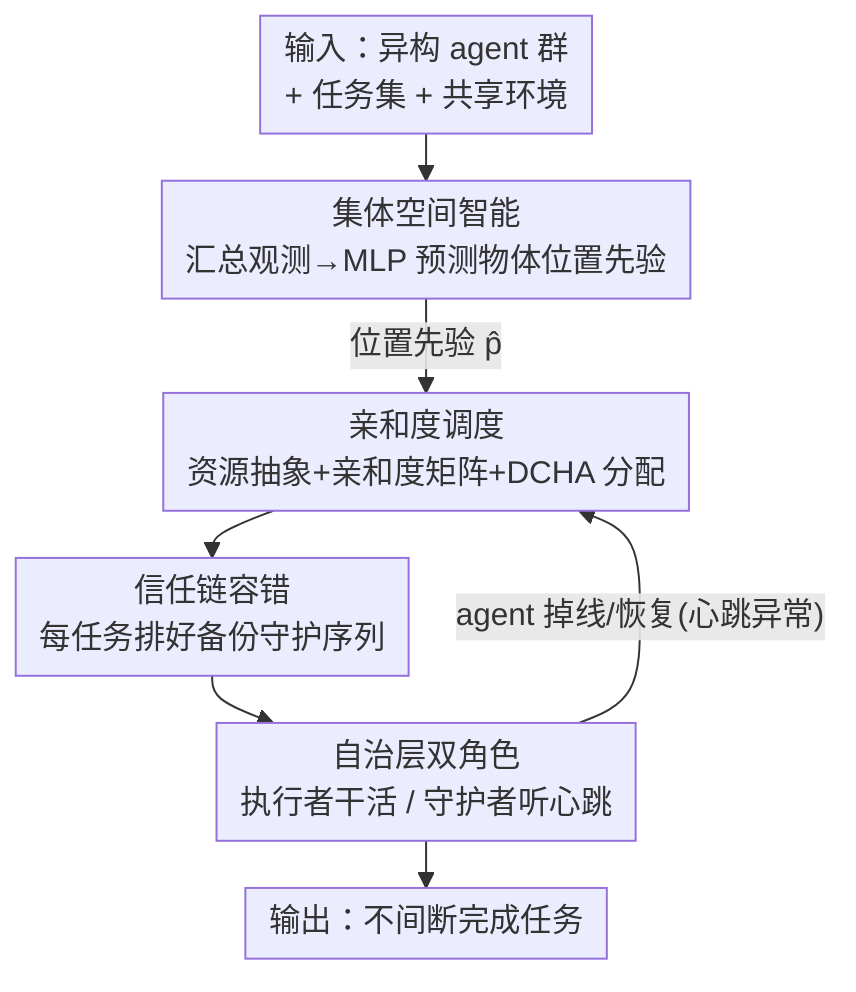

# DRAMA: Next-Gen Dynamic Orchestration for Resilient Multi-Agent Ecosystems in Flux

**Conference**: CVPR 2026  
**Paper**: [CVF Open Access](https://openaccess.thecvf.com/content/CVPR2026/html/Zhao_DRAMA_Next-Gen_Dynamic_Orchestration_for_Resilient_Multi-Agent_Ecosystems_in_Flux_CVPR_2026_paper.html)  
**Code**: None (Not provided by the paper)  
**Area**: Agent  
**Keywords**: Embodied Multi-Agent, Dynamic Orchestration, Fault-tolerant Takeover, Hungarian Algorithm, Collective Spatial Intelligence

## TL;DR
DRAMA uniformly abstracts agents and tasks in embodied multi-agent systems as "resource entities," utilizing an affinity matrix and a modified Hungarian algorithm for event-triggered dynamic scheduling. Complemented by a "Trust Chain" for decentralized fault takeover, the framework ensures uninterrupted task completion during agent dropout, addition, or recovery. In VirtualHome-Social, it achieves fewer average steps, lower conflict rates, and higher throughput compared to SOTA.

## Background & Motivation
**Background**: LLM-based Embodied Multi-Agent Systems (EMAS) have enabled groups of heterogeneous agents to collaboratively complete long-horizon, open-world household tasks through inter-agent planning, communication, and task division.

**Limitations of Prior Work**: Most EMAS frameworks rely on a **static architecture**, where agent capabilities and task assignments are fixed at initialization ($t=0$) and remain unchanged throughout execution. The paper formalizes this as a static paradigm $f_t = f_0,\ \forall t \in [1,T]$, causing the system goal to degenerate into a one-time optimization of $f_0$. However, real-world team compositions and tasks are "fluid": agents may disconnect, malfunction, or recover, and new agents or priority changes may occur.

**Key Challenge**: Once static assignments are locked, issues like agent idling, task overload, lack of fault response, and poor scalability emerge. The root cause is the system's lack of a **continuous monitoring and feedback reallocation** mechanism to update $f_t$ as the environment evolves.

**Goal**: To develop a resilient orchestration framework capable of real-time response to agent arrival, dropout, or recovery—ensuring efficiency in stable scenarios while maintaining task continuity during frequent team fluctuations.

**Key Insight**: The authors observe that if both agents and tasks are viewed as "resource entities," the problem of "who performs which task" becomes a **constrained assignment problem** that can be repeatedly solved. Combined with a backup takeover protocol, dynamism is naturally integrated into the scheduling framework.

**Core Idea**: Replace fixed assignments with "affinity-driven event-triggered rescheduling + layered trust chain takeover," utilizing a shared collective spatial memory to provide positional priors for scheduling.

## Method

### Overall Architecture
DRAMA utilizes a **three-layer architecture**: The **Strategic Layer** dynamically optimizes the agent–task assignment mapping $f_t$ and pre-arranges fault-tolerant backups. The **Collective Intelligence Layer** aggregates visual observations from all agents into shared spatial priors to predict object/task locations. The **Autonomous Layer** assigns each agent dual roles—"executor" and "guardian"—allowing them to perceive, plan, navigate, and act while monitoring peer heartbeats.

The entire loop is **event-triggered**: the Collective Intelligence Layer provides an object location prior $\hat{\mathbf{p}}_j$ $\rightarrow$ the Strategic Layer calculates affinity, assigns tasks via DCHA, and establishes trust chains $\rightarrow$ executors in the Autonomous Layer perform tasks while guardians monitor heartbeats $\rightarrow$ if an agent loses connection (dropout/failure), a guardian immediately takes over unfinished tasks based on the trust chain, triggering local affinity recalculation and rescheduling at the Strategic Layer. The process is decentralized and does not require step-by-step guidance from a central coordinator.

### Key Designs

**1. Resource Unified Abstraction + Affinity-Driven Scheduling: Transforming assignment into a resolvable problem**

The weakness of static frameworks is the locked assignment. DRAMA models agents and tasks as "resource entities," making assignment a problem that can be solved at any time. At time $t$, the instantaneous affinity between agent $a_i$ and task $q_j$ is defined as a weighted combination of available workload capacity and predicted spatial distance:

$$\mathcal{S}_{ij,t} = w_1 \cdot v_i(t) - w_2 \cdot \mathrm{Dist}\big(\mathbf{x}_i(t), \hat{\mathbf{p}}_j(t)\big)$$

Where $v_i(t)$ is the current availability of the agent, $\mathbf{x}_i(t)$ is its position, $\hat{\mathbf{p}}_j(t)$ is the predicted task location, $\mathrm{Dist}(\cdot)$ is Euclidean distance, and $w_1, w_2 > 0$ are weights. Intuitively: more available and closer agents are better suited for the task. The global objective is to find assignments that maximize total affinity: $f_t^* = \arg\max_{f_t} \sum_{j=1}^{M} \mathcal{S}_{f_t(q_j)j,t}$. This abstraction makes coordination modular and decoupled.

**2. Dual-Capacity Hungarian Assignment (DCHA): Extending the Hungarian algorithm for multi-tasking**

The classic Hungarian algorithm only handles one-to-one assignments, but agents should handle multiple tasks. DRAMA splits each real agent $a_i$ into **two virtual slots** $\{v_{i,1}, v_{i,2}\}$ (capacity limit of 2). A cost matrix $C[v_{i,k}, t_j] = -\mathrm{Aff}(a_i, t_j)$ is constructed using these slots and tasks, padded to a $K \times K$ square matrix ($K=\max(|V|,|T|)$) for standard Hungarian solving. Assignments are then merged back to the real agents, filtering dummy tasks. This maintains **global optimality** while supporting one-to-many allocation.

**3. Layered Trust Chain Takeover: Seamless handover via ordered backup sequences**

Re-allocation alone is insufficient; immediate takeover is required when an agent drops out. After DCHA provides the primary assignment, DRAMA ranks all agents for each task $q_j$ in descending order of affinity: $a_{(1)} \succ a_{(2)} \succ \cdots \succ a_{(N)}$. The selected $a_{(1)} = f_t^*(q_j)$ is the primary executor, and others form an ordered guardian sequence $a_{(1)} \rightarrow a_{(2)} \rightarrow \cdots \rightarrow a_{(N)}$. Each guardian monitors the predecessor; if $a_{(1)}$ fails, $a_{(2)}$ takes over, and so on. Upon takeover, a **local recalibration** is performed to update workload balance, ensuring decentralized and immediate recovery.

**4. Collective Spatial Intelligence + Autonomous Layer Dual-Roles: Shared priors and mutual monitoring**

The **Collective Intelligence Layer** records visual observations $H_{i,t} = \{(o_k, p_k)\mid k<t\}$ into a shared memory $H_t = \bigcup_{i=1}^N H_{i,t}$. Instead of simple occurrence frequency, it trains an MLP predictor $\hat{\mathcal{P}}_\theta(o,p\mid x_t) = f_\theta(x_t)$ to approximate the joint distribution $P(o,p)$, providing the location prior $\hat{\mathbf{p}}_j(t)$ for the affinity formula even for unexplored areas. The **Autonomous Layer** provides parallel paths: the executor maintains the perception-planning-navigation-action loop with **hierarchical memory management**, while the guardian listens for heartbeats to trigger takeover if peer latency or failure is detected.

## Key Experimental Results

Experiments used **VirtualHome-Social** in Unity, with three metrics: **Average Steps (AS, lower is better)**, **Conflict Rate (CR, lower is better)**, and **Throughput (TP, higher is better)**. Baselines included CoELA, MCTS, ProAgent, and AgentVerse (static/dynamic).

### Main Results (Efficiency Comparison, Selected Scenarios)

| Scenario | Metric | DRAMA | Strongest baseline | Description |
|------|------|-------|---------------|------|
| Static-3 | AS↓ / CR↓ / TP↑ | **59.98 / 0.027 / 0.189** | ProAgent 64.86 / 0.038 / 0.166 | Stable team, comprehensive lead |
| Static-5 | AS↓ / CR↓ / TP↑ | **46.70 / 0.083 / 0.252** | ProAgent 47.68 / 0.109 / 0.237 | Full team, significantly lower CR |
| Dropout 5→4→3 | AS↓ / CR↓ / TP↑ | **52.80 / 0.076 / 0.216** | ProAgent 54.96 / 0.111 / 0.208 | Optimum despite cascading dropouts |
| Recovery 4→3→4 | AS↓ / CR↓ / TP↑ | **55.07 / 0.044 / 0.204** | AV-static 56.82 / 0.064 / 0.207 | Leaving and re-joining team |

Overall, DRAMA reduced AS by ~4% (up to 7–8% in highly dynamic scenes) and improved TP by 10–20%. Note: MCTS occasionally showed lower CR due to rigid rule-based strategies but failed to adapt to changes, resulting in the highest AS.

### Robustness (Scenario Success, Table 2)

| Scenario | CoELA | MCTS | ProAgent | AV-static | AV-dynamic | DRAMA |
|------|:----:|:----:|:--------:|:---------:|:----------:|:-----:|
| Static | ✓ | ✓ | ✓ | ✓ | ✓ | ✓ |
| Dropout | ✗ | ✗ | ✗ | ✗ | ✗ | **✓** |
| Addition | ✓ | ✓ | ✓ | ✓ | ✓ | ✓ |
| Recovery | ✗ | ✗ | ✗ | ✗ | ✗ | **✓** |

DRAMA is the **only** framework capable of reliably handling agent dropout and recovery—other methods lack the ability to reallocate unfinished tasks when agents leave the team.

### Ablation Study (Table 4)

| Configuration | Static-3 (AS/CR/TP) | Dropout 4→3 (CR) | Description |
|------|---------------------|------------------|------|
| Full DRAMA | 59.98 / 0.027 / 0.189 | 0.026 | Full model |
| w/o Collective Intelligence | 65.43 / 0.037 / 0.171 | 0.029 | Efficiency drops (higher AS, lower TP) |
| w/o Trust Chain | 61.64 / 0.022 / 0.182 | **0.044** | CR nearly doubles in dynamic scenes |

### Key Findings
- **Modular Division of Labor**: Removing the Collective Intelligence Layer harms efficiency (AS increases ~9%), while removing the Trust Chain harms dynamic robustness (CR rises from 0.026 to 0.044 in dropouts).
- **Model Agnostic**: Consistency across GPT-4.1, GPT-4o-mini, Qwen-Max, and DeepSeek-V3.2 proves gains stem from the orchestration mechanism, not a specific LLM.
- **Stability**: Across 50 independent runs, DRAMA shows lower medians and tighter distributions for AS/CR, with more stable TP.

## Highlights & Insights
- **Dynamism as an Assignment Problem**: Abstracting agents and tasks as resource entities allows environmental changes to simply trigger a recalculation of optimal assignment, resulting in an elegant engineering solution.
- **DCHA Virtual Slotting Trick**: Adapting the one-to-one Hungarian algorithm to capacity-constrained one-to-many scenarios via virtual slots is a reusable technique for general resource scheduling.
- **Proactive Fault Tolerance**: The Trust Chain pre-arranges backups during the assignment phase rather than reacting after a failure, which is why it uniquely supports dropout/recovery scenarios.

## Limitations & Future Work
- **Scalability Limits**: Currently supports up to 5 agents; overhead for Hungarian solving and Trust Chain maintenance in large-scale teams (50+ agents) remains unverified.
- **Single Simulation Platform**: Experiments were limited to VirtualHome-Social in Unity; sim-to-real gap remains unknown. Gain percentages fluctuate between scenes (AS 4%~8%, TP 10%~20%).
- **Fixed Capacity**: DCHA uses a static capacity of 2 slots per agent, lacking adaptivity in workload distribution. MLP training details are relegated to the supplementary material.

## Related Work & Insights
- **vs AgentVerse-Dynamic**: AV-Dynamic reallocates tasks periodically only upon "task completion," which is passive. DRAMA uses event-triggered global optimal re-assignment + pre-arranged backup chains.
- **vs ProAgent**: ProAgent is fully decentralized and relies on communication for prediction; while strong in static scenes, it lacks unified resource assignment and backup takeover, failing in dropout scenarios.
- **vs MCTS / MASTER**: MCTS-based planning selects high-reward paths within a fixed budget; it is rule-heavy and static, leading to high AS and an inability to adapt to real-time fluctuations.

## Rating
- Novelty: ⭐⭐⭐⭐ Combination of resource abstraction + DCHA + Trust Chain is a clear new framework for MAS.
- Experimental Thoroughness: ⭐⭐⭐⭐ Covers static/dropout/addition/recovery/replacement with multiple backbones, though limited to small teams in one simulation.
- Writing Quality: ⭐⭐⭐⭐ Architecture and formulas are clearly expressed.
- Value: ⭐⭐⭐⭐ Provides a deployable resilient orchestration paradigm for real-world multi-agent teams with fluctuating sizes.

<!-- RELATED:START -->

## Related Papers

- [\[ACL 2026\] Towards Scalable Lightweight GUI Agents via Multi-role Orchestration](../../ACL2026/llm_agent/towards_scalable_lightweight_gui_agents_via_multi-role_orchestration.md)
- [\[CVPR 2026\] WorldMM: Dynamic Multimodal Memory Agent for Long Video Reasoning](worldmm_dynamic_multimodal_memory_agent_for_long_video_reasoning.md)
- [\[CVPR 2026\] Nerfify: A Multi-Agent Framework for Turning NeRF Papers into Code](nerfify_multiagent_nerf_paper_to_code.md)
- [\[ACL 2026\] Dynamic Generation of Multi-LLM Agents Communication Topologies with Graph Diffusion Models](../../ACL2026/llm_agent/dynamic_generation_of_multi-llm_agents_communication_topologies_with_graph_diffu.md)
- [\[CVPR 2026\] Think, Then Verify: A Hypothesis-Verification Multi-Agent Framework for Long Video Understanding](think_then_verify_a_hypothesis-verification_multi-agent_framework_for_long_video.md)

<!-- RELATED:END -->
