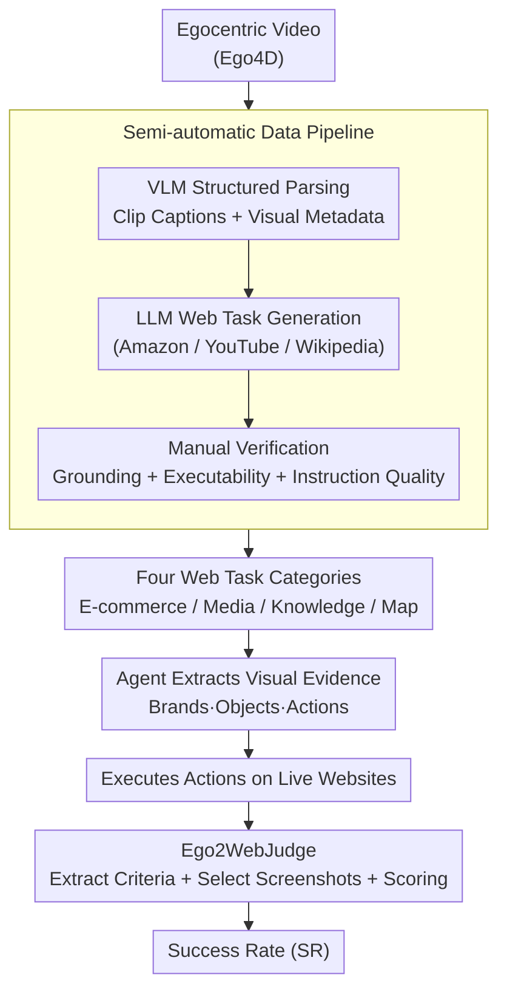

# Ego2Web: A Web Agent Benchmark Grounded in Egocentric Videos

**Conference**: CVPR 2026  
**arXiv**: [2603.22529](https://arxiv.org/abs/2603.22529)  
**Code**: [https://github.com/Yui010206/Ego2Web](https://github.com/Yui010206/Ego2Web)  
**Area**: Agent  
**Keywords**: Web Agent, Egocentric Video, Multimodal Benchmark, Cross-modal Transfer, Automatic Evaluation

## TL;DR

Ego2Web is proposed as the first benchmark that combines egocentric video perception with web agent execution. Accompanied by a semi-automatic data construction pipeline and the Ego2WebJudge automatic evaluation framework, experiments reveal a significant gap for current top agents in transferring from real-world visual perception to online actions, with a maximum success rate of only 48.2%.

## Background & Motivation

**Background**: Multimodal AI agents are evolving rapidly, moving from simple conversational assistants toward performing operations in real web environments (e.g., shopping, searching, or checking maps). Several web agent benchmarks (e.g., WebArena, MiniWoB++, Mind2Web) already exist to evaluate agent task completion in online environments.

**Limitations of Prior Work**: Existing web agent benchmarks have a fundamental limitation—they focus entirely on web-side interaction and perception, lacking a connection to the user's actual physical environment. This means a critical scenario cannot be evaluated: when an agent needs to first identify objects in the user's surroundings via egocentric vision (e.g., AR glasses) and then complete related online tasks (e.g., seeing a snack and searching for it on Amazon). This bridging capability from "seeing" to "online execution" is a core requirement for future AI assistants.

**Key Challenge**: Current web agent evaluations only consider capabilities within the digital world, completely ignoring the agent's ability to acquire visual cues from the physical world and transform them into digital world actions. This leads to an inability to understand the true proficiency of current models across the full "see → understand → act" pipeline.

**Goal**: To build a benchmark that combines egocentric video perception with web action execution to systematically evaluate agents' visual understanding, task planning, and online interaction capabilities.

**Key Insight**: Leveraging existing large-scale egocentric video datasets (such as Ego4D) in combination with a VLM+LLM automatic data generation pipeline and manual verification to construct high-quality video-web task pairs.

**Core Idea**: Use visual evidence from egocentric videos (e.g., brands, objects, actions) as grounding information, requiring agents to complete related tasks in real web environments, thereby evaluating agent capabilities across physical and digital worlds.

## Method

### Overall Architecture

Ego2Web addresses a gap where existing web agent benchmarks only evaluate digital-world interactions, leaving the "perceive with egocentric vision first, then complete web tasks" physical-digital bridge untested. This work focuses on three components: a semi-automatic pipeline to pair egocentric videos with web tasks, a benchmark dataset covering e-commerce, media retrieval, knowledge query, and map services, and the Ego2WebJudge for automatic scoring on live websites. During evaluation, an agent receives an egocentric video, extracts key visual evidence (brands, objects, actions), performs operations on real active websites, and finally, Ego2WebJudge compares the operation trajectory with visual evidence to determine if the task was truly completed.

### Key Designs

**1. Semi-automatic Data Pipeline: Ensuring Grounding and Executability**

Manual annotation of video-task pairs is costly, while fully automatic generation lacks quality. This pipeline finds a balance in three steps: first, a VLM (e.g., Gemini) performs structured parsing of egocentric videos to produce clip-level captions and visual metadata, identifying objects, brands, and actions; next, an LLM uses this metadata to derive web task instructions for active sites like Amazon, YouTube, and Wikipedia; finally, human annotators verify visual grounding accuracy, web task executability, and instruction quality. This allows automation to handle the bulk of the work while manual oversight ensures quality and scale.

**2. Four Web Task Categories: Probing Agent Weaknesses across Dimensions**

AI assistants must handle diverse web interactions. The benchmark categorizes tasks into four types, each requiring the agent to ground actions in video evidence: E-commerce (searching for a seen snack) tests fine-grained object recognition; Media Retrieval (searching for a fitness movement) tests action understanding; Knowledge Query (checking admission info for a visible university) tests text recognition; and Local/Map Services (navigating to a seen store) tests spatial localization. These tasks reveal specific weaknesses—such as the poor performance in e-commerce and maps seen in experiments—corresponding to dimensions of "object, action, text, or location" recognition.

**3. Ego2WebJudge: LLM-based Scoring for Real-time Web Environments**

Evaluating on live websites makes traditional methods like URL or text matching fragile due to page updates. Ego2WebJudge serves as a flexible, automatic judge. It receives task instructions, agent operation trajectories, web screenshots, and visual evidence. It extracts key success criteria from instructions, selects relevant screenshots from the trajectory, and determines if the task was completed correctly while maintaining consistency between visual evidence and web content. This approach achieves approximately 84% agreement with human judgment, significantly outperforming exact-match methods.

### Loss & Training

Ego2Web is an evaluation benchmark rather than a training method and thus does not involve training losses. The core metric is **Success Rate (SR)**, which is automatically determined by Ego2WebJudge for each video-task pair and aggregated by task type and overall.

## Key Experimental Results

### Main Results

| Agent (Model) | E-commerce SR | Media SR | Knowledge SR | Map SR | Overall SR |
|---------------|---------------|----------|--------------|--------|------------|
| Qwen3-VL-Flash| 21.7          | 30.1     | 50.0         | 23.1   | 29.0       |
| GPT-4o        | 26.9          | 30.3     | 63.0         | 22.5   | 34.6       |
| Gemini-2.5 Pro| 38.2          | 50.7     | 75.0         | 48.3   | 48.2       |
| Human Eval    | -             | -        | -            | -      | 58.6       |

### Ablation Study (Visual Perception Impact)

| Video Input | Detailed Description | E-commerce | Knowledge | Overall SR |
|-------------|----------------------|------------|-----------|------------|
| ✗           | ✗                    | 2.6        | 5.4       | 4.4        |
| ✗           | ✓                    | 13.0       | 39.1      | 23.6       |
| ✓           | ✗                    | 38.2       | 75.0      | 48.2       |

### Key Findings

- **Top Agents are Far from Perfect**: Gemini-2.5 Pro, the best model, achieved only 48.2% SR compared to 58.6% for humans (noting some tasks are inherently difficult), indicating massive room for improvement.
- **Raw Video Greatly Outperforms Text Descriptions**: Direct video input is more than twice as effective as using VLM-generated text descriptions (48.2% vs 23.6%), proving that visual grounding must come from raw visual signals.
- **Error Analysis**: 36% of failures stem from misidentifying objects, 18% from temporal/action misunderstanding, and 16% from cross-modal retrieval failures, identifying visual perception as the primary bottleneck for current agents.
- **E-commerce and Map Tasks are the Most Challenging**: These require precise visual recognition and spatial understanding, where current agents perform worst.

## Highlights & Insights

- **Pioneering Physical-Digital Bridging Benchmark**: Ego2Web fills the gap in the "visual perception → online action" pipeline within web agent evaluation. This design is forward-looking, reflecting real-world use cases for future AR and intelligent assistants.
- **Ego2WebJudge Evaluation Scheme**: An 84% human agreement rate makes it a reliable automatic evaluation tool, avoiding the high cost of manual evaluation in live web environments. This framework is transferable to other agent tasks requiring online evaluation.
- **Quantitative Revelation of Perception Bottlenecks**: The experiments clearly illustrate the bottlenecks at each step of the "see → understand → act" chain, providing clear directions for future research.

## Limitations & Future Work

- The data scale is relatively limited and does not yet cover all daily web task scenarios (e.g., social media operations, calendar management).
- The benchmark relies on live web environments; changes to websites may affect the reproducibility of evaluations.
- Currently, only existing general agents have been evaluated, and no dedicated agent architecture specifically for Ego2Web tasks has been designed.
- Future work can extend to multi-turn dialogue scenarios (e.g., users making follow-up requests after watching a video) and multimodal web interactions (e.g., voice commands + visual perception).

## Related Work & Insights

- **vs WebArena**: WebArena focuses solely on web task execution without real-world visual input; Ego2Web introduces the complete pipeline from egocentric video to web action.
- **vs Ego4D**: Ego4D is a video understanding benchmark without online action execution; Ego2Web utilizes Ego4D video data but requires agents to complete tasks on the live web.
- **vs Mind2Web**: Mind2Web uses static web page screenshots, whereas Ego2Web evaluates in real-time web environments, which is closer to real-world application scenarios.

## Rating

- Novelty: ⭐⭐⭐⭐⭐ First benchmark to bridge egocentric video and web agent execution, filling a critical gap.
- Experimental Thoroughness: ⭐⭐⭐⭐ Multi-model evaluation + input ablation + error analysis, though comparison with more agent architectures is missing.
- Writing Quality: ⭐⭐⭐⭐⭐ Clear motivation, precise problem definition, and detailed data process description.
- Value: ⭐⭐⭐⭐⭐ Significant contribution to the AI Agent and embodied intelligence communities.

<!-- RELATED:START -->

## Related Papers

- [\[ICML 2026\] It's a TRAP! Task-Redirecting Agent Persuasion Benchmark for Web Agents](../../ICML2026/llm_agent/its_a_trap_task-redirecting_agent_persuasion_benchmark_for_web_agents.md)
- [\[ICLR 2026\] WebFactory: Automated Compression of Foundational Language Intelligence into Grounded Web Agents](../../ICLR2026/llm_agent/webfactory_automated_compression_of_foundational_language_intelligence_into_grou.md)
- [\[CVPR 2026\] Learning to Adapt: Self-Improving Web Agent via Cognitive-Aware Exploration](learning_to_adapt_self-improving_web_agent_via_cognitive-aware_exploration.md)
- [\[ICLR 2026\] ST-WebAgentBench: A Benchmark for Evaluating Safety and Trustworthiness in Web Agents](../../ICLR2026/llm_agent/st-webagentbench_a_benchmark_for_evaluating_safety_and_trustworthiness_in_web_ag.md)
- [\[ICLR 2026\] VideoAgentTrek: Computer Use Pretraining from Unlabeled Videos](../../ICLR2026/llm_agent/videoagenttrek_computer-use_pretraining_from_unlabeled_videos.md)

<!-- RELATED:END -->
