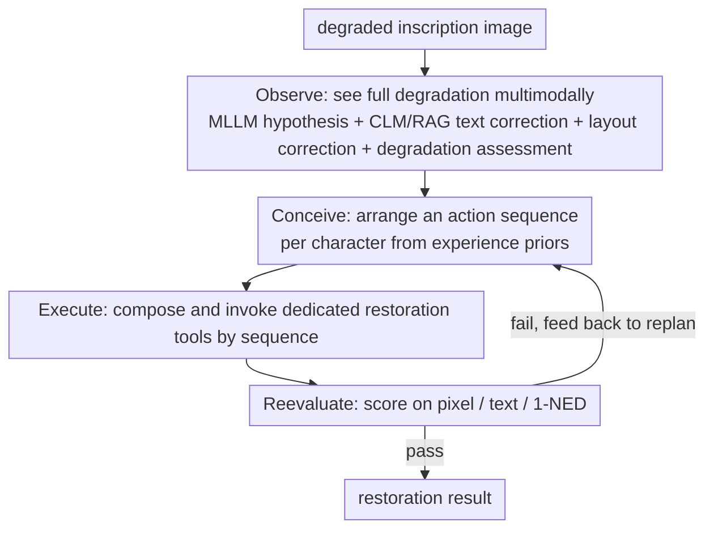

# EpiAgent: An Agent-Centric System for Ancient Inscription Restoration

**Conference**: CVPR 2026  
**arXiv**: [2604.09367](https://arxiv.org/abs/2604.09367)  
**Code**: [https://github.com/blackprotoss/EpiAgent](https://github.com/blackprotoss/EpiAgent)  
**Area**: LLM Agent / Digital Humanities  
**Keywords**: Ancient Inscription Restoration, LLM Agent, Multimodal Analysis, Iterative Refinement, Cultural Heritage Preservation

## TL;DR

EpiAgent is the first agent-centric system for ancient inscription restoration, using an LLM central planner to coordinate multimodal analysis, dedicated restoration tools, and iterative self-refinement, surpassing prior methods in both textual authenticity and visual fidelity.

## Background & Motivation

**Background**: AI-driven restoration of ancient scripts has made progress, but existing methods are either limited to single-character-level restoration or use a fixed pipeline for full-inscription restoration, and cannot handle heterogeneous degradation patterns.

**Limitations of Prior Work**: (1) Image-to-image translation methods often distort the original glyphs, leading to over- or under-restoration; (2) fixed pipelines lack adaptability to heterogeneous degradation patterns; (3) inscription restoration requires simultaneously satisfying the dual demands of textual authenticity and visual fidelity.

**Key Challenge**: Inscription restoration is not simple image enhancement, but a complex cognitive process that, like a human epigrapher, must coordinate multimodal analysis, expert skill judgment, and aesthetic evaluation.

**Goal**: Build an agent system that mimics the workflow of a human epigrapher, achieving flexible and adaptive inscription restoration.

**Key Insight**: Formalize inscription restoration as a hierarchical planning problem, driven by an LLM central planner within an "Observe-Conceive-Execute-Reevaluate" loop.

**Core Idea**: Replace the fixed pipeline with an agent architecture, so the restoration process can dynamically adjust tool selection and execution order according to the degradation pattern.

## Method

### Overall Architecture

EpiAgent treats inscription restoration as a process of "repeatedly deliberating like a human epigrapher," rather than a fixed image-enhancement pipeline. When a degraded inscription image comes in, the system, with the LLM as central planner, turns through a four-stage Observe-Conceive-Execute-Reevaluate loop: first Observe "sees the stele clearly"—where the degradation is, what the characters are, how much is missing; then Conceive arranges a separate restoration action sequence for **each character** based on historical experience; next Execute composes and invokes the dedicated restoration tools according to the plan; finally Reevaluate scores the result with automatic metrics (plus optional expert feedback), and if unsatisfied feeds the information back to the planner for another round. The key is that "which tools and in what order" is not hard-wired, but decided on the fly by the planner based on each character's degradation pattern, so it can cope with the spatially uneven, structurally coupled, heterogeneous degradation on the same stele.

### Key Designs

**1. Observe: coordinate multimodality to "see the full degradation state," giving subsequent planning a reliable draft**

The common flaw of fixed pipelines is that they only see the image surface, not "what this character actually is, or which part is entirely missing." EpiAgent's Observe stage builds this draft solidly in two steps. The first step has the MLLM produce an initial layout hypothesis and per-character text hypothesis for the whole image; the second step uses three dedicated modules to correct it: the Correction Language Model (CLM) is a fine-tuned 7B LLM that, together with RAG querying a large-scale Chinese classical-text corpus, corrects characters that the MLLM misread back to text that genuinely appeared in history; the layout-correction module predicts the complete layout, filling in the positions even for regions that are **completely missing, with no pixels in the image at all**; and the degradation-assessment model outputs a pixel-level degradation segmentation mask and severity grade. The product of this step is an observation record $T_r$—containing both the semantic judgment of "what this character should be" and the spatial judgment of "where it is damaged and how severely," precisely covering the three properties of inscription degradation: spatial variation, structural coupling, and multi-scale.

**2. Conceive: use statistical priors from historical logs to arrange a separate action sequence for each character**

Knowing where it is damaged and how badly, the next step is to decide "which tool first, which next." EpiAgent does not rely on hand-written rules, but mines an experience prior from historical execution logs—for each degradation pattern $\mathcal{S}_d$ it tallies the utility distribution $p(f\mid\mathcal{S}_d)$ of each restoration tool $f$, essentially a frequency table of "for this kind of degradation in the past, which tool worked well." The planner $\pi$ takes both the observation record $T_r$ and this experience prior $T_e$, generating an action sequence **independently for each character**:

$$P_c = \big(f_1^{(c)}, f_2^{(c)}, \dots, f_{N_c}^{(c)}\big)$$

Per-character planning is the crux here—on the same stele, some characters are only lightly worn and one denoising step suffices, while others are structurally collapsed and need several tools chained together; a one-size-fits-all approach across the whole image would only over- or under-restore. The experience prior, meanwhile, frees the planner from trial-and-error from scratch, directly mapping the degradation pattern to a likely-effective tool combination.

**3. Reevaluate: closed-loop scoring on three dimensions, feeding back to replan if it fails**

Finally we must answer "did this round actually fix it." The quality of inscription restoration cannot be judged only by how good the image looks; it must also check whether the characters are right and whether the whole reads coherently, so Reevaluate evaluates on three dimensions simultaneously: pixel quality (PSNR / SSIM / LPIPS) for visual fidelity, character recognition (Top-1 / Top-5 accuracy) for whether each character is recognizable, and end-to-end 1-NED (based on normalized edit distance) for the coherent readability of the whole text. When needed, it can also incorporate third-party expert feedback for human-in-the-loop verification. The evaluation results across the three dimensions are not the endpoint, but are fed back to the Conceive stage to trigger the next round of replanning—whichever dimension lags behind, the next round targets it by swapping tools or adding steps, forming a genuine closed-loop iteration.

### A Worked Example

Take a rubbing that contains both lightly worn and severely missing characters and walk it through once: in the **Observe** stage, the MLLM first reads out initial hypotheses for 12 characters, the CLM queries the corpus to correct 2 of them that were recognized as visually similar characters back to the correct forms in historical records, the layout-correction module fills in the position box for a completely missing character in the lower-right corner, and the degradation-assessment model marks "8 characters on the left lightly degraded, 4 on the lower-right severely coupled-degraded." In the **Conceive** stage, the planner queries the experience prior and arranges one denoising step for each lightly degraded character on the left, and a three-step chain "denoise → structure completion → glyph refinement" for the severely degraded characters on the lower-right, one independent sequence per character. **Execute** composes and invokes the tools by sequence to complete the first round of restoration. **Reevaluate** scores and finds that the overall PSNR and recognition accuracy already meet the bar, but the 1-NED in the region of the severely missing characters is low and does not read smoothly, so the information for this region is fed back to the planner, and the second round adds a context-consistency refinement step for those characters; re-evaluation passes and the loop exits. Throughout, the tool selection and the number of rounds are decided on the spot by the degradation pattern, not by a preset pipeline.

### Loss & Training

EpiAgent is mainly inference-time agent orchestration and is not trained end-to-end; only two sub-modules need separate training: the CLM achieves text correction by fine-tuning a 7B LLM together with RAG, while the degradation-assessment model is trained with pixel-level degradation segmentation as the objective. The planner's experience prior comes from statistics over historical execution logs, requiring no gradient training.

## Key Experimental Results

### Main Results

| Method | PSNR↑ | SSIM↑ | LPIPS↓ | Top-1 Acc↑ | 1-NED↑ |
|------|-------|-------|--------|------------|--------|
| CharFormer | 19.74 | 0.9503 | 0.0478 | 0.9109 | 0.8313 |
| DocDiff | 20.61 | 0.9565 | 0.0361 | 0.9275 | 0.8439 |
| MambaIR | 21.10 | 0.9599 | 0.0377 | 0.9093 | 0.8251 |
| IR3 | 21.15 | 0.9540 | 0.0388 | 0.9626 | 0.8855 |
| EpiAgent | **22.14** | **0.9684** | **0.0254** | **0.9889** | **0.9069** |
| Complete original | - | - | - | 0.9971 | 0.9120 |

### Ablation Study

| Config | Key Metric | Note |
|------|---------|------|
| w/o CLM correction | recognition accuracy drops | inaccurate text guidance |
| w/o experience prior | restoration quality drops | tool selection not optimized |
| w/o iterative refinement | suboptimal quality | single-pass restoration insufficient |
| Full EpiAgent | best | four-stage closed-loop coordination |

### Key Findings

- EpiAgent's recognition accuracy (0.9889) approaches that of the complete original (0.9971), showing the restored text is almost fully readable
- Generalization on real degraded inscriptions is significantly better than fixed-pipeline methods
- The agent's iterative refinement mechanism is especially effective in complex coupled-degradation scenarios

## Highlights & Insights

- **A pioneering application of the agent paradigm in cultural heritage preservation**: bringing LLM agents from general tasks into the highly specialized field of epigraphy is an important breakthrough for digital humanities
- **Closed-loop design with optional expert feedback**: the system supports human experts intervening at the evaluation stage, realizing a human-in-the-loop restoration workflow
- **Character-level fine-grained planning**: unlike one-size-fits-all whole-image processing, EpiAgent plans the restoration strategy independently for each character, handling spatially coupled degradation

## Limitations & Future Work

- LLM inference has high computational cost; restoring a single inscription may take several minutes
- Heavily dependent on the CLM's text-correction quality, which may fail on extremely degraded inscriptions
- Validated only on Chinese ancient inscriptions; extending to other writing systems requires additional work

## Related Work & Insights

- **vs IR3**: IR3 uses a global-local framework for full-inscription restoration but suffers from error propagation, whereas EpiAgent's agent architecture naturally supports error correction
- **vs AutoHDR**: AutoHDR uses an LLM to predict damaged content but its style transfer may distort glyphs, whereas EpiAgent preserves calligraphic authenticity via dedicated tools

## Rating

- Novelty: ⭐⭐⭐⭐⭐ first application of the agent paradigm in cultural heritage preservation
- Experimental Thoroughness: ⭐⭐⭐⭐ comprehensive evaluation on synthetic and real degraded data
- Writing Quality: ⭐⭐⭐⭐ clear workflow description
- Value: ⭐⭐⭐⭐ significant for the digital humanities field

<!-- RELATED:START -->

## Related Papers

- [\[ACL 2026\] HiGMem: A Hierarchical and LLM-Guided Memory System for Long-Term Conversational Agents](../../ACL2026/llm_agent/higmem_a_hierarchical_and_llm-guided_memory_system_for_long-term_conversational_.md)
- [\[CVPR 2026\] Ego2Web: A Web Agent Benchmark Grounded in Egocentric Videos](ego2web_a_web_agent_benchmark_grounded_in_egocentric_videos.md)
- [\[CVPR 2026\] Nerfify: A Multi-Agent Framework for Turning NeRF Papers into Code](nerfify_multiagent_nerf_paper_to_code.md)
- [\[CVPR 2026\] WorldMM: Dynamic Multimodal Memory Agent for Long Video Reasoning](worldmm_dynamic_multimodal_memory_agent_for_long_video_reasoning.md)
- [\[CVPR 2026\] CarePilot: A Multi-Agent Framework for Long-Horizon Computer Task Automation in Healthcare](carepilot_a_multi-agent_framework_for_long-horizon_computer_task_automation_in_h.md)

<!-- RELATED:END -->
