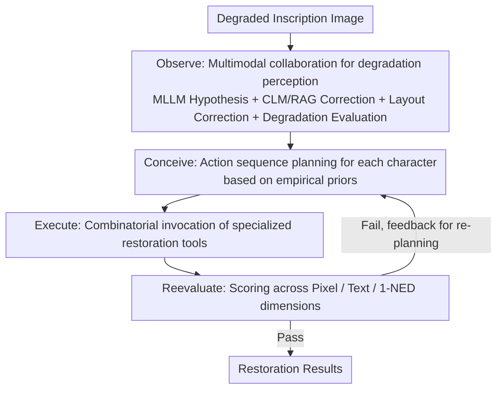

# EpiAgent: An Agent-Centric System for Ancient Inscription Restoration

**Conference**: CVPR 2026  
**arXiv**: [2604.09367](https://arxiv.org/abs/2604.09367)  
**Code**: [https://github.com/blackprotoss/EpiAgent](https://github.com/blackprotoss/EpiAgent)  
**Area**: LLM Agent/Digital Humanities  
**Keywords**: Ancient Inscription Restoration, LLM Agent, Multimodal Analysis, Iterative Optimization, Cultural Heritage Protection

## TL;DR

EpiAgent is the first Agent system for ancient inscription restoration. By utilizing an LLM central planner to coordinate multimodal analysis, specialized restoration tools, and iterative self-optimization, it outperforms existing methods in both textual authenticity and visual fidelity.

## Background & Motivation

**Background**: AI-driven restoration of ancient scripts has progressed, but existing methods are either limited to character-level restoration or use fixed pipelines for full-inscription restoration, making them unable to handle heterogeneous degradation patterns.

**Limitations of Prior Work**: (1) Image-to-image translation methods often distort original glyphs, leading to over- or under-restoration; (2) fixed pipelines lack adaptability to heterogeneous degradation patterns; (3) inscription restoration requires satisfying the dual demands of textual authenticity and visual fidelity.

**Key Challenge**: Inscription restoration is not a simple image enhancement task; it is a complex cognitive process that requires coordinating multimodal analysis, professional skill judgment, and aesthetic evaluation, much like a human epigrapher.

**Goal**: To build an Agent system that mimics the workflow of human epigraphers for flexible and adaptive inscription restoration.

**Key Insight**: Inscription restoration is formalized as a hierarchical planning problem driven by an LLM central planner within an "Observe-Conceive-Execute-Reevaluate" loop.

**Core Idea**: The fixed pipeline is replaced with an Agent architecture, enabling the restoration process to dynamically adjust tool selection and execution sequences based on degradation patterns.

## Method

### Overall Architecture

EpiAgent treats inscription restoration as a process of "iterative refinement similar to human epigraphers" rather than a fixed image enhancement pipeline. When a degraded inscription image is input, the system uses an LLM as the central planner, operating within a four-stage loop of Observe-Conceive-Execute-Reevaluate: First, **Observe** "sees clearly" the rubbing—where the degradation is, what the characters are, and how much is missing; then **Conceive** plans a sequence of restoration actions for **each character** individually based on historical experience; next, **Execute** calls specialized restoration tools in combination according to the plan; finally, **Reevaluate** scores the results using automated metrics (with optional expert feedback). If the score is unsatisfactory, information is fed back to the planner for another round. Crucially, "which tools to use and in what order" is not hard-coded but decided on the fly by the planner based on the degradation pattern of each character, thus handling heterogeneous degradations with spatial non-uniformity and structural coupling on the same stele.

### Key Designs

**1. Observe: Multimodal collaboration for comprehensive degradation assessment to provide a reliable draft for planning**

A common failure of fixed pipelines is only seeing the image surface without identifying "what the character actually is" or "which parts are completely missing." In the Observe stage, EpiAgent solidifies this draft in two steps. First, it allows the MLLM to provide initial layout hypotheses and character-wise text hypotheses for the entire image. Second, three specialized modules are used for correction: the Correction Language Model (CLM), a fine-tuned 7B LLM, works with RAG to query large-scale ancient Chinese corpora to correct misidentified characters back to historically authentic texts; the layout correction module predicts the complete layout, even completing positions for regions that are **completely missing with no pixels** in the image; the degradation evaluation model outputs pixel-level degradation segmentation masks and severity levels. The product of this stage is an observation record $T_r$—containing both semantic judgments of "what the character should be" and spatial judgments of "where and how it is damaged," covering the triple characteristics of spatial variation, structural coupling, and multi-scale nature in inscription degradation.

**2. Conceive: Utilizing statistical priors from historical logs to plan action sequences for each character**

Once the damage is located and typed, the next step is to decide "which tool to use first, then which next." Instead of relying on manual rules, EpiAgent extracts an empirical prior from historical execution logs—calculating the utility distribution of each restoration tool $f$ for each degradation pattern $\mathcal{S}_d$, denoted as $p(f\mid\mathcal{S}_d)$. This is essentially a frequency table of "which tools worked well for this type of degradation in the past." The planner $\pi$ consumes both the observation record $T_r$ and this empirical prior $T_e$ to generate an action sequence **independently for each character**:

$$P_c = \big(f_1^{(c)}, f_2^{(c)}, \dots, f_{N_c}^{(c)}\big)$$

Character-wise planning is critical here—on the same stele, some characters are only slightly worn and require a single denoising step, while others are structurally collapsed and require multiple tools in series. The empirical prior prevents the planner from starting from scratch, mapping degradation patterns directly to high-probability tool combinations.

**3. Reevaluate: Three-dimensional closed-loop scoring with feedback for re-planning**

Finally, the system must answer, "Was the restoration successful in this round?" Inscription restoration quality cannot be judged solely by visual appearance; it also depends on whether the characters are correct and the overall text is coherent. Therefore, Reevaluate scores across three dimensions simultaneously: pixel quality (PSNR / SSIM / LPIPS) for visual fidelity, character recognition (Top-1 / Top-5 accuracy) for individual character legibility, and end-to-end 1-NED (based on Normalized Edit Distance) for the coherence and readability of the entire text. If necessary, third-party expert feedback can be integrated for human-in-the-loop verification. The evaluation results are not an endpoint but are fed back to the Conceive stage to trigger the next round of re-planning—whichever dimension lags behind, the next round targetedly changes tools or adds steps, forming a true closed-loop iteration.

### An Example Walkthrough

Taking a rubbing containing both slightly worn and severely missing characters: In the **Observe** stage, the MLLM reads 12 initial character hypotheses. The CLM consults the corpus to correct 2 characters misidentified due to glyph similarity into their historically correct forms. The layout correction module adds a bounding box for a completely missing character in the bottom-right corner. The degradation evaluation model marks "8 characters on the left as mild and 4 characters on the bottom-right as severely coupled degradation." In the **Conceive** stage, the planner checks empirical priors and plans a single denoising step for the mild characters on the left, and a three-step sequence of "denoising $\rightarrow$ structural completion $\rightarrow$ glyph refinement" for the severe characters on the bottom-right, with independent sequences for each. **Execute** completes the first round of restoration by calling these tool combinations. **Reevaluate** finds that overall PSNR and recognition accuracy have reached standards, but 1-NED in the severely missing region is low and incoherent. This information is fed back to the planner, and the second round adds a context-consistency refinement step for those characters. After re-evaluation passes, the loop exits. The entire tool selection and number of rounds are decided on-site by degradation patterns rather than a preset pipeline.

### Loss & Training

EpiAgent primarily involves Agent orchestration during inference and does not undergo end-to-end training. Only two sub-modules require separate training: the CLM is fine-tuned from a 7B LLM with RAG for text correction, and the degradation evaluation model is trained for pixel-level degradation segmentation. The planner's empirical prior is derived from statistics of historical logs and does not require gradient-based training.

## Key Experimental Results

### Main Results

| Method | PSNR↑ | SSIM↑ | LPIPS↓ | Top-1 Acc↑ | 1-NED↑ |
|------|-------|-------|--------|------------|--------|
| CharFormer | 19.74 | 0.9503 | 0.0478 | 0.9109 | 0.8313 |
| DocDiff | 20.61 | 0.9565 | 0.0361 | 0.9275 | 0.8439 |
| MambaIR | 21.10 | 0.9599 | 0.0377 | 0.9093 | 0.8251 |
| IR3 | 21.15 | 0.9540 | 0.0388 | 0.9626 | 0.8855 |
| **Ours** (EpiAgent) | **22.14** | **0.9684** | **0.0254** | **0.9889** | **0.9069** |
| Original Inscription | - | - | - | 0.9971 | 0.9120 |

### Ablation Study

| Configuration | Key Metrics | Description |
|------|---------|------|
| W/o CLM Correction | Accuracy Dec. | Inaccurate textual guidance |
| W/o Empirical Prior | Quality Dec. | Suboptimal tool selection |
| W/o Iterative Opt. | Suboptimal | Insufficient single-pass restoration |
| **Full EpiAgent** | **Optimal** | Four-stage closed-loop synergy |

### Key Findings

- EpiAgent's recognition accuracy (0.9889) is close to the original inscription (0.9971), indicating that the restored text is almost entirely legible.
- Generalization ability on real degraded inscriptions is significantly superior to fixed-pipeline methods.
- The Agent's iterative optimization mechanism is particularly effective in complex coupled degradation scenarios.

## Highlights & Insights

- **Pioneering application of the Agent paradigm in cultural heritage protection**: Bringing LLM Agents from general tasks into the highly specialized field of epigraphy represents a major breakthrough in digital humanities.
- **Closed-loop design with optional expert feedback**: The system supports human expert intervention during the evaluation phase, achieving a human-computer collaborative restoration workflow.
- **Character-level fine-grained planning**: Unlike one-size-fits-all processing for the full image, EpiAgent plans restoration strategies independently for each character, effectively handling spatially coupled degradation.

## Limitations & Future Work

- Computational overhead for LLM inference is high; restoring a single inscription can take several minutes.
- High dependence on CLM text correction quality; it may fail on extremely degraded inscriptions.
- Validated only on ancient Chinese inscriptions; extending it to other writing systems requires additional work.

## Related Work & Insights

- **vs IR3**: IR3 uses a global-local framework for full-inscription restoration but suffers from error propagation; the Agent architecture of EpiAgent naturally supports error correction.
- **vs AutoHDR**: AutoHDR uses LLM to predict damaged content, but style transfer may distort glyphs; EpiAgent maintains calligraphic authenticity through specialized tools.

## Rating

- Novelty: ⭐⭐⭐⭐⭐ First application of the Agent paradigm in cultural heritage protection.
- Experimental Thoroughness: ⭐⭐⭐⭐ Comprehensive evaluation on synthetic and real degradation data.
- Writing Quality: ⭐⭐⭐⭐ Clear description of the workflow.
- Value: ⭐⭐⭐⭐ Significant importance for the digital humanities field.

<!-- RELATED:START -->

## Related Papers

- [\[CVPR 2026\] Symphony: A Cognitively-Inspired Multi-Agent System for Long-Video Understanding](symphony_a_cognitively-inspired_multi-agent_system_for_long-video_understanding.md)
- [\[CVPR 2026\] Refer-Agent: A Collaborative Multi-Agent System with Reasoning and Reflection for Referring Video Object Segmentation](refer-agent_a_collaborative_multi-agent_system_with_reasoning_and_reflection_for.md)
- [\[CVPR 2026\] SciEducator: Scientific Video Understanding and Educating via Deming-Cycle Multi-Agent System](scieducator_scientific_video_understanding_and_educating_via_deming-cycle_multi-.md)
- [\[CVPR 2026\] Paper2Figure: A Multi-Agent Collaborative System for Figure Generation Towards Academic Research Paper](paper2figure_a_multi-agent_collaborative_system_for_figure_generation_towards_ac.md)
- [\[CVPR 2026\] RAAS: LLM Agentic System Architecture Search with GRPO](raas_llm_agentic_system_architecture_search_with_grpo.md)

<!-- RELATED:END -->
