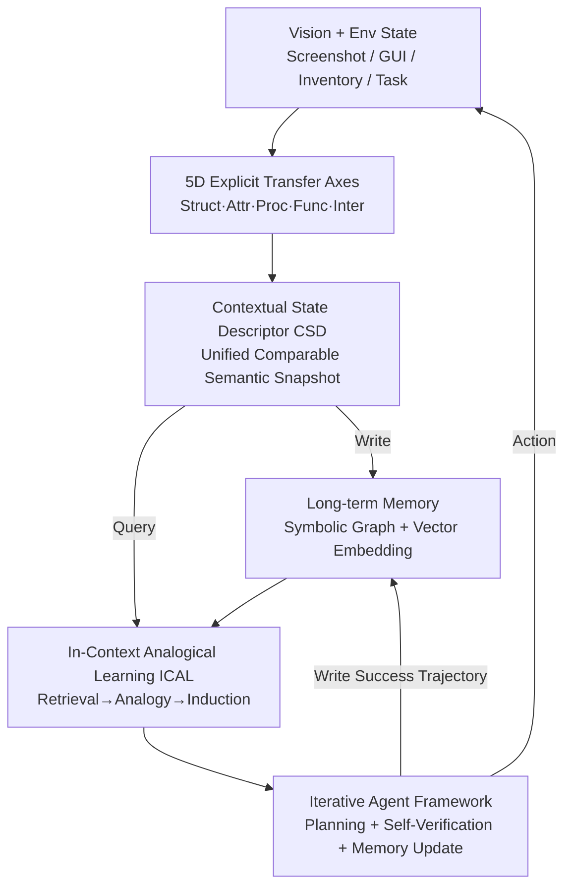

# Experience Transfer for Multimodal LLM Agents in Minecraft Game

**Conference**: CVPR 2026  
**Paper**: [CVF Open Access](https://openaccess.thecvf.com/content/CVPR2026/html/Li_Experience_Transfer_for_Multimodal_LLM_Agents_in_Minecraft_Game_CVPR_2026_paper.html)  
**Code**: None  
**Area**: Agent / Multimodal VLM  
**Keywords**: Experience Transfer, Multimodal Embodied Agent, In-Context Analogical Learning, Structured Memory, Minecraft  

## TL;DR
This paper proposes Echo—a "transfer-oriented" memory framework that explicitly decomposes reusable knowledge into five transfer dimensions: structure, attribute, process, function, and interaction. These are encapsulated into a unified Contextual State Descriptor (CSD). Using In-Context Analogical Learning (ICAL), the agent actively infers and verifies new tasks from the memory bank. In Minecraft "from-scratch" scenarios, this increases item unlocking speed by 1.3×–1.7× and leads to a "chain burst unlocking" phenomenon.

## Background & Motivation

**Background**: Multimodal LLM agents represented by Voyager and JARVIS-1 perform open-ended exploration in open worlds like Minecraft via a "perception-reasoning-action-memory" loop, decomposing goals, planning sub-tasks, and calling tools without large-scale task supervision. They generally rely on long-term memory to reuse skills and support long-range planning.

**Limitations of Prior Work**: Although these methods include "memory," they treat it as a **passive repository**—an index of historical behaviors or a library of reusable skills. In-Context Learning in these systems is merely a passive process of "retrieving a few few-shot examples for the current goal," while the deep structures that make experience **transferable** have never been explicitly modeled. Consequently, when moving to a new world or using different materials, the agent often has to relearn what it already knows.

**Key Challenge**: Open worlds contain numerous recurring structural patterns—"shape prototypes" for tools/armor, "substitutability" between material families, common processing chains like "collection → smelting → crafting," and functional symmetries between weapons. However, traditional MLLM agents perceive **different state transitions and causal relationships** when facing different tasks, failing to recognize that "the task structure is the same, only the materials differ." Combined with the hallucinations and uncontrollable reasoning of MLLMs in open scenarios, transfer is neither stable nor verifiable.

**Goal**: To transform retrieval from "passively serving the current goal" to "actively discovering transferable new tasks," achieving **fast, stable, and interpretable** generalization to new tasks, while making the determination of "which old experience remains applicable in a new context" computable and alignable.

**Key Insight**: The authors observe that "although materials for tools, weapons, and armor differ (wood/stone/iron/diamond), the patterns in their crafting recipes are consistent." Therefore, by explicitly representing the "axes" of transfer (shape, material, process, function) and aligning them with multimodal embeddings, the agent does not need to relearn known knowledge but can rapidly reorganize and reuse existing knowledge.

**Core Idea**: Decompose transferable knowledge along five explicit semantic axes (structure, attribute, process, function, and interaction), compress them into a unified and comparable Contextual State Descriptor (CSD), and utilize In-Context Analogical Learning (ICAL) for active transfer through "retrieval-analogy-execution-verification."

## Method

### Overall Architecture
Echo follows the classic agent model (perception-decision-execution + four layers of short/long-term memory) but focuses on "how to make memory transferable." The system operates in a closed loop: the perception layer encodes vision and environmental states into a **CSD** (a semantic snapshot organized along five transfer axes). This CSD is both written into the long-term memory bank and used as a query to retrieve top-K similar historical tasks. **ICAL** assembles these examples into a context, allowing the instruction-tuned MLLM to analogically infer "potential new tasks" and output action sequences. Actions are executed after **self-verification + pre-checking**, with successful trajectories written back to memory and failures recorded—thus continuously accumulating and autonomously expanding knowledge.

The key design philosophy is that the five transfer axes answer three fundamental questions for knowledge transfer in embodied agents: **what** the world looks like (structure + attribute), **how** the world changes (process + function), and **how** the agent interacts with the world (interaction).

### Key Designs

**1. Five Explicit Transfer Axes: Dissecting "Why Tasks are Transferable" into Five Alignable Semantic Axes**

Traditional methods fail to see that "task structures are identical despite different materials" because they perform **implicit holistic similarity** on tasks, unable to locate exactly which dimension is transferring. This paper explicitly decomposes transferable knowledge into five axes: **Structural Axis** (how the world is organized—spatial layout, hierarchical relationships, accessibility), **Attribute Axis** (visual/physical properties of objects—color, texture, hardness, material, supporting substitution/compatibility reasoning), **Procedural Axis** (how the world changes—causal rules and state transition sequences of actions changing the environment), **Functional Axis** (what an object can do—usage and roles, supporting semantic-level generalization and cross-domain reuse), and **Interaction Axis** (how the agent interacts with the world—perception-action loops and feedback).

These five axes are not randomly assembled but hierarchically dependent: structure and attributes provide a static scaffold, process and function characterize dynamics, and interaction closes the "perception → action → feedback" loop. The value of explicit modeling lies in the agent's ability to semantically explain correspondences and similarities between tasks, thereby making interpretable cross-task alignments and analogies—for example, identifying "oak planks and stone have similar functions" via the functional axis allows moving the task structure of "crafting a wooden pickaxe" to "crafting a stone pickaxe." The authors specifically distinguish their approach from MrSteve's "What-Where-When memory": while the latter introduces episodic memory, this work uses structured memory to **drive task transfer**.

**2. Contextual State Descriptor (CSD): Compressing Heterogeneous Multimodal Inputs into Unified, Comparable, and Verifiable Semantic Snapshots**

Having five axes is not enough; a unified container is needed to hold and align heterogeneous signals like vision, text, and interaction. A CSD consists of six parts: a `meta` field (recording generation timestamp, source environment, model version) plus `struct / attr / proc / func / inter` fields, each corresponding to a transfer axis. Each field stores both symbolic content (e.g., a JSON description "iron ore occupies the top slot of the furnace, charcoal as fuel in the bottom slot") and global embeddings for fast vector retrieval. Thus, the CSD possesses both **interpretability** (symbolic graph) and **retrievability** (vectors), serving as a unified foundation for stable retrieval and reasoning.

To ensure the MLLM reliably produces well-formatted CSDs, the authors performed **instruction tuning**: using many structured task examples (multimodal task instructions, historical execution trajectories, verifier feedback) to teach the model to align task descriptions with evidence from the five axes and output CSDs following a unified specification. The CSD library is also maintained periodically offline—merging, cleaning, deduplicating, and clustering. Clustered CSDs support knowledge inference and pattern abstraction (e.g., extrapolating "smelting iron ore → iron ingot" to "gold ore → gold ingot," or deriving new crafting routes), enabling autonomous knowledge expansion.

**3. In-Context Analogical Learning (ICAL): Transforming ICL from "Passive Example Fetching" to "Active Inference and Verification of New Tasks"**

This is the most fundamental difference between Echo and classic methods like DEPS or JARVIS-1. The latter use ICL merely to fetch a few few-shot examples from memory to assist in generating sub-task sequences for the current goal. ICAL treats ICL as an **active process**—it actively pulls "potential new tasks" from memory to verify and execute. Specifically, it follows a five-step workflow: (1) **Task Selection**—picking a representative task (most successful or recently learned) and extracting its full CSD; (2) **Example Retrieval**—calculating multi-dimensional semantic similarity across the five CSD components (attr/struct/func/proc/inter) to fetch the top-K most relevant tasks; (3) **ICL Context Construction**—assembling these examples into a context; (4) **New Task Induction**—the model generalizes from the context, outputting only the action sequence of the "potential new task"; (5) **Execution and Verification**—executing and evaluating, with successful trajectories stored and failures recorded.

The retrieval operator can be written as $\mathcal{S}_K = R(x_t, M, T)$, where $M$ is memory and $T=\{\text{struct, attr, proc, func, inter}\}$ is the transfer space, returning $K$ examples and their cross-axis similarity evidence. This process links experience accumulation, knowledge transfer, and autonomous task discovery into a self-driven chain—the more memory there is, the more new tasks can be inferred "out of thin air," which is the mechanism behind the "chain burst unlocking" phenomenon seen later.

**4. Iterative Agent Framework and Transfer Formalization: Stabilizing Transfer in Open Worlds with a Three-Layer Architecture + Self-Verification + Dual-Channel Memory Updates**

MLLM hallucinations in open scenarios can make transfer results unreliable, so the overall framework wraps ICAL in a stabilization mechanism. The system uses a three-layer architecture (Perception / Decision / Execution) coupled with short-term + long-term memory. Perception outputs scene descriptions, object lists, and spatial relations. The Planner in the decision layer generates plans and command sequences, which first pass through a Pre-checker (checking resources/locations). After execution, success is evaluated; if it fails, the MLLM is called for Error Recovery to fix commands; if successful, the Task Manager updates progress/next sub-goal.

The authors formalize this transfer reasoning: a frozen instruction-tuned MLLM $f_\theta$ performs structured in-context learning, outputting a hierarchical plan $\pi_t$ and self-verification assertions $\mathcal{A}ss_t$:

$$[\pi_t,\ \mathcal{A}ss_t] = f_\theta(x_t, \mathcal{S}_K, \text{protocol})$$

Subsequently, the verifier $V$ provides $\{pass, fail\} = V(\pi_t, \mathcal{A}ss_t, x_t)$, ensuring internal logical consistency between the plan and assertions as well as external task feasibility. The executor $Exec(\pi_t)\to trace_t$ collects trajectories, and memory update $M' = U(M, trace_t)$ **updates both symbolic graph and vector channels simultaneously** for continuous learning. "Self-verification/self-consistency checks" were experimentally proven to be key to cross-world stability—removing this baseline (like JARVIS-1's SelfCheck) drops the success rate by 10–20 points.

### A Complete Example: Transferring from Wood Pickaxe to Stone Pickaxe

Using the Case Study example: the goal is to craft a wooden pickaxe, and the task steps are: (1) oak log → oak planks; (2) planks → sticks; (3) failure to craft directly, realizing a crafting table is needed; (4) craft and place a crafting table; (5) arrange planks and sticks on the crafting table to craft a wooden pickaxe. This success trajectory and its CSD are stored.

Later, when crafting a stone pickaxe, ICAL retrieves via the **Functional Axis**—because the functional descriptions of "oak planks" and "cobblestone" are similar (both are "tool materials and building blocks"). It then analogizes the wooden pickaxe task structure to induce steps for the stone pickaxe: (1) use a wooden pickaxe to mine stone to get cobblestone; (2) collect planks to craft sticks; (3) craft and place a crafting table; (4) arrange stone and sticks on the crafting table to craft a stone pickaxe. ICAL recognizes the task pattern "collect material → use crafting table → arrange material," achieving transfer by simply swapping materials—the agent does not relearn the recipe but reuses the structure.

## Key Experimental Results

Experiments were conducted in a **from-scratch / cold-start** setting in Minecraft, measuring Success@0→10 / Success@0→30 (average success rate for the first 10 and 30 episodes). Tasks were divided into four families: Recipe (structure/shape recipe transfer), Functional Eq. (functional equivalent substitution), Crafting Chain (multi-step dependencies), and Utility Blocks (short-range tasks with functional blocks).

### Main Results

The table below excerpts representative tasks from Table 1 (Succ@0→10 / Succ@0→30, higher is better), comparing strong baselines with Echo's few-shot variants:

| Method | Iron Pickaxe (Recipe) | WeaponEq (Func Eq.) | ArmorSet (Chain) | CraftTable (Utility) |
|------|------|------|------|------|
| Voyager [42] | 30.0 / 57.5 | 15.0 / 32.5 | 17.5 / 40.0 | 35.0 / 65.0 |
| MrSteve [36] | 20.0 / 37.5 | 42.5 / 72.5 | 12.5 / 27.5 | 17.5 / 35.0 |
| MP5 [38] | 37.5 / 65.0 | 37.5 / 65.0 | 30.0 / 57.5 | 35.0 / 65.0 |
| JARVIS-1 [45] | 50.0 / 85.0 | 40.0 / 70.0 | 30.0 / 65.0 | 55.0 / 82.5 |
| Echo (2-shot) | 50.0 / 87.5 | 40.0 / 65.0 | 22.5 / 67.5 | 55.0 / 87.5 |
| **Echo (8-shot)** | **52.5 / 87.5** | 45.0 / 75.0 | **27.5 / 67.5** | **55.0 / 87.5** |

Echo achieves up to 62.5 / 92.5 on Recipe and Crafting Table families (Bed/CraftGrid columns), steadily improving with the number of shots (k=1→8). Note: MrSteve is strongest in functional equivalence but weak in structural/multi-step tasks; JARVIS-1 is the most stable overall baseline. Echo is competitive with just 2-shot, though its 8-shot performance in functional equivalence does not exceed the absolute peak of JARVIS-1, despite having a smoother learning curve.

### Continuous Learning and Ablation Study

**Continuous Learning (31 episodes)**: Echo starts slow but accelerates after episode 10, stabilizing at 46–48% toward the end. At episode 30, the ranking is Echo(45) > MP5(43) > JARVIS-1(35) > MrSteve(33) > Voyager(18). In contrast, JARVIS-1 starts fast due to its pre-trained policy library but saturates after 20 episodes, suggesting limited scalability in multi-task long-range reasoning.

**Single-Axis Ablation (Keep-Only / Remove, ΔSuccess Rate %)**:

| Removed Axis | Most Affected Task Family | Success Rate Change |
|---------|------------------|-----------|
| Attribute | Recipe | -11% |
| Structural | Functional Eq. / Crafting Chain | -7% / -9% |
| Procedural | Crafting Chain (Long-range) | -12% |
| Functional | Functional Eq. (Almost paralyzed) | -9% |
| Interaction | Utility Blocks (Short-range) | -7% |

### Key Findings
- **The drop from removing an axis is much larger than keep-only effects**, indicating that the five axes are complementary and synergistic rather than independent—this is direct evidence that "explicit modeling outperforms implicit holistic similarity."
- **The Procedural Axis has the greatest impact on long-range tasks (Crafting Chain, -12%)**, as these tasks rely most on correct reasoning of causal chains and state transitions; the Functional Axis almost dictates the survival of functional equivalence tasks (-9%).
- **"Chain Burst Unlocking" Phenomenon**: After accumulating some knowledge during cold-start, a burst of similar items is unlocked in a very short time during the mid-to-late stages. This is the compound effect of ICAL actively inferring new tasks from memory and the source of the 1.3×–1.7× speedup.
- **Slow start is the cost**: Echo sacrifices early speed for long-term sustainable growth—essentially a tradeoff between "building the library early, harvesting late."

## Highlights & Insights
- **Turning "transfer" from a slogan into five computable axes**: Most agents claim to reuse memory, but Echo is the first to decompose "why transfer is possible" into five alignable and ablatable semantic axes, proving through ablation which axis governs which task family—this "locatable transfer" is rare.
- **Clever semantic upgrade from ICL → ICAL**: While both are in-context learning, changing "passive example retrieval for the current goal" to "active retrieval of potential new tasks for verification and execution" turns the memory bank from a warehouse into an engine, directly triggering the chain burst unlocking.
- **Symbolic + Vector Dual-Channel Memory** is transferable to any agent system requiring both interpretability and fast retrieval: symbolic graphs for humans/verifiers to check consistency, and vector embeddings for retrievers to calculate similarity, coexisting in the same CSD.
- **Analogy driven by the Functional Axis** (Planks ↔ Stone) demonstrates a general zero-shot task synthesis idea: as long as "similar material functions" can be calculated, the entire task structure can be moved over without relearning recipes.

## Limitations & Future Work
- **Authors acknowledge**: Echo leans toward "skill acquisition and learning" rather than "exploration/perception"; in information-sparse environments, it relies more on priors and retrieval, making its active exploration weaker than active perception methods like MP5; the initial learning rate is also slow.
- **Authors acknowledge**: Evaluation is primarily in Minecraft—an open but idealized environment with simple, consistent rules. Real-world tasks are more diverse, blurred, and causally complex, where transfer will rely more on the LLM's own reasoning generalization rather than being as direct as in Minecraft.
- **Independent Observation**: ⚠️ The paper provides only qualitative descriptions of specific CSD embedding methods, weights for the five-axis similarity formulas, and the scale of instruction-tuning data, lacking quantitative details for reproduction. The code is not open-source, resulting in a high barrier to reproduction.
- **Improvement Ideas**: Incorporate "when to explore vs. when to transfer" into explicit modeling (to mitigate information-sparse scenarios) or introduce an active perception module to offset Echo's weakness in exploration; verify the robustness of the five axes in environments closer to real physics with inconsistent rules.

## Related Work & Insights
- **vs Voyager / JARVIS-1**: They treat memory as a passive repository and use ICL to fetch few-shot examples for current goals; Echo uses ICAL to actively infer and verify new tasks. Echo shows stronger long-term growth and scalability but a slower cold-start than JARVIS-1 (which uses a pre-trained policy library).
- **vs MrSteve (What-Where-When Memory)**: MrSteve introduces episodic memory for event backtracking, performing strongly in functional equivalence but weakly in structural/multi-step tasks; Echo uses structured memory to drive task transfer, performing better in structural and long-range tasks.
- **vs MP5**: MP5 relies on active perception to continuously acquire new information and possesses good robustness; Echo relies on priors and retrieval, making it weaker in sparse-information scenarios—the two are actually complementary. "Active perception + explicit transfer axes" is a promising direction for integration.

## Rating
- Novelty: ⭐⭐⭐⭐⭐ First to explicitly decompose multimodal memory transfer into five alignable, ablatable semantic axes and upgrade ICL to active ICAL.
- Experimental Thoroughness: ⭐⭐⭐⭐ Four task families + strong baselines + single-axis ablation + continuous learning curves are fairly complete, though lacking real-world validation and formula-level details.
- Writing Quality: ⭐⭐⭐⭐ Motivation and the five axes are clearly narrated with intuitive cases; some formulas and quantitative details are slightly coarse.
- Value: ⭐⭐⭐⭐ "Locatable experience transfer + chain burst unlocking" provides clear inspiration for memory design in open-world agents, though unfortunately not open-sourced.

<!-- RELATED:START -->

## Related Papers

- [\[CVPR 2026\] Learning to Select Visual Tools from Experience](learning_to_select_visual_tools_from_experience.md)
- [\[CVPR 2026\] ReFAct: Empowering Multimodal Web Agents with Visual and Context Focusing](refact_empowering_multimodal_web_agents_with_visual_and_context_focusing.md)
- [\[ICLR 2026\] Towards Multimodal Data-Driven Scientific Discovery Powered by LLM Agents](../../ICLR2026/llm_agent/towards_multimodal_data-driven_scientific_discovery_powered_by_llm_agents.md)
- [\[ICML 2026\] EvolveR: Self-Evolving LLM Agents through an Experience-Driven Lifecycle](../../ICML2026/llm_agent/evolver_self-evolving_llm_agents_through_an_experience-driven_lifecycle.md)
- [\[ICML 2026\] Skill-Pro: Learning Reusable Skills from Experience via Non-Parametric PPO for LLM Agents](../../ICML2026/llm_agent/skill-pro_learning_reusable_skills_from_experience_via_non-parametric_ppo_for_ll.md)

<!-- RELATED:END -->
