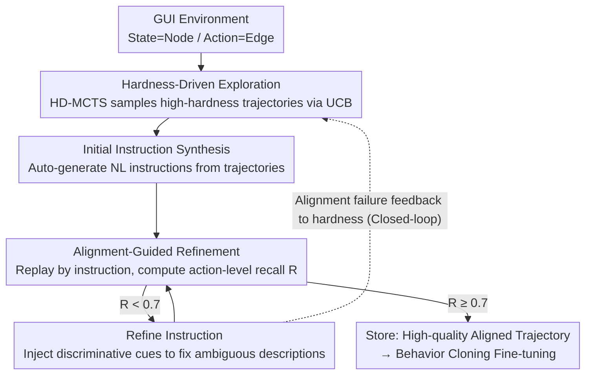

# HATS: Hardness-Aware Trajectory Synthesis for GUI Agents

**Conference**: CVPR 2026  
**arXiv**: [2603.12138](https://arxiv.org/abs/2603.12138)  
**Code**: [JiuTian-VL/HATS](https://github.com/JiuTian-VL/HATS)  
**Area**: LLM Agent  
**Keywords**: GUI Agent, Trajectory Synthesis, Semantic Ambiguity, Monte Carlo Tree Search, Data Alignment  

## TL;DR

Ours proposes HATS, a hardness-aware trajectory synthesis framework. Through a closed-loop mechanism of hardness-driven exploration and alignment-guided refinement, it focuses on collecting and correcting training trajectories with semantically ambiguous actions, significantly enhancing the generalization capabilities of GUI Agents in complex real-world scenarios.

## Background & Motivation

GUI Agents based on Large Vision-Language Models (VLM) have shown great potential in automating digital tasks. Existing work (e.g., OS-Genesis) typically adopts trajectory synthesis to construct training data—allowing the model to explore autonomously in simulated environments, recording operation trajectories and pairing them with instructions. However, Agents trained with such methods perform adequately on simple interactions but fail to generalize to complex scenarios.

Ours identifies the root cause as the neglect of **semantically ambiguous actions**. The meaning of such actions is highly dependent on context, operation sequence, or visual cues, categorized into three types:

**Context-dependent**: The same icon/button triggers completely different functions on different pages or states. For example, a "+" button creates a new email in a mail app but creates a new event in a calendar.

**Order-dependent**: Certain operations must be performed after specific prerequisite steps to execute correctly; skipping intermediate steps leads to entirely different results.

**Visually ambiguous**: UI elements with highly similar appearances actually correspond to different functions, causing model confusion.

Under existing random exploration strategies, over 70% of collected trajectories consist of simple operations like "open menu" or "click back," leaving semantically ambiguous actions severely underrepresented. Furthermore, even when such trajectories are collected, single-pass instruction generation often produces vague descriptions, leading to semantic misalignment between instructions and execution. These dual issues severely limit the quality and diversity of synthesized data.

## Method

### Overall Architecture

HATS addresses a chronic issue in GUI Agent training data: random exploration causes simple, high-frequency actions like "click settings" or "click OK" to be repeatedly sampled, while difficult-to-learn semantically ambiguous actions are rarely captured. HATS forms a closed loop with two modules to correct this bias—**Hardness-Driven Exploration** actively samples "hard" trajectories, while **Alignment-Guided Refinement** ensures the "instruction-execution" semantic alignment of the sampled trajectories, feeding alignment failure signals back to exploration to keep the system focused on hard samples.

### Key Designs

**0. Definition of Hardness**

The entire framework revolves around **hardness (the degree of semantic ambiguity of an action)**. Intuitively, an action is more "ambiguous" if multiple visually or semantically similar targets exist under the same interface state, making it impossible to uniquely determine the target from a vague instruction. HATS quantifies this using **replay reproducibility**—after pairing a trajectory with an automatically generated instruction, the Agent re-executes the instruction. The **action-level reconstruction recall $R$** (the recall of the replayed action sequence matching the original trajectory step-by-step) measures alignment. A lower $R$ indicates the action is prone to deviation during replay, representing higher hardness. Thus, hardness is not a subjective label but a measurable metric derived from "how many actions were lost during reconstruction."

**1. Hardness-Driven Exploration (HD-MCTS): Focusing Exploration on Difficulties**

HATS models GUI exploration as a tree search: each UI state is a node, and each action is an edge. Using the Monte Carlo Tree Search (MCTS) framework, hardness serves as the node value signal. When selecting the next step, the UCB (Upper Confidence Bound) formula balances **exploitation** (known high-hardness branches) and **exploration** (under-visited new states). It prioritizes (a) action branches with known high hardness and (b) new states with insufficient visits, dynamically updating hardness statistics during search. Consequently, the sampling distribution shifts from "biased toward simple high-frequency actions" to "challenging ambiguous actions."

**2. Alignment-Guided Refinement: Refining Vague Instructions for Reproducibility**

Sampling hard trajectories is insufficient—a trajectory might be correct, but the paired instruction might be too vague (e.g., "click settings"), failing to uniquely determine the path during replay. Refinement acts as a quality gate using "replay validation + iterative refinement":

| Step | Action | Description |
|:---:|:---|:---|
| 1 | Initial Instruction Synthesis | Automatically generate natural language instructions from exploration trajectories |
| 2 | Instruction Replay | Re-execute in the same environment following the instruction |
| 3 | Alignment Measurement | Calculate action-level reconstruction recall $R$ |
| 4 | Instruction Refinement | Inject missing contextual cues to fix ambiguous descriptions |
| 5 | Iterative Check | Repeat steps 2–4 until $R \geq 0.7$ |

Only trajectories passing the alignment check ($R \geq 0.7$) enter the final training corpus.

**3. Mechanism: Closed-loop Feedback**

The two modules are connected by a bidirectional information flow: Exploration feeds challenging trajectories to Refinement for validation; Refinement discovers actions that fail alignment during replay and feeds their hardness signals back to the search module, increasing the priority of these actions in future exploration. This ensures actions that are harder to align receive higher exploration weights, allowing the system to self-focus on high-quality hard samples.

### Loss & Training

The value of HATS lies in data synthesis. Final training employs standard **Behavior Cloning (BC)**: fine-tuning a VLM-based GUI Agent using the synthesized high-quality trajectories. The objective is the standard next-action prediction loss. The key is not the training algorithm itself but the data—HATS ensures that semantically ambiguous actions are adequately represented and correctly aligned with instructions.

## Key Experimental Results

### Main Results

Comparison with existing methods on two mainstream GUI Agent benchmarks:

| Method | AndroidWorld (SR%) | WebArena (SR%) |
|:---|:---:|:---:|
| Base VLM (Zero-shot) | ~5.0 | ~3.0 |
| Random Exploration | ~8.5 | ~4.5 |
| OS-Genesis | 11.30 | 6.53 |
| AgentTrek | ~12.5 | ~8.0 |
| DigiRL | ~14.0 | ~9.5 |
| **Ours (HATS)** | **22.60** | **20.60** |

Compared to the strongest baseline OS-Genesis, HATS achieves an improvement of approximately **100%** on AndroidWorld and **215%** on WebArena, demonstrating a significant advantage.

### Ablation Study

Ablation study of module contributions:

| Configuration | AndroidWorld (SR%) | WebArena (SR%) |
|:---|:---:|:---:|
| Full HATS | **22.60** | **20.60** |
| w/o HD-MCTS (Random) | ~15.0 | ~12.5 |
| w/o Alignment Refinement | ~16.5 | ~13.0 |
| w/o Closed-loop Feedback | ~17.5 | ~14.0 |
| w/o Hardness Signal (Uniform UCB) | ~18.0 | ~15.5 |

### Key Findings

1.  **Modules are Interdependent**: Removing either HD-MCTS or Alignment Refinement leads to a significant performance drop, proving that exploration quality and data alignment are equally vital.
2.  **Closed-loop Feedback is a Key Catalyst**: Using both modules separately (without feedback) provides gains, but the extra boost from the closed-loop integration indicates that adaptive hardness updates are crucial.
3.  **High Data Efficiency**: HATS outperforms baselines using large datasets with fewer trajectory data points because each trajectory has higher information density.
4.  **Threshold Selection $R \geq 0.7$**: Thresholds that are too low introduce noise, while those that are too high over-filter data. 0.7 is the optimal observed balance.

## Highlights & Insights

1.  **Precise Problem Definition**: Ours is the first to explicitly define "semantically ambiguous actions" and systematically categorize them, providing a clear analytical framework for future research.
2.  **Elegant Closed-loop Design**: Exploration and Refinement are not merely connected in a pipeline but form a positive feedback loop via hardness signals. This adaptive mechanism allows the system to focus automatically on areas needing improvement.
3.  **Quality over Quantity**: In GUI Agent data synthesis, while most works pursue higher trajectory volumes, HATS proves that fine-grained control over trajectory distribution and alignment quality is far more important than quantity.
4.  **Novel MCTS Application**: While modeling GUI exploration as a tree search is not new, using the degree of semantic ambiguity as a reward signal for MCTS is an innovative design that directly links search strategy to data quality goals.

## Limitations & Future Work

1.  **Environment Dependency**: HATS exploration requires interactive GUI environments (Android emulators, browsers), posing high requirements for environment setup and leading to non-trivial operational costs.
2.  **Alignment Validation Ceiling**: Alignment Refinement relies on the VLM's own judgment to evaluate alignment. If the VLM itself lacks understanding of certain ambiguous actions, it may create "blind spots."
3.  **Hardness Cold Start**: In the initial stage, there is a lack of prior hardness information, potentially leading to lower efficiency in the first few rounds of exploration.
4.  **Cross-platform Generalization**: While validated on Android and Web, the interaction patterns of desktop GUIs (e.g., Windows/macOS native apps) differ significantly.
5.  **Scalability to Complex Tasks**: Currently focused on short-sequence operations, the MCTS search tree might face exponential expansion for complex multi-step tasks requiring long-term planning.

## Related Work & Insights

-   **OS-Genesis**: The previous strongest method for GUI trajectory synthesis, using random exploration and single-pass instruction generation. HATS specifically addresses its core flaws: exploration bias and insufficient alignment.
-   **AgentTrek**: Another synthesis method focusing on task diversity but failing to handle semantic ambiguity.
-   **DigiRL**: Introduces reinforcement learning to GUI Agent training, though RL reward design remains challenging in open-world environments.
-   **Insight**: The core idea—"focusing on hard samples in data while ensuring their quality"—is highly generalizable and can be transferred to other domains requiring synthetic training data, such as robotic manipulation or autonomous driving decision-making.

## Rating

| Dimension | Score (1-5) | Description |
|:---|:---:|:---|
| Novelty | ⭐⭐⭐⭐ | First to define ambiguous actions and propose a closed-loop synthesis framework |
| Technical Depth | ⭐⭐⭐⭐ | Design of HD-MCTS and alignment validation is solid with clear motivation |
| Experimental Thoroughness | ⭐⭐⭐⭐ | Significant improvements over baselines on two major benchmarks with complete ablations |
| Writing Quality | ⭐⭐⭐⭐ | Clear problem definition and intuitive analysis of ambiguity types |
| Value | ⭐⭐⭐⭐⭐ | Open-sourced data and models directly benefit the GUI Agent community |
| **Overall** | **⭐⭐⭐⭐** | **A major advancement in GUI Agent data synthesis with an elegant closed-loop design** |

<!-- RELATED:START -->

## Related Papers

- [\[ICML 2026\] Recovering Policy-Induced Errors: Benchmarking and Trajectory Synthesis for Robust GUI Agents](../../ICML2026/llm_agent/recovering_policy-induced_errors_benchmarking_and_trajectory_synthesis_for_robus.md)
- [\[ACL 2025\] OS-Genesis: Automating GUI Agent Trajectory Construction via Reverse Task Synthesis](../../ACL2025/llm_agent/os_genesis_gui_agent_trajectory.md)
- [\[AAAI 2026\] History-Aware Reasoning for GUI Agents](../../AAAI2026/llm_agent/history-aware_reasoning_for_gui_agents.md)
- [\[CVPR 2026\] GUI-CEval: A Hierarchical and Comprehensive Chinese Benchmark for Mobile GUI Agents](gui-ceval_a_hierarchical_and_comprehensive_chinese_benchmark_for_mobile_gui_agen.md)
- [\[CVPR 2026\] MMBench-GUI: A Unified Hierarchical Evaluation Framework for Multi-Platform GUI Agents](mmbench-gui_a_unified_hierarchical_evaluation_framework_for_multi-platform_gui_a.md)

<!-- RELATED:END -->
