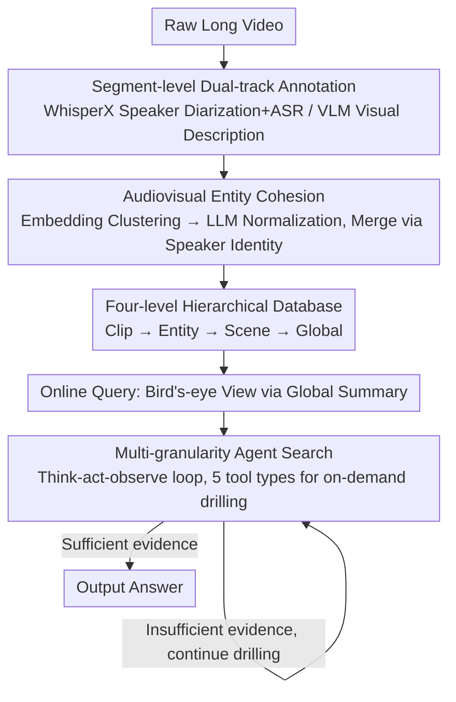

# HAVEN: Hierarchical Long Video Understanding with Audiovisual Entity Cohesion and Agentic Search

**Conference**: CVPR 2026  
**arXiv**: [2601.13719](https://arxiv.org/abs/2601.13719)  
**Code**: None  
**Area**: LLM Agent  
**Keywords**: Long Video Understanding, Hierarchical Indexing, Entity Consistency, Agentic Search, Audiovisual Fusion

## TL;DR
HAVEN proposes a unified framework featuring audiovisual entity cohesion + hierarchical indexing + agentic search. By utilizing speaker identity as a cross-modal consistency signal, it constructs a four-level hierarchical database (Global-Scene-Clip-Entity), achieving SOTA with an overall accuracy of 84.1% on LVBench.

## Background & Motivation
1. **Background**: Long video understanding is a significant challenge for VLMs. Existing solutions (RAG, Agent frameworks) remain insufficient when processing hour-long videos.
2. **Limitations of Prior Work**: (i) Naive chunk-based RAG leads to information fragmentation and loss of global coherence; (ii) lack of hierarchical video representation forces Agents into inefficient multi-turn retrievals to recover cross-segment continuity.
3. **Key Challenge**: Events in long videos span long time ranges and evolve through multiple scenes. Local segment descriptions fail to capture the global narrative structure and long-range entity associations.
4. **Goal**: Shift from fragmented retrieval to coherent structured understanding—by constructing a hierarchical database offline and executing adaptive Agent search online.
5. **Key Insight**: Utilize speaker identity as a long-range consistency signal across modalities (effective even when visual cues are unreliable) to build robust entity representations.
6. **Core Idea**: Audiovisual entity cohesion (consolidating fragmented observations via speaker identity) + Four-level hierarchical database + Goal-driven multi-granularity Agent search.

## Method

### Overall Architecture

HAVEN decomposes "understanding long videos" into two stages: offline and online. **Offline**, the raw video is processed once into a four-level hierarchical database $\mathcal{D} = \{\tilde{\mathcal{C}}, \tilde{\mathcal{E}}, \tilde{\mathcal{S}}, \tilde{\mathcal{G}}\}$—from fine to coarse: Clip, Entity, Scene, and Global. **Online**, during question answering, the Agent no longer re-scans the video. Instead, it obtains a "bird's-eye view" via the global summary and performs on-demand drilling into the database through a think-act-observe loop. The three designs below address: how fragmented characters are recognized as the same person, how information is organized hierarchically, and how the Agent navigates between layers.

### Key Designs

**1. Audiovisual Entity Cohesion: Using "Voice" as Cross-segment Glue**

The same person appears repeatedly in long videos, but occlusions, scene cuts, and lighting changes cause pure visual descriptions to misidentify "the same person" as different individuals. HAVEN's key insight is: **speaker identity is much more stable than visual appearance**—the voice does not change because a person turns their back or the lights dim.

Mechanism: Each segment first extracts dual-track annotations—audio side uses WhisperX for speaker diarization + ASR, visual side uses VLM for descriptions, combined into a segment representation $C_i^t = [P_i'; T_i; V_i]$. Entity consolidation then follows two steps: (1) **Embedding Clustering** encodes all entity descriptions into candidate groups; (2) **LLM Normalization** verifies clusters to decide whether to merge into a canonical entity or split. A priority rule is applied: if multiple segments share the same speaker label, the corresponding characters are preferentially merged, even if their visual descriptions differ due to occlusion/perspective. This embodies using "voice" as the consistency glue across segments.

**2. Four-level Hierarchical Database: Information tailored to requirements**

Different questions require varying granularities of information. HAVEN indexes content into four layers:

- **Clip level $\tilde{\mathcal{C}}$**: 30-second segments containing text + visual embeddings, answering "What happened at minute 12".
- **Entity level $\tilde{\mathcal{E}}$**: Canonical entities + focused re-descriptions in each associated segment, answering "How Sarah's expression changed".
- **Scene level $\tilde{\mathcal{S}}$**: LLM adaptively groups semantically continuous segments and generates scene summaries, answering "What is this scene about".
- **Global level $\tilde{\mathcal{G}}$**: A general overview synthesized from scene summaries, answering "What is the whole video about".

This ensures "What is the video about / What happened at a specific minute / How a person changed" are addressed by the Global, Clip, and Entity layers respectively, without interference.

**3. Multi-granularity Agent Search: On-demand drilling instead of full scans**

The Agent is equipped with 5 tool types—Global Scene Browsing $T_{\text{scene}}$, Clip Description Search $T_{\text{caption}}$, Clip Visual Search $T_{\text{visual}}$, Entity Search $T_{\text{entity}}$, and Targeted Inspection $T_{\text{inspect}}$ (dual text/visual modes). Initialized with the global summary, it enters a think-act-observe loop: select tool → execute query → receive evidence → reasoning → decide to continue drilling or answer. Crucially, the path is autonomously planned by the Agent—it can go from "coarse to fine" or directly hit the entity layer when characters are known, avoiding unnecessary full scans.

### A Complete Walkthrough ("Who did Sarah leave after arguing with?")
1. **Bird's-eye View**: Agent reads Global Summary $\tilde{\mathcal{G}}$, locating scenes related to "arguing".
2. **Locate Scene**: Call $T_{\text{scene}}$ to find scene-level entries containing the argument, narrowing the time window to approximately 3 segments.
3. **Identify Entity**: Call $T_{\text{entity}}$ to retrieve Sarah’s canonical entity—because offline processing merged her across segments via speaker identity, she is correctly associated even if her back is to the camera here.
4. **Gather Evidence**: In the target window, call $T_{\text{caption}}$/$T_{\text{visual}}$ to find another entity in the same frame with matching dialogue labels = "Mark".
5. **Verification**: Call $T_{\text{inspect}}$ to confirm Sarah leaves the frame alone after the argument, outputting "Mark". The entire process only drills down through a single Scene → Entity → Clip path without scanning the full video.

This chain integrates the three designs: the hierarchical database provides entry points, entity cohesion ensures characters are not misidentified, and Agent search determines the shortest path.

### Loss & Training
The entire pipeline is **training-free**. Offline hierarchical database construction relies solely on VLM/LLM calls, and online search uses a pre-trained inference LLM without any parameter updates.

## Key Experimental Results

### Main Results

| Method | LVBench Overall | LVBench Reasoning | EgoSchema | Description |
|------|----------------|-------------------|-----------|------|
| HAVEN (2fps) | **84.1** | **80.1** | - | SOTA |
| DVD w. subtitle | 76.0 | 68.7 | - | Prev. Best Agent |
| OpenAI o3 | 57.1 | 50.8 | 63.2 | Closed-source model |
| GPT-4o | 48.9 | 50.3 | 70.4 | Closed-source model |

### Ablation Study

| Configuration | Overall | Description |
|------|---------|------|
| Full HAVEN | 84.1 | Complete framework |
| w/o Speaker Identity | Decrease | Lower quality of entity consolidation |
| w/o Hierarchical Indexing | Significant Decrease | Degenerates into flat RAG |
| w/o Multi-granularity Tools | Decrease | Lower search efficiency |

### Key Findings
- HAVEN performs exceptionally well in the reasoning category (80.1%), suggesting the hierarchical structure is particularly helpful for complex reasoning.
- Speaker identity is an irreplaceable cue for entity consolidation in long videos.
- Compared to DVD, HAVEN shows Gains across all subcategories and requires fewer search iterations.

## Highlights & Insights
- **Speaker identity as "glue" for entity cohesion** is a significantly overlooked yet highly effective innovation.
- The **four-level hierarchical architecture** aligns with human cognitive patterns for understanding long videos (overview first, then details).
- The offline construction + online search architecture ensures that repeated queries do not require re-processing the video.

## Limitations & Future Work
- Offline construction of the hierarchical database incurs certain computational costs (multiple LLM calls).
- Reliability depends on the quality of WhisperX speaker diarization, making it less effective for non-dialogue videos.
- Fixed segment lengths (30s) may not be the optimal partition for all video types.

## Related Work & Insights
- **vs DVD**: DVD uses simple segment descriptions + global entity registration but lacks a hierarchical structure. HAVEN’s four-level hierarchy provides more efficient navigation.
- **vs VideoRAG**: Based on fragmented segment retrieval, VideoRAG lacks global coherence. HAVEN maintains narrative structure through hierarchical indexing.

## Rating
- Novelty: ⭐⭐⭐⭐⭐ Audiovisual entity cohesion and four-level hierarchical indexing are innovative designs.
- Experimental Thoroughness: ⭐⭐⭐⭐ LVBench SOTA + multi-benchmark validation.
- Writing Quality: ⭐⭐⭐⭐⭐ Clear framework and systematic methodology description.
- Value: ⭐⭐⭐⭐⭐ A milestone work in the field of long video understanding.

<!-- RELATED:START -->

## Related Papers

- [\[CVPR 2026\] Think, Then Verify: A Hypothesis-Verification Multi-Agent Framework for Long Video Understanding](think_then_verify_a_hypothesis-verification_multi-agent_framework_for_long_video.md)
- [\[NeurIPS 2025\] Deep Video Discovery: Agentic Search with Tool Use for Long-form Video Understanding](../../NeurIPS2025/llm_agent/deep_video_discovery_agentic_search_with_tool_use_for_longfo.md)
- [\[CVPR 2026\] Symphony: A Cognitively-Inspired Multi-Agent System for Long-Video Understanding](symphony_a_cognitively-inspired_multi-agent_system_for_long-video_understanding.md)
- [\[CVPR 2026\] Resolving Evidence Sparsity: Agentic Context Engineering for Long-Document Understanding](resolving_evidence_sparsity_agentic_context_engineering_for_long-document_unders.md)
- [\[CVPR 2026\] SciEducator: Scientific Video Understanding and Educating via Deming-Cycle Multi-Agent System](scieducator_scientific_video_understanding_and_educating_via_deming-cycle_multi-.md)

<!-- RELATED:END -->
