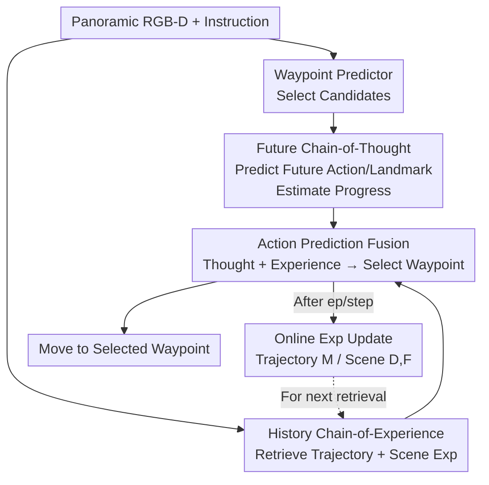

# History to Future: Evolving Agent with Experience and Thought for Zero-shot Vision-and-Language Navigation

**Conference**: CVPR 2026  
**Paper**: [CVF Open Access](https://openaccess.thecvf.com/content/CVPR2026/html/Dai_History_to_Future_Evolving_Agent_with_Experience_and_Thought_for_CVPR_2026_paper.html)  
**Area**: Agent / Embodied Navigation  
**Keywords**: Zero-shot VLN-CE, LLM Navigation, Feedback Reasoning, Experience Replay, Future Chain-of-Thought  

## TL;DR
EVONAV equips LLM agents for Zero-shot Vision-and-Language Navigation in Continuous Environments (VLN-CE) with a "Review History + Predict Future" feedback loop. By using Future Chain-of-Thought (F-CoT) to predict future actions and landmarks for estimating navigation progress, and History Chain-of-Experience (H-CoE) to summarize completed trajectories and traversed scenes into an online retrievable experience bank, the two components evolve decision-making from "naive direct reasoning" to "continuous error correction with feedback." On R2R-CE, it outperforms Open-Nav (using the same LLM) by +20% SR, +21% OSR, and +17% SPL, while being more time and VRAM efficient.

## Background & Motivation

**Background**: Vision-and-Language Navigation in Continuous Environments (VLN-CE) requires agents to follow natural language instructions to a target without pre-built maps, using only low-level actions (move forward 0.25m, turn left/right 15°). Traditional approaches rely on supervised training (CMA, BEVBert, ETPNav, etc.) on R2R-CE data, achieving high accuracy through inductive biases learned in seen environments. Recently, zero-shot VLN-CE using LLMs has emerged. These methods utilize LLM common sense and reasoning by first using general visual translators (e.g., BLIP-2) to convert panoramic images into text, and then tasking the LLM with predicting the next action (NavGPT, MapGPT, Open-Nav, etc.).

**Limitations of Prior Work**: The authors identify two fundamental flaws in existing LLM-based routes. First, relying on external visual translators "indirectly" processes visuals, losing fine-grained details as the LLM perceives compressed text descriptions. Second, and more critically, these methods rely on **naive reasoning**: given current observations and instructions, they output an action directly without reviewing past mistakes or predicting future outcomes. Once the first few steps go wrong, the agent enters a "continuous failure" loop, especially in difficult tasks.

**Key Challenge**: Humans evolve decisions along the "History → Present → Future" timeline—summarizing past errors to form experience and imagining future consequences to mitigate risk. Existing LLM agents lack this feedback chain; they possess strong reasoning capabilities but lack the historical experience and future thought as inputs to "close the loop," leading to unreleased reasoning potential and hallucinations.

**Goal**: Without any task-specific training (maintaining zero-shot capability for better sim-to-real transfer), provide LLM agents with "Reviewing History" and "Predicting Future" feedback, transforming direct reasoning $\text{LLM}(O,I)\to A_{now}$ into evolved decision-making with feedback.

**Core Idea**: Use "Future Thought" and "History Experience" to constrain current decisions. Formally, the paradigm is rewritten as:
$$\text{H-CoE} \leftarrow \text{LLM}(O,I) \to A_{now} \to \text{F-CoT}$$
While F-CoT predicts forward actions/landmarks as "thought," H-CoE summarizes backward trajectories/scenes as "experience." Both streams are fed back into the action prediction module, allowing the agent to "review history, dream future" like a human.

## Method

### Overall Architecture
The input of EVONAV (written as EvoNav in the text) is panoramic RGB-D images (12 RGB + depth patches covering 0° to 330°) and language instructions; the output is the next candidate waypoint. The pipeline consists of four stages: First, a standard waypoint predictor selects candidate waypoints from the panoramic view. Second, **F-CoT** performs "Future Thought" reasoning to predict the next action and landmark, estimating navigation progress and potential direction. Third, **H-CoE** retrieves relevant trajectory and scene experiences from an "experience bank" that continuously summarizes and stores completed paths and scenes. Finally, the **Action Prediction Module** fuses retrieved history and predicted future thought to make reliable waypoint selections. The experience bank updates online as episodes and steps are completed, meaning the more the agent runs, the more robust its decisions become.

### Key Designs

**1. Future Chain-of-Thought (F-CoT): Estimating Progress by Predicting the Future**
The blind spot of naive reasoning is "not knowing one's progress in the instructions." Instructions are sequences of sub-actions, but the agent often loses track of which step it is on. F-CoT uses four serial sub-steps to explicitly derive the "future" to calibrate the current state. ① **Instruction Decomposition**: LLM splits instructions into temporal sub-actions $I_t$ and spatial landmarks $I_s$. ② **Predict Future Action** $P_f = \text{LLM}(H, O, I)$: By first determining what hasn't happened yet, the agent can infer its current state by subtracting future actions from the complete set. ③ **Progress Estimation**: Deduce already executed actions $A_d = \text{LLM}(I_s, I_t, P_f, H)$ based on future action and history. ④ **Predict Future Landmark** $L_f = \text{LLM}(I, I_s, I_t, A_d)$: If the next action mentions a landmark, it is precisely matched; otherwise, it outputs "None." The predicted $L_f$ is used as a query for H-CoE scene retrieval, linking "what I want to find next" with "where I have seen similar scenes."

**2. H-CoE History Trajectory Experience: Summarizing Global Success and Failure**
Trajectory experience addresses episode-level global guidance. Upon completing an episode, a performance metric $R = \psi(NE, SR, OSR, SPL)(Nav, Nav_{GT})$ is calculated. Based on $R$ and the full trajectory $H^*$, the LLM summarizes experience $E$ following three rules: **Total Failure (SR=0)**—analyze errors and provide correction workflows; **Perfect Navigation (SR=1, SPL≥0.8)**—replicate this behavior; **Successful but Inefficient (SR=1, SPL<0.8)**—provide optimization suggestions for SPL. These are stored in a Chroma vector database $M_n = M_{n-1} \cup [(I_n, I_s^n, H_n^*, E_n)]$. Retrieval uses $I_s$ of the current episode as a query for top-K T2T retrieval.

**3. H-CoE History Scene Experience: Dual-Channel Local Visual Cues**
While trajectory experience is global, step-level decisions require local visual cues. This is built via two paths: an LLM extracts text descriptions $d$ into a scene description bank $D$, while CLIP extracts visual feature embeddings $f$ into a scene appearance bank $F$. Retrieval uses the F-CoT predicted future landmark $L_f$ as the query: $V_e = V_d + V_f$, where $V_d$ is Text-to-Description (T2D) similarity and $V_f$ is Text-to-Visual (T2V) similarity using CLIP’s joint embedding space.

**4. Action Prediction Fusion: Converging Thought and Experience**
The final step converges all information. The LLM makes decisions based on four elements: **View Observation** (spatial relationships), **Thought Support** (using $L_f$ for direction), **Experience Support** (retrieved $T^e$ and $V^e$), and **Waypoint Selection**. Formally:
$$R_n, S_n, Y_n = \text{LLM}(I_s, I_t, I, H, O, T^e, V^e, A_d)$$
where $R_n$ is the reasoning, $S_n$ the description, and $Y_n$ the selected waypoint.

## Key Experimental Results

### Main Results

Comparison on R2R-CE with supervised, pre-trained zero-shot, and training-free zero-shot methods:

| Method | NE↓ | nDTW↑ | OSR↑ | SR↑ | SPL↑ |
|:---|:---:|:---:|:---:|:---:|:---:|
| BEVBert (Supervised) | 5.13 | 61.40 | 64 | 60 | 53.41 |
| SmartWay-GPT4o (Zero-shot + Pre-train) | 7.01 | - | 51 | 29 | 22.46 |
| Open-Nav-GPT4o | 6.70 | 45.79 | 23 | 19 | 16.10 |
| Open-Nav-Gemini-2.5-pro | 7.28 | 49.51 | 30 | 23 | 19.90 |
| **EvoNav-GPT4o (Ours)** | 5.97 | 56.32 | 35 | 30 | 24.91 |
| **EvoNav-Gemini-2.5-pro (Ours)** | **5.04** | **62.38** | **51** | **43** | **37.77** |

Under the same LLM (Gemini), EVONAV improves SR from 23 to 43 (+20), OSR from 30 to 51 (+21), and SPL from 19.9 to 37.77 (+17.87), even surpassing SmartWay which utilizes more pre-training data.

### Ablation Study

Table 4 on R2R-CE (Base is Gemini-2.5-pro naive reasoning):

| Config | Features | OSR↑ | SR↑ | SPL↑ | Description |
|:---|:---|:---:|:---:|:---:|:---|
| Base | All Off | 14 | 9 | 7.46 | Naive baseline |
| A1 | +Future Action $P_f$ | 33 | 25 | 22.10 | Action only |
| A3 | $P_f + L_f$ (Full F-CoT) | 36 | 27 | 24.92 | F-CoT active |
| B2 | A3 + Trajectory Exp $T^e$ | 42 | 31 | 27.64 | Global experience |
| C3 | A3 + Scene Desc + Appear. | 48 | 40 | 34.07 | Local experience |
| Full | F-CoT + H-CoE | 51 | 43 | 37.77 | Final model |

### Key Findings
- **F-CoT is a Catalyst**: Adding F-CoT alone boosts SR from 9 to 27, proving that clarifying the future before localizing current progress is the "switch" for LLM reasoning.
- **Future Action > Future Landmark**: Action guidance is more critical for progress estimation; without it, landmark prediction becomes suboptimal.
- **Scene Experience > Trajectory Experience**: Local visual references (C3 SR 40) are more direct for step-wise decisions than global path summaries (B2 SR 31).
- **Efficiency**: EVONAV requires 2.4G VRAM vs Open-Nav's 12.5G, and completes an episode in 7.6 minutes vs 14.7 minutes.

## Highlights & Insights
- **"Predicting future to infer the present" is a clever trick**: Directly asking an LLM for its current progress is often inaccurate. Calculating the difference between the set of sub-actions and predicted future actions is much more robust.
- **Future landmarks bridge thought and retrieval**: $L_f$ acts as both a directional aid for the LLM and a query for the scene experience bank, aligning intent with past observations.
- **Hierarchical experience summarization**: Categorizing experiences into Failure/Perfect/Inefficient provides the LLM with "labeled reflection samples" rather than raw logs.
- **Self-improving evolution**: The online accumulation of the experience bank allows the system to become more stable over time without any gradient updates.

## Limitations & Future Work
- **Dependency on Experience Accumulation**: The "cold start" period (first 30% of episodes) yields low H-CoE benefits, making the method more suitable for long-term or repetitive scenarios.
- **Latency**: Multiple LLM calls for F-CoT and H-CoE retrieval might hinder real-time deployment on hardware (though it is faster than Open-Nav).
- **Hyperparameter Sensitivity**: The retrieval counts (1 trajectory, 4 images) and the 30% start threshold were empirically tuned and may vary across environments.

## Related Work & Insights
- **Vs. Open-Nav / NavGPT**: These methods perform one-way reasoning. EVONAV demonstrates that a feedback loop "doubles" SR performance while using fewer resources.
- **Vs. SLAM / Geometric Memory**: Unlike methods relying on 3D geometry or re-localization in seen environments, EVONAV stores task-level experiences that generalize to new environments.
- **Vs. Supervised VLN-CE**: While supervised models still hold the state-of-the-art accuracy, they suffer from sim-to-real gaps. EVONAV offers a competitive, training-free alternative ready for real-world deployment.

## Rating
- Novelty: ⭐⭐⭐⭐ Systematizing human-like feedback into F-CoT/H-CoE chains is highly effective.
- Experimental Thoroughness: ⭐⭐⭐⭐⭐ Comprehensive benchmarks, real-world tests, and multi-dimensional ablations.
- Writing Quality: ⭐⭐⭐⭐ Clear diagrams and logic; inconsistent notation in some sections.
- Value: ⭐⭐⭐⭐ Significant practical progress for the zero-shot embodied navigation community.

<!-- RELATED:START -->

## Related Papers

- [\[ICML 2026\] Scaling, Benchmarking, and Reasoning of Vision-Language Agents for Mobile GUI Navigation](../../ICML2026/llm_agent/scaling_benchmarking_and_reasoning_of_vision-language_agents_for_mobile_gui_navi.md)
- [\[ECCV 2024\] Agent3D-Zero: An Agent for Zero-shot 3D Understanding](../../ECCV2024/llm_agent/agent3d-zero_an_agent_for_zero-shot_3d_understanding.md)
- [\[CVPR 2026\] Towards GUI Agents: Vision-Language Diffusion Models for GUI Grounding](towards_gui_agents_vision-language_diffusion_models_for_gui_grounding.md)
- [\[CVPR 2026\] JarvisEvo: Towards a Self-Evolving Photo Editing Agent with Synergistic Editor-Evaluator Optimization](jarvisevo_towards_a_self-evolving_photo_editing_agent_with_synergistic_editor-ev.md)
- [\[CVPR 2026\] Learning to Select Visual Tools from Experience](learning_to_select_visual_tools_from_experience.md)

<!-- RELATED:END -->
