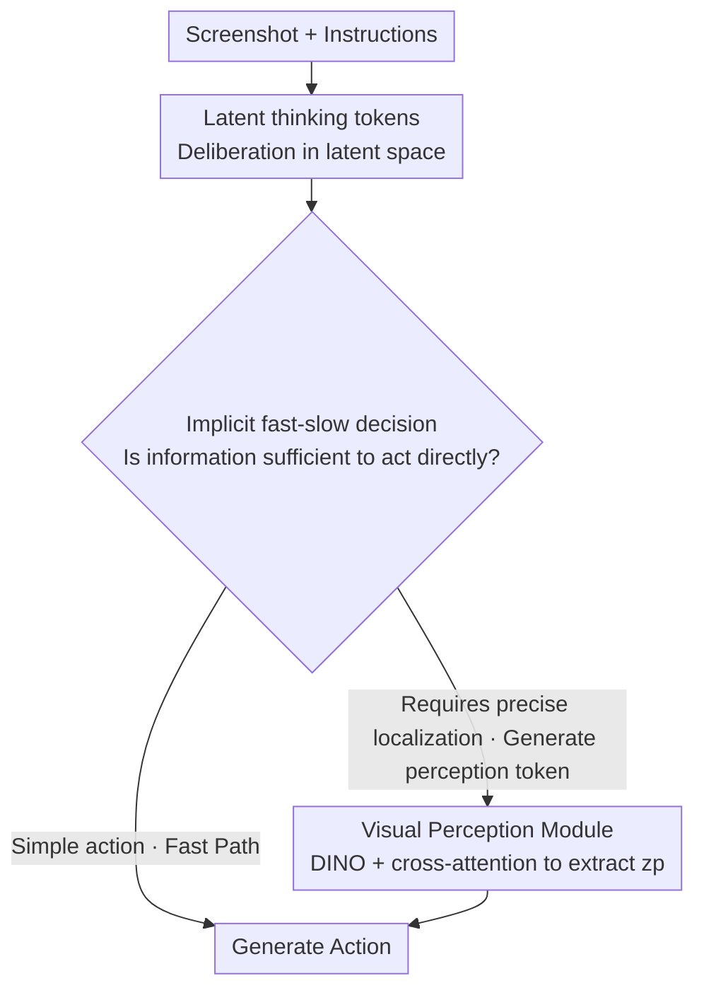

<!-- 由 tmp/gen_cvf_stubs.py 自动生成（CVF-only，无 arXiv） -->
# iSHIFT: Lightweight Slow-Fast GUI Agent with Adaptive Perception

**Conference**: CVPR 2026  
**Paper**: [CVF Open Access](https://openaccess.thecvf.com/content/CVPR2026/html/Mehrotra_iSHIFT_Lightweight_Slow-Fast_GUI_Agent_with_Adaptive_Perception_CVPR_2026_paper.html)  
**Code**: Yes (the paper states it is open-source, but no specific link is provided in the CVF main text)  
**Area**: GUI Agent / Multimodal VLM  
**Keywords**: GUI Agent, Slow-Fast Inference, Implicit Thinking Token, Adaptive Perception, Visual Grounding

## TL;DR
iSHIFT is a multimodal GUI agent with only 2.5B parameters that allows the model to decide whether to enter "slow thinking" **via token generation itself**. Simple actions (such as swiping) take a lightweight fast path, while a DINO visual perception module is temporarily turned on for fine-grained localization only when precise clicks on small icons are needed, thereby matching the accuracy of 18B-class SOTA models within a small model footprint.

## Background & Motivation

**Background**: Using Multimodal Large Language Models (MLLMs) to directly perceive screenshots and generate actions (click/swipe/type) from pixels like humans is replacing earlier structural approaches that rely on HTML, DOM, or accessibility trees (AXTree). The latter suffer from poor cross-platform generalization and frequently fail to retrieve structural information at runtime.

**Limitations of Prior Work**: Pure pixel-based approaches suffer from two chronic issues. First, **heavy perception**: to accurately recognize dense small icons and texts, many methods constantly keep OCR, segmentation, or high-resolution encoders active, incurring complete perception overhead even for a simple "swipe", resulting in high latency and computational costs. Second, **lack of adaptive resource allocation**: the vast majority of GUI agents treat all actions equally, ignoring the inherent binary nature of UI interaction—**fast actions** like scrolling can be solved with global context alone, whereas **slow actions** like clicking small buttons truly require deep deliberation and high-precision localization. Consequently, compute is wasted on simple tasks, while reasoning remains insufficient on difficult tasks.

**Key Challenge**: The trade-off between efficiency and accuracy. Although existing slow-fast schemes acknowledge that "not all tasks require equal compute", their implementations introduce new complexities: they either rely on an **external controller** to arbitrate between the fast and slow paths (adding another module, more latency, and another failure point), or, as in recent GUI work, **generate explicit intermediate representations** (icon captions, interface summaries) on the slow path before acting—which ties localization accuracy to the quality of the generated text and introduces generation latency. They prove that "adaptive computation" is useful, but highlight that what is truly missing is a **unified and implicit** control mechanism.

**Goal + Core Idea**: To **natively embed both decisions** of "whether to think slowly" and "whether to invoke fine-grained perception" **into the same MLLM**, without external controllers or long intermediate text generation. The core idea in one sentence: **allow the model to implicitly decide "when to think deeply and where to look" through token generation itself**—relying on latent thinking tokens (latent thinking) for non-verbal internal deliberation, and temporarily activating a lightweight local visual module via an on-demand triggered perception token.

## Method

### Overall Architecture
iSHIFT is built upon Qwen2-VL 2B, taking a UI screenshot and a textual instruction as input, and outputting an action. It **defaults to the Fast Path**: it first utilizes a sequence of latent thinking tokens (`<bot>...<eot>`) to perform internal deliberation in the latent space, evaluating whether the "current information is sufficient to act directly." The output of this step is not text but hidden states, from which the model makes an **implicit fast-slow decision**: if the task is simple (e.g., swipe), it directly generates the action; if high precision is required (e.g., clicking small icons), the model instead generates a set of **latent perception tokens** (`<bop>, <ctrl>, <eop>`). This acts as a switch that **temporarily reroutes** execution to the **Slow Path**—re-extracting local fine-grained visual features $z_p$ using a DINO encoder, injecting them back into the sequence, and then generating the action. This overall fast-slow switching is learned end-to-end based on programmatic labeling of actions by "whether they require precise coordinates" during training.

### Key Designs

**1. Implicit Slow-Fast Control: Let Token Generation Itself Act as the Switch for Deep Deliberation**

This is the central innovation of iSHIFT, addressing the pain point that "existing slow-fast schemes rely on external controllers for arbitration." iSHIFT does not use any external judge; decisions occur entirely within **what token the model generates next** (see Algorithm 1). The model runs in the fast path by default; after finishing latent deliberation, if internal judgment deems the information sufficient, it directly emits the action; if it judges that high precision is needed, it generates `<bop>` as the perception token—the appearance of `<bop>` is the explicit signal to activate the slow path. The key is that this is not a "restart", but a **conditional detour**: the slow path only performs feature enhancement (invoking VPM to extract $z_p$ and injecting it into the sequence), and then returns to the main sequence to continue generating the action. Thus, reasoning depth and visual precision are **tightly coupled into the hidden states of a unified architecture**, eliminating additional latency and failure points brought by external modules, and avoiding approaches that tie localization accuracy to text quality (e.g., "generating interface summaries before acting").

**2. Latent Thinking Tokens (LTT): "Thinking" in Latent Space instead of Translating Thoughts into Words**

GUI tasks are highly sensitive to response speed, whereas explicit Chain of Thought (CoT) that generates natural language deliberations introduces substantial inference latency. Inspired by Coconut-style continuous latent thinking, iSHIFT introduces `<bot>` / `<eot>` to mark a continuous block of thinking. Within this block, the model **directly converts hidden states into input embeddings for the next step, completely bypassing the vocabulary layer** (without decoding into any language tokens), thereby completing deeper representation flow in far fewer steps than explicit CoT. This latent deliberation is exactly the "internal decision-maker" that triggers the slow path. Its training adopts a clever two-stage approach: first, the thinking position `<bot>...<eot>` is filled with **explicit natural language reasoning** on a small dataset to teach the model what and how to think here; once learned, the explicit reasoning is **replaced with latent thinking tokens** to provide the model with a strong prior. Because the final thinking consists of latent representations rather than text, it can scale to a dataset approximately 50× larger **without any additional thinking annotations**, showing excellent scalability. Ablation studies reveal that 8 latent tokens is optimal (76.34), with 4 achieving 75.72, while increasing to 16/20 degrades performance to 74.09/74.04—the length of the thinking block is a sensitive hyperparameter; thinking too much dilutes focus on the context.

**3. Visual Perception Module (VPM): A Local High-Precision Localization Engine Temporarily Activated Only When Needed**

This is the engine of the slow path, addressing the pain point of "permanently active heavy high-resolution/OCR perception stacks." Once activated by `<bop>`, the VPM uses a DINO visual encoder to re-encode the image into highly informative feature maps $F_{img}$, and then performs **cross-attention** between these visual features and the hidden states $h_{ctrl}$ of the latent perception tokens to aggregate critical visual details. Specifically, image features act as Queries, and perception token hidden states act as Keys/Values:

$$Q = \text{Linear}_Q(F_{img}); \quad K, V = \text{Linear}_{K,V}(h_{ctrl})$$
$$z_p = \text{softmax}\!\left(\frac{QK^\top}{\sqrt{d_k}}\right)V + F_{img}$$

The resulting context embedding $z_p$ is injected back into the MLLM sequence to provide fine-grained control needed for precise localization. Unlike approaches like CogAgent and V-Zen, which **permanently run** high-resolution modules and consequently bloat parameter counts, VPM is lighter and **only activated when necessary**, allowing iSHIFT to achieve high accuracy without stacking parameters. Ablation studies confirm that cross-attention is crucial: without it, the slow path degrades to coarse global DINO features, causing the AMS to drop from 76.34 to 73.40.

### Loss & Training
The entire conditional slow-fast pipeline is learned end-to-end, aided by a **dataset augmentation** step: training data is programmatically labeled based on the perceptual needs of the actions. Any action requiring the prediction of precise coordinates (e.g., clicking a specific UI element) is labeled as a **slow action**, and latent perception tokens (`<bop>, <ctrl>, <eop>`) are inserted into its prompt label. This teaches the model that "seeing this token sequence means invoking VPM to retrieve additional context." Conversely, actions that can be inferred from the global context alone (e.g., swiping) are labeled as **fast actions**, going through the fast path and bypassing the VPM. This mapping provides the model with supervision signals for "task type ↔ whether to generate `<bop>` to activate the slow path." Coupled with the two-stage training of LTT in Key Design 2 (explicit thinking followed by latent token replacement), there is no need to manually annotate thoughts for large-scale data.

## Key Experimental Results

### Main Results
Evaluated on Android In The Wild (AITW) using Action Matching Score (AMS), iSHIFT achieves an average score of 76.34% with only 2.5B parameters, establishing SOTA in the <5B category and trailing the 18B CogAgent (76.88%) by only 0.54%.

| Dataset / Subset | Metric | iSHIFT (2.5B) | <5B Comparison | >5B Best |
|--------|------|------|----------|----------|
| AITW General | AMS | **70.6** | ShowUI 2B 63.9 | — |
| AITW Install | AMS | **80.82** | AutoGUI 76.89 | — |
| AITW Single | AMS | **86.03** | AutoGUI 84.58 | CogAgent 93.49 |
| AITW WebShop | AMS | **72.60** | AutoGUI 70.26 | SphAgent 74.0 |
| AITW Google Apps | AMS | 71.64 | TongUI 3B 74.5 | SeeClick 75.9 |
| **AITW Average** | AMS | **76.34** | AutoGUI 4.5B 74.27 | CogAgent 18B 76.88 |
| Android Control (Low) | AMS | **87.7** | OS-Atlas 4B 80.64 | OS-Atlas 7B 85.22 |
| Android Control (High) | AMS | 65.6 | OS-Atlas 4B 67.54 | OS-Atlas 7B 71.17 |
| GUI Odyssey | SR | **73.97** | OS-Atlas 4B 56.39 | Aguvis 7B 63.8 |
| GUIAct Web Single | Type/SR | **93.83** / 66.38 | GUICourse 3.1B 91.8 | GUICourse 9.6B 90.9 |
| GUIAct Phone | Type/SR | **79.41** / **60.08** | GUICourse 3.1B 71.7 | GUICourse 9.6B 73.0/58.1 |

In the efficiency dimension (accuracy/parameter size), iSHIFT averages 30.54, which is over 5 times that of the 18B CogAgent (≈4.27).

### Ablation Study

| Configuration | VPM | LTT | Slow | Fast | AMS | Description |
|------|-----|-----|------|------|-----|------|
| Base (Qwen2-VL 2B) | × | × | × | ✓ | 67.24 | Vanilla Base |
| w/ Fast Path Only (LTT only) | × | ✓ | × | ✓ | 72.54 | +5.30, latent deliberation itself is effective |
| w/ VPM, Slow Only | ✓ | × | ✓ | × | 72.71 | +5.47, VPM itself is effective |
| w/ VPM, Adaptive (non-LTT decision) | ✓ | × | ✓ | ✓ | 75.48 | Path switching enabled +2.77 |
| w/ VPM+LTT, Slow Only | ✓ | ✓ | ✓ | × | 74.58 | Forced slow path only is lower instead |
| w/o Cross-Attention in VPM | ✓ | ✓ | ✓ | ✓ | 73.40 | W/o cross-attention drops 2.94 |
| **iSHIFT (Full)** | ✓ | ✓ | ✓ | ✓ | **76.34** | Full model |

### Key Findings
- **Path switching contributes the most**: Moving from "Slow Only (72.71)" to "Adaptive (75.48)" yields a +2.77 increase, which is the largest single gain; LTT-driven decisions contribute an additional +0.86 to reach 76.34.
- **"Always slow" is worse and slower**: Forcing the model to only take the slow path yields only 74.58. Furthermore, Table 5 shows that the adaptive version (General: 2229ms / 70.6) is both **faster and more accurate** than the purely slow version (2331ms / 68.2). Indiscriminately feeding local vision to all actions causes attention dissipation and misclassifies simple actions (e.g., misclassifying click as "Task Complete"). On complex click actions, the deviation in action types between the adaptive version and ground truth is only 2.4%, compared to a high of 8.9% for the pure slow version.
- **Cross-attention is crucial for VPM**: Without it, the slow path degrades to coarse global DINO features, dropping performance to 73.40.
- **Number of latent tokens is a sensitive hyperparameter**: 8 is optimal (76.34), while too many (16/20) degrades performance to around 74.

## Highlights & Insights
- **Deconstructing "Controller" into Token Generation**: The most startling insight is that there is no need to attach an external router/controller; instead, the model's generation of `<bop>` itself serves as both the "decision" and the "action". The decision is embedded directly into the hidden states, with zero extra modules and zero extra failure points. This paradigm of "using generation behavior as control signals" can be transferred to any agent requiring conditional compute (such as tool-use or retrieval triggering).
- **Synergy between Implicit Deliberation and On-Demand Perception**: LTT governs "how deeply to think", while perception tokens handle "how closely to look". Both are triggered uniformly by the same latent process, preventing the "thinking" and "looking" from being separated into two sub-systems.
- **Two-stage Latent Thinking Training**: Using explicit natural language reasoning to "cold-start" the model on what to think, and then replacing it with latent tokens, solves the issue of latent CoT being hard to supervise and requiring heavy thought annotations when scaling data. This serves as a practical recipe for applying Coconut-like concepts to actual agent training.
- **Counter-intuitive Evidence that "More Compute ≠ Better"**: Table 5 directly quantifies attention dissipation caused by excessive perception, providing mechanistical (attention map) rather than just metric-level evidence for "adaptation".

## Limitations & Future Work
- **Slow/Fast labeling relies on heuristic rules**: The heuristic "requires precise coordinates = slow action" is programmatic. For actions that lie in-between (e.g., clicking on large buttons or ambiguous swipes), it might result in mislabeling, limiting decision granularity; finer complexity estimation or learnable labeling may yield better results.
- **High-level subset is still not the strongest**: Performance on Android Control (High) is 65.6, slightly lagging behind OS-Atlas 4B's 67.54, which indicates that compact models still have a gap in long-horizon/high-abstraction planning. The slow-fast mechanism behaves more like a "single-step precise localization" rather than "multi-step planning".
- **Single perception module**: The slow path only uses DINO for local features, which has not been fully verified for extremely small text or overlapping elements; switching among multi-granularity perception backends warrants exploration.
- **Details left to the Supplementary**: LTT training details and latency measurements are in the supplementary material. The runtime figures (~2200ms) presented in the main text are somewhat high, and the actual deployment benefits need to be evaluated on specific hardware.

## Related Work & Insights
- **vs. External Controller-based Slow-Fast (e.g., Router in General Vision Agents)**: They use an independent module to arbitrate between fast and slow paths, bringing modular complexity, latency, and points of failure; iSHIFT embeds decisions as token generation, unifying them inside a single MLLM for greater elegance.
- **vs. Intermediate Representation-based GUI Slow Paths (generating icon captions/interface summaries before action)**: Those methods tie localization accuracy to the quality of generated text and introduce generation latency; iSHIFT deliberates in the latent space without producing wordy text, using the slow path only for feature enhancement.
- **vs. CogAgent / V-Zen (Always-on High-Resolution Perception)**: They trade parameter bloat (18B) for precision by constantly running high-resolution modules; iSHIFT's VPM is activated only on-demand and is lighter, matching their performance at 2.5B.
- **vs. Explicit Chain of Thought GUI Agents (ReAct / Generating Thought)**: Explicit NL generation is verbose and slow to infer; iSHIFT uses latent thinking tokens for non-verbal deliberation, saving on generation latency.

## Rating
- Novelty: ⭐⭐⭐⭐ "Using token generation itself as the slow-fast switch to eliminate external controllers" is a clear and practical new combination, though LTT (Coconut) and perception tokens have prior work.
- Experimental Thoroughness: ⭐⭐⭐⭐ Covering 4 GUI benchmarks + complete ablation of components + latency/attention analyses provides solid mechanistical evidence, although high-level planning and open-ended environments are slightly under-explored.
- Writing Quality: ⭐⭐⭐⭐ Clear motivation reasoning, well-interpreted ablations, and Algorithm 1 alongside Figure 2 make the process reproducible.
- Value: ⭐⭐⭐⭐ 2.5B matching 18B with 5× efficiency holds direct reference value for the deployment of edge/mobile GUI agents.

<!-- RELATED:START -->

## Related Papers

- [\[CVPR 2026\] AdapAction: Adaptive Target Action Backdoor Attack against GUI Agents](adapaction_adaptive_target_action_backdoor_attack_against_gui_agents.md)
- [\[CVPR 2026\] MMBench-GUI: A Unified Hierarchical Evaluation Framework for Multi-Platform GUI Agents](mmbench-gui_a_unified_hierarchical_evaluation_framework_for_multi-platform_gui_a.md)
- [\[ACL 2026\] Towards Scalable Lightweight GUI Agents via Multi-role Orchestration](../../ACL2026/llm_agent/towards_scalable_lightweight_gui_agents_via_multi-role_orchestration.md)
- [\[ICLR 2026\] FaSTA*: Fast-Slow Toolpath Agent with Subroutine Mining for Efficient Multi-turn Image Editing](../../ICLR2026/llm_agent/fasta_fast-slow_toolpath_agent_with_subroutine_mining_for_efficient_multi-turn_i.md)
- [\[ACL 2025\] Browsing Like Human: A Multimodal Web Agent with Experiential Fast-and-Slow Thinking](../../ACL2025/llm_agent/browsing_like_human_a_multimodal_web_agent_with_experiential_fast-and-slow_think.md)

<!-- RELATED:END -->
