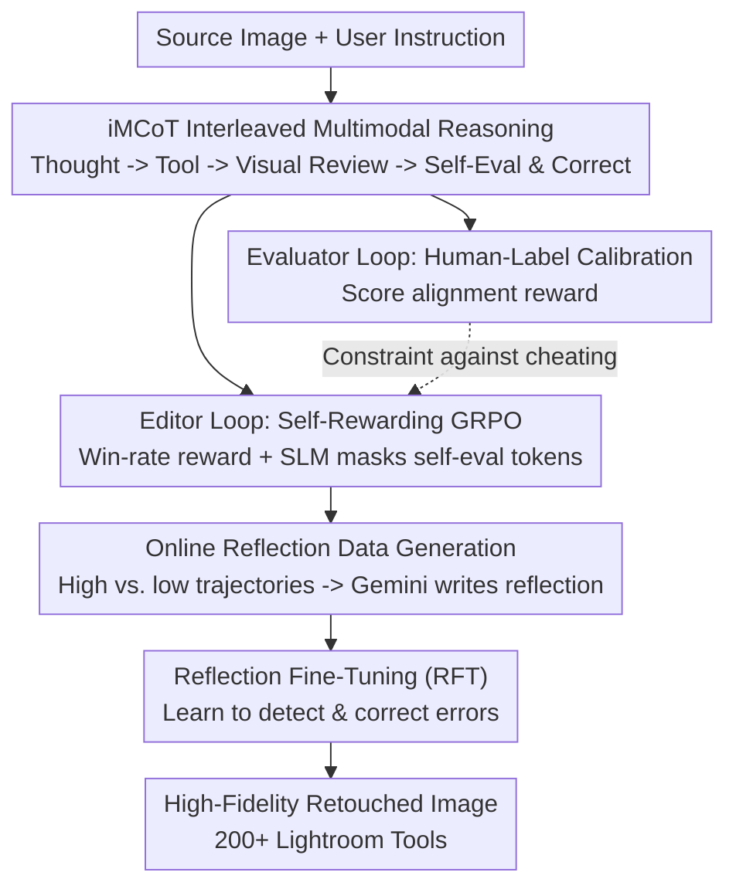

# JarvisEvo: Towards a Self-Evolving Photo Editing Agent with Synergistic Editor-Evaluator Optimization

**Conference**: CVPR 2026  
**Paper**: [CVF Open Access](https://openaccess.thecvf.com/content/CVPR2026/html/Lin_JarvisEvo_Towards_a_Self-Evolving_Photo_Editing_Agent_with_Synergistic_Editor-Evaluator_CVPR_2026_paper.html)  
**Code**: [Project Page jarvisevo.vercel.app](https://jarvisevo.vercel.app/)  
**Area**: Agent / Image Editing / Reinforcement Learning  
**Keywords**: Image Editing Agent, Interleaved Multimodal CoT, Self-Rewarding RL, Reward Hacking, Editor-Evaluator Synergy

## TL;DR
JarvisEvo integrates a professional retouching designer into a single-model Agent. It iteratively edits photos by invoking Lightroom tools while performing visual self-evaluation on intermediate results to reflect and correct errors. Powered by a dual-loop RL framework (SEPO) combining "editor self-rewarding" and "evaluator human-label calibration," it achieves **self-evolution without relying on external reward models**, outperforming Nano-Banana by 44.96% in pixel fidelity on ArtEdit-Bench.

## Background & Motivation
**Background**: Instruction-based image editing (GPT-Image-1, Nano-Banana, Qwen-Image-Edit) excels at creative synthesis. Another line of research focuses on Agent-style tool editors (JarvisArt, MonetGPT) that use **high-fidelity tools** like Lightroom for expert-level editing without destroying original content, making them more suitable for "retouching" rather than "redrawing."

**Limitations of Prior Work**: Agent-style editing suffers from two persistent issues. First, **instruction hallucination**: existing methods use pure textual CoT to enhance instruction understanding, but the model only encodes the source image at the beginning and **cannot see intermediate editing results** during reasoning. Consequently, textual hypotheses like "I think adjusting this will make it warmer" are never verified against real visual feedback, causing drifted outputs. Second, **reward hacking**: when using RL to align with human preferences, the reward model remains **static** during training while the policy continuously updates. The policy can easily exploit loopholes in the reward function to obtain high scores without genuinely improving. Offline reward calibration is expensive, requiring extensive human labeling, and fails to address the root cause of static reward models.

**Key Challenge**: Textual CoT lacks closed-loop visual feedback "while editing"; meanwhile, introducing self-evaluation as a reward easily leads to **self-deception**, where the model awards itself high scores, leading to worsening performance through training. In short: how to enable self-evaluation without self-deception.

**Goal**: (1) Integrate visual feedback into the reasoning process to verify each editing step using real intermediate images; (2) Enable self-evolution without an external reward model while preventing self-deception caused by self-rewards.

**Key Insight**: Mimic how human retouchers work—editing one step, reviewing the visual effect, evaluating the quality, and tracing back to correct errors if issues are found. Both "editing" and "evaluating" capabilities are integrated into **the same model**, where the evaluation capability conversely constrains the optimization of the editing capability.

**Core Idea**: Use **interleaved multimodal CoT (iMCoT)** to establish a "perception-action" closed loop replacing pure textual CoT; employ **SEPO dual-loop RL**—where the editor uses self-evaluation as intrinsic rewards, and the evaluator is continuously calibrated by human-labeled data—to suppress reward hacking during self-evolution.

## Method

### Overall Architecture
JarvisEvo is built upon Qwen3-VL-8B. Given a source image + user instruction, it outputs the image after multi-step high-fidelity editing. During inference, it executes an iMCoT trajectory: generating textual "thoughts" $\rightarrow$ invoking editing tools to output intermediate images $\rightarrow$ stitching intermediate images back into the context $\rightarrow$ self-evaluating/reflecting based on real visual results $\rightarrow$ deciding the next step, until providing the final self-score. Training consists of three stages: Stage 1 Cold-Start SFT (150K samples to establish multimodal reasoning, tool invocation, and self-evaluation syntax); Stage 2 SEPO RL to transition from "imitation" to "autonomy," with the **editor loop** using self-scores as intrinsic rewards and the **evaluator loop** calibrated with human-annotated scores; Stage 3 RFT using 5K reflection samples collected online during SEPO to enhance error-detection and self-correction. The relationship among the three is: iMCoT provides the structure of "editing-while-viewing" trajectories, SEPO optimizes this trajectory without cheating, and RFT consolidates past failures into reflection capabilities.

### Key Designs

**1. Interleaved Multimodal CoT (iMCoT): Reasoning while viewing instead of guessing blindly**

The fatal flaw of pure text CoT is that the source image is only encoded once at the beginning. Every subsequent reasoning step is a linguistic assumption of "what if I adjust this", never verified by real editing results, decoupling color/brightness judgments from actual pixel realities. iMCoT inserts visual feedback into every step of reasoning: the model first proposes a hypothesis via text (e.g., `<think>` to establish a warm base for golden hour), invokes global/local editing tools via `<tool_call>` to **actually generate an intermediate image**, loops it back into the trajectory, and reflects in subsequent text (e.g., "is this image overexposed? is the subject bright enough?"), deciding the next step based on this. A trajectory is formalized as $\tau^{edit} = \{(I, Q); ([C_0, T_0, O_0], \dots, [C_t, S_{pred}])\}$, where $C$ is textual reasoning, $T$ is tool call, $O$ is executing intermediate image, and $S_{pred}$ is final self-score. This establishes a closed perception-action loop: "generate text $\rightarrow$ verify with image $\rightarrow$ reflect with text," anchoring decisions to real visual states and reducing hallucinations (iMCoT reduces L2 from 33.41 to 21.38 in ablation).

**2. SEPO Editor Loop: Converting self-evaluation to intrinsic reward, with SLM to avoid "copying own answer"**

To enable self-evolution without an external reward model, the most straightforward approach is using the model's own self-score as RL rewards. Since absolute scores are unstable, the authors adopt **pairwise win rates**: sampling $G$ trajectories for the same input, where each has a self-score $s_i^{pred}$, and converting absolute scores into a relative reward $R_{pp}(\tau_i^{edit}) = \frac{1}{G-1}\sum_{j \neq i} \mathbb{I}(s_i^{pred} > s_j^{pred})$, indicating "how many trajectories in the group this trajectory outperformed." The total reward $R_{edit} = R_f + R_{ta} + R_{pp} \in [0,3]$ also includes format rewards and tool accuracy rewards, optimized with GRPO. The crucial anti-cheating mechanism is **Selective Loss Masking (SLM)**: the self-evaluation token $S_{pred}$ both participates in reward generation and exists in the same trajectory. If included in loss calculation, the model discovers that "writing a higher self-score" is easier than "genuinely improving the image," leading to **self-reward information leakage** and training collapse. SLM masks self-eval tokens from the loss, blocking this shortcut. Ablation shows that removing SLM causes L2 to spike from 12.84 to 43.75, where self-scores soar while real editing quality plummets due to optimization collapse.

**3. SEPO Evaluator Loop: Calibrating the evaluator via human labels to cross-check the editor**

Self-evaluation alone is insufficient, as the evaluator itself can drift and self-deceive. Thus, the same model runs a second loop: training the evaluation capability on a human-annotated dataset $\langle I, Q, H, S_{tgt} \rangle$ (where $H$ is the complete editing trajectory and $S_{tgt}$ is the human-annotated score). The reward is a **score-alignment reward** $R_{sa}(\tau_i^{eval}) = \exp\!\left(-\frac{1}{2}\frac{|s_i^{pre} - s_i^{tgt}|}{\sigma}\right) + \epsilon$ ($\sigma=0.5$ controls error tolerance), driving the predicted score toward human judgment. The total reward is $R_{eval} = R_f + R_{sa} \in [0,2]$. Since both loops share the same model and the evaluator input is strictly context-preserving with the editor generation, a more accurate evaluator translates to more credible self-reward signals for the editor, essentially equipping the editor loop with a "human-calibrated lie detector." Removing the evaluator loop in ablation causes editor self-scores to inflate, pairwise preference rewards to slide, and overall quality to drop (L2 rising from 12.84 to 29.33) due to self-deception and reward hacking from missing calibration.

**4. Online Reflection Data Generation + RFT: Automatically converting failures into training samples**

Simply being able to edit and evaluate does not teach the model to "detect errors and correct them." The authors attach an **online reflection pipeline** during editor loop training: when the self-score of trajectory $s_0^{pred}$ exceeds another trajectory $s_3^{pred}$, the high-scoring trajectory is treated as the "correct path" and the low-scoring one as the "incorrect path." Both are fed into Gemini-2.5-Pro (taking source image, instruction, incorrect image $O_3$, correct image $O_0$) to generate a reflection critique $R_{3\to0}$, forming a reflection trajectory $\tau^{reft} = \{(I,Q); ([H_3, S_3^{pre}], [R_{3\to0}, T_{0,0:t}, O_{0,t}])\}$, where $H_3$ is the incorrect editing history, $T_{0,0:t}$ is the correct tool sequence, and $O_{0,t}$ is the target image. These samples undergo RFT in Stage 3, teaching the model to "identify errors $\rightarrow$ reflect on optimal plans $\rightarrow$ adjust tool execution." Crucially, this data is collected **on-policy** automatically—the model's own self-contrast provides supervision without extra human labeling, and reflections directly correspond to its own actual mistakes.

### A Complete Example
Taking a backlit couple photo with a cold tone where the user requests "a warm, dreamy golden sunset vibe": the model first plans via `<think>`: "first apply a warm base, shift green toward yellow, suppress bright sky, lift shadows," and invokes **global tools** to output the first intermediate image. In self-evaluation, it observes: "the warm sunset atmosphere is there, but yellow is oversaturated, making the landscape look fake," yielding Aesthetic 1.9 / Instruction 4.3. It then reflects: "I pushed white balance and saturation too hard; I should use **local tools** to desaturate the couple's skin and cool it down slightly to make them glow instead of looking yellow," and adjusts with local tools. If the self-score of this corrected trajectory is higher than the previous one, this "incorrect $\rightarrow$ correct" pair is used by the reflection pipeline to generate training data. The entire process forms a closed loop of editing, viewing, self-scoring, and reflecting-correcting, instead of one-shot blind generation.

### Loss & Training
Three stages: Stage 1 SFT is based on Qwen3-VL-8B using 150K samples (110K editing + 40K evaluation) over 2 epochs, batch size = 2, learning rate = 1e-5 (LLaMA-Factory). Stage 2 SEPO RL (vlm-r1 framework) uses 10K editor instructions + 10K evaluator queries over 1 epoch, batch size = 1, learning rate = 1e-6, sampling 4 trajectories per query. Stage 3 RFT takes 5K online reflection samples over 1 epoch with learning rate = 5e-6. Both loops use the GRPO objective $J_{GRPO}$, with advantage $A_{i,j} = \frac{r_i - \text{mean}(\{r_i\})}{\text{std}(\{r_i\})}$. The process runs on 32×A100 GPUs. Tools are accessed via the A2L protocol with 200+ Lightroom retouching tools.

## Key Experimental Results

### Main Results
ArtEdit-Bench-Lr (800 samples: 400 EN + 400 ZH), measuring L1/L2 for pixel fidelity (lower is better), while SC/PQ/O are scored 0–10 by GPT-4o (higher is better):

| Dataset | Method | L1×10² ↓ | L2×10³ ↓ | SC ↑ | PQ ↑ | O ↑ |
|--------|------|----------|----------|------|------|-----|
| English | Nano-Banana (Commercial) | 11.54 | 28.34 | 8.33 | 8.92 | 8.59 |
| English | GPT-Image-1 (Commercial) | 21.20 | 82.77 | 8.45 | 8.02 | 8.21 |
| English | UniWorld-v1 | 11.79 | 29.40 | 8.34 | 8.69 | 8.49 |
| English | **JarvisEvo** | **7.82** | **12.45** | **8.53** | **9.03** | **8.77** |
| Chinese | Nano-Banana (Commercial) | 11.46 | 27.39 | 8.35 | 8.99 | 8.64 |
| Chinese | **JarvisEvo** | **7.63** | **11.54** | **8.54** | **9.04** | **8.76** |

On ArtEdit-Bench-Lr, JarvisEvo outperforms Nano-Banana by an average of 18.95% across five metrics. Its content fidelity (L1/L2) improves by 44.96% on average—highlighting the core advantage of Lightroom's fidelity-preserving tools over "re-drawing" generative models.

Evaluation capability (ArtEdit-Bench-Eval, correlation with human scores):

| Method | SRCC ↑ | PLCC ↑ |
|------|--------|--------|
| Gemini-2.5-Flash | 0.6188 | 0.6441 |
| Qwen3-VL-256B-A22B | 0.5706 | 0.5650 |
| VisualQuality-R1 (IQA Specialist) | 0.5645 | 0.5018 |
| **JarvisEvo** | **0.7243** | **0.7116** |

JarvisEvo's self-evaluation capability surpasses specialized IQA models and larger general MLLMs, proving that the evaluator loop successfully develops evaluation competence. In human preference studies (30 annotators, pairwise comparisons on 200 samples), JarvisEvo achieves a win rate of 49% in fine-grained editing, outperforming Nano-Banana (28%) by 21 percentage points.

### Ablation Study

| Configuration | L1×10² ↓ | L2×10³ ↓ | O ↑ | Description |
|------|----------|----------|-----|------|
| SFT only | 9.97 | 19.84 | 8.26 | Cold-star SFT only |
| + SEPO w/o Evaluator Loop | 12.43 | 29.33 | 7.78 | Missing calibration $\rightarrow$ self-deception, reward hacking |
| + SEPO w/o SLM | 14.35 | 43.75 | 7.40 | Self-reward leakage $\rightarrow$ training collapse |
| + SEPO w/o SLM & Evaluator Loop | 17.51 | 59.67 | 7.25 | Missing both $\rightarrow$ rapid collapse |
| + Full SEPO | 8.25 | 12.84 | 8.54 | Full dual-loop optimization |
| + Full SEPO + RFT | **7.72** | **11.98** | **8.76** | Best performance with reflection fine-tuning |
| Text-only CoT | 12.78 | 33.41 | 8.04 | Textual reasoning only |
| iMCoT | 10.98 | 21.38 | 8.25 | Multimodal reasoning only |

### Key Findings
- **SLM is the lifeline to prevent collapse**: Removing SLM causes L2 to spike from 12.84 to 43.75, where self-scores inflate while actual quality collapses—self-reward leakage steers the model to "forge reward scores" rather than "improve images."
- **Evaluator loop is the antidote to reward hacking**: Removing evaluator calibration results in inflated self-scores, sliding preference rewards, and overall performance drops. Omitting both loops leads to catastrophic system collapse (L2 = 59.67), proving that self-scores must be continuously calibrated against human labels to remain credible.
- **iMCoT significantly outperforms text-only CoT**: Reducing L2 from 33.41 to 21.38, verifying that "editing-while-viewing" visual feedback is indispensable for editing decisions.
- The authors note: even when using a stronger Gemini-2.5-Pro as the LLM-as-judge reward, reward hacking persists—implying that the issue lies in the structural mismatch of "static rewards vs. dynamic policies" rather than referee capacity.

## Highlights & Insights
- **Compressing both the "editor" and "evaluator" into a single model to check and balance each other**: More accurate evaluator $\rightarrow$ more credible editor self-rewards $\rightarrow$ stronger editor. Meanwhile, human labels are only used to train the evaluator, not to directly train the editor, minimizing annotation overhead while embedding human preferences as a "lie detector." This "self-rewarding + external calibration" dual-loop paradigm can be adapted to any open-ended generation task lacking verifiable rewards (e.g., design, writing).
- **The SLM design is critical**: When reward signals and optimized outputs share the same tokens, reward tokens must be excluded from loss calculations. Otherwise, the model takes the shortcut of fabricating rewards. This is a highly generalizable and easily overlooked engineering detail in self-rewarding RL.
- **On-policy reflection data generation**: Contrasting the model's own high vs. low trajectories coupled with a stronger model writing reflections automatically transforms failures into "error-detection and correction" training samples with near-zero extra human labeling.
- Selecting fidelity-preserving tools (Lightroom) over redrawing-based generation is the fundamental reason for L1/L2 supremacy. For retouches, tool-based agents are structurally superior in content fidelity.

## Limitations & Future Work
- Heavily reliant on Lightroom's 200+ tools and the A2L protocol; capabilities are bound by the toolset ceiling, and cannot perform editing beyond tool capabilities (e.g., complex content addition/deletion, generative outpainting).
- Reflection data generation requires calling an external strong model (Gemini-2.5-Pro), thus not being completely self-contained; reflection quality is bounded by the referee model.
- The evaluator loop still requires human-labeled evaluation sets (10K + 50K ArtEdit-Eval). While "no external reward model" holds, human preferences are still fed into evaluator training in the form of annotations.
- High training cost (32×A100, three stages); self-rewarding win-rate sensitivity to hyperparameters like group sample size $G$ and $\sigma$ is not fully detailed.
- ArtEdit-Bench is primarily focused on bilingual retouching scenarios; cross-domain generalization (e.g., professional imaging like medical, remote sensing) remains unverified.

## Related Work & Insights
- **vs. JarvisArt / MonetGPT (Tool-based Editing Agents)**: While both use Lightroom fidelity tools, they lack "editing-while-viewing" visual closed-loops and self-evolving RL. JarvisEvo remedies this via iMCoT for visual feedback and SEPO to co-train editing and evaluation, achieving stronger core performance and evaluation capacity.
- **vs. RLHF**: RLHF relies on costly and static reward models prone to reward hacking. JarvisEvo replaces external reward models with editor self-rewards and dynamically calibrates them via the evaluator loop, bypassing the structural flaws of static rewards.
- **vs. RLIF (Reinforcement Learning from Internal Feedback)**: Pure RLIF easily leads to self-deception, overconfidence, and training collapse. SEPO acts as a hybrid dual-loop combining RLIF (self-reward) and RLVR (reinforcement learning from verifiable rewards), using verifiable feedback from RLVR to anchor RLIF's self-deception.
- **vs. Text-Only CoT in Visual Generation**: Inspired by OpenAI-o3's "think with images", visual feedback is integrated into each reasoning step to break the information bottleneck of text-only CoT.

## Rating
- Novelty: ⭐⭐⭐⭐⭐ The same-model editor-evaluator dual-loop self-evolution + SLM leakage prevention + on-policy reflection paves a successful path for "self-rewarding without self-deception."
- Experimental Thoroughness: ⭐⭐⭐⭐ Detailed results, evaluation capacity, human preferences, and ablations on a robust bilingual benchmark; cross-domain generalization and hyperparameter sensitivity are slightly underrepresented.
- Writing Quality: ⭐⭐⭐⭐ Highly aligned motivation-mechanism-ablation relationships; three failure configurations clearly illustrate why each component is indispensable.
- Value: ⭐⭐⭐⭐⭐ Offers a reusable paradigm for "open-ended generative self-evolution without external rewards", providing practical value for real-world high-fidelity photo editing deployment.

<!-- RELATED:START -->

## Related Papers

- [\[ICML 2026\] Self-evolving LLM agents with in-distribution Optimization](../../ICML2026/llm_agent/self-evolving_llm_agents_with_in-distribution_optimization.md)
- [\[ACL 2026\] SEARL: Joint Optimization of Policy and Tool Graph Memory for Self-Evolving Agents](../../ACL2026/llm_agent/searl_joint_optimization_of_policy_and_tool_graph_memory_for_self-evolving_agent.md)
- [\[CVPR 2026\] REALM: An MLLM-Agent Framework for Open World 3D Reasoning Segmentation and Editing on Gaussian Splatting](realm_mllm_agent_3d_reasoning_gaussian.md)
- [\[ICLR 2026\] ReVeal: Self-Evolving Code Agents via Reliable Self-Verification](../../ICLR2026/llm_agent/reveal_self-evolving_code_agents_via_reliable_self-verification.md)
- [\[CVPR 2026\] History to Future: Evolving Agent with Experience and Thought for Zero-shot Vision-and-Language Navigation](history_to_future_evolving_agent_with_experience_and_thought_for_zero-shot_visio.md)

<!-- RELATED:END -->
