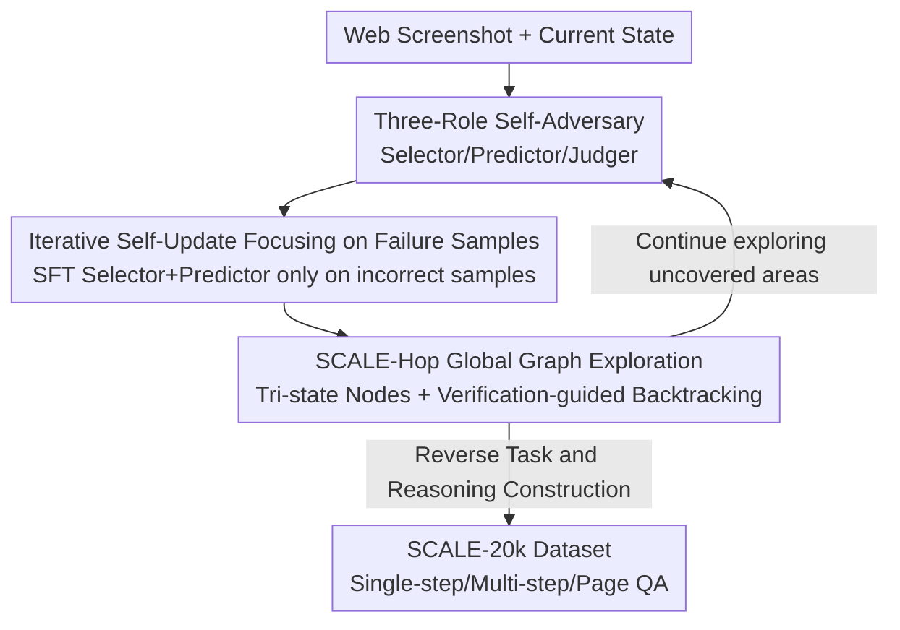

# Learning to Adapt: Self-Improving Web Agent via Cognitive-Aware Exploration

**Conference**: CVPR 2026  
**Paper**: [CVF Open Access](https://openaccess.thecvf.com/content/CVPR2026/html/Chen_Learning_to_Adapt_Self-Improving_Web_Agent_via_Cognitive-Aware_Exploration_CVPR_2026_paper.html)  
**Code**: To be confirmed  
**Area**: Agent / Multimodal VLM / Self-supervised  
**Keywords**: Web Agent, Self-driven Exploration, Cognitive Boundary, Self-adversarial Learning, Self-improvement

## TL;DR
To address the issues of web agents relying on manual pipelines or expensive expert trajectories and struggling to adapt to dynamic web pages, the authors propose SCALE. This method enables a single MLLM to play three adversarial roles—Selector, Predictor, and Judger—to automatically discover and expand its own cognitive boundaries via "prediction errors." Combined with SCALE-Hop graph exploration for global planning, it achieves average task success rate improvements of 231.8% for InternVL2.5-8B and 176.3% for Qwen2.5-VL-7B, while generating the SCALE-20k dataset.

## Background & Motivation
**Background**: Web agents based on Multimodal Large Language Models (MLLMs) have shown promising performance in web automation tasks such as product searching, online shopping, and navigation. The mainstream approach is to directly reuse the pre-trained capabilities of MLLMs.

**Limitations of Prior Work**: Real-world web pages are highly diverse and dynamic, leading to a significant gap between an agent's prior knowledge and actual web environments. Existing works bridge this gap either via **manually designed execution pipelines** (e.g., Tree-of-Thought, ReAct, world model planning) or by fine-tuning on **expensive human-annotated expert trajectories**. Both paths have major drawbacks: pipelines and trajectories are often tailored to specific scenarios and fail on unpredictable real-world pages; furthermore, agents become passive, relying on fixed task flows and lacking the ability to explore unfamiliar environments.

**Key Challenge**: Existing methods neglect a crucial question—**how to evaluate and expand the agent's own "cognitive boundary."** This boundary refers to objects and operations that the agent finds difficult to understand or decide upon based on its prior knowledge. Without actively probing this boundary, agents remain within their comfort zones and fail to "upskill" in areas where they lack understanding.

**Goal**: To enable agents to break free from dependence on expert trajectories and manual pipelines, allowing them to actively adapt to new environments and continuously expand their cognitive boundaries. This is divided into two sub-problems: ① how to automatically discover actions the agent does not understand without external supervision; ② how to transition from local interactions to global planning to avoid being trapped in local dead ends.

**Key Insight**: When humans learn a new tool, they actively try uncertain operations, anticipate outcomes, and correct themselves using real-world feedback. The authors integrate this "self-questioning—prediction—verification" loop into the agent, letting the same model play three roles in self-adversarial play.

**Core Idea**: Use a Selector–Predictor–Judger adversarial setup to treat "mismatches between predictions and ground truth" as cognitive boundary signals for targeted learning, and utilize graph structures for global exploration—replacing passive imitation with **cognitive-aware exploration**.

## Method

### Overall Architecture
The core of SCALE is to let one MLLM simultaneously play three adversarial roles: the **Selector** chooses rare or unfamiliar actions to challenge itself, the **Predictor** anticipates the result and reasoning for that action, and the **Judger** compares the "prediction vs. reality" after execution to determine if the agent truly understands the action. The process consists of three stages: input encoding (using Set-of-Mark for pure visual processing of screenshots) → self-check (adversarial probing of cognitive boundaries) → iterative updating (fine-tuning the Selector and Predictor only on "prediction error" failure samples). Above this, **SCALE-Hop** constructs a directed graph of exploration history, using tri-state node marking and verification-guided backtracking for global planning to avoid local minima. Finally, all exploration trajectories are inversely constructed into the **SCALE-20k** dataset, which can be used to train other MLLMs.

### Key Designs

**1. Selector–Predictor–Judger Self-Adversary: Locating Cognitive Boundaries via "Prediction Failures"**

The pain point is that agents do not know what they "don't know" and only repeat familiar operations. SCALE creates a closed loop where the same MLLM plays three roles: the Selector ($\pi_{sel}$) specifically picks rare or confusing elements to generate exploratory actions (e.g., clicking a site logo instead of a product on a product page), the Predictor ($\pi_{pre}$) anticipates the outcome and explanation based on existing knowledge, and the Judger compares the prediction with actual observations after execution. Formally, the Selector outputs $a_i, r_{sel_i} = \pi_{sel}(O_i)$, the Predictor gives $p_i, r_{pre_i} = \pi_{pre}(O_i, a_i, r_{sel_i})$, and execution yields a new observation $O_{i+1} = \Omega(T(S_i, a_i))$. The Judger then determines $j_i = \mathrm{Judger}(O_i, O_{i+1}, a_i, p_i, r_{pre_i}) \in \{0,1\}$. The elegance lies in the **adversarial relationship between the Selector and Predictor**: one aims to expose misunderstood behaviors, while the other strives to refute this by accurate prediction. The Judger provides feedback for both to improve. Prediction inconsistency ($j_i=0$) indicates the cognitive boundary has been reached.

**2. Iterative Self-Updating via Failure Samples: Learning only where "Understood Least"**

How to use the boundary once discovered? SCALE explicitly **focuses only on failure samples**. When $j_i = 0$ (prediction error), it indicates the action exceeds current knowledge. The Judger then generates a description of the real result $t_i, r_{t_i} = \mathrm{Judger}(\cdot)$, and this experience is stored as $\mathrm{ExploreData}_i = \langle O_i, a_i, r_{sel_i}, t_i, r_{t_i}\rangle$. If $j_i = 1$ (already understood, no learning value), the environment is reset, and the Selector re-samples until an unfamiliar action is produced. After accumulating $K$ steps, the Selector and Predictor are fine-tuned via SFT: $\pi_{sel_{j+1}} = \mathrm{SFT}(\pi_{sel_j}, \mathrm{ExploreData}_j)$, $\pi_{pre_{j+1}} = \mathrm{SFT}(\pi_{pre_j}, \mathrm{ExploreData}_j)$, while the Judger remains fixed. Focusing on failures rather than successes is because failures expose cognitive blind spots and provide the maximum learning signal; the Selector and Predictor evolve together in this cycle.

**3. SCALE-Hop Graph Representation and Verification-Guided Backtracking: Scaling from Local Interaction to Global Planning**

SCALE alone struggles with a global perspective and can get stuck locally. SCALE-Hop models exploration as a directed graph $G=(N, E)$, where nodes $n_i = (O_i, u_i)$ are defined by observations and URLs. If a URL is new, a new node is created. If the URL exists, the structural similarity index (SSIM) compares the new observation with existing nodes of the same URL. A new node is only inserted if all SSIM scores fall below a threshold $\delta$—this deduplicates while identifying truly new states. **Verification-guided backtracking** dynamically labels each node with three states: Unexplored / Partially Explored / Fully Explored. When exploration in a node stalls, verification is triggered: the Predictor predicts $N$ random actions from that node. If all are correct, it is marked "Fully Explored"; otherwise, it remains "Partially Explored." Once verified, the agent backtracks to the nearest Unexplored or Partially Explored node. This mechanism balances "broad coverage" with "intensive exploration."

**4. SCALE-20k Dataset Construction: Converting Trajectories into Trainable Data**

To alleviate the scarcity of high-quality web task data, the authors use SCALE to explore 19 real websites and use GPT-4o for a three-stage reverse construction of the dataset: ① Single-step tasks—deriving tasks and reasoning from valid exploratory actions; ② Multi-step tasks—extracting coherent trajectories from the SCALE-Hop graph; ③ Page understanding QA—generating QA pairs for each node to provide page-level supervision. SCALE-20k contains 15,042 single-step tasks, 3,780 multi-step tasks, and 6,886 page QA pairs, collected by Qwen2.5-VL-7B and InternVL2.5-8B.

### Loss & Training
SCALE uses Supervised Fine-Tuning (SFT) to update the Selector and Predictor after every $K$ exploration steps. The Judger remains fixed throughout, forming an iterative self-improvement loop. This exploration-learning process requires no external expert trajectories or reward models and introduces no additional overhead during inference.

## Key Experimental Results

### Main Results
Metrics: **SR (Success Rate, %) Higher is Better**, **AS (Average Steps) Lower is Better** (shorter reasoning paths). Benchmarks include VisualWebArena (Shopping / Classifieds / Reddit) and WebVoyager (Real websites, dynamic content). Selected SR comparison:

| Backbone / Strategy | Shopping SR | Classifieds SR | Reddit SR | WebVoyager SR |
|-------------|-------------|----------------|-----------|---------------|
| GPT-4o (Zero-shot) | 17.2 | 13.7 | 6.7 | 9.6 |
| Qwen2.5-VL-7B Zero-shot | 4.1 | 6.0 | 2.4 | 0.6 |
| Qwen2.5-VL-7B + GPT Imitation | 18.3 | 10.7 | 3.3 | — |
| Qwen2.5-VL-7B + OS-Genesis | 11.2 | 8.6 | 1.4 | 6.7 |
| **Qwen2.5-VL-7B + SCALE** | 14.4 | 12.0 | 4.8 | **7.9** |
| InternVL2.5-8B Zero-shot | 3.9 | 0.4 | 1.4 | 0.0 |
| **InternVL2.5-8B + SCALE** | 11.0 | 6.4 | 3.3 | 1.8 |

Compared to zero-shot baselines, SCALE improves average task success rates by 231.8% (InternVL2.5-8B) and 176.3% (Qwen2.5-VL-7B). Its advantage is particularly evident on dynamic pages like WebVoyager, where static trajectories fail to cover complexity. Simultaneously, AS values are often the lowest or second-lowest, indicating more concise reasoning. Training the model-agnostic LLaVA-NeXT-8B on SCALE-20k also improves its agent performance.

### Ablation Study
| Configuration | Shopping SR | Overall SR | Visited Nodes | Description |
|------|-------------|---------|-----------|------|
| Random Walk | 14.8 | 10.4 | 399 | Blind spread, low quality |
| w/o SCALE-Hop | 13.5 | 10.1 | 277 | Lacks global planning |
| SCALE (Full) | 14.4 | **11.6** | **876** | Widest coverage, highest SR |

Different exploration depths (outer loop hops × inner loop 25 steps) for Qwen2.5-VL-7B overall SR: SCALE(20-25) 7.2 → SCALE(40-25) 7.9 → SCALE(60-25) **11.9**, showing deeper exploration yields better results.

### Key Findings
- **Self-adversarial mechanism is key to exploration quality**: Compared to random walks, SCALE is superior in success rate and coverage (876 vs. 399 nodes), with more nodes located in rare areas, producing "highly informative, error-exposing" data.
- **SCALE-Hop provides a global perspective**: Removing it significantly reduces visited nodes (277) and overall SR, proving that graph representation and verification backtracking effectively avoid dead ends.
- **Deeper exploration yields greater gains**: Increasing the number of hops consistently improves SR, indicating that deeper exploration uncovers more informative behaviors.
- **Dataset transferability**: SCALE-20k is effective even when training unrelated models, demonstrating the framework's universality.

## Highlights & Insights
- **Adversarial design for "self-challenging" is ingenious**: The Selector picks unfamiliar actions, the Predictor tries to anticipate them, and the Judger decides. These roles are derived from the same model yet are adversarial, turning "what I don't know" into computable prediction failure signals without external labeling.
- **Learning only from failure samples**: Explicitly discarding "already understood" successful samples and fine-tuning only on $j_i=0$ failure data concentrates the learning signal on cognitive blind spots, which is more efficient than indiscriminate data collection.
- **Layered structure of local exploration + global planning**: SCALE handles single pages/actions, while SCALE-Hop manages global coverage via tri-state nodes, SSIM deduplication, and verification backtracking. This hierarchy allows for deep exploration without getting stuck.

## Limitations & Future Work
- **Fixed Judger**: The correctness of the self-improvement loop depends heavily on the Judger's quality. If the Judger misclassifies (judging "understood" as "not understood" or vice versa), it may pollute the training data.
- **Dependency on GPT-4o for data construction**: The three-stage construction of SCALE-20k relies on GPT-4o for task generation and verification, making data quality and cost dependent on an external strong model.
- **Absolute success rates remain low**: SR in most domains is still in the single or double digits (e.g., Reddit commonly below 5%), indicating that real-world dynamic web tasks remain challenging despite significant relative improvements.
- **Future directions**: Incorporate the Judger into the learning/calibration loop to reduce misjudgments and explore more efficient boundary detection strategies to reduce ineffective random sampling.

## Related Work & Insights
- **vs. Manual Pipelines (ReAct / Tree-of-Thought / World Models)**: These use explicit modules for structured reasoning but require heavy manual design and fail outside predefined scenarios. SCALE adapts to new environments via self-driven exploration.
- **vs. Expert Trajectory Fine-Tuning (Mind2Web / OSWorld / AGUVIS)**: These rely on large-scale human annotations, leading to high costs and limited diversity. SCALE requires no expert annotation and lets the agent self-evaluate and expand.
- **vs. Exploration Methods (OS-Genesis / Learn-by-Interact)**: These generate trajectories via unsupervised interaction and filter them with reward models, but most lack systemic cognitive boundary detection. SCALE focuses on cognitive-aware exploration to actively locate and widen its boundaries.

## Rating
- Novelty: ⭐⭐⭐⭐ The combination of three-role self-adversary, cognitive boundary detection, and global graph backtracking into a trainable loop is innovative.
- Experimental Thoroughness: ⭐⭐⭐⭐ Includes two backbones, two benchmarks, multiple baselines, and exploration depth/ablation analysis, though absolute SR remains low.
- Writing Quality: ⭐⭐⭐⭐ Framework and formalizations are clear; the three-stage narration is well-structured, despite slightly dense notation.
- Value: ⭐⭐⭐⭐ A self-improvement paradigm without expert annotations and a reusable SCALE-20k dataset provide practical value to web agent research.

<!-- RELATED:START -->

## Related Papers

- [\[ICLR 2026\] Web-CogReasoner: Towards Knowledge-Induced Cognitive Reasoning for Web Agents](../../ICLR2026/llm_agent/web-cogreasoner_towards_knowledge-induced_cognitive_reasoning_for_web_agents.md)
- [\[ACL 2026\] TheraAgent: Self-Improving Therapeutic Agent for Precise and Comprehensive Treatment Planning](../../ACL2026/llm_agent/theraagent_self-improving_therapeutic_agent_for_precise_and_comprehensive_treatm.md)
- [\[ICLR 2026\] Agentic Context Engineering: Evolving Contexts for Self-Improving Language Models](../../ICLR2026/llm_agent/agentic_context_engineering_evolving_contexts_for_self-improving_language_models.md)
- [\[ACL 2026\] Don't Adapt Small Language Models for Tools; Adapt Tool Schemas to the Models](../../ACL2026/llm_agent/don39t_adapt_small_language_models_for_tools_adapt_tool_schemas_to_the_models.md)
- [\[ACL 2025\] GUI-explorer: Autonomous Exploration and Mining of Transition-aware Knowledge for GUI Agent](../../ACL2025/llm_agent/gui_explorer_autonomous.md)

<!-- RELATED:END -->
