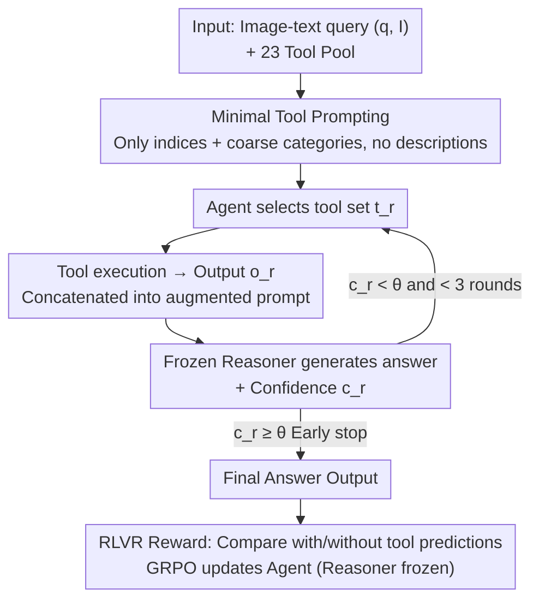

# Learning to Select Visual Tools from Experience

**Conference**: CVPR 2026  
**Paper**: [CVF Open Access](https://openaccess.thecvf.com/content/CVPR2026/html/Huang_Learning_to_Select_Visual_Tools_from_Experience_CVPR_2026_paper.html)  
**Code**: https://oodbag.github.io/vista_web/ (Project Page)  
**Area**: Agent / Multimodal VLM  
**Keywords**: Tool Selection, Reinforcement Learning, Verifiable Reward, Visual Reasoning, GRPO

## TL;DR
This paper proposes VisTA (VisualToolAgent), which trains an agent using reinforcement learning to autonomously select the most useful combinations from 23 heterogeneous visual tools based solely on "correctness" feedback. These tools are provided to a **frozen** VLM reasoner. VisTA significantly outperforms training-free and fine-tuned baselines on ChartQA, Geometry3K, MathVerse, and BlindTest. Furthermore, the learned selection strategy can be directly transferred to stronger reasoners (e.g., GPT-4o) without retraining.

## Background & Motivation
**Background**: Connecting LLMs/VLMs to external tools (Python interpreters, object detectors, chart parsers, etc.) is a mainstream path for extending model capabilities. A common practice in the visual domain is to have the model generate invocation code or decompose complex visual tasks into sub-tasks for specialized modules.

**Limitations of Prior Work**: Existing tool integration methods generally do not perform "active trial-and-error selection." One category is **training-free prompting**, which relies entirely on the model's internal world knowledge and textual tool descriptions to decide which tool to use. Another category is **large-scale supervised fine-tuning**, which teaches the model tool invocation through human demonstrations/annotations. The former is limited by the accuracy of tool descriptions, while the latter requires heavy human supervision. Both assume a small number of tools with clearly describable capabilities.

**Key Challenge**: In reality, the same category of tools often has **multiple variants** with varying capabilities (e.g., three different implementations of "chart-to-table" with different precision). Moreover, the actual performance of a tool often contradicts its textual description. Without a "learning from experience" mechanism, systems can neither determine the optimal tool for a specific query nor discover synergistic tool combinations.

**Goal**: To learn **query-adaptive tool selection/grouping** within a large and heterogeneous tool pool without human supervision or modifications to the inference model itself.

**Key Insight**: Tool selection is essentially an "exploration-exploitation" decision problem—naturally suited for reinforcement learning. RL enables an agent to evaluate and select the most effective tools based on **empirical performance** rather than preset rules through repeated interaction with the environment, potentially discovering non-obvious combinations not apparent in descriptions.

**Core Idea**: Tool selection is modeled as an RL policy trained using **Reinforcement Learning from Verifiable Rewards (RLVR)** based only on the correctness of the final answer. Since the reasoner is frozen, the learned tool selection strategy can be used in a plug-and-play manner with other reasoners.

## Method

### Overall Architecture
VisTA consists of two decoupled roles: a **trainable agent** (a vision-language model, QwenVL2.5-7B) responsible for tool selection, and a **frozen reasoner** (VLM) responsible for generating answers based on tool outputs. Given a vision-language query $(q, I)$, the agent selects a set of tools $t_1 = \langle T^{(1)}, \dots, T^{(K)} \rangle$ from a unified tool pool $T = \{T_1, \dots, T_M\}$ ($M=23$). These tools are executed on the image to obtain outputs $o_1$, which are concatenated with the original input into an augmented prompt for the frozen reasoner to produce the answer $y_{img+tools} = f_\omega(q, I, o_1)$. During training, a baseline prediction without tools $y_{img} = f_\omega(q, I)$ is computed to measure the incremental contribution of the tools.

On top of this, **multi-round refinement** is applied: the reasoner outputs an additional confidence score $c_r \in [0, 1]$ per round. If $c_r$ exceeds a threshold (heuristically set to $0.9$), it triggers early stopping; otherwise, the agent proceeds to the next round with decision history and confidence, for up to three rounds. The entire pipeline is optimized end-to-end using GRPO and task rewards to update the agent while keeping the reasoner frozen.

### Key Designs

**1. Verifiable Reward (RLVR) + Contrastive Reward, Zero Inference Supervision**

To address the issue where existing methods fail to learn the true utility of tools, VisTA does not provide the agent with reasoning examples or tool semantics. Instead, it shapes the agent using only the correctness of the final answer. The key is the **contrastive reward** between "with" and "without" tools: for each sampled tool set, the system compares the frozen reasoner's baseline prediction $y_{img} = f_\omega(q, I)$ with the tool-augmented prediction $y_{img+tools}$. The reward is defined as: $r=+1$ if tools fix an error ($y_{img} \neq y^*$ and $y_{img+tools} = y^*$); $r=-0.5$ if tools cause an error ($y_{img} = y^*$ and $y_{img+tools} \neq y^*$); $r=+1$ if both are correct; $r=0$ if both are wrong. This explicitly rewards "incremental contribution" and penalizes "detrimental interference," allowing the agent to learn the **empirical utility** of tools for that specific reasoner rather than stated functions.

**2. Decoupled Agent and Frozen Reasoner for Policy Transferability**

This is the primary deployment advantage of VisTA. Since the reasoner is frozen during training, the agent learns a selection policy—"which tools to select for a given query"—that does not depend on the specific reasoner's parameters. Consequently, a tool selection strategy trained with QwenVL-7B can be paired with a stronger GPT-4o reasoner **without retraining**. Experiments show that this transfer achieves 88.1% on ChartQA and 75.6% on ChartQA-OoD, surpassing the best training-free GPT-4o baselines by 3.5 and 2.3 points, respectively. This decoupling maintains the reasoner's generalization while providing flexibility to swap backbones.

**3. Confidence-Driven Multi-Round Tool Refinement**

A single tool selection round is often insufficient for difficult problems. The multi-round mechanism allows the agent in round $r > 1$ to observe the full history $s_r = (q, I, \{(t_1, c_1), \dots, (t_{r-1}, c_{r-1})\})$, where $c_i$ is a scalar confidence provided by the reasoner. If $c_r$ exceeds $\theta=0.9$, the process stops; otherwise, supplementary tools are selected (up to three rounds). To ensure gradients only affect tool decisions, a **token-wise loss mask** is applied to observations like confidence scores generated by the reasoner. This early stopping is efficient—averaging 1.1 rounds on ChartQA and 1.4–1.8 rounds on harder datasets (OoD/Geometry3K/MathVerse).

**4. Minimal Tool Prompting to Enforce Experience-Based Learning**

The pool contains 23 tools across four categories: chart analysis, diagram parsing, mathematics, and low-level perception. However, the prompt **only lists tool indices and coarse function categories** (e.g., chart analysis / object detection), omitting detailed descriptions or examples. This intentional "information scarcity" prevents the agent from taking shortcuts by reading descriptions, forcing it to discover tool utility via RL feedback. Pearson correlation analysis confirms this: the correlation between tool invocation frequency and individual tool accuracy rises from near 0 to above 0.8 during training, indicating the agent converges toward high-efficiency tools rather than fixed heuristics.

## Key Experimental Results

### Main Results
Using QwenVL2.5-7B as the agent and a frozen reasoner, VisTA (single/multi-round) consistently outperforms training-free and RL fine-tuning baselines (Accuracy %):

| Method | ChartQA | ChartQA-OoD | Geometry3K | MathVerse |
|------|---------|-------------|------------|-----------|
| Training-Free (QwenVL-7B reasoner) | 76.4 | 62.3 | 54.0 | 46.7 |
| RL Fine-tuned Reasoner (GRPO, no tools) | 77.5 | 64.3 | 41.0 | 49.2 |
| VisTA Single-round | 79.1 | 72.7 | 55.3 | 50.8 |
| VisTA Multi-round (≤3 rounds) | **79.9** | **75.8** | **57.0** | **52.1** |

Transfer Experiment: Pairing the QwenVL-7B trained policy with a GPT-4o reasoner **without retraining** achieved 88.1 (ChartQA), 75.6 (OoD), 52.0 (Geometry3K), and 55.8 (MathVerse), all exceeding the strongest training-free GPT-4o baselines. On BlindTest (low-level perception), VisTA reached 53.4, higher than GPT-4o's 51.8.

### Ablation Study

| Configuration | ChartQA | Description |
|------|---------|------|
| Baseline (No tools) | 76.4 | Reasoner solo |
| Best Single Tool (T2) | 78.3 | Static use of the best tool |
| VisTA Policy | 79.1 | Outperforms any single tool |
| Pseudo Upper Bound | 88.0 | Bound if any single tool is correct |

Multi-round ablation (average rounds with confidence-based early stopping):

| Rounds | ChartQA | ChartQA-OoD | Geometry3K | MathVerse |
|------|---------|-------------|------------|-----------|
| 1 Round | 79.1 | 72.7 | 55.3 | 50.8 |
| ≤2 Rounds | 79.6 | 74.4 | 56.3 | 51.7 |
| ≤3 Rounds | 79.9 | 75.8 | 57.0 | 52.1 |
| Avg. Actual Rounds | 1.1 | 1.8 | 1.4 | 1.5 |

### Key Findings
- **No "Universal Tool"**: The best single tool (78.3%) is far from the pseudo-upper bound (88.0%), justifying the need for an adaptive selection strategy.
- **Multi-round gains are concentrated on difficult/OoD samples**: On ChartQA-OoD, multi-round VisTA is 11.5 points higher than GRPO fine-tuning, suggesting that "re-evaluating with tool evidence" is more effective for visual grounding than direct model optimization.
- **Agent learns utility ranking**: The Pearson correlation between invocation frequency and tool accuracy rose from ~0 to >0.8, showing a strong preference for efficient chart-to-table tools (T1/T2) over inefficient chart-to-SVG (T3) or captioning (T6) tools.

## Highlights & Insights
- **Contrastive RLVR is effective**: Measuring the difference between "with" and "without" tool predictions converts "tool contribution" directly into a reward signal. This is more effective than simple correctness rewards for distinguishing whether a tool helped or hindered—a strategy transferable to any "plug-in module" scenario (retrieval, memory, APIs).
- **"Weak Training, Strong Deployment" Paradigm**: Training the policy with a cheaper QwenVL-7B and deploying with GPT-4o allows for zero-cost policy transfer. This decouples "agent capability" from "reasoner capability," allowing for independent upgrades.
- **Strategic "Information Scarcity" in Prompting**: Withholding tool descriptions forces the model to learn from results rather than instruction manuals, leading to more robust empirical learning when tool descriptions might be deceptive.

## Limitations & Future Work
- VisTA treats every tool as a **black-box module** for high-level selection, without modeling the full parameter structure of tool interfaces. Scenarios requiring explicit parameter construction (e.g., specifying a bounding box for a zoom-in tool) are currently not covered.
- Evaluation is limited to four reasoning/chart benchmarks. The generalization of this tool pool to broader open-ended vision tasks remains to be verified.
- Future improvements could involve refining rewards from "final correctness" to "invocation efficiency/cost" to optimize both accuracy and tool budgets, or introducing parameter generation heads.

## Related Work & Insights
- **vs. Training-free Tool Prompting (e.g., VisProg/ViperGPT)**: While these rely on internal knowledge and descriptions, VisTA learns empirical utility from task outcomes. VisTA better identifies tool synergies and handles fine-grained preferences across variants but requires RL training.
- **vs. RL Fine-tuning of Reasoners (e.g., DeepSeek-R1 style)**: Instead of end-to-end training of the reasoning model, VisTA takes an **orthogonal** approach—it freezes the reasoner and only trains the tool-selection agent, preserving general capabilities and enabling cross-reasoner transfer.
- **vs. ReTool / o3 "think with images"**: VisTA targets a more complex setting with a large, heterogeneous tool pool where the optimal tool is highly query-dependent, requiring adaptive selection from a larger candidate set.

## Rating
- Novelty: ⭐⭐⭐⭐ Solid combination of RLVR, contrastive rewards, and decoupled transfer, though tool selection via RL is not a brand-new concept.
- Experimental Thoroughness: ⭐⭐⭐⭐ Comprehensive benchmarks plus transferability, multi-round ablations, and tool correlation analysis; however, tool pool is reasoning-centric.
- Writing Quality: ⭐⭐⭐⭐ Clear motivation and methodology; formulas for rewards and multi-round refinement are well-defined.
- Value: ⭐⭐⭐⭐ The "weak training, strong deployment" transferable tool policy is highly attractive for practical multimodal system implementations.

<!-- RELATED:START -->

## Related Papers

- [\[CVPR 2026\] ReFAct: Empowering Multimodal Web Agents with Visual and Context Focusing](refact_empowering_multimodal_web_agents_with_visual_and_context_focusing.md)
- [\[ICML 2026\] Skill-Pro: Learning Reusable Skills from Experience via Non-Parametric PPO for LLM Agents](../../ICML2026/llm_agent/skill-pro_learning_reusable_skills_from_experience_via_non-parametric_ppo_for_ll.md)
- [\[CVPR 2026\] Experience Transfer for Multimodal LLM Agents in Minecraft Game](experience_transfer_for_multimodal_llm_agents_in_minecraft_game.md)
- [\[CVPR 2026\] CGL: Advancing Continual GUI Learning via Reinforcement Fine-Tuning](cgl_advancing_continual_gui_learning_via_reinforcement_fine-tuning.md)
- [\[CVPR 2026\] ORCA: Orchestrated Reasoning with Collaborative Agents for Document Visual Question Answering](orca_orchestrated_reasoning_with_collaborative_agents_for_document_visual_questi.md)

<!-- RELATED:END -->
