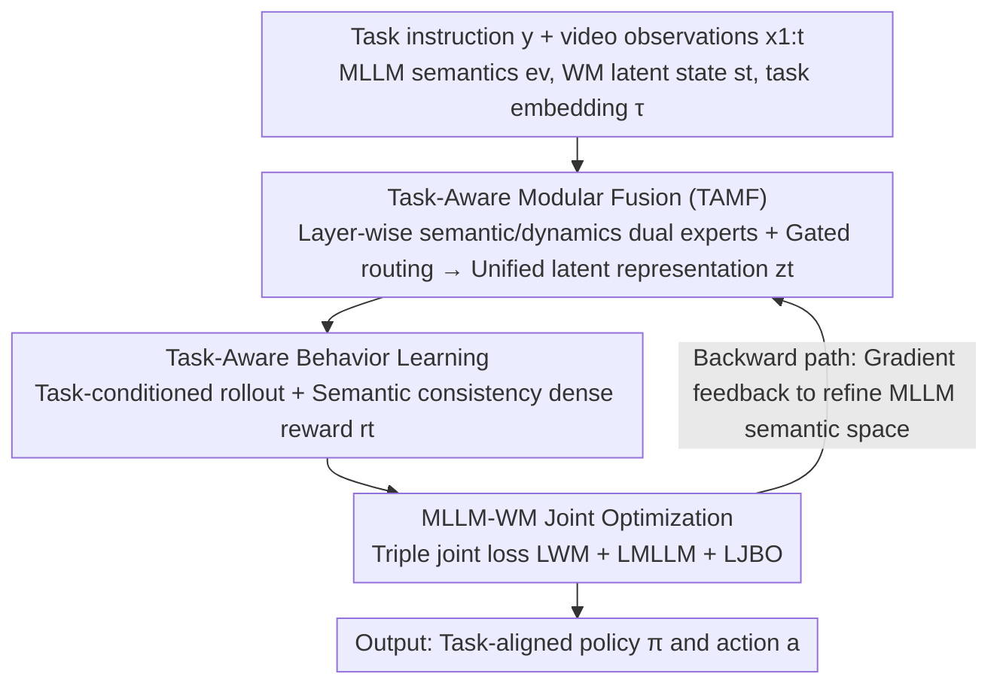

# ModularAgent: A Task-Aware Modular Framework for Joint Optimization of Multimodal Large Language Models and World Models

**Conference**: CVPR 2026  
**Paper**: [CVF Open Access](https://openaccess.thecvf.com/content/CVPR2026/html/Zhan_ModularAgent_A_Task_Aware_Modular_Framework_for_Joint_Optimization_of_Multimodal_CVPR_2026_paper.html)  
**Code**: Undisclosed  
**Area**: Agent / Embodied AI  
**Keywords**: World Models, MLLM, Bidirectional Coupling, Task-Aware Routing, Reinforcement Learning

## TL;DR
ModularAgent enables **bidirectional coupling** between Multimodal Large Language Models (MLLMs) and World Models (WMs) in latent space. The forward path injects MLLM semantics into the WM to guide "imagination," while the backward path utilizes dense text-aligned rewards generated by the WM to refine the MLLM semantic space. By employing task-aware layer-wise dual-expert routing to mitigate multi-task interference, it outperforms baselines such as GenRL and FOUNDER in DeepMind Control Suite (DMC) locomotion multi-task learning and cross-environment transfer.

## Background & Motivation

**Background**: Developing "generalist embodied agents" capable of generalizing in the real world requires two core capabilities: MLLMs provide strong semantic priors and cross-modal generalization (e.g., understanding high-level instructions like "turn on the lamp, watch out for the vase"), while World Models (WMs, such as the RSSM in Dreamer/PlaNet) excel at modeling environmental dynamics and performing long-horizon imagination and planning. Integrating both appears to be a shortcut toward open-ended embodied intelligence.

**Limitations of Prior Work**: Existing integration methods are relatively "shallow." One category (planner/reward paradigm) treats the MLLM as an external tool for high-level planning or reward calculation, resulting in fragmented learning objectives and misaligned representations. Another category (GenRL, FOUNDER) utilizes a connector to map MLLM embeddings into the WM latent space, but suffers from two major flaws: (1) **Unidirectional projection**—information flows only from the MLLM to the WM, meaning feedback from environmental dynamics never reaches the MLLM; (2) **Task-agnostic** connectors—they apply the same alignment strategy to all tasks, leading to parameter conflicts when tasks differ significantly, which limits multi-task and cross-task generalization.

**Key Challenge**: Semantic reasoning (MLLM) and physical dynamics (WM) naturally reside on different representation manifolds. Unidirectional, static connectors neither allow for closed-loop error correction nor do they adapt to specific tasks, leading to gradient conflicts in multi-task scenarios.

**Goal**: Establish a unified framework that tightly couples semantic intent with WM latent dynamics while allowing physical feedback from the WM to refine the MLLM. This coupling must be **task-aware** to support multi-task learning and cross-environment generalization.

**Key Insight**: The authors advocate for a shift from "static architecture design" to a "task-aware dynamic joint mechanism," implementing **bidirectional** coupling (forward + backward) with **layer-wise modular routing**.

**Core Idea**: Utilize a pair of complementary pathways (forward semantic injection for guided imagination and backward dense textual rewards for MLLM refinement) combined with task-conditioned gated layer-wise dual-expert fusion to achieve bidirectional joint optimization of the MLLM and WM in latent space.

## Method

### Overall Architecture
ModularAgent takes task instructions $y$, video observation sequences $x_{1:t}$, and historical actions $a_{t-1}$ as input, and outputs an action policy $\pi$ consistent with the task semantics. The pipeline forms a closed loop of "forward imagination and backward correction" through three components: **Task-Aware Dynamic Joint Learning** (centered on Task-Aware Modular Fusion, TAMF) fuses MLLM semantics $e_v$ and WM latent states $s_t$ into a unified latent representation $z_t$ guided by task embeddings $\tau$. **Task-Aware Behavior Learning** performs task-conditioned rollouts in this shared imagination space and calculates dense semantic consistency rewards. **MLLM-WM Joint Optimization** uses a triple joint loss to bind semantic alignment, dynamics prediction, and behavior optimization into a single training paradigm, ensuring gradient flow between the MLLM and WM. The forward path (A→B→C) enables semantic-guided imagination, while the backward path propagates gradients from D back to TAMF/MLLM to self-correct the semantic space based on physical dynamics.

### Key Designs

**1. Task-Aware Modular Fusion (TAMF): Integrating semantics and dynamics via task-conditioned layer-wise dual-expert routing to mitigate multi-task interference.**

This design addresses the limitation of task-agnostic connectors and multi-task parameter conflicts. Given MLLM visual semantics $e_v \in \mathbb{R}^{d_m}$ and WM latent state $s_t \in \mathbb{R}^{d_s}$, an initial fused representation $z^{(0)} = h_{\text{fuse}}([\,e_v;\,s_t\,])$ is produced. TAMF consists of $L$ stacked layers, each containing two expert adapters: a semantic expert $A^{(\ell)}_{\text{sem}}$ for aligning text/visual representations and a dynamics expert $A^{(\ell)}_{\text{dyn}}$ for integrating physical state transitions. The **task-guided gating** mechanism passes the task embedding $\tau$ through a lightweight network $p = \sigma(W_2\,\text{GELU}(W_1\,\text{LN}(\tau)))$ to obtain a routing coefficient $(0,1)$, which weights the experts in each layer:

$$z^{(\ell)} = z^{(\ell-1)} + (1-p^{(\ell)})\,A^{(\ell)}_{\text{sem}}(z^{(\ell-1)}) + p^{(\ell)}\,A^{(\ell)}_{\text{dyn}}(z^{(\ell-1)})$$

By using **independent layer-wise gating**, gradient propagation is decomposed into local decisions, leading to more stable convergence and a progressive balance between high-level semantic abstraction and low-level physical reasoning.

**2. Task-Aware Behavior Learning: Task-conditioned rollouts in the shared imagination space using dense semantic rewards.**

To address the issue of imagination being purely driven by physical transitions, this step incorporates task semantics into the imagination process. On the fused latent representation $z_t$, the policy network and transition function iterate: $a_t \sim \pi_\psi(a_t\,|\,z_t)$, $\tilde z_{t+1} \sim p_\theta(z_{t+1}\,|\,z_t, a_t)$. Dense rewards are **self-learned** rather than manually defined: task embeddings are mapped to the WM state manifold $z^\tau_t = f_{\text{map}}(\tau)$, and a dense reward is defined as the semantic consistency between the imagined state and the task reference trajectory $r_t = \text{Sim}(z_t, \tilde z^\tau_t)$. 

**3. MLLM-WM Joint Optimization: Binding forward injection and backward correction via a triple joint loss.**

The total loss is defined as:

$$L_{\text{total}} = \lambda_{\text{WM}} L_{\text{WM}} + \lambda_{\text{MLLM}} L_{\text{MLLM}} + \lambda_{\text{JBO}} L_{\text{JBO}}$$

Here, $L_{\text{WM}}$ is the standard RSSM objective (dynamics KL consistency + reconstruction), $L_{\text{MLLM}}$ handles semantic reconstruction and cross-modal alignment, and $L_{\text{JBO}}$ is the task-conditioned joint behavior optimization objective. Because the rewards are differentiable in the latent space, gradients can flow back to the MLLM, enabling the "backward path" for semantic self-correction.

### Loss & Training
Training involves two stages: pre-training the world model for 100K steps, followed by behavior learning for 50K steps. InternVideo2 is used as the backbone. Visual observations are rendered at 64×64.

## Key Experimental Results

### Main Results
Episodic reward comparison on DMC (selected tasks):

| Task | GenRL | FOUNDER | ModularAgent |
|------|-------|---------|--------------|
| walker run | 0.77 | 0.78 | **0.87** |
| quadruped run | 0.86 | 0.94 | **0.95** |
| stickman stand | 0.70 | 0.91 | **0.95** |
| overall (Avg. 10 tasks) | 0.82 | 0.87 | **0.91** |

### Ablation Study
Walker tasks with cumulative components:

| Configuration | walker stand | walker run | walker walk |
|------|------|------|------|
| base (Unidirectional, $L_{\text{WM}}$ only) | 0.89 | 0.67 | 0.86 |
| + $L_{\text{MLLM}}$ | 0.96 | 0.76 | 0.90 |
| + TAMF | 1.00 | 0.83 | 1.00 |
| + Joint Optimization (+TARO) | **1.03** | **0.87** | **1.02** |

### Key Findings
- **TAMF and Joint Optimization are the primary contributors**: TAMF significantly reduces multi-task interference, while dense textual rewards provide stable supervision via joint optimization.
- **Bidirectional coupling outperforms unidirectional methods**: By integrating semantic abstraction and physical modeling in a unified latent space, ModularAgent achieves more accurate decision-making than WM-CLIP or GenRL.
- **Imagination trajectory visualization** confirms that task-conditioned imagined observations closely match ground truth after behavior learning.

## Highlights & Insights
- **Differentiable Backward Path**: Turning feedback into a differentiable dense reward in the latent space allows the semantic space to be corrected by physical dynamics, moving beyond simple feature concatenation toward true joint optimization.
- **Layer-wise Task-Gated MoE**: Implementing routing at every layer using task embeddings strikes a balance between shared representation and task specificity, effectively mitigating gradient conflicts.
- **Self-Supervised Dense Rewards**: Using semantic consistency in the latent space avoids the pitfalls of manual reward engineering, which is particularly beneficial for long-horizon embodied tasks.

## Limitations & Future Work
- Evaluations are restricted to low-dimensional DMC control (64×64 rendering) and lack testing in real-robot manipulation or open-ended instruction spaces.
- There are slight discrepancies in reward definitions between different sections of the paper, and some acronyms (e.g., TARO) are not fully detailed.
- Multi-loss weighting ($\lambda$) and layer-wise gating introduce numerous hyperparameters, requiring more thorough sensitivity analysis.

## Related Work & Insights
- **vs. GenRL / FOUNDER**: These methods use unidirectional MLLM→WM projection. ModularAgent introduces a **bidirectional** loop where dynamics feedback corrects the MLLM.
- **vs. WM-CLIP**: WM-CLIP is a unidirectional WM→MLLM variant. ModularAgent integrates both directions for superior performance.
- **vs. Planner/Reward Paradigms**: Those methods treat MLLMs as external tools. This work performs gradient-level joint optimization in a shared latent space.

## Rating
- Novelty: ⭐⭐⭐⭐
- Experimental Thoroughness: ⭐⭐⭐
- Writing Quality: ⭐⭐⭐⭐
- Value: ⭐⭐⭐⭐

<!-- RELATED:START -->

## Related Papers

- [\[ACL 2026\] Agent-GWO: Collaborative Agents for Dynamic Prompt Optimization in Large Language Models](../../ACL2026/llm_agent/agent-gwo_collaborative_agents_for_dynamic_prompt_optimization_in_large_language.md)
- [\[CVPR 2026\] SenseSearch: Empowering Vision-Language Models with High-Resolution Agentic Search-Reasoning via Reinforcement Learning](sensesearch_empowering_vision-language_models_with_high-resolution_agentic_searc.md)
- [\[CVPR 2026\] Towards GUI Agents: Vision-Language Diffusion Models for GUI Grounding](towards_gui_agents_vision-language_diffusion_models_for_gui_grounding.md)
- [\[ACL 2026\] Feedback-Driven Tool-Use Improvements in Large Language Models via Automated Build Environments](../../ACL2026/llm_agent/feedback-driven_tool-use_improvements_in_large_language_models_via_automated_bui.md)
- [\[CVPR 2026\] OS-Oracle: A Comprehensive Framework for Cross-Platform GUI Critic Models](os-oracle_a_comprehensive_framework_for_cross-platform_gui_critic_models.md)

<!-- RELATED:END -->
