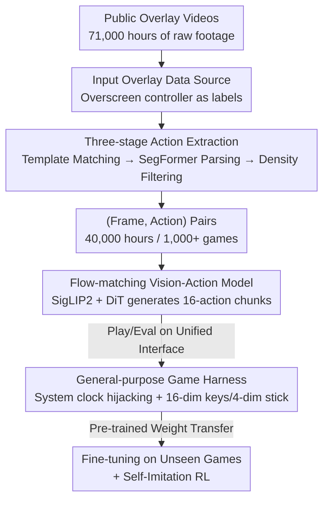

# NitroGen: An Open Foundation Model for Generalist Gaming Agents

**Conference**: CVPR 2026  
**Paper**: [CVF Open Access](https://openaccess.thecvf.com/content/CVPR2026/html/Magne_NitroGen_An_Open_Foundation_Model_for_Generalist_Gaming_Agents_CVPR_2026_paper.html)  
**Code**: To be open-sourced (Project page https://nitrogen.minedojo.org; the paper promises to release the dataset / simulator / weights after acceptance)  
**Area**: Generalist Gaming Agents / Embodied Foundation Models / Vision-Action Policy  
**Keywords**: Gaming Agent, Vision-Action Model, Behavior Cloning, flow matching, internet-scale data

## TL;DR
NitroGen treats "controller input overlays used by players in livestreams" as natural action labels. It automatically extracts (frame, action) pairs from 40,000 hours of public videos covering 1,000+ games. By training a single vision-action Transformer using flow-matching, the model can directly play various 2D/3D games. Pre-trained weights provide a maximum relative success rate improvement of 52% when fine-tuned on unseen games.

## Background & Motivation
**Background**: Vision and language models have achieved strong generalization capabilities through "internet-scale pre-training." However, embodied AI remains hindered by the lack of large-scale, diverse data with action labels. Video games serve as an ideal testing ground for embodied AI due to their rich visuals, interactivity, and vast range of task difficulties.

**Limitations of Prior Work**: Previous gaming AI methods have significant drawbacks. LLM-based methods (e.g., Voyager, Cradle) rely on hand-written program APIs to read internal game states or complex perception modules to extract text and detect objects, requiring extensive per-game customization. Reinforcement Learning (e.g., AlphaStar, OpenAI Five) can achieve superhuman performance in single games but results in narrow agents that are expensive to train and dependent on dedicated simulator interfaces, which most commercial games lack. Pure pixel-based behavior cloning (e.g., VPT) is limited by the high cost of collecting demonstration data, covering only a tiny fraction of games.

**Key Challenge**: Developing a "generalist" gaming agent requires massive multi-game data with action labels. However, action labels are the hardest to obtain—the vast majority of game recordings contain only visuals without the specific inputs made by the player. There is a fundamental conflict between data scale and label availability.

**Goal**: (1) Develop a scalable, near-zero-cost method to recover action labels from public videos; (2) Provide a unified evaluation interface for arbitrary commercial games; (3) Demonstrate that behavior cloning on noisy internet data can produce a cross-game generalist policy.

**Key Insight**: The authors noticed that many speedrunners and action game streamers use real-time controller visualizations (input overlays) in a corner of the screen. These overlays show which buttons are pressed and the position of the joysticks. The overlay itself is a "graphical annotation of actions." By parsing it from the screen, action labels can be obtained for free.

**Core Idea**: Treat on-screen controller overlays as action label sources to automatically parse button and joystick states, thereby scaling behavior cloning to internet-level multi-game videos.

## Method

### Overall Architecture
NitroGen consists of three interconnected components: ① an internet-scale multi-game video dataset with action labels (derived from parsing overlays); ② a general-purpose harness that wraps any commercial game with a Gymnasium API, defining a unified observation-action space and a multi-game evaluation suite; ③ a vision-action model trained via large-scale behavior cloning (using flow matching to generate future action chunks). The entire pipeline is: "Video → Automated Action Extraction → Quality Filtering → Behavior Cloning Training → Evaluation/Fine-tuning on the unified harness."

### Key Designs

**1. Input Overlay Data Source: Treating screen overlays as natural action labels**

Behavior cloning requires (observation, action) pairs. Since internet game recordings usually only have visuals, this lack of input data is the biggest obstacle to scaling BC. The authors found a public data source that provides the "answer": players use input overlay software (like Open Joystick Display, GamePad Viewer, etc.) to render a 2D controller in the corner, highlighting pressed buttons and moving joysticks in sync. This overlay is equivalent to a "frame-by-frame graphical annotation of actions." This source is naturally scalable—while overlay videos are a subset of all gaming content, they are numerous enough that the authors crawled 71,000 hours of raw material. To avoid over-representation of popular games, they used keyword search and diversity filtering. Compared to VPT (which labeled 70,000 hours for Minecraft using inverse dynamics but is limited to one game) or teleoperation datasets (expensive and small), this path is nearly zero-cost and covers thousands of games.

**2. Three-stage Action Extraction Pipeline: Precisely recovering inputs from overlay images**

Knowing the "answer" is on the screen isn't enough; it must be parsed reliably across different controller types (Xbox/PlayStation), transparencies, and compression artifacts. The authors use a three-stage pipeline. **Stage 1: Template Matching** locates the controller region. They prepared ~300 common templates and sampled 25 frames per video to perform feature matching using SIFT and XFeat. Affine transformations are estimated, requiring at least 20 inliers for validity, and the highest-scoring region is cropped. **Stage 2: Action Parsing** uses a fine-tuned SegFormer. It takes two consecutive frames (concatenated spatially to capture dynamics) and outputs a segmentation mask to locate the joystick on a discrete $11 \times 11$ grid, plus binary button states. The authors found that "estimating joystick position via segmentation masks" significantly outperforms "direct coordinate regression." This parser was trained on 8M synthetic frames with randomized overlays. During inference, joystick centers are determined via the average of "centered" frames and normalized to $[-1, 1]$ using the 99th percentile to suppress outliers. **Stage 3: Quality Filtering** addresses the issue of "empty actions." Like VPT, the model might over-predict inaction. The authors filter by action density, keeping only segments where at least 50% of timesteps have non-zero input, leaving 40,000 hours. The overlay in the screen is then masked (blacked out) to prevent the model from "cheating" by looking at the overlay.

**3. General Game Harness and Unified Observation-Action Space: Driving any game with one policy**

Commercial games lack programmatic control interfaces like Gymnasium. Without an interface, frame-by-frame training/evaluation is impossible. The authors built a general harness that hijacks the game engine's system clock to control simulation time. This allows frame-by-frame interaction without modifying game code, provided the game uses the system clock for physics (a common practice). On top of this, they defined a unified interface: observations are single RGB frames; actions are a standardized 16-dimensional binary vector (4 D-pad, 4 face buttons, 2 bumpers, 2 triggers, 2 stick clicks, start, back) plus 4 continuous joystick dimensions. Unlike old methods that define specific action spaces for each game, this unified layout allows the same policy to be transferred across games. The evaluation suite covers 10 games and 30 tasks (5 2D, 5 3D), categorized into Combat, Navigation, and Game-specific, with success rates assessed manually.

**4. Flow-matching Vision-Action Model: Generative action chunking for reactive control**

The policy maps the "current frame" to "future actions." NitroGen adapts generative modeling from robotics, using **flow matching** to generate action chunks conditioned on visual observations. The architecture is modified from GR00T N1, removing language and state encoders and keeping a single action head. $256 \times 256$ RGB frames are encoded by SigLIP 2 ViT into 256 image tokens. On the action side, a DiT (Diffusion Transformer) generates multiple actions in one forward pass: noisy action chunks are encoded by an MLP into action tokens, processed by DiT blocks with alternating self-attention and cross-attention (conditioning on image tokens), and decoded via an MLP. Training uses a standard conditional flow-matching objective on chunks of 16 actions with a single-frame context. Inference uses $k=16$ denoising steps. Interestingly, the authors found that using more than one frame of history provided no benefit, as the current state in these action games provided sufficient context. Thus, the model is a "system-1" fast-response perceptual model rather than a long-range planner.

### Loss & Training
The model is trained with a standard conditional flow-matching objective on 16-action chunks and single-frame context. Image augmentations include random brightness/contrast/saturation/hue, random rotation ($\pm 5^\circ$), and random cropping. The optimizer is AdamW (weight decay 0.001) with a warmup-stable-decay (WSD) learning rate schedule (constant lr 0.0001). EMA weights (decay 0.9999) are maintained, as they consistently outperformed non-EMA weights. The SegFormer for action parsing was trained separately with AdamW, lr 0.0001, linear decay, and a batch size of 256.

## Key Experimental Results

### Main Results
The extraction pipeline was validated for accuracy using 6 games recorded with OBS with randomized transparency/size.

| Target | Metric | Result |
|----------|------|------|
| Joystick Extraction | $R^2$ score | 0.84 |
| Button Extraction | Frame-level Accuracy | 0.96 |

After pre-training on the full dataset, the 500M model was evaluated **directly without any task-specific fine-tuning**, performing non-trivial tasks across various visual styles (3D / 2D top-down / 2D side-scrolling):

| Visual Style | Combat | Navigation | Game-specific |
|----------|------|------|----------|
| 3D | 61.2% | 55.0% | 56.3% |
| 2D Top-down | 46.0% | 52.0% | 61.5% |
| 2D Side-scrolling | 44.8% | 37.9% | 54.0% |

The authors emphasize that while the data is noisy (overlay lag, parsing errors, streamer UI elements, varying sensitivity), the pre-training still yields a robust multi-game policy. Performances were similar between "memorizable fixed layouts" and "procedurally generated" tasks, suggesting the model uses both memory and adaptation.

### Ablation Study
One game was held out from pre-training, then fine-tuned with a small amount of data, compared against training "from scratch" with the same architecture and compute.

| Setting (3D action-RPG, 30h, relative gain by task) | Fine-tuned vs. Scratch | Gain |
|------|------|---------|
| Combat | 73.3% vs. 48.3% | +52% |
| Navigation | 60.0% vs. 48.0% | +25% |
| Game-specific | 66.6% vs. 63.3% | +5% |

| Setting (Isometric roguelike, by data volume, Completion Rate) | Fine-tuned | Scratch |
|------|------|------|
| 60h | 53.0% | 48.1% |
| 120h | 65.6% | 57.8% |
| 240h | 81.0% | 76.0% |

The relative improvement for the isometric roguelike was ~10%, while the 3D action-RPG saw ~25%. Pre-training benefits general skills like "Combat" and "Navigation" significantly, but has less impact on "Game-specific" mechanics (+5%), indicating it learns transferable play patterns.

### Key Findings
- **Segmentation over Regression**: Predicting joystick position as a segmentation mask on an $11 \times 11$ grid was a key finding that enabled the zero-label pipeline.
- **Filtering is essential**: Without it, the model over-predicts empty actions. Retaining only 55% of the data based on action density resulted in a more robust policy.
- **Single-frame context is sufficient**: History didn't help, as the initial visual state in these games usually determines the immediate next step.
- **Self-Imitation RL**: On a 2D boss fight, self-imitation (mixing the model's own best rollouts into training) increased success rates from 18.7% to 90.5% over 3 rounds, proving NitroGen is well-suited for pixel-level RL adaptation.

## Highlights & Insights
- **Turning "Labeling" into a "Perception Problem"**: Instead of manual labeling, the authors recognized that overlays transform action acquisition into an overlay-parsing problem. This is a brilliant shift that unlocks 40,000 hours of multi-game data at near-zero cost.
- **Engineering Infrastructure**: The system-clock-hijacking harness and unified action space allow arbitrary commercial games to be treated as training environments without source code access.
- **Flow-matching for Games**: Porting "flow matching for action chunks" from robotics to gaming pixel control proved effective, with 16-action chunks providing better temporal consistency than step-by-step generation.

## Limitations & Future Work
- **System-1 Reactive Model**: The authors admit the model doesn't do long-range planning, end-to-end game completion, or follow language instructions. It acts only when the visual context is clear.
- **Data Bias**: The dataset favors action games played with controllers. Pure keyboard games or strategy games (requiring planning and keyboard inputs) are underrepresented.
- **Manual Evaluation**: Success rates rely on human assessment. The lack of automated metrics limits the speed and reproducibility of large-scale experiments.
- **Noisy Labels**: Despite proving that "training with noise works," the authors haven't quantified the impact of overlay lag and parsing errors on the potential performance ceiling.

## Related Work & Insights
- **vs. VPT [3]**: While VPT used inverse dynamics for 70,000 hours of Minecraft, NitroGen uses "screen overlays as labels" to scale to 1,000+ games.
- **vs. RL (AlphaStar / OpenAI Five)**: These achieve superhuman performance but are narrow and rely on specialized simulators. NitroGen sacrifices peak performance for generality and scalability.
- **vs. LLM Agents (Voyager / Cradle)**: These use high-level reasoning but require extensive customization per game. NitroGen is a direct pixel-to-action mapping.
- **vs. Game-TARS [62]**: Concurrent work that also trains multi-game agents but uses contractor-labeled and multimodal reasoning data (>20,000 hours); NitroGen's overlay-based source is more scalable.

## Rating
- Novelty: ⭐⭐⭐⭐⭐ "Screen overlays as action labels" is a brilliant data perspective.
- Experimental Thoroughness: ⭐⭐⭐⭐ Covers extraction accuracy, zero-shot eval, fine-tuning, and RL, though manual evaluation limits scale.
- Writing Quality: ⭐⭐⭐⭐ Clear structure and well-justified trade-offs.
- Value: ⭐⭐⭐⭐⭐ The release of the dataset, simulator, and weights provides significant infrastructure for the research community.

<!-- RELATED:START -->

## Related Papers

- [\[CVPR 2026\] RetouchIQ: MLLM Agents for Instruction-Based Image Retouching with Generalist Reward](retouchiq_mllm_agents_for_instruction-based_image_retouching_with_generalist_rew.md)
- [\[AAAI 2026\] AutoGLM: Autonomous Foundation Agents for GUIs](../../AAAI2026/llm_agent/autoglm_autonomous_foundation_agents_for_guis.md)
- [\[ICLR 2026\] AgentSynth: Scalable Task Generation for Generalist Computer-Use Agents](../../ICLR2026/llm_agent/agentsynth_scalable_task_generation_for_generalist_computer-use_agents.md)
- [\[CVPR 2026\] SceneAssistant: A Visual Feedback Agent for Open-Vocabulary 3D Scene Generation](sceneassistant_a_visual_feedback_agent_for_openvoc.md)
- [\[CVPR 2026\] Seeing as Experts Do: A Knowledge-Augmented Agent for Open-Set Fine-Grained Visual Understanding](seeing_as_experts_do_a_knowledge-augmented_agent_for_open-set_fine-grained_visua.md)

<!-- RELATED:END -->
