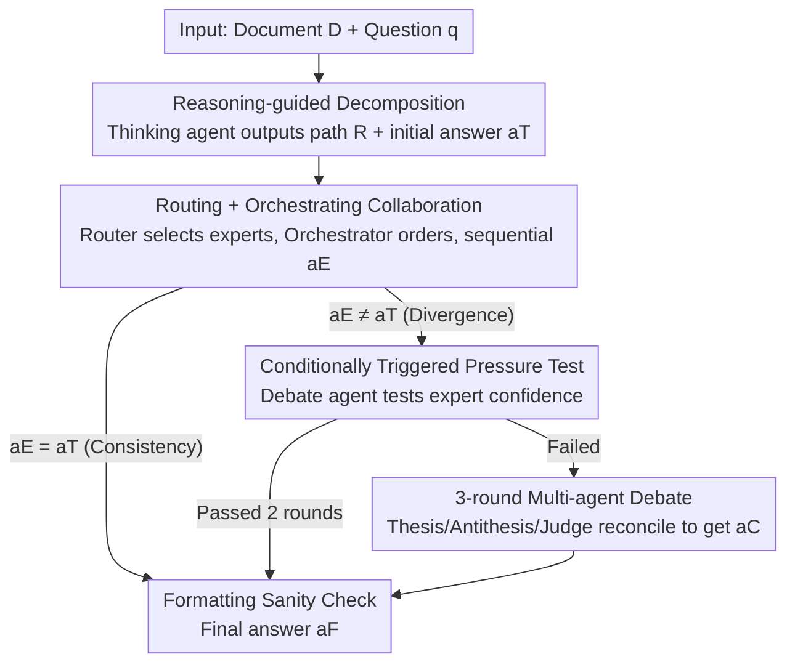

# ORCA: Orchestrated Reasoning with Collaborative Agents for Document Visual Question Answering

**Conference**: CVPR 2026  
**Paper**: [CVF Open Access](https://openaccess.thecvf.com/content/CVPR2026/html/Lassoued_ORCA_Orchestrated_Reasoning_with_Collaborative_Agents_for_Document_Visual_Question_CVPR_2026_paper.html)  
**Code**: https://github.com/AymenLass/ORCA  
**Area**: Agent / Multimodal Document Understanding  
**Keywords**: DocVQA, Multi-agent, Reasoning-guided Routing, Adversarial Verification, Conditional Activation

## TL;DR
ORCA transforms single-page Document Visual Question Answering (DocVQA) into a five-stage multi-agent pipeline. It uses a thinking agent to decompose questions into reasoning paths, routes them via content types to orchestrate nine specialized agents, and triggers pressure tests and adversarial debates only when expert answers conflict with the thinking agent. This approach surpasses single-model SOTA performance across three benchmarks while restricting heavy computation (debates) to only 8.3% of samples.

## Background & Motivation
**Background**: Single-page DocVQA requires models to understand "visually rich documents" containing text, tables, charts, forms, and handwriting while performing multi-step reasoning. Dominant approaches include specialized multimodal transformers like LayoutLM/Donut or general VLMs like Qwen3-VL, InternVL, and GLM-4.5V.

**Limitations of Prior Work**: The authors identify three specific shortcomings. First, **the "one-size-fits-all" approach**—a question involving "tables with handwritten notes" requires both structured data extraction and OCR/HTR capabilities, which individual models handle inconsistently. Second, **direct answer generation without explicit reasoning** lacks planning and interpretability; even with CoT, a single model handles all steps without content-aware specialization or self-verification. Third, **the lack of iterative refinement and cross-validation**, where models output answers without sufficient confidence evaluation.

**Key Challenge**: There is a fundamental mismatch between the **heterogeneity** of document components and the **homogeneous processing** of single models. Furthermore, applying heavy verification to all samples incurs unacceptable computational costs.

**Goal**: This work addresses three sub-problems: (1) How to decompose complex questions and route them to appropriate experts based on document components; (2) How to enable orderly collaboration and information flow among experts; (3) How to perform adversarial verification only on truly uncertain predictions.

**Key Insight**: Explicit reasoning can guide agent selection, sequential orchestration allows information transfer between experts, and debate mechanisms can reconcile discrepancies between the thinker and experts. These are integrated into a conditional activation pipeline.

**Core Idea**: Replace "direct single-model answering" with "reasoning-guided dynamic routing + expert orchestration + conditionally triggered adversarial verification," unifying specialization and self-verification while minimizing overhead through conditional activation.

## Method

### Overall Architecture
Given a single-page document $D$ and a natural language question $q$, ORCA follows a five-stage pipeline to produce answer $a$. **Stage 1**: A thinking agent decomposes the question into reasoning path $R$ and provides an initial answer $a_T$. **Stage 2**: A router uses $R$ to activate specialists, while an orchestrator determines execution order to Produce expert answer $a_E$. **Stage 3**: If $a_E \neq a_T$, a pressure test is triggered where a debate agent challenges the expert's confidence. **Stage 4**: If uncertainty persists, a three-round structured debate (thesis/antithesis/judge) yields $a_C$. **Stage 5**: A sanity checker performs formatting to yield final answer $a_F$. Crucially, stages 3 and 4 are **conditionally activated**.

### Key Designs

**1. Reasoning-guided Decomposition + Answer Masking: Guiding downstream while preventing bias**

To address "lack of planning," Stage 1 uses GLM-4.5V-9B as $A_{think}$ to analyze the problem and image, producing a **reasoning path** $R = \{r_1, r_2, \dots, r_n\}$ and an **initial answer** $a_T$, such that $(R, a_T) = A_{think}(q, D)$. To prevent **confirmation bias**, when $R$ is passed to specialists, an **answer mask** is applied: if $a_T$ appears in $R$ with frequency exceeding threshold $\tau$, occurrences are masked as $R^*$. The final expert then answers via $a_E = \sigma_n(q, D, a_{n-1}, R^*)$. This masking provides a +0.7/+0.4 gain.

**2. Reasoning-guided Dynamic Routing (Turbo DFS) + Sequence Orchestration: Heterogeneous task distribution**

Stage 2 maintains an agent dock with **nine specialized agents**: $A_{ocr}$ (handwriting/complex text), $A_{table}$ (tables/lists), $A_{figure}$ (charts), $A_{layout}$ (layout), $A_{form}$ (forms), $A_{text}$ (free text), $A_{image}$ (photos), $A_{yesno}$ (boolean), and $A_{other}$. The router $A_{route}$ (Qwen2.5-VL-7B) models selection as a **multi-label classification** task to output a binary activation vector $v \in \{0,1\}^9 = A_{route}(q, D, R)$. Instead of simple sigmoid thresholds, it uses **Turbo DFS (Score-guided Depth First Search)** to decode and union ranked candidates. Experts execute in a **sequential relay**, where each $\sigma_i$ receives the previous output $a_{i-1}$, ensuring information flow.

**3. Conditionally Triggered Two-level Adversarial Verification: Targeted compute allocation**

Verification is designed as a **conditionally activated** mechanism. Level 1 **Pressure Test (Stage 3)** starts only if $a_E \neq a_T$. $A_{debate}$ generates challenging follow-ups $q_{debate}$ based on $(q, D, a_E)$. If the expert fails $A_{eval}$'s pass/fail assessment twice, it proceeds to Level 2. Level 2 **Multi-round Debate (Stage 4)** introduces $A_{thesis}$ (defending $a_E$), $A_{anti}$ (InternVL3-8B-hf, proposing $a_{alt}$), and $A_{judge}$. The antithesis follows a [REFERENCE]/[CRITICISM]/[CONCLUSION] format. Statistics show Stage 3 is triggered for 23.4% of samples, and **multi-round debate only occurs for 8.3% of samples**, concentrating heavy compute on difficult cases.

## Key Experimental Results

Evaluations were performed on Single-Page DocVQA, InfographicsVQA, and OCRBench-v2 (ANLS for DocVQA/InfoVQA; mean score for OCRBench).

### Main Results
ORCA consistently outperforms single-model baselines across backbones, with **larger gains on tasks requiring complex reasoning**.

| Benchmark | Prev. SOTA (Qwen3VL-8B) | ORCA (Qwen3VL-8B) | Gain |
|------|----------------------|------------------|------|
| DocVQA (ANLS) | 96.1 | 97.2 | +1.1 (28.2% relative error reduction) |
| InfographicVQA (ANLS) | 83.1 | 88.0 | +4.9 |
| OCRBench-v2 (avg) | 65.4 | 67.1 | +1.7 |
| ChartQA | 85.7 | 90.1 | +4.4 (Generalization) |

Gains are more significant for **smaller models**: on OCRBench-v2, Qwen2.5-VL-7B improved by +3.6 compared to +1.7 for Qwen3VL-8B, showing that collaboration **compensates for small model capability gaps**.

### Ablation Study
Stage-level ablation (Backbone: Qwen3VL-8B):

| Configuration | DocVQA | InfoVQA | OCRBench-v2 | Note |
|------|--------|---------|-------------|------|
| ORCA (Full) | 97.2 | 88.0 | 67.1 | Full Pipeline |
| w/o Stage 1 (Reasoning) | 96.5 (-0.7) | 84.9 (-3.1) | 66.1 (-1.0) | Lacks Task Decomposition |
| w/o Stage 2 (Specialists) | 96.3 (-0.9) | 84.1 (-3.9) | 66.0 (-1.1) | Largest drop; core component |
| w/o Stage 3 (Pressure) | 97.0 (-0.2) | 87.5 (-0.5) | 66.9 (-0.2) | Minor gain contribution |
| w/o Stage 4 (Debate) | 96.9 (-0.3) | 87.2 (-0.8) | 66.7 (-0.4) | Minor gain contribution |
| w/o Stage 2–5 (=Single) | 96.2 (-1.0) | 84.1 (-3.9) | 65.6 (-1.5) | Regresses to baseline |

### Key Findings
- **Stage 2 (Specialist Collaboration) is the core**: Removing it causes performance to collapse toward the baseline.
- **Verification contributes specifically to hard cases**: While Stages 3/4 contribute only 0.1–0.8 points on average, their value lies in resolving high-uncertainty samples (the 8.3% of the total).
- **Controllable Latency**: Early termination for consistent answers (77% of samples) results in 2.9–4.5s latency, while the full pipeline (9.6–13.1s) is reserved for precision-sensitive cases.

## Highlights & Insights
- **"Conditional Activation" makes heavy verification economical**: Budgeting compute solely for 8.3% of cases is a transferable strategy for any "expensive verification" scenario.
- **Answer Masking targets confirmation bias**: Preventing specialists from blindly following the thinking agent's preliminary answer leads to a stable +0.7 gain.
- **Specialization as an alternative to scale**: The fact that smaller models (7B) benefit more than larger ones (8B) suggests that orchestration can be more compute-efficient than brute-force parameter scaling.

## Limitations & Future Work
- **Limitations**: Full pipeline latency is 10–16× higher than single models; high engineering complexity with heterogeneous agents (GLM/Qwen/InternVL). It is currently limited to **single-page** documents.
- **Future Work**: Learning optimal activation thresholds, using uniform lightweight backbones to reduce deployment costs, and using reasoning traces as training signals to reduce long-term compute needs.

## Related Work & Insights
- **vs Visual ChatGPT / HuggingGPT**: ORCA replaces manual rules with a learned VLM router and Turbo DFS constrained generation.
- **vs CoT / ReAct**: ORCA adds content-aware specialization and reasoning path masking to prevent confirmation bias.
- **vs Standard Debate**: Unlike methods applying debate to all samples, ORCA uses conditional activation to optimize the reliability-compute trade-off.

## Rating
- Novelty: ⭐⭐⭐⭐ 
- Experimental Thoroughness: ⭐⭐⭐⭐⭐ 
- Writing Quality: ⭐⭐⭐⭐ 
- Value: ⭐⭐⭐⭐

<!-- RELATED:START -->

## Related Papers

- [\[CVPR 2026\] Resolving Evidence Sparsity: Agentic Context Engineering for Long-Document Understanding](resolving_evidence_sparsity_agentic_context_engineering_for_long-document_unders.md)
- [\[AAAI 2026\] COVR: Collaborative Optimization of VLMs and RL Agent for Visual-Based Control](../../AAAI2026/llm_agent/covrcollaborative_optimization_of_vlms_and_rl_agent_for_visu.md)
- [\[ACL 2025\] A Multi-Agent Framework for Mitigating Dialect Biases in Privacy Policy Question-Answering Systems](../../ACL2025/llm_agent/multi_agent_dialect_bias_privacy_qa.md)
- [\[ICML 2025\] KBQA-o1: Agentic Knowledge Base Question Answering with Monte Carlo Tree Search](../../ICML2025/llm_agent/kbqa-o1_agentic_knowledge_base_question_answering_with_monte_carlo_tree_search.md)
- [\[CVPR 2026\] ReFAct: Empowering Multimodal Web Agents with Visual and Context Focusing](refact_empowering_multimodal_web_agents_with_visual_and_context_focusing.md)

<!-- RELATED:END -->
