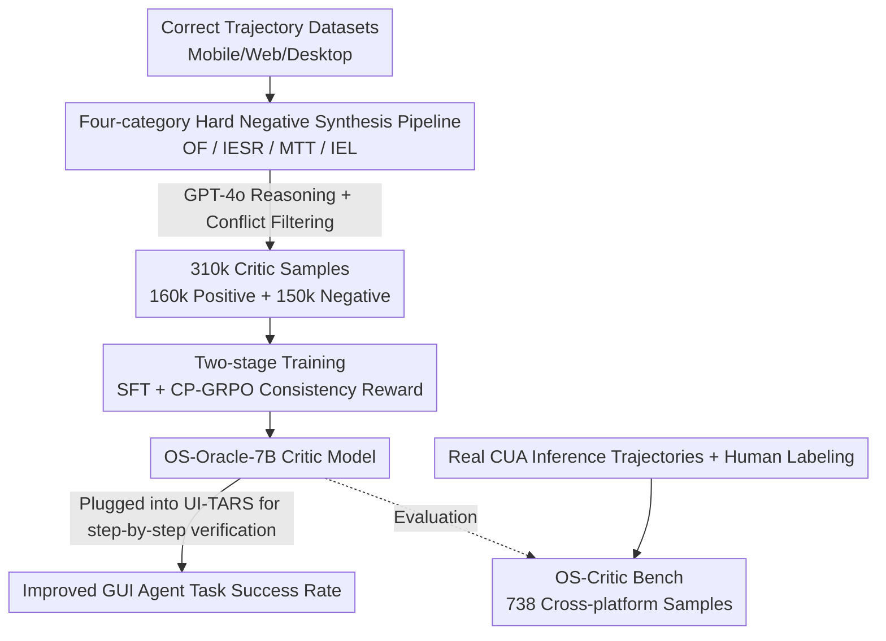

# OS-Oracle: A Comprehensive Framework for Cross-Platform GUI Critic Models

**Conference**: CVPR 2026  
**Paper**: [CVF Open Access](https://openaccess.thecvf.com/content/CVPR2026/html/Wu_OS-Oracle_A_Comprehensive_Framework_for_Cross-Platform_GUI_Critic_Models_CVPR_2026_paper.html)  
**Code**: https://github.com/numbmelon/OS-Oracle  
**Area**: Agent  
**Keywords**: GUI Agent, Critic Model, Hard Negative Synthesis, GRPO, Cross-platform Benchmark

## TL;DR
Addressing the lack of reliable step-by-step error detectors for "screen-based" GUI agents, OS-Oracle introduces a data pipeline that automatically synthesizes four types of typical error actions from positive trajectories. This generates 310,000 critic samples used to train a 7B critic model through two-stage SFT and Consistency-Preserving GRPO (CP-GRPO). The work also provides OS-Critic Bench, the first human-annotated critic benchmark covering Mobile, Web, and Desktop platforms. The model achieves SOTA among open-source models and demonstratedly improves the success rate of the UI-TARS agent.

## Background & Motivation
**Background**: VLM-driven Computer-Using Agents (CUAs) can already interact with screen screenshots—clicking buttons, filling forms, and completing multi-step tasks. However, in long-horizon workflows, a single error can accumulate, and some actions (e.g., deletion, submission) are irreversible. A natural solution is to equip the agent with a **critic model**: before executing each action, it judges whether the action is correct or needs to be retried. Compared to directly using RL to optimize the agent (where rewards are hard to design and require massive environment interactions), a critic is a more cost-effective and scalable approach—it can be trained based on a small VLM and plugged into various agents without retraining them.

**Limitations of Prior Work**: Critic models are currently hindered by two data gaps. First is the **lack of training data**, especially high-quality negative samples: public GUI trajectories consist almost entirely of expert demonstrations. Selecting "which step was wrong" from CUA-generated trajectories is extremely difficult—successful trajectories contain redundant steps, while failed ones make it hard to pinpoint the exact culprit. Relying solely on task success to judge each step is unreliable. Second is the **lack of evaluation benchmarks**: existing critic benchmarks are either built from open-source data (risking data leakage) or cover only a single platform (Web only or Desktop only).

**Key Challenge**: Training a critic requires a large number of "incorrect actions with correct labels," which are hard to find and label in real trajectories. Relying on manual labeling or GPT for correctness judgment introduces significant noise.

**Goal**: Establish an end-to-end full-stack framework to solve "data synthesis → model training → evaluation" for critics simultaneously, ensuring consistency across Mobile, Web, and Desktop platforms.

**Key Insight**: Instead of judging which step is wrong in real trajectories (hard), **actively synthesize errors from correct steps**. The authors categorized four typical errors committed by CUAs and used rules to transform correct actions into corresponding incorrect ones. In this way, the "error type + reason" of negative samples is naturally known, simplifying labeling and quality control.

**Core Idea**: Replace "mining errors from failed trajectories" with controllable "positive sample → rule-based error injection," and use consistency rewards to ensure the critic's judgment aligns with its reasoning.

## Method

### Overall Architecture
OS-Oracle is a three-stage full-stack pipeline. The input consists of existing GUI task trajectory datasets (Mobile/Web/Desktop), and the output is a pointwise-scoring critic model, OS-Oracle-7B, along with an evaluation benchmark.

The critic functions via **pointwise scoring**: given a task goal $g$, historical memory $m_t$, current screenshot $o_t$, and the action to be evaluated $a_t$, the model outputs a reason $r_t$ and a binary judgment $j_t \in \{\text{Yes}, \text{No}\}$ (i.e., $r_t, j_t = M_{\text{critic}}(g, m_t, o_t, a_t)$). The authors notably avoided pairwise ranking because in GUI tasks, both candidate actions are often wrong, making a forced choice meaningless.

The pipeline comprises three steps: **Data Synthesis**—extracting positive triplets from correct trajectories and rule-synthesizing negative actions across four error types, using GPT-4o to provide reasons for 310,000 samples (160k positive + 150k negative); **Two-stage Training**—SFT for fundamental discrimination and reasoning, followed by CP-GRPO using consistency rewards to align reasoning with judgment; and **Benchmark Construction**—manually labeling 738 actions sampled from real CUA inference trajectories to create OS-Critic Bench.

### Key Designs

**1. Four-category Hard Negative Synthesis Pipeline: Inverting "Mining Errors" into "Generating Errors by Type"**

This is the core contribution, directly addressing the "hard to find and label" bottleneck for negative samples. The authors synthesized errors based on four categories observed in practice:

- **Operation Failure (OF)**: Simulates the agent's failure to perceive subtle state changes. Specifically: inserting a `type` action before a `click` (not realizing the input box isn't active); repeating a clickable operation (missing a UI change); and adding `scroll` after reaching a boundary.
- **Inefficient Error State Recovery (IESR)**: Simulates the agent entering an unexpected UI and failing to `back` out. Using **state injection**, for a correct step, the pipeline retrieves a highly similar observation from another trajectory and injects its subsequent step as an "unexpected next state." Any action other than `back` is then treated as a negative sample.
- **Mistimed Task Termination (MTT)**: Simulates inaccurate judgment of completion. This involves either adding redundant actions to a finished trajectory or prematurely adding a `terminate` action to an unfinished one.
- **Inaccurate Element Localization (IEL)**: Simulates correct action types but clicking wrong elements. OmniParser V2 detects interactive elements. Metadata is used to calculate IoU (> 0.7), and the screen is divided into a 2×2 grid to sample diverse "wrong location" candidates.

This design **bypasses the hardest task of judging if a step is correct**; since negative samples are modified from correct actions, the error type and cause are known by design, ensuring high fidelity and scalability.

**2. Two-stage Training: Fixing "Reasoning and Judgment Mismatch" with Consistency Rewards**

To train a critic capable of reasoning, the authors used Qwen2.5-VL-7B as a base. The first stage, **SFT**, fine-tunes on the full dataset to learn reasoning and judgment simultaneously:

$$\mathcal{L}_{\text{SFT}} = -\mathbb{E}_{(x,r,j)\sim D}\big[\log P_\theta(r \mid x) + \log P_\theta(j \mid x, r)\big]$$

The second stage uses reinforcement learning based on GRPO. To address the issue where a model's **reasoning supports the action but the final judgment says No**, they proposed **Consistency-Preserving GRPO (CP-GRPO)**, adding an $R_{\text{consistency}}$ term to the reward.

Consistency is calculated using a "rules-first, model-backup" hybrid: positive/negative dictionaries ($L^+, L^-$) count semantic units in the reason ($c_i^+, c_i^-$) to determine rule-based polarity $p_i^{\text{rule}}$. If ambiguous, a Qwen3-8B proxy determines polarity $p_i^{\text{model}}$. $R_{\text{consistency}} = 1$ if the polarity matches the judgment $j_i$, and 0 otherwise. The total reward is weighted:

$$R(x_i, \hat r_i, \hat j_i) = \alpha R_{\text{acc}} + \beta R_{\text{format}} + \gamma R_{\text{consistency}}$$

**3. OS-Critic Bench: First Cross-platform, Human-annotated, Leakage-proof Benchmark**

To evaluate the critic itself, the authors built OS-Critic Bench. Data sources include AndroidControl/GUIOdyssey (Mobile), guiact/ScaleCUA-Web (Web), and AgentNet-Bench (Desktop). Quality control **avoids "ground-truth comparison"** because GUI paths aren't unique; actions deviating from the original trajectory but still progressing towards the goal are marked as correct. **Human experts provide the final binary labels**.

## Key Experimental Results

### Main Results
OS-Oracle compared to proprietary and open-source models on OS-Critic Bench (Overall Accuracy/F1):

| Model | Type | Overall Acc | Overall F1 |
|------|------|------|------|
| GPT-5 | Proprietary | 68.16 | 67.94 |
| Claude-4.5-Sonnet | Proprietary | 66.94 | 67.03 |
| Gemini-2.5-Pro | Proprietary | 67.62 | 70.16 |
| Qwen2.5-VL-7B (Base) | Open-source | 58.27 | 66.23 |
| GUI-Critic-R1 | Critic | 59.49 | 68.76 |
| OS-Oracle-7B-SFT | Ours | 63.14 | 71.49 |
| **OS-Oracle-7B** | Ours | **68.02** | **72.81** |

OS-Oracle-7B achieved the highest overall accuracy (68.02) among open-source models and **outperformed all proprietary models** in the Mobile category (Acc 70.78).

### Ablation Study

| Configuration | Key Metrics | Note |
|------|---------|------|
| Synthetic vs GPT-labeled Negatives | Acc 60.03 vs 55.42 | Synthetic negatives significantly outperformed GPT-4o labeled ones with the same positive sample count. |
| SFT + GRPO | Acc 66.53 / Consistency 80.89 | Standard GRPO reasoning-judgment consistency was only 80.89%. |
| SFT + CP-GRPO | Acc 68.02 / Consistency **99.73** | Consistency reward boosted consistency to 99.73% and improved accuracy. |
| Critic-guided SFT (Flywheel) | AndroidWorld 15.52 | Filtering 10k rollouts for SFT outperformed full-trajectory SFT (12.07). |

### Key Findings
- **Synthetic negatives exceed GPT-labeled quality**: Negatives directly labeled by GPT-4o contained noise that acted as harmful supervision, while rule-based synthesis was more reliable.
- **Consistency rewards fix reasoning gaps at zero cost**: CP-GRPO resolved the logic-judgment disconnect common in standard GRPO for critic tasks.
- **Scalability**: Increasing SFT samples from 10k to 310k monotonically increased accuracy, validating the pipeline's value.
- **Data Flywheel**: Using OS-Oracle to filter low-quality actions for training the agent improved downstream success rates.

## Highlights & Insights
- **The "Inverted Synthesis" Philosophy**: Instead of solving the hard problem of judging arbitrary steps, the authors solved the easy problem of modifying correct steps into known error types.
- **Error Taxonomy**: The OF/IESR/MTT/IEL classification is a systematic breakdown of CUA failure modes, useful for diagnostic purposes even without the critic.
- **Hybrid Consistency Reward**: Using rule dictionaries first and small-model logits as a backup is a robust, low-cost trick for any task requiring alignment between generated explanations and labels.

## Limitations & Future Work
- Negative samples rely on rule-based synthesis for **known** error modes; long-tail errors (e.g., semantic logic errors across many steps) might not be covered.
- The critic provides only binary Yes/No feedback, lacking granularity on "error severity" or "recoverability."
- Dynamic evaluation was limited to UI-TARS-1.5-7B; the benefits across more agents and longer tasks require further validation. ⚠️ The use of Qwen3-8B for polarity backup might introduce model-specific biases.

## Related Work & Insights
- **vs. Native RL Agents**: Native RL (e.g., UI-TARS-2) optimizes the agent directly with high environment costs; this work uses a plug-and-play critic trained offline, which is cheaper and cross-platform.
- **vs. GUI-Critic-R1 / UI-Genie**: These critics were trained primarily on mobile data; OS-Oracle provides unified coverage for Mobile, Web, and Desktop.
- **vs. Generic VLM Critics**: Using generic VLMs via prompting leads to high "acceptance bias" and instability; training a dedicated critic with consistency rewards ensures aligned reasoning.

## Rating
- Novelty: ⭐⭐⭐⭐ Inverted synthesis and CP-GRPO address core critic pain points.
- Experimental Thoroughness: ⭐⭐⭐⭐ Comprehensive offline and dynamic evaluations; however, the number of agents in dynamic tests was small.
- Writing Quality: ⭐⭐⭐⭐ Clear categorization of error modes and solid framework.
- Value: ⭐⭐⭐⭐ Full-stack open-source (pipeline, model, benchmark) provides significant utility for GUI agent reliability.

<!-- RELATED:START -->

## Related Papers

- [\[CVPR 2026\] MMBench-GUI: A Unified Hierarchical Evaluation Framework for Multi-Platform GUI Agents](mmbench-gui_a_unified_hierarchical_evaluation_framework_for_multi-platform_gui_a.md)
- [\[CVPR 2026\] GUI-CEval: A Hierarchical and Comprehensive Chinese Benchmark for Mobile GUI Agents](gui-ceval_a_hierarchical_and_comprehensive_chinese_benchmark_for_mobile_gui_agen.md)
- [\[ICLR 2026\] ScaleCUA: Scaling Open-Source Computer Use Agents with Cross-Platform Data](../../ICLR2026/llm_agent/scalecua_scaling_open-source_computer_use_agents_with_cross-platform_data.md)
- [\[CVPR 2026\] Towards GUI Agents: Vision-Language Diffusion Models for GUI Grounding](towards_gui_agents_vision-language_diffusion_models_for_gui_grounding.md)
- [\[CVPR 2026\] CGL: Advancing Continual GUI Learning via Reinforcement Fine-Tuning](cgl_advancing_continual_gui_learning_via_reinforcement_fine-tuning.md)

<!-- RELATED:END -->
