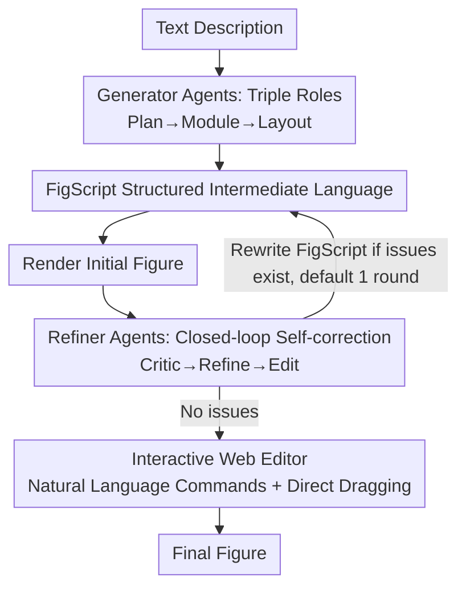

# Paper2Figure: A Multi-Agent Collaborative System for Figure Generation Towards Academic Research Paper

**Conference**: CVPR 2026  
**Paper**: [CVF Open Access](https://openaccess.thecvf.com/content/CVPR2026/html/Han_Paper2Figure_A_Multi-Agent_Collaborative_System_for_Figure_Generation_Towards_Academic_CVPR_2026_paper.html)  
**Code**: To be confirmed  
**Area**: Agent / Multimodal VLM  
**Keywords**: Multi-agent, Academic figure generation, Structured intermediate language, Self-refinement, Interactive editing

## TL;DR
Paper2Figure utilizes a dual multi-agent system comprising "Generator Agents + Refiner Agents." It first translates text descriptions of papers into a self-developed structured intermediate language, FigScript, used for rendering. A closed-loop Critic-Refine agent system then performs self-correction. Coupled with an interactive Web editor that returns control to the author, the system outperforms SVG/Mermaid code generation and text-to-image baselines on the self-built Paper2Figure Bench in accuracy, aesthetics, and completeness (+14.1% overall).

## Background & Motivation
**Background**: There are currently two mainstream routes for automatically generating main figures (methodology flowcharts, system overviews) for research papers. One is for LLMs to directly generate structured code (SVG, Mermaid, and other markup languages), and the other is to use text-to-image models (GPT-Image-1, Nano Banana, etc.) to synthesize pixel-based images directly.

**Limitations of Prior Work**: Both routes have significant flaws. Code generation (especially SVG) can faithfully preserve semantics and structure but suffers from poor readability—overlapping elements, broken connections, and tiny font sizes make information-dense figures hard to read. Mermaid is constrained by fixed layout rules, resulting in rigid layouts and a lack of visual hierarchy. Text-to-image paths produce visually appealing results but often fail in text rendering and suffer from disordered logical structures, missing modules, and chaotic connections, while remaining almost uneditable.

**Key Challenge**: No existing method can simultaneously guarantee **semantic precision, visual quality, and controllable/editable structure**. Code-based routes are precise but unattractive and rigid; image-based routes are aesthetic but disordered and unmodifiable, whereas academic figures require all three attributes.

**Goal**: To build a system capable of both automatically generating high-quality academic figures and allowing authors to perform fine-grained adjustments, thereby bridging the gap between "AI assistance" and "researcher control."

**Key Insight**: The authors draw inspiration from the workflow of professional academic illustrators—planning the structure, drawing modules, and then refining the layout, followed by repeated scrutiny and revision. This process is naturally suited for collaboration between multiple specialized agents using an intermediate representation that is more semantic than SVG and more flexible than Mermaid.

**Core Idea**: Use the structured intermediate language FigScript to connect the "Generation-Rendering-Refinement" dual-agent closed loop, overlaid with a Web editor to return final control to the user.

## Method

### Overall Architecture
Paper2Figure is a dual multi-agent system integrated with an interactive Web platform. The input is a text description, and the output is a publication-quality academic figure. The pipeline is divided into two segments: the **Generation Stage** involves three generator agents translating text into a FigScript draft for initial rendering; the **Refinement Stage** involves three refiner agents reviewing the rendered figure, locating issues, and rewriting FigScript for re-rendering in a closed loop. Finally, the Web editor allows users to continue adjustments via natural language commands or direct dragging. All agents are implemented based on GPT-4o. FigScript serves as the communication medium between agents and the bridge between the backend and frontend.

### Key Designs

**1. FigScript: A Structured Intermediate Language Between SVG and Mermaid**

Code generation routes are either too low-level (SVG is verbose, hard to edit, and poor at auto-layout) or too rigid (Mermaid has fixed syntax and weak styling), neither of which facilitates agent reasoning at the conceptual level. FigScript defines a figure as a hierarchical graph composed of nodes, edges, containers, and style attributes. It inherits the precision of SVG but abstracts low-level drawing operations into semantic building blocks. Unlike Mermaid, it provides a comprehensive set of adjustable parameters for colors, fonts, line weights, arrow shapes, padding, and icons, with built-in adjustable automatic layout algorithms. This "flexible yet constrained" design allows agents to balance structural accuracy with visual harmony while ensuring editable and consistent output.

**2. Generator Agents: Plan / Module / Layout**

Entrusting "text-to-figure" generation to a single model often leads to failures in structure, content, and layout. The generation stage is split into three serial agents: the Plan Agent analyzes instructions to extract entities and logic, determining the modular structure and hierarchy; the Module Agent constructs visual modules using FigScript (nodes, edges, containers); and the Layout Agent adjusts alignment, spacing, and grouping for a balanced layout. This division of labor allows each agent to focus on one aspect of creation, progressively grounding abstract semantics into concrete structures.

**3. Refiner Agents: Critic / Refine / Edit**

Initial generated figures often suffer from misaligned modules, inconsistent text, or poor color schemes. The refinement stage is a self-correcting loop: the Critic Agent scrutinizes the rendered figure to detect readability issues; the Refine Agent translates these issues into a structured revision plan for FigScript; and the Edit Agent executes the plan to trigger re-rendering. By default, refinement runs for one round ($N=1$). This loop ensures the output converges toward semantic precision and aesthetic quality.

**4. Interactive Web Editor: Returning Control to the Author**

Even the best automated systems require manual fine-tuning. The Web editor integrates automated generation with human control, featuring a dialogue panel, a real-time canvas, and a FigScript inspector. Users can describe desired changes in natural language (e.g., "move the preprocessing module to the left"), which the refiner agents then implement by rewriting FigScript. Users can also directly drag elements on the canvas. The agents handle semantic understanding and aesthetic optimization, while the editor provides transparent control over structure and style.

## Key Experimental Results

### Main Results
Evaluation was conducted on the **Paper2Figure Bench**, comprising 100 complex figures with paired descriptions manually curated from recent arXiv papers. Scoring was performed by GPT-4o as a judge (LLM-as-a-Judge) across three equally weighted dimensions: **Accuracy** (A1-A3: module coverage, relationship consistency, terminology alignment), **Beauty** (B1-B6: visual sub-items), and **Completeness** (C: bi-directional caption comparison).

| Method | Type | Accuracy | Beauty | Completeness | Overall Avg |
|------|------|----------|--------|--------------|----------|
| GPT-5 | SVG Code | — | — | — | 65.1 |
| Claude 4.5 Sonnet | SVG Code | — | — | — | 63.8 |
| Claude 4.5 Sonnet | Mermaid Code | — | — | — | 56.9 |
| Nano Banana | Text-to-Image | — | — | — | 45.0 |
| GPT-Image-1 | Text-to-Image | — | — | — | 34.9 |
| **Ours (full)** | FigScript | **77.5** | ~81.5* | **77.5** | **79.2** |

\* Beauty represents the average across B1-B6 sub-items; please refer to Table 1 in the original paper for specific values. Paper2Figure outperforms the strongest baseline (GPT-5 SVG, 65.1) by approximately **14.1%** overall.

### Ablation Study

| Configuration | Accuracy | Beauty | Completeness | Overall Avg |
|------|----------|--------|--------------|----------|
| Ours (w/o Refinement) | 74.3 | 79.1 | 71.0 | 74.8 |
| Ours (full) | 79.2 | — | 77.5 | **79.2** |

Note: The generation-only version already exhibits strong structural alignment; adding the refinement stage improves the overall score from 74.8 to 79.2, primarily enhancing module organization, text alignment, and color balance.

### Key Findings
- The three baseline categories have significant weaknesses: SVG is semantically faithful but visually cluttered; Mermaid is clean but rigid; text-to-image is attractive but logically incoherent and uneditable. Paper2Figure addresses all three via "intermediate language + agent collaboration."
- The refinement loop (Critic→Refine→Edit) provides stable gains even in a single round, proving visual feedback is more reliable than one-shot generation.
- Consistency analysis shows that the metrics correlate strongly with human judgment compared to BERTScore or F1, validating the reliability of the automated evaluation.

## Highlights & Insights
- **Decoupling semantics from rendering using an intermediate language** is the core innovation. FigScript allows multiple agents to collaborate at a conceptual level, a paradigm transferable to other "text-to-structure" tasks.
- **Separation of generation and refinement** mimics the human workflow of "drawing then revising," proving more stable than forcing a single model to handle all requirements simultaneously.
- **Keeping humans in the loop** via the Web editor provides the necessary controllability for research scenarios where "automated but unchangeable" outputs are insufficient.
- The evaluation methodology (rubric-based + LLM-as-Judge + completeness check) provides a quantifiable and reproducible way to measure "semantic completeness" in figures.

## Limitations & Future Work
- The system relies heavily on GPT-4o, meaning performance and reproducibility are tied to a single closed-source model.
- Refinement is limited to one round by default; the convergence and potential over-editing in multi-round scenarios require systematic analysis.
- The benchmark size of 100 figures is relatively small, and using GPT-4o as both generator and judge may introduce potential biases.
- The boundaries of FigScript's expressiveness for extremely complex or non-standard layouts have not been fully analyzed through failure cases.

## Related Work & Insights
- **vs. LLM-SVG Road**: These models are semantically faithful but produce visually messy results with tiny text and broken lines. Ours uses FigScript to abstract low-level drawing into semantic components and auto-layouts, resulting in much higher readability.
- **vs. Mermaid Road**: Mermaid's fixed rules lead to rigid and monotonous layouts. FigScript provides adjustable parameters and varied layout algorithms to maintain visual hierarchy.
- **vs. Text-to-Image Road**: While visually superior, these models suffer from text distortion and logical gaps. Ours employs code-based rendering with agent refinement to ensure editability and symbolic reasoning.

## Rating
- Novelty: ⭐⭐⭐⭐
- Experimental Thoroughness: ⭐⭐⭐⭐
- Writing Quality: ⭐⭐⭐⭐
- Value: ⭐⭐⭐⭐

<!-- RELATED:START -->

## Related Papers

- [\[ACL 2026\] RoadMapper: A Multi-Agent System for Roadmap Generation of Solving Complex Research Problems](../../ACL2026/multi_agent/roadmapper_a_multi-agent_system_for_roadmap_generation_of_solving_complex_resear.md)
- [\[CVPR 2026\] Refer-Agent: A Collaborative Multi-Agent System with Reasoning and Reflection for Referring Video Object Segmentation](refer-agent_a_collaborative_multi-agent_system_with_reasoning_and_reflection_for.md)
- [\[AAAI 2026\] FinRpt: Dataset, Evaluation System and LLM-based Multi-agent Framework for Equity Research Report Generation](../../AAAI2026/multi_agent/finrpt_dataset_evaluation_system_and_llm-based_multi-agent_framework_for_equity_.md)
- [\[AAAI 2026\] LungNoduleAgent: A Collaborative Multi-Agent System for Precision Diagnosis of Lung Nodules](../../AAAI2026/multi_agent/lungnoduleagent_a_collaborative_multi-agent_system_for_precision_diagnosis_of_lu.md)
- [\[AAAI 2026\] AgentODRL: A Large Language Model-based Multi-agent System for ODRL Generation](../../AAAI2026/multi_agent/agentodrl_a_large_language_model-based_multi-agent_system_fo.md)

<!-- RELATED:END -->
