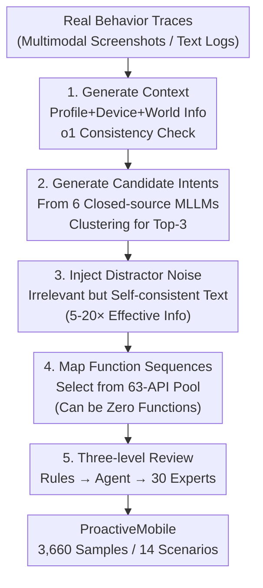

# ProactiveMobile: A Comprehensive Benchmark for Boosting Proactive Intelligence on Mobile Devices

**Conference**: CVPR 2026  
**Paper**: [CVF Open Access](https://openaccess.thecvf.com/content/CVPR2026/html/Kong_ProactiveMobile_A_Comprehensive_Benchmark_for_Boosting_Proactive_Intelligence_On_Mobile_CVPR_2026_paper.html)  
**Code**: https://github.com/xiaomi-research/proactive-mobile  
**Area**: Agent / Multimodal VLM  
**Keywords**: Proactive Intelligence, Mobile GUI Agent, Benchmark, Function Calling, Intent Inference

## TL;DR
Addressing the limitations of current mobile agents as passive command executors, this paper proposes ProactiveMobile—a large-scale benchmark that formalizes "proactive intelligence" as "inferring potential user intent from 4D device context and generating executable function sequences" (3,660 multi-intent samples / 14 scenarios / 63 APIs). Equipped with objectively evaluable SR/FTR metrics, it demonstrates that proactivity is a learnable capability currently missing in MLLMs (fine-tuned Qwen2.5-VL-7B achieves a 20.82% success rate, surpassing o1's 17.02%).

## Background & Motivation

**Background**: Driven by MLLMs, mobile GUI agents can understand interfaces, interact via dialogue, and perform multi-step task planning. However, they remain stuck in a "reactive" paradigm—essentially passive executors of direct commands. Users must bear the full cognitive burden of "identifying needs → articulating goals," while agents serve only as advanced tools.

**Limitations of Prior Work**: The next step is "proactive intelligence"—where agents anticipate needs and initiate actions. However, this direction is bottlenecked by the lack of benchmarks. Existing proactive agent benchmarks (ProactiveAgent, FingerTip-20K) have three major flaws: ① **Oversimplified tasks**—using abstracted context and assuming a "single correct action" per scenario, ignoring the inherent one-to-many nature of user preferences; ② **Coarse evaluation**—relying on binary reward models (unable to distinguish "partially correct" from "entirely wrong") or cosine similarity (measuring semantic relevance rather than functional correctness and executability); ③ **Non-executable outputs**—producing natural language suggestions that lack a direct path to on-device execution.

**Key Challenge**: Proactive suggestions are inherently **one-to-many mappings** (the same context can correspond to multiple reasonable actions), which old benchmarks collapse into one-to-one mappings. Furthermore, natural language suggestions are **subjective and non-executable**, making evaluation neither objective nor practical.

**Goal**: Construct a proactive intelligence benchmark that reflects real-world complexity, supports objective executable evaluation, and bridges the gap between "suggestion" and "execution."

**Core Idea**: Reformulate the proactive intelligence task as "4D Device Context → Executable Function Sequence." By using a unified pool of 63 APIs, vague natural language intents are anchored into structured, objectively scorable function calls, and one-to-many labeling is employed to acknowledge the subjective diversity of proactivity.

## Method

ProactiveMobile is not a model but a suite comprising a **benchmark + task definition + data production pipeline + evaluation protocol**. It addresses how to transform "proactively recommending useful actions to users" into a learnable task with real-world complexity and objective scoring.

### Overall Architecture

The input is the 4D device context at a "decision moment"—User Profile ($U$), Device State ($D$), World Information ($W$), and Behavior Trace ($B$). The model outputs an "intent + function sequence" pair $(\hat{I}, \hat{F})$, where $\hat{F}$ is an executable sequence selected from a predefined function pool $F$. The task is formalized as:

$$T = \{(I_k, F_k)\}_{k=1}^{a} = \text{Predict}(U, D, W, B)$$

Crucially, the ground-truth is a **set** $T$ (1–3 valid intent-function pairs per sample). A model prediction $(\hat{I}, \hat{F})$ is correct if it matches any pair in the set. This one-to-many design distinguishes this benchmark from previous work. When no action is required, $\hat{F}=\varnothing$ (no-recommendation logic).

The data production follows a multi-stage pipeline: starting with real behavior traces, using multiple closed-source models to generate context/intents, injecting distractor noise, and mapping to function sequences, followed by a three-level review.

### Key Designs

**1. Task Formalization of 4D Context + One-to-Many Function Sequences: Making "Proactivity" Scorable**

This design directly addresses the "oversimplification + non-executability" of previous work. Input signals are categorized into four dimensions: **User Profile** (basic info, long-term habits, personal preferences), **Device State** (hardware, battery, network, location, notifications), **World Information** (weather, time, holidays), and **Behavior Trace** (temporal sequence of user-device interactions). The first three are expressed in natural language, while the behavior trace can use screenshot sequences for multimodal signals.

The output is strictly constrained to $(\hat{I}, \hat{F})$, where $\hat{F} \subseteq F$ is non-empty only if $\hat{I}$ is executable. The prediction is correct if $(\hat{I}, \hat{F}) \in T$. This ensures that subjective natural language suggestions are anchored by function calls, transforming evaluation from "subjective text matching" to "objective structural matching."

**2. Multi-Model Collaborative Data Pipeline + Noise Injection: Generating High-Complexity Samples**

The pipeline uses five steps: ① Claude-Sonnet-4, Gemini-2.5-Pro, and GPT-5 generate 4D contexts, with o1 performing reasonableness checks. ② 6 SOTA closed-source MLLMs simulate potential intents, which are then clustered by Gemini-2.5-Flash to extract Top-3 representative intents. ③ **Distractor Noise Injection**: Irrelevant but self-consistent noise (5–20× the volume of effective information) is added to force the model to identify relevant signals. ④ Claude-Sonnet-4 maps intents to function sequences. ⑤ Three-level review.

**3. Three-Level Review + Three-Tier Difficulty Classification: Ensuring Quality and Discriminability**

Quality is ensured via **Rule Filtering**, **Agent Evaluation** (checking for authenticity, naturalness, and coherence), and **Expert Review** (30 trained annotators verifying factual accuracy and feasibility). Each sample requires at least 2 out of 3 annotators to agree.

Samples are classified into three levels based on the performance of 5 strong models: **L1 Easy** (4–5 correct), **L2 Mid** (2–3 correct), and **L3 Hard** (0–1 correct). Manual evaluation by 5 PhD researchers showed >95% consistency with this automated grading.

**4. SR / FTR Dual Metrics + Best-Match Selection Protocol: Tailored for One-to-Many Scenarios**

The benchmark uses two core metrics: **Success Rate (SR)** (higher is better), where Gemini-2.5-Pro acts as a judge to determine functional equivalence between a prediction and any ground-truth; and **False Trigger Rate (FTR)** (lower is better), measuring incorrect triggers when no action was required:

$$\text{FTR} = \frac{N_{ft}}{N_{no\text{-}action}}$$

The **Best-Match Selection Protocol** handles the one-to-many mapping: Phase 1 prioritizes perfect functional equivalence; Phase 2 (for failures) uses the ground-truth with the highest F1 score (treating sequences as unordered sets of function names) for further analysis.

## Key Experimental Results

Evaluation compares closed-source SOTA MLLMs with fine-tuned models. 8,876 training samples were used for full-parameter SFT on Qwen2.5-VL-7B-Instruct and MiMo-VL-7B-SFT-2508.

### Main Results (Test Set Avg, %)

| Model | SR↑ | FTR↓ | Description |
|------|-----|------|------|
| GPT-4o | 6.60 | 65.32 | Closed-source, high FTR |
| Gemini-2.5-Pro | 9.62 | 74.98 | Closed-source |
| GPT-5 | 11.37 | 39.20 | Strong closed-source |
| o1 | 17.02 | 14.09 | **Strongest closed-source**, low FTR |
| Qwen2.5-VL-7B-Instruct (Original) | 1.61 | 67.62 | Pre-finetuning baseline |
| **Qwen2.5-VL-7B + Proactive** | **20.82** | 13.76 | **Best Overall**, surpasses o1 |
| MiMo-VL-7B-SFT + Proactive | 13.47 | 46.91 | Post-finetuning |

**Key Conclusion**: Fine-tuning on this benchmark successfully unlocks proactive capabilities, with Qwen improving from 1.61% to 20.82%. specialized training is essential; even the strongest general-purpose models cannot be used out-of-the-box for proactivity.

### Ablation Study (Output Format, All splits, %)

| Training Strategy | SR↑ | FTR↓ | Description |
|----------|-----|------|------|
| Func. Only | 9.18 | 93.16 | Exploding FTR, random triggering |
| **Rec.+Func. (Ours)** | **20.82** | 13.76 | Rec. text + Function; highest SR |
| Think+Func. | 6.36 | 93.06 | Adding "think" step worsened results |
| Think+Rec.+Func. | 8.02 | 2.06 | Very low FTR but massive SR drop (overly conservative) |

### Key Findings
- **Output format is a decisive variable**: Generating a natural language recommendation before the function sequence (Rec.+Func.) provides an "intent anchor," significantly improving SR and lowering FTR.
- **Multimodality is the core bottleneck**: Optimal model performance on text tasks (SR 26.04%) far exceeds multimodal tasks (SR 15.61%). Robust visual understanding remains a major weakness for mobile-side proactive intelligence.
- **Limited but reasonable OOD generalization**: Fine-tuned Qwen still leads in unseen scenarios (Logistics, Smart Home) with 20.31% SR, though absolute values remain low.
- **Deployment Gap**: Even the best model achieves only ~21% SR, highlighting that proactive intelligence is far from ready for production deployment.

## Highlights & Insights
- **Engineering subjective suggestions into objective function calls**: Using a 63-API pool and an LLM judge bypasses the subjectivity trap of natural language evaluation.
- **One-to-many labeling + Best-Match protocol**: This acknowledges user preference diversity and achieves a balance between strictness and fairness.
- **Noise injection modeling real-world information overload**: This effectively trains model robustness against the dense context found on real devices.
- **Rec.+Func. > Pure Func.**: Evidence suggests that articulating intent before execution is more stable for proactive agents.

## Limitations & Future Work
- **Dependency on closed-source models**: The benchmark distribution inherits the biases of the models used for generation (Claude/GPT/Gemini).
- **Absolute success rates remain low**: A ~21% SR is insufficient for deployment, marking the task as an open challenge.
- **Multimodal grounding**: Visual information sometimes hinders performance; future work must focus on grounding models in noisy real-world GUI screenshots.

## Related Work & Insights
- **vs. ProactiveAgent / FingerTip-20K**: Upgrades from single-action assumptions and subjective evaluation to one-to-many mapping and objective FTR/SR metrics.
- **vs. Reactive Mobile GUI Agents**: Moves beyond passive command execution to autonomous need anticipation.

## Rating
- **Novelty**: ⭐⭐⭐⭐⭐ Formalizing proactive intelligence as a "4D Context → Multi-Intent Function Sequence" task is pioneering.
- **Experimental Thoroughness**: ⭐⭐⭐⭐ Comprehensive coverage of difficulty/modalities/OOD; however, lacks deeper ablation on specific context dimensions.
- **Writing Quality**: ⭐⭐⭐⭐ Rigorous definitions of tasks and protocols.
- **Value**: ⭐⭐⭐⭐⭐ Provides a much-needed training and evaluation foundation for proactive mobile agents.

<!-- RELATED:START -->

## Related Papers

- [\[CVPR 2026\] GUI-CEval: A Hierarchical and Comprehensive Chinese Benchmark for Mobile GUI Agents](gui-ceval_a_hierarchical_and_comprehensive_chinese_benchmark_for_mobile_gui_agen.md)
- [\[ICLR 2026\] FingerTip 20K: A Benchmark for Proactive and Personalized Mobile LLM Agents](../../ICLR2026/llm_agent/fingertip_20k_a_benchmark_for_proactive_and_personalized_mobile_llm_agents.md)
- [\[ICLR 2026\] MCPMark: A Benchmark for Stress-Testing Realistic and Comprehensive MCP Use](../../ICLR2026/llm_agent/mcpmark_a_benchmark_for_stress-testing_realistic_and_comprehensive_mcp_use.md)
- [\[CVPR 2026\] OS-Oracle: A Comprehensive Framework for Cross-Platform GUI Critic Models](os-oracle_a_comprehensive_framework_for_cross-platform_gui_critic_models.md)
- [\[ICLR 2026\] SMAN-Bench: A Cross-System Benchmark for Mobile Agents under Single- and Multi-path, Ambiguous, and Noisy Tasks](../../ICLR2026/llm_agent/sman-bench_a_cross-system_benchmark_for_mobile_agents_under_single-_and_multi-pa.md)

<!-- RELATED:END -->
