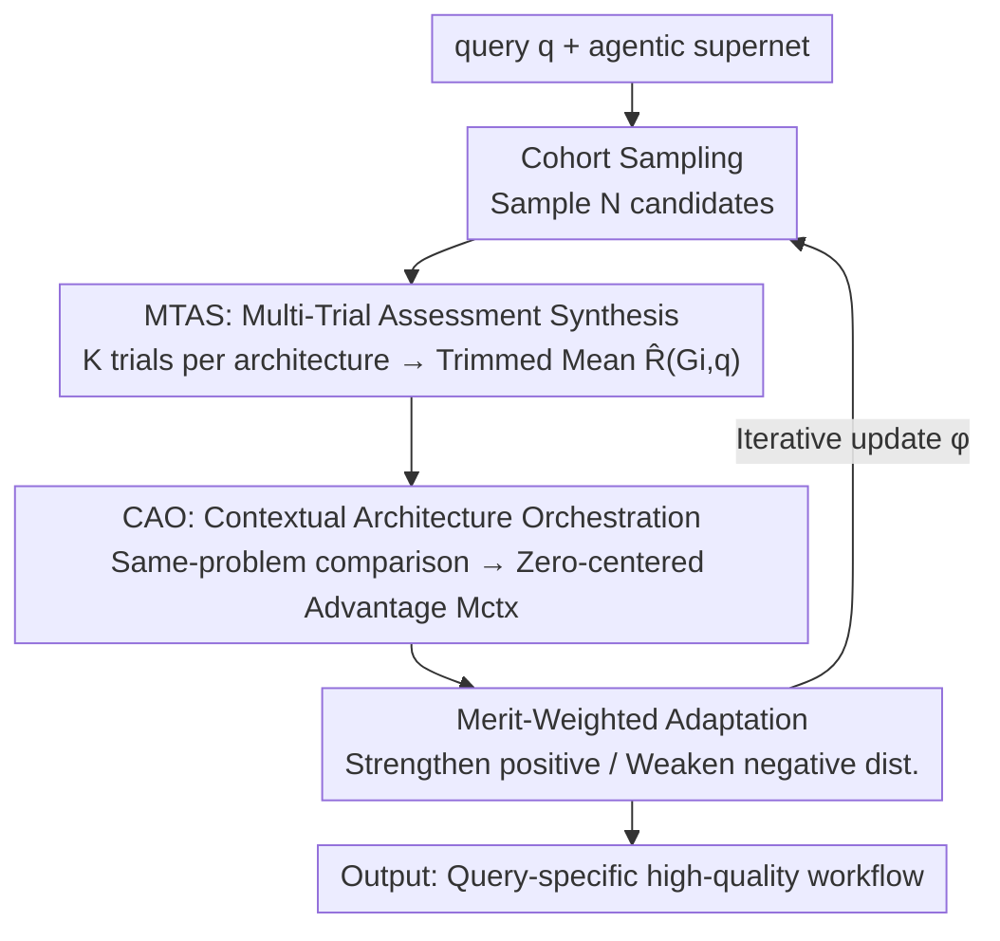

# RAAS: LLM Agentic System Architecture Search with GRPO

**Conference**: CVPR 2026  
**Paper**: [CVF Open Access](https://openaccess.thecvf.com/content/CVPR2026/html/Yang_RAAS_LLM_Agentic_System_Architecture_Search_with_GRPO_CVPR_2026_paper.html)  
**Code**: https://github.com/ridlog/raas  
**Area**: Agent  
**Keywords**: Multi-Agent Architecture Search, Agentic Supernet, Group Relative Policy Optimization, Evaluation Stability, GRPO

## TL;DR
RAAS introduces the concept of "group relative evaluation" into agentic supernet architecture search: multiple candidate architectures compete on the **same problem** (CAO), with each architecture undergoing **multiple independent trials to calculate a trimmed mean** (MTAS). By using zero-centered relative advantage signals to update the generative distribution, it decouples "architecture quality" from "problem difficulty/execution randomness," consistently outperforming the strongest baseline MaAS (average +5.41) across six benchmarks including MATH, HumanEval, and GAIA.

## Background & Motivation

**Background**: LLM Multi-Agent Systems (MAS) rely on the collaboration of multiple agents to solve complex tasks, but the manual design of agent roles, interaction patterns, and decision protocols is costly. A recent paradigm in automation is the **Agentic Supernet** (e.g., MaAS): instead of finding a "one-size-fits-all" fixed workflow, it optimizes a **probabilistic architecture space** $\mathcal{A}=\{\pi, O\}$ to dynamically sample query-specific workflows.

**Limitations of Prior Work**: Methods like MaAS inherit a fundamental flaw when **evaluating candidate architectures**—they directly use the **absolute score** $R(G,q)$ of a sampled architecture on a specific problem as the learning signal. This leads to two types of instability: (1) **Difficulty entanglement**—weak architectures may appear strong by achieving high scores on simple problems, while strong architectures appear weak on difficult problems; (2) **Execution variance**—agentic workflows involve sampling and intermediate decision randomness, where a single execution may be inflated by a lucky path or deflated by an accidental failure.

**Key Challenge**: The "intrinsic quality of the architecture" in the search signal is contaminated by two exogenous factors: "problem difficulty" and "single-run execution noise." This causes simple problems to inflate low-quality designs and difficult problems to obscure high-quality ones, destabilizing search dynamics.

**Goal**: Decomposition into two sub-problems—Q1: How to decouple intrinsic architecture quality from problem difficulty? Q2: How to obtain a stable evaluation reflecting **consistent capability** rather than a single-run illusion?

**Key Insight**: Evaluation should not ask "how well did this architecture perform" (absolute), but "how much better is it than its peers on the same task" (relative). This aligns with the "intra-group peer comparison" logic of GRPO/SCST—transferring it from RL training to the evaluation phase of architecture search.

**Core Idea**: Use "group relative advantage on the same problem + multi-trial statistical aggregation" instead of "single-run absolute scores" as the update signal for the supernet.

## Method

### Overall Architecture
RAAS builds a **closed-loop search process** on top of the MaAS agentic supernet: for each query $q$, it samples a cohort of $N$ candidate architectures from the distribution; each architecture runs $K$ independent trials on the **same problem**, with MTAS aggregating result to a robust capability estimate $\hat R(G_i,q)$; CAO uses the cohort's average capability as a baseline to calculate a zero-centered "contextual advantage" $M_{ctx}$ for each architecture; finally, this advantage is used for a merit-weighted update of the generative distribution, strengthening positive-advantage architectures and weakening negative ones. The supernet formalization follows MaAS: given activation operator sets $V_l$ at each layer, the joint probability is $p(G)=\prod_{l=1}^{L}\prod_{O\in O}\pi_l(O)^{\mathbb{I}_{O\in V_l}}$, and the goal is to learn a query-conditional distribution $P(G|q)$ to maximize the cost-adjusted utility $U_\lambda(G;q)=U(G;q,a)-\lambda C(G;q)$.

> ⚠️ While the title mentions "with GRPO," the text does not directly apply a loss named GRPO; it borrows the core idea of **group relative, zero-centered advantage** from GRPO/SCST, implemented as CAO (peer comparison) + MTAS (multi-trial aggregation). It is GRPO-style rather than literal GRPO training.

### Key Designs

**1. Contextual Architecture Orchestration (CAO): Decoupling Difficulty via Same-Problem Peer Comparison**

Addressing "difficulty entanglement": Instead of asking for absolute scores, CAO runs all candidates in a cohort $C_q=\{G_1,\dots,G_N\}$ on the **same problem** $q$, first calculating a contextual baseline $\bar R_{ctx}(q)=\frac{1}{N}\sum_{i=1}^{N}\hat R(G_i,q)$—this baseline naturally absorbs "how hard this problem is," as difficult problems lower the scores of all peers simultaneously. The **contextual advantage** is then the deviation from the baseline: $M_{ctx}(G_i,q)=\hat R(G_i,q)-\bar R_{ctx}(q)$. This is a **zero-centered** signal where $M_{ctx}>0$ indicates performance superior to peers in the current context, and $<0$ indicates inferior performance; problem difficulty is canceled out by the baseline. The authors provide a variance decomposition $\mathrm{Var}[\hat R_i]=\mathrm{Var}[\bar R_{ctx}(q)]+\mathrm{Var}[M_i]+2\mathrm{Cov}[\bar R_{ctx}(q),M_i]$: the first term represents context fluctuations filtered by CAO, leaving the second term as the desired architecture quality signal.

**2. Multi-Trial Assessment Synthesis (MTAS): Reducing Execution Variance via Trimmed Aggregation**

Addressing "execution variance": MTAS does not rely on a single run. For each $G_i$ and $q$, it instantiates $K$ **independent** workflows $\{R^{(1)},\dots,R^{(K)}\}$ (independent random seeds, agent initializations, and intermediate decisions), then aggregates them using a synthesis function $\hat R(G_i,q)=\Phi(\{R^{(k)}(G_i,q)\}_{k=1}^K)$. $\Phi$ is the **trimmed mean**—averaging after discarding the highest and lowest $\alpha$ proportion of trials, making it robust to rare extreme paths while preserving central tendencies. By the Law of Large Numbers, the estimation variance decreases as $\mathrm{Var}[\hat R]\propto \sigma^2/K_{\text{eff}}$ as $K$ increases. CAO provides the context of "who to compare with," and MTAS provides "trustworthy scores"—the two must be linked: CAO alone with jittery scores produces jittery advantages; MTAS alone produces stable scores but still includes problem difficulty.

**3. Merit-Weighted Adaptation: Backpropagating Advantages to Operators**

With a stable and difficulty-agnostic $M_{ctx}$, the supernet is updated by distributing the advantage across operators using influence weights: the update for a single architecture is $\Delta\phi(G_i;q)=\omega_i(\phi)\cdot M_{ctx}(G_i,q)$, where $\omega_i(\phi)=\nabla_\phi\log p(G_i;\phi)=\sum_{l=1}^{L}\sum_{O\in V_{i,l}}\nabla_\phi\log\pi_l(O)$ quantifies the contribution of each activated operator. The aggregated cohort update is $\Theta_{RAAS}(\phi;q)=\frac{1}{N}\sum_{i=1}^{N}\nabla_\phi\log p(G_i;\phi)\cdot M_{ctx}(G_i,q)$, iterated as $\phi\leftarrow\phi+\eta\cdot\Theta_{RAAS}(\phi;q)$. Since $\sum_i M_{ctx}(G_i,q)=0$, the update naturally balances "strengthening good patterns / suppressing bad patterns" without an extra baseline adjustment; this is isomorphic to the zero-centered advantage in GRPO.

### Loss & Training
The supernet parameters are optimized using the multi-domain data layout (math, reasoning, code, QA) following MaAS; the base LLMs are GPT-4o-mini and Qwen-2.5-72B. The key hyperparameters are cohort size $N$ and trial count $K$, with $N{=}5, K{=}5$ (25 runs per query) identified as the cost-effectiveness sweet spot.

## Key Experimental Results

### Main Results
Six benchmarks spanning mathematical reasoning (MATH/GSM8K/MultiArith), code generation (HumanEval/MBPP), and multi-step tool use (GAIA). Representative results with GPT-4o-mini (Accuracy %, gain relative to Vanilla in brackets, "vs MaAS" indicates the increment over the strongest baseline):

| Benchmark | Vanilla | MaAS (Strongest Baseline) | RAAS (Ours) | vs MaAS |
|------|---------|------------------|--------------|---------|
| MATH | 46.30 | 52.08 | **60.87** | +8.79 |
| GSM8K | 87.45 | 91.84 | **95.16** | +3.32 |
| HumanEval | 87.08 | 92.23 | **96.31** | +4.08 |
| MBPP | 71.83 | 78.71 | **84.18** | +5.47 |
| GAIA (Avg) | 3.98 | 18.06 | **20.84** | +2.78 |

The average **Gain** across six benchmarks relative to MaAS is **+5.41**. Conclusions are consistent with Qwen-2.5-72B (MATH 60.14, HumanEval 95.96). On GAIA, RAAS ranks first across Level-1/2/3 with scores of 29.53 / 25.32 / 7.68 respectively.

### Ablation Study
Ablations were performed by incrementally adding modules (Fig.5, values represent qualitative trends as original data were in bar charts):

| Configuration | Key Metric Trend | Description |
|------|--------------|------|
| MaAS Baseline | Lowest | Single evaluation with absolute score |
| MaAS + Entropy Reg. | Slight Increase | Exploration regularization added, but difficulty entanglement remains |
| RAAS (CAO only, no MTAS) | Moderate | Peer comparison exists but execution variance is unrefined |
| Full RAAS (CAO + MTAS) | Highest | Synergy between mechanisms, best across all benchmarks |

### Key Findings
- **Removing CAO** drops performance near MaAS levels—contextual baselines are critical for removing difficulty entanglement; **removing MTAS** reintroduces execution noise and lowers final values. Both are required for optimal results.
- **Hyperparameter Sensitivity**: On MATH, accuracy rises with $N$, saturating at $N\approx 6$ (from $54.12 \to 61.24$ with $K{=}5$). When $N$ is small, increasing $K$ has limited returns due to unstable baselines. For $N\ge5$, increasing $K$ to 5 yields a +4.45 improvement in reliability. $N$ enhances peer diversity and stabilizes $\bar R_{ctx}$, while $K$ filters execution stochasticity.
- **Value**: On MATH, RAAS achieves 60.87% accuracy at \$0.31/query, which is an **8.8 point improvement and 6% cost saving** compared to MaAS—more accurate architecture selection avoids redundant exploration and premature convergence.
- **Convergence**: RAAS surpasses MaAS within 2–3 checkpoints, showing a near-monotonic trajectory with narrow confidence bands and a higher plateau.

## Highlights & Insights
- **Migration of "Intra-group Relative Advantage" from RL to Architecture Search**: While GRPO/SCST was designed for zero-centered advantages in sequence generation, this paper recognizes that agentic supernet evaluation suffers from "absolute score contamination" and provides a clean cross-domain application of the idea.
- **CAO and MTAS as Orthogonal Pillars**: One addresses "who to compare with" (task difficulty), the other addresses "whether to trust this score" (execution variance). Both are essential, as confirmed by the theoretical sanity checks of variance decomposition and the Law of Large Numbers.
- **Trimmed Mean as a Low-Cost Robust Choice**: Unlike training a critic model, trimmed aggregation introduces no additional learnable components or significant compute while resisting extreme trials—this "robust evaluation without critic" is transferable to any search scenario with stochastic execution.
- **Improved Cost-Efficiency**: Stable signals lead to fewer search detours, illustrating how "evaluation quality improvements feed back into search efficiency."

## Limitations & Future Work
- **Lack of Multi-turn Interaction Validation**: The authors acknowledge that most benchmarks involve single-turn reasoning or coding, with only GAIA involving multi-step tool use. The effectiveness of CAO+MTAS in truly multi-turn interactive workflows requires broader validation.
- **Linear Cost Growth with $N\times K$**: While the $N{=}5, K{=}5$ sweet spot is only slightly more expensive than MaAS, 25 runs per query is significant for large models; adaptive allocation of $N$ and $K$ is proposed for future work.
- **Lack of Theoretical Convergence Proof**: Merit-weighted adaptation is currently empirically effective; proving its convergence theoretically is listed as a future task.
- **Title vs. Method Discrepancy**: The "with GRPO" title might lead readers to expect a standard GRPO training pipeline, whereas it is actually a GRPO-style evaluation mechanism.

## Related Work & Insights
- **vs MaAS (Direct Baseline / Agentic Supernet)**: MaAS innovated by shifting from fixed workflows to architecture distributions, but evaluation remained absolute. By changing the evaluation signal (absolute to relative, single to multi-trial), RAAS achieves a +5.41 improvement, suggesting "evaluation signal quality" is an undervalued bottleneck.
- **vs AFlow / AgentSquare / ADAS / GPTSwarm**: These systems innovate in search algorithms or design spaces but share the vulnerability of "absolute score evaluation." RAAS's contribution is orthogonal and theoretically stackable.
- **vs GRPO / SCST (Relative Evaluation in RL)**: This work borrows the zero-centered advantage idea but adapts it from "token sequences" to "agent architectures," adding MTAS specifically to handle the execution variance inherent in agentic workflows.

## Rating
- Novelty: ⭐⭐⭐⭐ Applying GRPO-style relative evaluation to agentic supernets is a clear, clever migration and extension of existing ideas.
- Experimental Thoroughness: ⭐⭐⭐⭐ Six benchmarks, two backbones, ablations, and cost analysis are complete, though multi-turn scenarios are limited to GAIA.
- Writing Quality: ⭐⭐⭐⭐ Clear mapping between problems and mechanisms with theoretical sanity checks, though the "GRPO" title may cause literal misunderstanding.
- Value: ⭐⭐⭐⭐ Stable improvements achieved by simply swapping the evaluation signal provide direct utility for researchers in agentic architecture search.

<!-- RELATED:START -->

## Related Papers

- [\[ACL 2026\] MAGMA: A Multi-Graph based Agentic Memory Architecture for AI Agents](../../ACL2026/llm_agent/magma_a_multi-graph_based_agentic_memory_architecture_for_ai_agents.md)
- [\[CVPR 2026\] HAVEN: Hierarchical Long Video Understanding with Audiovisual Entity Cohesion and Agentic Search](haven_hierarchical_long_video_understanding_with_audiovisual_entity_cohesion.md)
- [\[ICLR 2026\] An Information Theoretic Perspective on Agentic System Design](../../ICLR2026/llm_agent/an_information_theoretic_perspective_on_agentic_system_design.md)
- [\[ACL 2026\] BAPO: Boundary-Aware Policy Optimization for Reliable Agentic Search](../../ACL2026/llm_agent/bapo_boundary-aware_policy_optimization_for_reliable_agentic_search.md)
- [\[ACL 2026\] Robust Tool Use via Fission-GRPO: Learning to Recover from Execution Errors](../../ACL2026/llm_agent/robust_tool_use_via_fission-grpo_learning_to_recover_from_execution_errors.md)

<!-- RELATED:END -->
