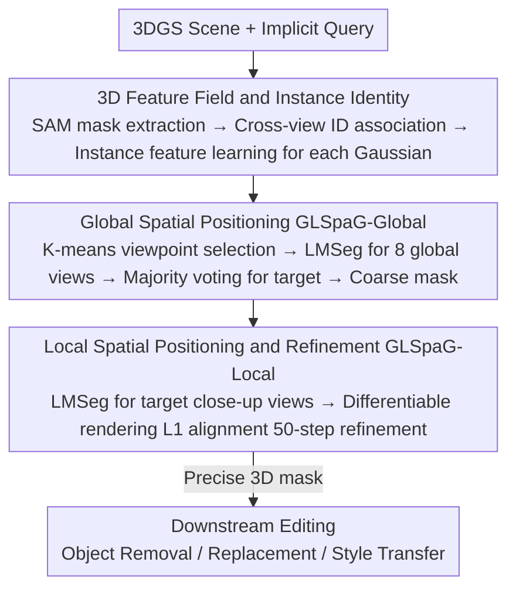

# REALM: An MLLM-Agent Framework for Open World 3D Reasoning Segmentation and Editing on Gaussian Splatting

**Conference**: CVPR 2026  
**arXiv**: [2510.16410](https://arxiv.org/abs/2510.16410)  
**Code**: [https://ChangyueShi.github.io/REALM](https://ChangyueShi.github.io/REALM)  
**Area**: LLM Agent / 3D Vision  
**Keywords**: 3D Reasoning Segmentation, MLLM-Agent, 3D Gaussian Splatting, Global-to-Local Spatial Positioning, 3D Scene Editing

## TL;DR
The REALM framework is proposed, leveraging the reasoning capabilities of MLLMs through a global-to-local spatial positioning strategy to perform open-world 3D reasoning segmentation on 3DGS. It handles implicit instructions without 3D post-training, achieving 92.88% mIoU on LERF (surpassing baselines by over 40 percentage points) while supporting editing tasks such as object removal, replacement, and style transfer.

## Background & Motivation

**Background**: Enabling AI systems to understand complex human instructions and precisely locate target objects in 3D scenes is a fundamental capability for robotics and human-robot collaboration. Existing 3D open-vocabulary segmentation methods (e.g., LERF, LangSplat, GS-Grouping) can handle explicit category queries (e.g., "segment the cup") but perform poorly on implicit instructions requiring reasoning (e.g., "segment the object between the lamp and the book," "make the table tidier").

**Limitations of Prior Work**: (1) 3D segmentation methods lack reasoning capabilities—they are restricted to explicit keyword matching and cannot understand spatial relationships, semantic attributes, or common-sense reasoning; (2) 2D MLLMs, while skilled at reasoning, naturally lack 3D spatial understanding—directly inputting rendered views into MLLMs is highly sensitive to viewpoint selection, where different angles may yield contradictory results; (3) Existing attempts (e.g., ScanReason, ReasonGrounder) are limited by predicting bounding boxes or relying on top-down views, lacking precision and general applicability.

**Key Challenge**: MLLMs possess powerful 2D reasoning capabilities but lack 3D spatial perception. How can 2D reasoning results be stably lifted into 3D space to obtain precise segmentation masks without performing 3D-specific post-training on the MLLM?

**Goal**: To implement an open-world framework capable of understanding implicit reasoning instructions, requiring no 3D post-training, and generating precise 3D segmentation masks.

**Key Insight**: Using 3DGS as a high-fidelity proxy for the 3D world—it can render realistic novel views for MLLM interpretation; aggregating MLLM responses from different angles through a global-to-local two-stage multi-view reasoning strategy eliminates single-view sensitivity.

**Core Idea**: Render multiple views using 3DGS for MLLM reasoning, and obtain precise 3D masks through a two-stage strategy of global coarse positioning and local fine segmentation.

## Method

### Overall Architecture
REALM addresses an unavoidable mismatch: MLLMs can reason but only understand 2D images, while 3D segmentation methods match keywords but cannot reason. The solution is to use 3DGS as a "view factory"—rendering the 3D scene into photo-realistic images for the MLLM to perform 2D reasoning, then stably lifting the answers back to 3D. The pipeline consists of three components: first, learning instance features for each 3D Gaussian offline to build a 2D↔3D bridge; during inference, using a wrapper called LMSeg to pass "an image + a query" to the MLLM to obtain a bbox/category/explanation, which is converted to a 2D mask via SAM to look up target instance IDs; finally, using Global-to-Local Spatial Positioning (GLSpaG), where multiple wide views vote to identify the target for coarse segmentation, followed by close-up views to refine mask boundaries. Once the precise 3D mask is obtained, object removal, replacement, and style transfer are performed as subsequent operations on that set of Gaussians.

### Key Designs

**1. 3D Feature Field and Instance Identity: Translating "Selected 2D Regions" into "3D Gaussian Clusters"**

MLLM reasoning results naturally fall on a specific 2D view. To determine which 3D Gaussians the target corresponds to, REALM pre-learns an instance feature for each Gaussian instead of complex multi-view 3D fusion. SAM is used to extract 2D instance masks frame-by-frame, and a temporal propagation model associates masks of the same object across views, assigning consistent instance IDs as supervision. Each Gaussian $G_i$ carries a learnable feature $f_i \in \mathbb{R}^D$. During rendering, these are blended like color to produce a 2D feature map $F = \sum_i f_i \alpha_i \prod_{j<i}(1-\alpha_j)$, followed by a classifier to predict instance IDs: $\hat{id}(u,v) = \arg\max_k (CLS(F)_{u,v,k})$. Once trained, this bridge is bidirectional—a region selected by LMSeg in 2D immediately maps to the corresponding set of 3D Gaussians without any 3D post-training.

**2. Global Spatial Positioning (GLSpaG-Global): Suppressing "Viewpoint Stochasticity" via Multi-view Voting**

Passing a single rendered view to an MLLM yields results highly sensitive to the viewpoint. The global stage stabilizes this. First, K-means clustering is performed on training camera poses to obtain $N^{cluster}$ representative viewpoints (ensuring diversity). From these, $N^{global}=8$ views with the highest object counts are selected as global cameras (ensuring coverage). Each view runs LMSeg to produce target instance IDs, and the unique target is determined via majority voting: $ID^q = \arg\max_{c} |\{i: ID_i^q = c\}|$. The corresponding Gaussians are extracted from the 3D feature field to generate a coarse mask $M^{3D}$. Ablations confirm that the two steps—"Clustering for diversity + Top-K-ID for coverage"—are essential: single-view Qwen2.5-VL achieves only 0.78 mIoU, while global voting boosts it to 0.89.

**3. Local Spatial Positioning and Refinement (GLSpaG-Local): Refining Coarse Mask Boundaries via Close-ups**

Global voting identifies the target, but boundaries from distant views are often blurry. The local stage selects representative viewpoints containing the target instance ID as close-up views. Each close-up runs LMSeg to obtain a refined 2D mask $M_i^{2D\text{-Local}}$. Differentiable rasterization renders the current 3D mask $M^{3D}$ back to these local views to obtain $\hat{M}_i$, which is aligned using an L1 loss:

$$\mathcal{L}_{local} = \|\hat{M}_i - M_i^{2D\text{-Local}}\|_1$$

Only the 3D mask itself is optimized for 50 iterations (3.67s). This iteration count is a "sweet spot"—10 iterations are insufficient, while 500/1000 lead to overfitting; 50 iterations push mIoU from 0.89 to 0.95.

### Loss & Training
During the feature field training phase, a cross-entropy loss is used to align rendered instance IDs with SAM ground-truth IDs. The local refinement during inference utilizes the L1 loss mentioned above to align 3D rendered masks with LMSeg 2D masks for 50 steps. The entire framework requires no 3D-specific post-training; both the MLLM (Qwen-2.5-VL) and SAM are off-the-shelf pre-trained models.

## Key Experimental Results

### Main Results

| Dataset | Metric | REALM | Prev. SOTA | Gain |
|--------|------|-------|----------|------|
| LERF | mIoU | 92.88% | 44.82% (Gaga) | +48.06% |
| LERF | mBIoU | 90.12% | 42.37% (Gaga) | +47.75% |
| 3D-OVS | mIoU | 93.68% | 58.46% (GAGS) | +35.22% |
| 3D-OVS | mBIoU | 86.02% | 50.34% (GAGS) | +35.68% |
| REALM3D | mIoU | 82.30% | 65.55% (GS-Group) | +16.75% |
| REALM3D | mBIoU | 70.37% | 55.99% (GS-Group) | +14.38% |

Note: Comparisons are conducted under **implicit query** conditions. Baseline methods primarily rely on CLIP keyword matching and cannot effectively process reasoning-based implicit instructions.

### Ablation Study

| Configuration | mIoU | mBIoU | Note |
|------|------|-------|------|
| GS-Group (Baseline) | 0.32 | 0.30 | No reasoning ability |
| +Qwen2.5-VL | 0.78 | 0.77 | MLLM reasoning added but unstable |
| +Global Reasoning | 0.89 | 0.88 | Multi-view voting eliminates stochasticity |
| +Local Refinement | 0.95 | 0.94 | Boundary refinement |

Efficiency: Rendering speed is 354.72 FPS; total inference time <10s (Global MLLM 2.53s + Local MLLM 2.48s + Local Refinement 3.67s).

### Key Findings
- REALM's advantage in implicit queries is significantly pronounced (mIoU >48% over baseline on LERF), as baselines fail to handle reasoning-type instructions.
- Global camera sampling is critical: K-means clustering ensures diversity and Top-K-ID selection ensures object coverage.
- 50 iterations for local refinement is optimal—fewer (10) lack precision, while more (500+) lead to overfitting.
- A cluster count $N^{cluster}=24$ performs best; too few (2) provide insufficient coverage, while too many (128) introduce noise.

## Highlights & Insights
- Using 3DGS as a "view factory" is elegant—MLLMs excel at understanding photo-realistic 2D images, and 3DGS provides exactly that, making them naturally complementary.
- The global-to-local strategy acts as a coarse-to-fine spatial attention mechanism, reducing uncertainty from full-scene retrieval to local segmentation.
- The voting mechanism is simple yet effective, transforming high-variance single-view outputs into stable multi-view logic.
- The REALM3D benchmark (100+ scenes, 1444 prompt-mask pairs including implicit instructions) fills a gap in evaluating 3D reasoning segmentation.

## Limitations & Future Work
- Dependency on 3DGS reconstruction quality—if 3DGS produces texture loss or geometric errors, MLLM comprehension suffers.
- MLLM reasoning limits—failure may occur for extremely complex reasoning chains or highly abstract instructions.
- Inference latency due to multi-view processing (~8.68s total) makes real-time interaction difficult.
- Local refinement is optimized per-view; 3D masks may be less precise in areas not covered by selected local viewpoints.

## Related Work & Insights
- **vs LERF/LangSplat**: These embed CLIP features in radiance fields/3DGS, limiting them to explicit queries ("cup"); REALM breaks this via MLLM reasoning.
- **vs GS-Grouping/Gaga**: Based on contrastive learning for 3D instances, these are also limited to explicit vocabulary; REALM outperforms Gaga by 48% mIoU on implicit queries.
- **vs ReasonGrounder**: Conceptually similar but relies on top-down views and bounding boxes; REALM provides fine masks from any viewpoint.

## Rating
- Novelty: ⭐⭐⭐⭐ Innovative combination of MLLM-Agent + 3DGS with a clever spatial positioning strategy.
- Experimental Thoroughness: ⭐⭐⭐⭐⭐ Comprehensive evaluation across three benchmarks, detailed ablations, and multiple downstream tasks.
- Writing Quality: ⭐⭐⭐⭐ Clear motivation with powerful visualizations of viewpoint sensitivity.
- Value: ⭐⭐⭐⭐ Establishes the direction of 3D reasoning segmentation; the REALM3D benchmark provides long-term utility.

<!-- RELATED:START -->

## Related Papers

- [\[CVPR 2026\] Vinedresser3D: Towards Agentic Text-guided 3D Editing](vinedresser3d_towards_agentic_text-guided_3d_editing.md)
- [\[CVPR 2026\] SceneAssistant: A Visual Feedback Agent for Open-Vocabulary 3D Scene Generation](sceneassistant_a_visual_feedback_agent_for_openvoc.md)
- [\[CVPR 2026\] ModularAgent: A Task-Aware Modular Framework for Joint Optimization of Multimodal Large Language Models and World Models](modularagent_a_task-aware_modular_framework_for_joint_optimization_of_multimodal.md)
- [\[CVPR 2026\] RetouchIQ: MLLM Agents for Instruction-Based Image Retouching with Generalist Reward](retouchiq_mllm_agents_for_instruction-based_image_retouching_with_generalist_rew.md)
- [\[CVPR 2026\] Seeing as Experts Do: A Knowledge-Augmented Agent for Open-Set Fine-Grained Visual Understanding](seeing_as_experts_do_a_knowledge-augmented_agent_for_open-set_fine-grained_visua.md)

<!-- RELATED:END -->
