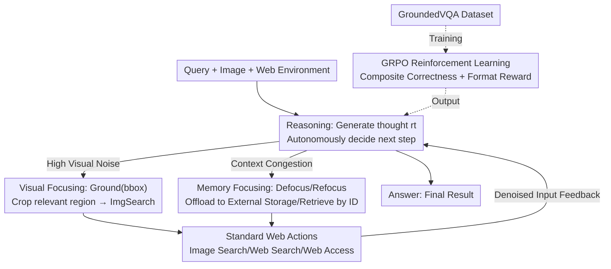

# ReFAct: Empowering Multimodal Web Agents with Visual and Context Focusing

**Conference**: CVPR 2026  
**Paper**: [CVF Open Access](https://openaccess.thecvf.com/content/CVPR2026/html/Wu_ReFAct_Empowering_Multimodal_Web_Agents_with_Visual_and_Context_Focusing_CVPR_2026_paper.html)  
**Code**: To be confirmed  
**Area**: Agent  
**Keywords**: Multimodal Web Agents, Visual Focusing, Grounding, External Memory, GRPO

## TL;DR
ReFAct enables multimodal web search agents to **actively manage cross-modal contexts**: it employs Grounding tools to crop highly relevant image regions to counter "visual noise," uses Defocus/Refocus external memory operations to compress and retrieve long text on demand to counter "retrieval noise," and is fine-tuned via GRPO reinforcement learning on a custom GroundedVQA dataset designed for high-noise scenarios. ReFAct-7B significantly outperforms RL agents of the same scale on high-noise benchmarks.

## Background & Motivation

**Background**: Text-based Web Search Agents (e.g., Search-R1, DeepResearcher) have successfully solved complex problems via "reasoning-retrieval" iterative loops. As the real world is rich in visual information, multimodal web agents (e.g., MMSearch-R1, WebWatcher) have emerged, equipping MLLMs with tools like image search, web browsing, and OCR.

**Limitations of Prior Work**: These multimodal agents **inherit the passive perception of the base MLLM**, encoding entire screenshots or full-page search results into the context without filtering. Two types of noise poison them: (1) **Visual Noise**: Irrelevant backgrounds and complex textures distract attention (e.g., an irrelevant building outside a window might cause the agent to search for the wrong landmark), establishing a "false factual basis" that derails subsequent reasoning. (2) **Retrieval Noise**: Redundant elements like ads and navigation bars in webpages dilute key information and overwhelm reasoning.

**Key Challenge**: An agent's attention is a finite resource, but passive perception "inputs everything," causing key evidence to be drowned by noise. This leads to both incorrect initial retrieval queries (due to visual noise) and long-range context explosions where reasoning is "suffocated" by irrelevant text (due to retrieval noise).

**Goal**: To empower agents with **active, cross-modal context management capabilities**, allowing them to actively focus on highly relevant image regions and regulate the information density of their working memory.

**Key Insight**: Treat "focusing" as a unified concept and explicitly define information filtering as an **action** within the agent's repertoire. This allows the agent to autonomously decide "where to look, what to remember, and when to retrieve" during reasoning, rather than being a passive receiver.

**Core Idea**: A triad of Reasoning + Focusing + Acting—where Visual Focusing (Grounding) addresses visual noise and Memory Focusing (Defocus/Refocus) addresses retrieval noise, working together to maintain high-fidelity working memory.

## Method

### Overall Architecture
ReFAct formalizes the interaction between the agent and the multimodal web environment as a sequential decision process: at each step $t$, it observes state $o_t$ and maintains a context history $H_t$. Unlike standard agents that passively stack all observations into $H_t$, ReFAct **expands the action space with explicit Focusing actions**, allowing the agent to actively manage visual attention and working memory load. A typical trajectory is: $\tau=(q, I_0,\dots, r_t, \text{Ground}(bbox), \text{ImgSearch}(I_{crop}),\dots, r_{t+k}, \text{Refocus}(id), r_{t+k+1}, \text{Answer})$—where thought $r_t$ drives the next move. Standard web actions and internal focusing operations are seamlessly interwoven, ensuring each external action is based on **actively organized, denoised** inputs. To train and evaluate this capability, the authors constructed the GroundedVQA dataset and used GRPO to train ReFAct-7B.

### Key Designs

**1. Visual Focusing (Grounding): Moving from Full-Image to Region-Specific Search**

To address visual noise, standard agents often use the entire image for reverse image search, which frequently misleads the retrieval due to background clutter. ReFAct introduces active Grounding: before executing an image search, the agent generates a $\text{Ground}(I_t, bbox)$ action, where $bbox=[x_1,y_1,x_2,y_2]$ specifies a target crop. The environment then uses the cropped $I_t[bbox]$ as the precise query. A critical design choice is **having the agent directly predict the bbox** rather than relying on a third-party detector. This avoids external detector bias and allows the grounding capability to be **jointly optimized** with the reasoning process (learning "when to crop" vs. "when it's redundant"). It transforms hard-to-identify tasks with small targets in cluttered scenes into solvable sub-problems.

**2. Memory Focusing (Defocus / Refocus): Regulating Context Density with Dual Memory**

To address retrieval noise and long-range context explosion, ReFAct distinguishes between a finite, high-value **active working memory** $H_t$ and an infinite **external memory** $M_t$. **Defocus**: When encountering information-dense but currently non-critical content (e.g., a long article), the agent offloads the raw content to $M_t$, keeping only a concise summary with evidence and a unique reference ID in $H_t$. **Refocus**: When subsequent reasoning requires details from offloaded content, the agent executes $\text{Refocus}(id)$ to **precisely retrieve** the original text from $M_t$ using the ID. This mechanism allows the agent to "remember the gist and check the details when needed," actively regulating working memory density.

**3. GroundedVQA Dataset: High-Noise Training and Evaluation Source**

Standard VQA datasets (e.g., OKVQA) often have highly salient target entities, allowing agents to succeed without deep visual understanding. GroundedVQA's core difference is **mandatory visual grounding**—questions are designed such that they cannot be answered without precise region localization. The construction follows a "map then sample" paradigm: using high-resolution cluttered scenes from SA-1B, Qwen3-VL-235B detects candidate entities and generates descriptions. These are filtered via Google Serper image search and secondary verification to find high-confidence **Grounded Entities**. Their text identities are then expanded into an image knowledge graph $G_I$ via web search and Jina Reader. QA pairs for Level-1 (single-entity reasoning) and Level-2 (cross-entity relational reasoning) are sampled from this subgraph. The training set uses **rejection sampling** via Qwen-2.5VL-32B (discarding questions solvable without the image) to filter out shortcuts.

**4. GRPO Reinforcement Learning + Composite Reward: Emerging Focusing Strategies**

To determine the optimal timing for focusing, the authors used Group Relative Policy Optimization (GRPO) to train ReFAct-7B end-to-end. For each query and image, GRPO samples a group of $G$ trajectories. The objective is $\mathcal{J}_{GRPO}(\theta)=\mathbb{E}_{q\sim D}\big[\frac{1}{G}\sum_{i=1}^{G}\frac{\pi_\theta(\tau_i|q,I)}{\pi_{\theta_{old}}(\tau_i|q,I)}\hat A_i\big]-\beta\mathbb{D}_{KL}(\pi_\theta\|\pi_{ref})$, where the advantage $\hat A_i$ is computed via relative normalization within the group. The composite reward is $R(\tau)=(1-\lambda)r_{acc}+\lambda r_{fmt}$, where $r_{acc}$ uses LLM-as-Judge for semantic equivalence and $r_{fmt}$ penalizes malformed tool calls. ⚠️ Note: The training phase **primarily optimizes visual grounding**, as visual noise is the more critical deficiency in current MLLMs; Defocus/Refocus was kept out of the RL loop to maintain training stability.

## Key Experimental Results

### Main Results
The base model is Qwen2.5-VL-7B-Instruct. GRPO training was conducted for 2 epochs on 8×A100 GPUs. Rewards and evaluations were judged by Gemini-2.5-pro. The metric is pass@1 (accuracy judged by LLM). The table below compares RL-trained agents:

| Model | Source | GroundedVQA L1 | GroundedVQA L2 | MMSearch | SimpleVQA | LiveVQA | Average |
|------|------|----------------|----------------|----------|-----------|---------|------|
| DeepEyes | Open | 0.184 | 0.179 | 0.281 | 0.463 | 0.168 | 0.255 |
| WebWatcher | Open | 0.372 | 0.232 | 0.491 | 0.543 | 0.512 | 0.430 |
| MMSearch-R1 | Open | 0.433 | 0.304 | 0.538 | 0.574 | 0.484 | 0.467 |
| **ReFAct-7B** | Open | **0.513** | **0.375** | 0.497 | 0.616 | 0.300 | 0.460 |

ReFAct-7B shows a **decisive lead** on the high-noise GroundedVQA benchmark while maintaining strong adaptability on low-noise datasets like SimpleVQA (0.616), indicating it does not "over-process" when grounding is unnecessary.

### Ablation Study
Success rate (%) on GroundedVQA when removing components ($\Delta$ indicates drop relative to the full model):

| Variant | Level-1 | $\Delta$ | Level-2 | $\Delta$ |
|------|---------|----------|---------|----------|
| ReFAct-7B (Full) | 51.3 | - | 37.5 | - |
| w/o GroundedVQA Data | 43.3 | -8.0 | 30.4 | -7.1 |
| w/o Memory Focusing | 49.4 | -1.9 | 33.9 | -3.6 |
| w/o Visual Focusing | 40.2 | -11.1 | 26.8 | -10.7 |

### Key Findings
- **Visual Focusing contributes the most**: Removing the Ground tool drops L1 performance by 11.1% and L2 by 10.7%, identifying it as the most critical component for filtering extreme visual noise.
- **Memory Focusing is useful but secondary**: Removing Defocus/Refocus only drops L1 by 1.9% and L2 by 3.6%, confirming that visual noise is the primary bottleneck in GroundedVQA.
- **GroundedVQA data is irreplaceable**: Training with only general VQA data leads to significant drops, suggesting that without dense noise scenarios, agents fail to learn "when to trigger active grounding."
- **Robustness to Visual Noise**: When categorizing targets by spatial size (smaller targets = higher noise), ReFAct-7B outperforms MMSearch-R1 by **+6.3%** in the **extreme noise region** (target <5%), whereas baselines degrade rapidly as targets shrink.
- **Plug-and-play depends on base grounding**: Applying the ReFAct framework to Qwen2.5-VL-72B yields a +0.111 gain on L1; however, gains for models with weaker internal grounding (e.g., Gemini-2.5-flash) are negligible or negative, indicating the framework relies on the model's ability to utilize the tools correctly.

## Highlights & Insights
- **Focusing as an explicit action**: Integrating visual and memory focusing into the Reasoning-Focusing-Acting loop is a clean implementation of "active context management."
- **Self-predicted bboxes**: Predicting bboxes directly within the agent eliminates external pipeline dependencies and allows "when to crop" to become a learned strategy.
- **Precise ID-based addressing**: Using summaries + unique IDs for external memory is more reliable than fuzzy vector retrieval, avoiding recall errors.
- **Honest trade-offs**: The authors admit that visual focusing can hurt performance on holistic tasks like LiveVQA by reducing search query richness.

## Limitations & Future Work
- **Training coverage**: Memory Focusing (Defocus/Refocus) was not fully optimized via RL due to stability issues; its full potential remains untapped.
- **Holistic understanding bottleneck**: ReFAct lags behind top closed-source models on low-noise benchmarks requiring global understanding (e.g., LiveVQA).
- **Reliance on base model**: The framework is only as good as the model's inherent grounding capability.
- **Data scale**: GroundedVQA's evaluation set is relatively small (261+56 samples), requiring larger-scale validation for statistical robustness.
- **Judge dependency**: Both rewards and evaluations rely on Gemini-2.5-pro, inheriting any potential biases from the judge.

## Related Work & Insights
- **vs. MMSearch-R1 / WebWatcher**: While these provide tools, they remain **passive perceptors**. ReFAct differentiates itself by making noise filtering an active action.
- **vs. ReAct**: ReFAct inserts a Focusing stage between Reason and Act, making context organization explicit.
- **vs. GUI Agents**: ReFAct focuses on "retrieval + reasoning" rather than GUI navigation (clicks/scrolls).
- **vs. Standard MLLMs**: While standard MLLMs suffer from attention dilution in cluttered scenes, ReFAct uses active retrieval for knowledge and active focusing for attention.

## Rating
- Novelty: ⭐⭐⭐⭐ Clear concept of "active context management"; the visual+memory focusing combination is innovative.
- Experimental Thoroughness: ⭐⭐⭐⭐ Extensive ablations and noise-level analysis, though evaluation sets are small.
- Writing Quality: ⭐⭐⭐⭐ Strong motivation and honest discussion of trade-offs.
- Value: ⭐⭐⭐⭐ Provides a reusable paradigm for noise-resistant multimodal agents and a valuable benchmark.

<!-- RELATED:START -->

## Related Papers

- [\[CVPR 2026\] WebGym: Scaling Training Environments for Long-Horizon Visual Web Agents with Realistic Tasks](webgym_scaling_training_environments_for_long-horizon_visual_web_agents_with_rea.md)
- [\[CVPR 2026\] Learning to Select Visual Tools from Experience](learning_to_select_visual_tools_from_experience.md)
- [\[CVPR 2026\] Experience Transfer for Multimodal LLM Agents in Minecraft Game](experience_transfer_for_multimodal_llm_agents_in_minecraft_game.md)
- [\[ICCV 2025\] Less is More: Empowering GUI Agent with Context-Aware Simplification](../../ICCV2025/llm_agent/less_is_more_empowering_gui_agent_with_context-aware_simplification.md)
- [\[CVPR 2026\] ORCA: Orchestrated Reasoning with Collaborative Agents for Document Visual Question Answering](orca_orchestrated_reasoning_with_collaborative_agents_for_document_visual_questi.md)

<!-- RELATED:END -->
