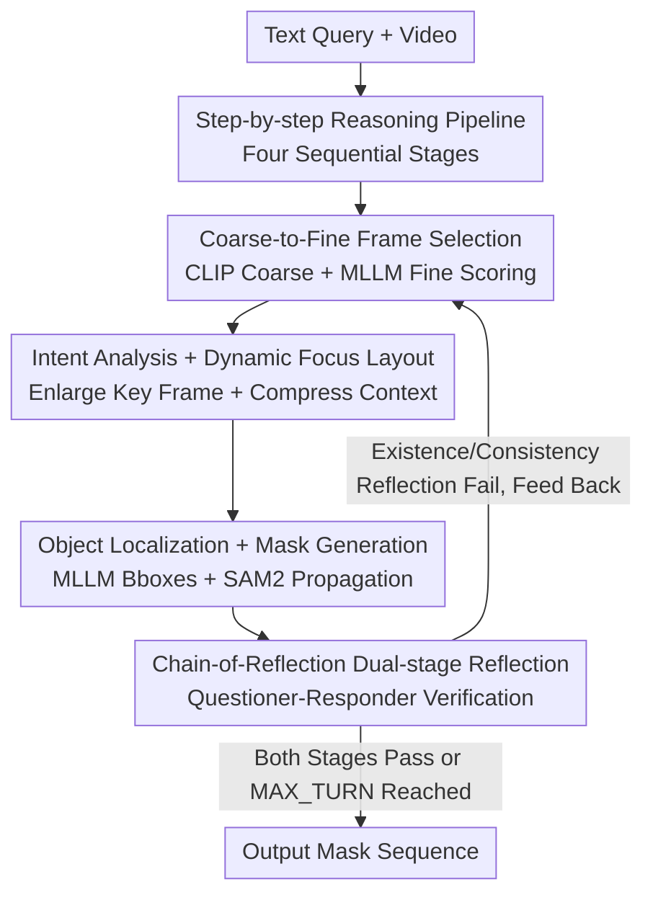

# Refer-Agent: A Collaborative Multi-Agent System with Reasoning and Reflection for Referring Video Object Segmentation

**Conference**: CVPR 2026  
**Paper**: [CVF Open Access](https://openaccess.thecvf.com/content/CVPR2026/html/Jiang_Refer-Agent_A_Collaborative_Multi-Agent_System_with_Reasoning_and_Reflection_for_CVPR_2026_paper.html)  
**Code**: To be confirmed  
**Area**: Agent / Video Understanding  
**Keywords**: Referring Video Object Segmentation, Zero-shot, Multi-agent, Reasoning-Reflection, Frame Selection

## TL;DR
Refer-Agent decomposes Referring Video Object Segmentation (RVOS) into a step-by-step reasoning pipeline of "frame selection → intent analysis → object localization → mask generation." It further integrates a dual-stage Chain-of-Reflection (Existence Reflection + Consistency Reflection) composed of a Questioner-Responder pair to alternate between reasoning and reflection for self-correction. Without any training and using only a 9B open-source MLLM, it outperforms SFT methods and GPT-4o-based zero-shot methods across five RVOS benchmarks.

## Background & Motivation
**Background**: Referring Video Object Segmentation (RVOS) aims to segment a specific target throughout a video based on a textual description. Current mainstream methods integrate Multimodal Large Language Models (MLLMs) into the RVOS pipeline by training a set of learnable semantic embeddings to bridge the MLLM and foundation segmentation models (SAM/SAM2) via end-to-end joint fine-tuning.

**Limitations of Prior Work**: This SFT paradigm suffers from two major drawbacks. First, both MLLMs and segmentation models are data-hungry, requiring massive multi-source datasets and computational resources for large-scale supervised fine-tuning. As MLLMs iterate rapidly with new architectures, repeating high-cost SFT for every new model is inefficient and impractical. Second, recent zero-shot methods, while training-free and flexible, merely string MLLMs, grounding models, and segmentation models into a "linear workflow." Each worker only focuses on its specific step without a self-correction mechanism, leading to error accumulation. Moreover, MLLMs are prone to hallucinations, often providing "confidently incorrect" answers in complex scenes.

**Key Challenge**: The SFT approach offers high precision but cannot keep pace with MMLM evolution; the zero-shot approach is flexible but significantly lags behind SFT in performance due to "linear workflows + no self-correction + MLLM hallucinations." An **efficient, training-free, and scalable paradigm** that approaches or exceeds SFT accuracy is needed.

**Goal**: Design an effective training-free multi-model collaboration mechanism that can reason through complex queries step-by-step while identifying and correcting hallucinations and error accumulation during the process.

**Key Insight**: It is observed that the poor performance of zero-shot methods stems from their "one-pass, no-look-back" nature. Adding a reflection loop to the collaborative pipeline—capable of verifying intermediate results and feeding feedback back for re-execution—can suppress hallucinations without fine-tuning any parameters.

**Core Idea**: A multi-agent system with alternating "reasoning-reflection" is proposed. The main pipeline performs step-by-step reasoning, while the Chain-of-Reflection uses Questioner-Responder pairs to verify and provide feedback, iterating until verification passes or a limit is reached.

## Method

### Overall Architecture
Given a text query $x_q$ and a video $x_v=\{f_t\}_{t=1}^{T}$, the goal is to output a sequence of masks for the referred target. Refer-Agent consists of two coupled components: a **step-by-step reasoning pipeline** (Frame Selection → Intent Analysis → Object Localization → Mask Generation) and a **dual-stage Chain-of-Reflection** that captures potential hallucinations and refines predictions. The system alternates between reasoning and reflection—if reflection fails, feedback is sent back to the corresponding stage of the pipeline—until both validation stages pass or the maximum turns (MAX_TURN, default 4) are reached.

### Key Designs

**1. Step-by-step Reasoning Pipeline: Decomposing RVOS into Four Controllable Stages**

Directly handing "one sentence → full-segment mask" to a single model often leads to total failure on complex queries with no way to locate specific errors. Refer-Agent uses a chain of agents to execute four steps: Frame Selection (sampling representative frames from dense video to reduce noise and cost), Intent Analysis (converting vague queries into discriminative expressions, e.g., mapping "person enjoying music" to "man in blue shirt"), Object Localization (MLLM providing bounding boxes for targets on key frames), and Mask Generation (using boxes and key frames as prompts for SAM2 to generate and propagate masks). This modularity allows intermediate products to be scrutinized and corrected individually.

**2. Coarse-to-Fine Text-Guided Frame Selection: Filtering for Diversity, Ranking for Relevance**

Traditional single-pass sampling often struggles to balance diversity and relevance. This method uses two steps: first, CLIP calculates the semantic similarity $S_{\text{CLIP}}$ between the query and each frame, dividing the video into $N$ segments and picking the highest-scoring frame from each to get $N$ representative frames ($N \gg K$). Then, these $N$ frames and the query are fed to an MLLM to score importance. The final top-$K$ frames are selected based on:
$$S_t = \alpha \cdot S^t_{\text{CLIP}} + \beta \cdot S^t_{\text{MLLM}}$$
(In implementation, $N=10, K=5, \alpha=0.3, \beta=0.7$). This considers both CLIP's coverage and MLLM's semantic judgment. Since frame selection can still fail in complex reasoning scenarios (e.g., query "who made the girl cry"), the subsequent reflection mechanism allows for multi-turn correction of these choices.

**3. Dynamic Focus Layout: Enlarging Key Frames, Compressing Context**

Reasoning only on a single key frame lacks temporal context, while feeding all sampled frames at equal resolution wastes computation and distracts the MLLM. Dynamic Focus Layout dynamically allocates a larger, higher-resolution area for the key frame (highest importance score) and compresses context frames into smaller, lower-resolution grid cells within the same image. The layout template is determined by the key frame index. This composite image allows the MLLM to focus on the primary target while maintaining temporal awareness to generate target expressions.

**4. Chain-of-Reflection: Dual-stage "Questioner-Responder" Self-Correction**

To prevent error propagation from initial stages, CoR introduces two stages of reflection. Each stage consists of a Questioner and a Responder generating a Q&A chain to verify results and provide feedback:

- **Existence Reflection (Stage 1)**: Examines frame quality regarding visibility (is the target clear in key frames?), completeness (do key frames cover all referred targets?), and optimality (are there better key frames among context frames?). If validation fails, feedback (e.g., "target car is occluded in key frame") triggers the frame selection agent to find better evidence.
- **Consistency Reflection (Stage 2)**: Verifies if predicted targets match the original query. The Questioner breaks the query into attribute sets and generates multiple-choice questions covering high-level concepts (category, state) and low-level details (appearance, spatial position). The Responder answers based on the key frame (where predicted targets are highlighted with bboxes). If consistency falls below a threshold (e.g., >30% targets inconsistent), a report is sent back for correction.

### Mechanism Example
For the query "Which vertebrate in the video is oviparous and covered in feathers?", frame selection picks several frames, and intent analysis identifies "a bird in a blue cage" and "a bird in a green cage." **Existence Reflection** asks if the key frames are optimal. The Responder realizes the current key frame only shows two birds, while the video contains three (two overlapping in the green cage). This failure triggers a re-selection of frames. After re-reasoning, **Consistency Reflection** verifies bird attributes against the query. Only after all checks pass is the final mask output.

## Key Experimental Results

### Main Results
Evaluated on 5 benchmarks (ReVOS, Ref-YouTube-VOS, MeViS, ReasonVOS, GroundMoRe) using Region Similarity $\mathcal{J}$, Boundary Accuracy $\mathcal{F}$, and their mean $\mathcal{J\&F}$. MLLM: Ovis2.5-9B, segmentation: SAM2. Training-free, using 8x NVIDIA 3090 GPUs.

| Method | Type | Ref-YT-VOS | MeViS | ReasonVOS | ReVOS | GroundMoRe |
|------|------|-----------|-------|-----------|-------|-----------|
| GLUS | SFT | 67.3 | 51.3 | 49.9 | 54.9 | — |
| RGA3 | SFT | 68.5 | 50.1 | 53.6 | 58.0 | — |
| VRS-HQ | SFT | 71.0 | 50.9 | — | 60.0 | — |
| AL-Ref-SAM2 | Zero-shot (GPT-4) | 67.9 | 42.8 | — | — | — |
| CoT-RVS | Zero-shot (GPT-4o) | — | 52.2 | 65.5 | 55.9 | — |
| **Refer-Agent** | Zero-shot (Ovis2.5-9B) | **71.3** | **54.7** | **69.8** | **61.3** | **33.4** |

(Values are $\mathcal{J\&F}$.) Training-free Refer-Agent leads all 5 benchmarks. It outperforms the strongest SFT methods on ReasonVOS by 16.2% and ReVOS by 1.3%. Compared to GPT-4o-based CoT-RVS, it improves by 5.4% on ReVOS and 4.3% on ReasonVOS.

### Ablation Study

| Config | $\mathcal{J\&F}$ | $\mathcal{J}$ | $\mathcal{F}$ | Description |
|------|------|------|------|------|
| Refer-Agent (full) | 69.8 | 67.0 | 72.7 | ReasonVOS Full Model |
| w/o Stage 1 (Existence) | 66.6 | 63.7 | 69.5 | -3.2 |
| w/o Stage 2 (Consistency) | 65.2 | 62.4 | 68.1 | -4.6 |
| w/o Stage 1 & Stage 2 | 64.5 | 61.8 | 67.2 | Pipeline only, -5.3 |

### Key Findings
- **Both reflection stages are essential**: Removing either stage drops $\mathcal{J\&F}$ by over 3%. Removing Consistency Reflection (Stage 2) hurts more than removing Existence Reflection (Stage 1).
- **Reflection turn sweet spot**: Performance increases from MAX_TURN 0 to 4 (64.5 → 69.8) but slightly decreases at 6 (69.3) while increasing latency, identifying 4 as the optimal balance for accuracy and efficiency.
- **Strong plug-and-play capability**: Swapping MLLMs shows immediate benefits without training. Using Qwen2.5-VL-7B in Refer-Agent surpasses the SFT-based RGA3 (55.5 vs 53.6 $\mathcal{J\&F}$).

## Highlights & Insights
- **Replacing SFT Data with Reflection Loops**: The core insight is that zero-shot RVOS bottlenecks are workflow-related rather than model-limited. Adding a closed feedback loop suppresses hallucinations and bridges the gap to SFT.
- **Categorizing Hallucinations**: Existence Reflection targets "evidence-level" errors (wrong frames), while Consistency Reflection targets "semantic-level" errors (mismatched attributes).
- **Dynamic Focus Layout**: A clever trick to balance context and focus by using a composite grid, which is transferable to other video tasks requiring MLLM attention on specific frames.
- **Training-free and Plug-and-play**: This naturally aligns with the rapid evolution of MLLMs, allowing immediate upgrades to the latest models—a feat SFT paradigms cannot achieve.

## Limitations & Future Work
- Heavy reliance on base MLLM zero-shot capabilities; performance ceiling is largely determined by the MLLM's grounding and reasoning power.
- Inference latency due to multi-turn reflection roughly 195s/sample, limiting real-time applications.
- Reflection logic involves heuristic priors (e.g., 30% inconsistency threshold, MAX_TURN=4), which might require tuning for specific datasets.
- Absolute scores on high-motion datasets like GroundMoRe (33.4) remain relatively low, suggesting the temporal understanding ceiling has not yet been reached.

## Related Work & Insights
- **Compared to SFT (GLUS / RGA3 / VRS-HQ)**: These rely on massive data for joint fine-tuning and cannot easily adapt to new MLLM architectures. Ours is training-free and outperforms them on multiple benchmarks.
- **Compared to Zero-shot (AL-Ref-SAM2 / CoT-RVS)**: These use linear workflows without self-correction. Ours introduces a reasoning-reflection cycle to significantly lead in performance (e.g., +5.4% on ReVOS over GPT-4o versions).
- **Compared to Visual Agents**: While agents are used for long-video understanding, Chain-of-Reflection specifically targets hallucinations and error accumulation in cross-modal reasoning, offering a generalizable approach for visual tasks.

## Rating
- Novelty: ⭐⭐⭐⭐ Step-by-step reasoning + dual-stage reflection specialized for RVOS is novel; categorizing hallucinations is a highlight.
- Experimental Thoroughness: ⭐⭐⭐⭐⭐ Extensive benchmarks, comprehensive ablation studies on CoR, visual input strategies, and MLLM backbones.
- Writing Quality: ⭐⭐⭐⭐ Clear motivation and mechanism descriptions with illustrative examples.
- Value: ⭐⭐⭐⭐⭐ Training-free, plug-and-play, and superior to SFT-based methods, offering high practical value for the evolving MLLM ecosystem.

<!-- RELATED:START -->

## Related Papers

- [\[CVPR 2026\] Symphony: A Cognitively-Inspired Multi-Agent System for Long-Video Understanding](symphony_a_cognitively-inspired_multi-agent_system_for_long-video_understanding.md)
- [\[CVPR 2026\] SciEducator: Scientific Video Understanding and Educating via Deming-Cycle Multi-Agent System](scieducator_scientific_video_understanding_and_educating_via_deming-cycle_multi-.md)
- [\[CVPR 2026\] Paper2Figure: A Multi-Agent Collaborative System for Figure Generation Towards Academic Research Paper](paper2figure_a_multi-agent_collaborative_system_for_figure_generation_towards_ac.md)
- [\[AAAI 2026\] COACH: Collaborative Agents for Contextual Highlighting -- A Multi-Agent Framework for Sports Video Analysis](../../AAAI2026/multi_agent/coach_collaborative_agents_for_contextual_highlighting_--_a_multi-agent_framewor.md)
- [\[CVPR 2026\] AgentDet: A Shared-Blackboard Multi-Agent Framework for Zero-/Few-Shot Object Detection](agentdet_a_shared-blackboard_multi-agent_framework_for_zero-few-shot_object_dete.md)

<!-- RELATED:END -->
