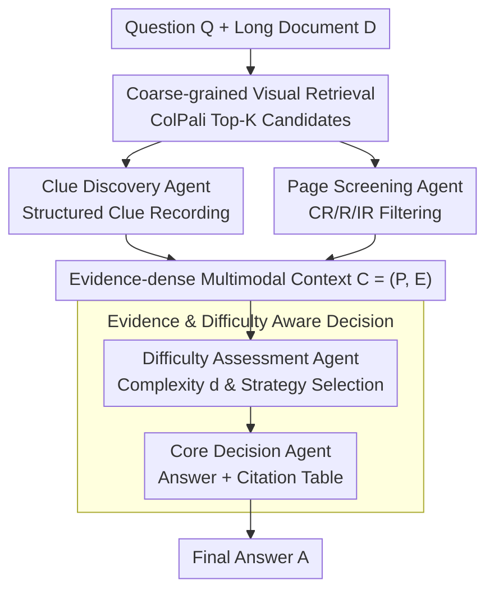

# Resolving Evidence Sparsity: Agentic Context Engineering for Long-Document Understanding

**Conference**: CVPR 2026  
**Paper**: [CVF Open Access](https://openaccess.thecvf.com/content/CVPR2026/html/Liu_Resolving_Evidence_Sparsity_Agentic_Context_Engineering_for_Long_Document_Understanding_CVPR_2026_paper.html)  
**Code**: Not released  
**Area**: Agent / Multimodal VLM / Document Understanding  
**Keywords**: Long-document understanding, Multi-agent, Context Engineering, Evidence Sparsity, Training-free

## TL;DR
Addressing the pain points of "sparse and scattered key evidence" and "redundant context interference" in long-document QA, this paper proposes SLEUTH, a training-free multi-agent framework. It utilizes a coarse-to-fine pipeline of "Retrieval → Clue Mining + Visual Screening → Difficulty Assessment → Decision" to distill noisy top-K retrieved pages into concise, evidence-dense multimodal contexts, achieving SOTA performance across four long-document benchmarks in a model-agnostic manner.

## Background & Motivation

**Background**: Vision Language Models (VLMs) have become mainstream for document understanding, showing strong performance on single-page documents (DocVQA, ChartQA, etc.). For long-document processing, existing approaches follow three main routes: enhancing agent reasoning (e.g., MACT via multi-agent collaboration and training), improving retrieval recall (various RAG methods feeding relevant pages to VLMs), and combining both (e.g., MDocAgent).

**Limitations of Prior Work**: Most content in long documents is redundant, while the actual evidence required to answer a question is often **sparse and scattered across multiple pages and modalities**. Pure reasoning-based methods still feed the entire long context into the model, leading to interference from redundant information. While RAG filters relevant pages, the retrieval results **still contain significant irrelevant information**, making it difficult for the VLM to precisely locate key evidence. Combined methods still face long and noisy contexts during inference.

**Key Challenge**: The authors highlight an overlooked fact—even if MLLMs possess ultra-long context windows, **performance significantly degrades as context length increases**. Directly stacking more retrieved pages does not linearly improve results but instead amplifies hallucinations. The root problem lies not in "how much is recalled" or "how strong the reasoning is," but in the quality of the ingested context.

**Goal**: From the perspective of "context engineering," this work addresses the core sub-problem of long-document understanding: how to precisely locate useful evidence from massive content and organize it into a high-quality context representation suitable for reasoning.

**Key Insight**: Treating the page as the minimum unit of processing, the framework mines evidence and screens visual relevance page-by-page. This keeps the effective context length **fixed**, allowing accuracy to scale with retrieval top-K without amplifying hallucinations.

**Core Idea**: Utilize a set of collaborative agents to distill "long and noisy" retrieval results into "short and evidence-dense" multimodal contexts. This approach enhances document understanding in a plug-and-play, training-free manner through hierarchical refinement.

## Method

### Overall Architecture
Given a question $Q$ and a document $D=\{p_1,\dots,p_N\}$ (where each page $p_i$ is an RGB image), SLEUTH generates an answer $A$ in a training-free, plug-and-play fashion. The pipeline is coarse-to-fine: first, a standard visual retriever shrinks the search space from $N$ pages to top-K candidate pages ($K\ll N$); then, two complementary agents work in parallel—the Clue Discovery Agent records structured text/visual clues page-by-page, and the Page Screening Agent determines the relevance of each page to discard irrelevant images; the Difficulty Assessment Agent analyzes task complexity to produce reasoning strategy instructions; finally, the Core Decision Agent generates the answer and an evidence citation table based on the distilled, evidence-dense context.

### Key Designs

**1. Coarse-grained Retrieval: Shrinking search space to Top-K**

Since long documents can span hundreds of pages, running agents on every page is slow and expensive. The first step involves quickly locating a small set of likely relevant pages. SLEUTH reuses the off-the-shelf ColPali-v1.3 for pure visual page-level retrieval: the question is encoded into a text embedding sequence $q_t$, and each page image into visual embeddings $v_{i,j}$. Relevance is defined via late-interaction maximal similarity sum $s_i=\sum_{t=1}^{n_Q}\max_{1\le j\le n_i}\langle q_t,v_{i,j}\rangle$, yielding the top-K candidate set $P_K$. This ensures $K\ll N$, preserving layout while compressing computation for subsequent agents.

**2. Clue Discovery Agent + Page Screening Agent: Distilling noisy pages into evidence-dense context**

This is the core of SLEUTH. Two agents work in parallel to separate "parts containing true evidence" from redundancy. The **Clue Discovery Agent** operates at the page level to extract evidence at the regional level (text lines, table cells, chart areas), outputting **structured records** $e_{i,m}=(\text{page}=i,\text{region}=w_{i,m},\text{content}=c_{i,m},\text{insight}=k_{i,m},\text{rationale}=r_{i,m})$. These records include semantic content, spatial location, and CoT reasoning for explainability. The **Page Screening Agent** performs joint semantic-visual reasoning on each candidate page, outputting discrete relevance labels $y_i\in\{\text{CR},\text{R},\text{IR}\}$ (Completely Relevant / Relevant / Irrelevant) and rationale $r_i^{\text{page}}$, retaining only pages where $y_i\in\{\text{CR},\text{R}\}$. The resulting multimodal context is $C=(P, E=\bigcup_{p_i\in P_K}E_i)$, ensuring both fine-grained text evidence and critical visual elements (tables/charts) are preserved.

**3. Difficulty Assessment Agent + Core Decision Agent: Adaptive decision-making**

**Difficulty Assessment Agent** determines the task difficulty $d=\arg\max_{c\in\{0,1\}}f(c;Q,C)$ and generates instructions $\Gamma_d=\Psi(Q,C,d)$. $d=0$ triggers Standard Mode (Instruct-type models), while $d=1$ triggers Reasoning Mode (Thinking-type models) for cross-page multi-step reasoning and numerical calculation. The **Core Decision Agent** receives $\Gamma_d$ and the structured context $C$ to generate the final answer $A^\star=\Phi(Q,C,\Gamma_d)$ along with a citation table $S=\{\text{Page},\text{Evidence},\text{Source}\}$ for verification. This mechanism dynamically balances efficiency and reasoning depth based on problem complexity.

### Mechanism
Consider a cross-page table question: 100-page document → ColPali retrieves top-5 pages → Clue Discovery Agent records structured clues page-by-page (e.g., "Clue 1: Page 1 describes model components... Clue 5: No evidence found"), Page Screening Agent classifies pages as CR/R/IR, retaining only 2 relevant pages with tables/images → Synthesized context $C$ → Difficulty Assessment Agent identifies a "table calculation" task ($d=1$) → Core Decision Agent activates Thinking mode, reasons over the fixed-length distilled context, and produces an answer with a citation table. The effective context remains minimal regardless of the original 100-page length.

## Key Experimental Results

### Main Results
Evaluated on MMLongBench-Doc (by evidence type) using Qwen3VL-8B as the default backbone with ColPali-v1.3 at top-5 retrieval:

| Dataset | Metric | SLEUTH | Prev. SOTA (MoLoRAG) | Gain |
|--------|------|--------|---------------|------|
| MMLongBench-Doc | Avg. Acc(%) | 52.77 | 48.75 | +4.02 |
| MMLongBench-Doc | Pure-text | 59.26 | 54.86 | +4.40 |
| MMLongBench-Doc | None | 67.38 | 51.67 | +15.71 |
| LongDocURL | Avg. Acc(%) | 59.96 | 57.57 | +2.39 |
| PaperTab | Acc(%) | 43.09 | 42.59 | +0.50 |
| FetaTab | Acc(%) | 70.46 | 69.41 | +1.05 |

Absolute gains on MMLongBench-Doc: +6.87 vs. M3DocRAG, +4.95 vs. MDocAgent, +4.02 vs. MoLoRAG, +6.01 vs. Base, and +10.06 vs. Direct (Long-context direct reading). Significant improvements were observed in Pure-text and Figure categories, demonstrating that the "page-by-page distillation" effectively suppresses interference from redundant context.

### Ablation Study
Ablation on MMLongBench-Doc and LongDocURL by activating agents (C: Clue, P: Page, D: Difficulty) and varying top-K:

| Configuration (Qwen3-VL-8B) | MMLongBench Avg. | LongDocURL Avg. | Description |
|------|------|------|------|
| Base (Retrieval feeding pages) | 46.76 | 55.18 | Baseline |
| SLEUTH (C) | 48.61 | 57.15 | Added Clue Discovery |
| SLEUTH (P) | 51.29 | 59.49 | Added Page Screening |
| SLEUTH (Top1) | 44.92 | 52.88 | Full Agents, Top-1 |
| SLEUTH (Top3) | 49.65 | 58.38 | Full Agents, Top-3 |
| SLEUTH (Top5) | **52.77** | **59.96** | Full SLEUTH, Top-5 |

### Key Findings
- **Positive contribution of each agent**: Accuracy increases monotonically as components C and P are added, validating the hierarchical refinement paradigm.
- **Accuracy scales with Top-K**: Unlike standard RAG where noise accumulates, SLEUTH's accuracy improves from Top-1 to Top-5 because the effective context length is kept fixed.
- **Model Agnostic**: Using GLM-4.1V-Thinking-9B as the backbone also shows consistent gains, proving the framework is compatible with various VLMs.

## Highlights & Insights
- **Context Engineering as a First-Principle Problem**: Unlike others focusing solely on recall or raw reasoning, SLEUTH addresses context quality to mitigate performance decay in long contexts.
- **Traceable Structured Evidence**: By recording region/content/insight/rationale, the system supports built-in explainability and citation tables.
- **Fixed Context Length = Scalable Recall**: This design allows higher top-K retrieval without the penalty of increased hallucinations, a valuable trick for multimodal RAG.
- **Difficulty-Aware Adaptive Switching**: Dynamically balancing efficiency (Instruct mode) and depth (Thinking mode) provides a practical engineering solution for complex queries.

## Limitations & Future Work
- **Dependency on Backbone Capability**: The quality of clue extraction and screening relies on the VLM's zero-shot capability; errors here propagate downstream.
- **Sequential Overhead**: Processing pages one-by-one increases agent calls linearly with Top-K, impacting latency and cost.
- **Discrete Difficulty Logic**: A binary $d\in\{0,1\}$ classification might mischaracterize medium-difficulty questions.
- **Risk of Mis-filtering**: Irreversible loss of information if the Page Screening Agent incorrectly labels a page as IR.

## Related Work & Insights
- **vs. MACT**: MACT uses multi-agent training for reasoning but still ingests long sequences; SLEUTH is training-free and focuses on distilling the context first.
- **vs. M3DocRAG / MoLoRAG**: These focus on retrieval recall; SLEUTH adds a post-retrieval distillation layer to further refine retrieved results.
- **vs. MDocAgent**: MDocAgent uses independent pipelines for modalities but the context remains noisy; SLEUTH uses page-level fixed context and adaptive decision-making to avoid performance decay.

## Rating
- Novelty: ⭐⭐⭐⭐ (First to explicitly treat evidence-dense context construction as the primary task for long-doc understanding.)
- Experimental Thoroughness: ⭐⭐⭐⭐ (Solid testing across baselines and ablation, though lacks detailed cost analysis.)
- Writing Quality: ⭐⭐⭐⭐ (Clear motivation and well-explained pipeline.)
- Value: ⭐⭐⭐⭐ (The "page-level distillation" pattern is highly reusable for multimodal RAG systems.)

<!-- RELATED:START -->

## Related Papers

- [\[CVPR 2026\] Think, Then Verify: A Hypothesis-Verification Multi-Agent Framework for Long Video Understanding](think_then_verify_a_hypothesis-verification_multi-agent_framework_for_long_video.md)
- [\[CVPR 2026\] HAVEN: Hierarchical Long Video Understanding with Audiovisual Entity Cohesion and Agentic Search](haven_hierarchical_long_video_understanding_with_audiovisual_entity_cohesion.md)
- [\[ACL 2025\] Self-Taught Agentic Long-Context Understanding](../../ACL2025/llm_agent/self_taught_agentic_long_ctx.md)
- [\[ICLR 2026\] Agentic Context Engineering: Evolving Contexts for Self-Improving Language Models](../../ICLR2026/llm_agent/agentic_context_engineering_evolving_contexts_for_self-improving_language_models.md)
- [\[CVPR 2026\] ORCA: Orchestrated Reasoning with Collaborative Agents for Document Visual Question Answering](orca_orchestrated_reasoning_with_collaborative_agents_for_document_visual_questi.md)

<!-- RELATED:END -->
